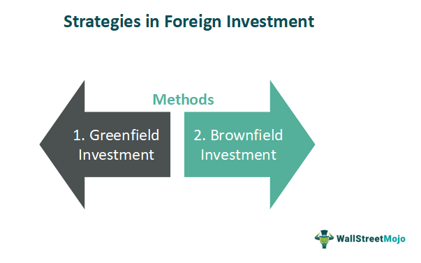

In today's global economy, businesses face increasing pressure to optimize their corporate structures to attract and effectively manage foreign investments. As barriers to international trade decrease and markets become more interconnected, companies seek efficient strategies to leverage foreign capital for growth and expansion. This trend is driven by the need to capitalize on diverse markets and resources available across different regions, leading to strategic business planning and structural optimization.

Simultaneously, the advent of algorithmic trading has revolutionized the financial landscape. By employing complex algorithms and leveraging big data, algorithmic trading offers unprecedented opportunities for efficiency and precision in executing trades. This automation of trading processes allows for rapid decision-making and reduces human errors, leading to improved financial outcomes. Algorithmic trading leverages analytical models to predict trends and execute large volumes of trades at speeds impossible for human traders. This shift impacts not only trading floors but also the strategic planning of enterprises seeking to optimize their investment strategies.



Understanding the interplay between business structures, foreign investment, and algorithmic trading is now more crucial than ever for enterprises aiming for success in the global market. Effective business structures facilitate the seamless integration of foreign investment, providing the flexibility required to adapt to regional regulations and economic conditions. Meanwhile, algorithmic trading complements these structures by enhancing the precision of investment strategies, thus optimizing financial performance and risk management.

This article will explore how these elements come together, providing actionable insights for business leaders seeking to navigate the complexities of the modern financial environment. By examining this intersection, businesses can better position themselves to harness the full potential of foreign investments and algorithmic trading, ultimately securing a competitive edge in the global economy.

## Table of Contents

## Understanding Business Structures for Foreign Investment

Business structures significantly influence foreign investment by either facilitating or obstructing the flow of capital into international markets. Different regions implement unique sets of regulations and business structures to manage and attract foreign investments. A prime example is Foreign Invested Enterprises (FIEs) in China, which include structures like Equity Joint Ventures (EJVs) and Wholly Foreign Owned Enterprises (WFOEs). These structures have been pivotal in managing how foreign investments are operationalized in China.

Choosing the right business structure is essential as it can directly affect profit margins, operational control, and adherence to local regulations. For instance, structures like EJVs in China allow foreign entities to partner with local companies, benefiting from local expertise and distribution networks. However, this comes with shared control and profits, potentially limiting the foreign firm's operational autonomy. Conversely, WFOEs provide full control to foreign investors, appealing to businesses prioritizing autonomy and comprehensive control over their operations, albeit with a potentially steeper compliance landscape.

The selection of an appropriate business structure is thus a strategic decision entwined with legal and financial implications. Businesses must thoroughly evaluate local laws, taxation policies, and the extent of their operational involvement desired in the foreign market. Compliance with local laws is paramount to avoid legal repercussions and ensure smooth business operations. For example, non-compliance can lead to hefty fines, operational disruptions, or even revocation of business licenses.

Moreover, understanding the tax implications is crucial. Some business structures might offer tax incentives while others could result in a higher tax burden. Thus, an in-depth analysis of the tax environment in the host country can reveal opportunities for optimizing taxation and improving profit margins.

In conclusion, navigating the complexities of foreign investment requires careful evaluation of various business structures prevalent in the target country. The choice of structure not only impacts financial performance but also defines the scope of operational control and compliance requirements. Therefore, businesses looking to establish a foothold in foreign markets must undertake a comprehensive assessment of the regional regulatory landscape and tailor their strategies accordingly to harness the full potential of their investments.

## Types of Foreign Investment Enterprises

Foreign Investment Enterprises (FIEs) offer various structures that cater to different business needs and strategic goals. Two prominent types of FIEs include Equity Joint Ventures (EJVs) and Wholly Owned Foreign Enterprises (WFOEs). Each structure presents distinct implications concerning control, risk management, and adherence to regulatory standards.

**Equity Joint Ventures (EJVs):** An EJV is a collaborative business form where foreign and local partners jointly invest in and manage the enterprise. The distribution of equity and control is typically proportional to the capital or assets each partner contributes. This arrangement allows foreign investors to leverage local expertise, established networks, and resources. However, it also necessitates negotiating terms that protect the foreign investor's interests while respecting the host country's regulations.[^1] EJVs can be advantageous in countries where full foreign ownership is restricted, as they provide a pathway to market entry with reduced barriers.

**Wholly Owned Foreign Enterprises (WFOEs):** In contrast, a WFOE allows complete foreign ownership and control, providing investors the autonomy to implement their strategies and business practices without a local partner. WFOEs are particularly beneficial in industries where sensitive technologies or proprietary processes are involved, as they minimize risks related to intellectual property and strategic oversight. However, establishing a WFOE often requires navigating complex regulatory landscapes and can involve significant initial investments and compliance challenges.[^2]

Understanding these structures is crucial for optimizing investment and operational strategy in foreign markets. The choice of structure impacts profit margins, operational control, and compliance with local laws. Moreover, each structure offers different levels of protection against political and market risks, influencing the overall business sustainability and growth potential.

**Recent Law Updates:** Major economies, such as China, continuously evolve their legal frameworks to attract and manage foreign investment. Recent updates in Chinese law, for instance, have offered new opportunities while introducing challenges for foreign investors. Changes in policies have streamlined the process for establishing WFOEs, enhancing their appeal to investors seeking autonomy. Simultaneously, evolving joint venture laws require foreign entities to reassess their strategies to ensure alignment with current regulations and maximize collaborative benefits.[^3]

By staying informed of changes in legal standards, businesses can better navigate the intricacies of global investment environments, ensuring they select the configuration that best aligns with their strategic objectives and market conditions.

[^1]: Dess, G. G., & Lumpkin, G. T. (2003). Strategic Management: Creating Competitive Advantages. McGraw-Hill.
[^2]: Chan, K. K., & Mo, P. L. L. (2000). China's Wholly Foreign-Owned Enterprises: Chinese Characteristics. University of Technology Press.
[^3]: Li, D. (2020). Trends in the Regulation of Foreign Investment in China. Journal of International Business Law.

## The Intersection of Algo Trading and Business Structures

Algorithmic trading, or algo trading, has revolutionized the methodology of trading by leveraging complex algorithms to execute trades at high speeds and with great precision. This technology-driven approach enables traders to capitalize on market inefficiencies and fluctuations with minimal human intervention. As businesses increasingly rely on algorithmic strategies, integrating these approaches into existing corporate structures becomes essential for optimizing financial operations and investment strategies.

The integration of [algorithmic trading](/wiki/algorithmic-trading) within business structures involves aligning technological capabilities with regulatory frameworks and strategic goals. Businesses must ensure that their corporate architectures can accommodate the fast-paced and data-intensive nature of algo trading. This alignment is crucial for achieving competitive advantages such as enhanced speed, increased efficiency, and superior data-driven decision-making.

To illustrate, consider the mathematical underpinnings of algorithmic trading strategies like mean reversion and [momentum](/wiki/momentum). In a mean reversion strategy, an algorithm might be designed to identify deviations from a stock's average value, capitalizing on anticipated returns to the mean. This can be expressed as:

$$
P(t) = \mu + \epsilon(t)
$$

where $P(t)$ is the price at time $t$, $\mu$ is the mean price over a specified period, and $\epsilon(t)$ is the error term that represents deviations from the mean. Algorithms detect when $\epsilon(t)$ falls outside predetermined thresholds, triggering buy or sell orders.

For successful integration, businesses must navigate the technological demands of such strategies. This includes investing in robust IT infrastructure capable of handling high-frequency data inputs and executing trades in milliseconds. Equally important is the ability to manage the voluminous data sets that these algorithms analyze, often requiring advanced data storage solutions and efficient data processing capabilities.

Furthermore, the regulatory landscape plays a critical role in shaping how businesses structure their algorithmic trading operations. Regulatory considerations might include transparency requirements, risk management protocols, and compliance obligations set by authorities like the U.S. Securities and Exchange Commission (SEC) and the Commodity Futures Trading Commission (CFTC). A well-aligned business structure not only supports technological demands but also ensures adherence to these regulatory standards.

Python and other programming languages are integral to developing and deploying algorithmic trading strategies. Below is a simple Python example illustrating a basic framework for executing trades based on moving averages, a common technique in algorithmic trading:

```python
import pandas as pd

def moving_average_strategy(data, short_window, long_window):
    signals = pd.DataFrame(index=data.index)
    signals['price'] = data['price']
    signals['short_mavg'] = data['price'].rolling(window=short_window, min_periods=1, center=False).mean()
    signals['long_mavg'] = data['price'].rolling(window=long_window, min_periods=1, center=False).mean()
    signals['signal'] = 0.0
    signals['signal'][short_window:] = \
        np.where(signals['short_mavg'][short_window:] > signals['long_mavg'][short_window:], 1.0, 0.0)   
    signals['positions'] = signals['signal'].diff()
    return signals

# Example usage:
data = pd.DataFrame({'price': [100, 101, 102, 104, 103, 104, 106]})
strategy_signals = moving_average_strategy(data, short_window=3, long_window=5)
print(strategy_signals)
```

In conclusion, integrating algorithmic trading strategies into business structures is not merely about adopting new technologies; it involves rethinking corporate frameworks to support the dual demands of innovation and regulation. Accomplishing this integration allows businesses to exploit algorithmic trading's full potential, offering a clear competitive edge in the rapidly evolving financial landscape.

## Setting Up a Successful Algorithmic Trading Business

Setting up a successful algorithmic trading business requires meticulous strategic planning, beginning with the selection of an appropriate business structure that can support the technological demands and regulatory constraints of algorithmic trading. The choice of structure, whether it be a limited liability company (LLC), corporation, or partnership, impacts legal obligations, tax implications, and the ability to raise capital. 

An essential component of this setup is the establishment of managed accounts. These accounts allow traders to handle client funds, which necessitates compliance with particular regulations. For instance, in the United States, Commodity Trading Advisors (CTAs) are required to register with the Commodity Futures Trading Commission (CFTC) and adhere to the rules of the National Futures Association (NFA). Understanding these regulatory requirements is critical to avoid legal setbacks and to ensure smooth operations.

Algorithmic trading firms must also consider whether they will operate as proprietary trading firms or adopt a [hedge fund](/wiki/hedge-fund-trading-strategies) model. Proprietary trading involves trading the firm's own money, allowing for greater autonomy but also presenting higher risk. On the other hand, hedge funds manage pooled funds from investors and must comply with additional regulations regarding investor protections and disclosures.

The initial setup of an algorithmic trading business demands significant capital investment. This includes the development or acquisition of sophisticated trading algorithms, access to high-quality data feeds, and investment in robust IT infrastructure to ensure low-latency trading capabilities. 

Moreover, compliance with financial regulations is not a one-time exercise but a continuous obligation. Algorithmic trading firms must implement systems to monitor and maintain compliance with evolving regulations. This may include regular audits, updating trading algorithms to reflect regulatory changes, and maintaining transparent records.

Strategic partnerships and alliances can be highly beneficial in expanding market reach and enhancing capabilities. Collaborating with technology providers can offer advanced algorithmic solutions and analytics, while alliances with financial institutions can provide access to broader markets and [liquidity](/wiki/liquidity-risk-premium) pools.

In conclusion, the process of launching an algorithmic trading business involves a combination of strategic legal and financial planning, technological investment, and a commitment to robust compliance protocols. Successfully navigating these domains can position a firm for innovation and growth in the competitive field of algorithmic trading.

## Navigating Regulatory Challenges

Foreign investments and algorithmic trading are crucial yet complex areas, primarily due to the diverse regulatory landscapes across countries. Understanding and complying with these regulations are critical for businesses aiming to participate effectively in international markets and leverage algorithmic trading. 

In the United States, the Securities and Exchange Commission (SEC) and the Commodity Futures Trading Commission (CFTC) are the primary regulatory bodies overseeing these activities. The SEC regulates securities markets and protects investors, while the CFTC is responsible for commodities and futures markets. Each agency enforces specific rules and guidelines businesses must adhere to, such as registration requirements, reporting standards, and restrictions on market manipulation. For instance, businesses engaged in algorithmic trading must ensure their systems are robust against manipulation risks and adhere to algorithm transparency and reporting requirements.

Additionally, legal considerations such as data protection and intellectual property rights are paramount. With the rise of data-driven strategies, businesses must navigate regulations surrounding data acquisition, storage, and usage. The European Union's General Data Protection Regulation (GDPR) exemplifies stringent data protection laws affecting multinational operations, mandating businesses to implement rigorous data handling and privacy protocols.

Intellectual property rights also affect the development and deployment of proprietary trading algorithms. Protecting these algorithms requires a thorough understanding of patent laws and trade secret protections, ensuring that innovations remain secure from unauthorized use.

Navigating these regulatory frameworks demands continuous vigilance. Regulatory environments are not static; they evolve with technological advancements and market dynamics. Thus, businesses need dedicated compliance teams to monitor legal updates and ensure ongoing adherence to local and international regulations. This proactive approach mitigates risks associated with non-compliance, such as financial penalties, legal actions, and reputational damage, ultimately securing the business's operational integrity and competitive advantage. 

In conclusion, understanding and adapting to regulatory challenges are integral to successfully combining foreign investment strategies with algorithmic trading. This necessitates a multifaceted approach involving compliance with regulatory bodies like the SEC and CFTC, addressing data privacy and intellectual property concerns, and maintaining vigilance to regulatory changes. Through strategic navigation of these complex landscapes, businesses can harness the potential of global markets while safeguarding their operations.

## Case Studies and Real-World Applications

Several businesses have successfully leveraged the integration of foreign investments and algorithmic trading strategies to enhance their market position and operational efficiency. This section highlights notable case studies that illustrate effective business structures and strategies, demonstrating the potential for innovation and growth within the global market.

### Case Study 1: Virtu Financial

Virtu Financial, a leading firm in algorithmic trading, exemplifies the integration of foreign investments with cutting-edge trading strategies. Founded in 2008, Virtu Financial has harnessed algorithmic trading to execute high-frequency trades across international markets. The firm's global approach involves setting up subsidiaries in regions with favorable regulatory environments, enabling it to diversify its trading assets and mitigate risks associated with market [volatility](/wiki/volatility-trading-strategies).

Virtu's success is partly due to its robust technology infrastructure, which supports rapid trade execution and real-time data analysis. By strategically aligning its business structure to support these capabilities, Virtu effectively navigates the complexities of international regulatory frameworks. This strategy has allowed Virtu to maintain a competitive edge in capturing market opportunities globally.

### Case Study 2: Renaissance Technologies

Renaissance Technologies, renowned for its Medallion Fund, offers an exemplary model of integrating foreign investment with sophisticated algorithmic strategies. The fund utilizes a large-scale computational approach to trading, analyzing vast datasets to identify profitable trading signals. One key aspect of Renaissance's strategy is its rigorous approach to maintaining data integrity and minimizing noise, ensuring that its algorithms operate on high-quality inputs.

To optimize its global investment framework, Renaissance has adopted structures that provide flexibility in deploying capital across various markets. The firm's adeptness at regulatory compliance enables it to operate efficiently in different jurisdictions, a critical element in sustaining its competitive advantage and attracting foreign investment.

### Lessons Learned

From these case studies, several insights emerge:

1. **Regulatory Compliance**: Both Virtu Financial and Renaissance Technologies underline the importance of understanding and adhering to regulatory environments across different jurisdictions. Success requires not only technological prowess but also strategic compliance.

2. **Technological Infrastructure**: A robust and scalable technology infrastructure is crucial for handling the computational demands of algorithmic trading. This infrastructure must be capable of processing large volumes of data and executing trades with minimal latency.

3. **Risk Management**: Successful integration of foreign investment and algorithmic trading entails sophisticated risk management strategies to safeguard against market fluctuations and geopolitical uncertainties.

4. **Strategic Structuring**: Flexible business structures that accommodate regional regulatory differences can enhance operational efficiencies and broaden market access.

Analyzing these case studies provides valuable lessons for other enterprises aiming to replicate similar successes in integrating foreign investments with algorithmic trading. The ability to harness technology effectively while navigating complex regulatory landscapes offers firms a pathway to innovation and growth in the global marketplace.

## Conclusion

The dynamic intersection of business structures, foreign investment, and algorithmic trading presents both opportunities and challenges for modern enterprises. Businesses that are adept at navigating these complexities can secure a competitive edge in the global marketplace. By leveraging optimal business structures, companies can attract foreign investment effectively, enabling them to expand operations, increase profitability, and improve compliance with diverse international regulations.

Algorithmic trading adds a layer of technological sophistication, offering enhanced efficiency, speed, and data-driven decision-making capabilities. As such, businesses that successfully integrate algorithmic trading strategies into their operations can optimize financial outcomes and refine their strategic investment decisions.

As regulatory landscapes continue to evolve, continuous adaptation and strategic planning remain crucial. Compliance with local and international laws, including data protection and intellectual property rights, is essential to avoiding legal pitfalls. Moreover, businesses must stay informed about changes in regulations and algorithmic trading metrics to maintain their competitive standing.

Future success will depend on the ability to integrate these elements effectively and innovatively. Businesses must foster a culture of agility and embrace technological advancements. Collaborative efforts, such as strategic alliances and partnerships, can further enhance capabilities and expand market reach.

To remain at the forefront, organizations should focus on developing robust frameworks that support both foreign investment and algorithmic trading. With the right strategies and adaptive practices in place, businesses can navigate the complexities of the modern financial landscape and capitalize on emerging opportunities.

## References & Further Reading

[1]: Bergstra, J., Bardenet, R., Bengio, Y., & Kégl, B. (2011). ["Algorithms for Hyper-Parameter Optimization."](https://dl.acm.org/doi/10.5555/2986459.2986743) Advances in Neural Information Processing Systems 24.

[2]: ["Advances in Financial Machine Learning"](https://www.amazon.com/Advances-Financial-Machine-Learning-Marcos/dp/1119482089) by Marcos Lopez de Prado

[3]: ["Evidence-Based Technical Analysis: Applying the Scientific Method and Statistical Inference to Trading Signals"](https://www.amazon.com/Evidence-Based-Technical-Analysis-Scientific-Statistical/dp/0470008741) by David Aronson

[4]: ["Machine Learning for Algorithmic Trading"](https://github.com/stefan-jansen/machine-learning-for-trading) by Stefan Jansen

[5]: ["Quantitative Trading: How to Build Your Own Algorithmic Trading Business"](https://www.amazon.com/Quantitative-Trading-Build-Algorithmic-Business/dp/1119800064) by Ernest P. Chan