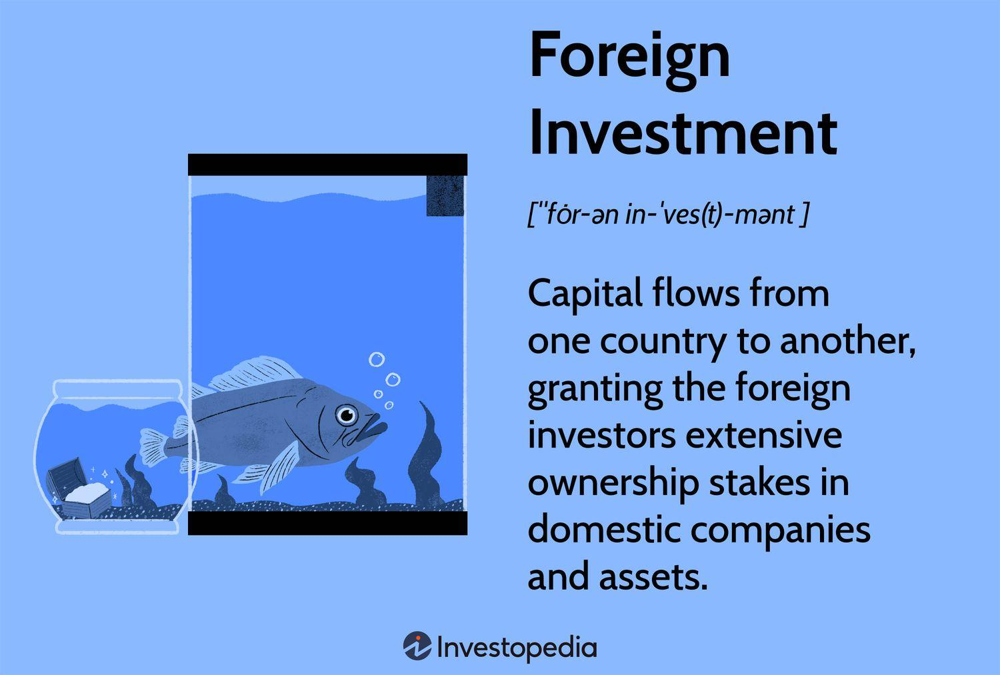

## Table of Contents

## What is a Foreign-Invested Enterprise (FIE)?

A Foreign-Invested Enterprise (FIE) is a business in which foreign investors have a stake. This type of enterprise is common in countries that encourage foreign investment to boost their economy. FIEs can take different forms, such as wholly foreign-owned enterprises, where the foreign investor owns 100% of the business, or joint ventures, where the foreign investor partners with a local company.

Setting up an FIE can be beneficial for foreign investors because it allows them to tap into new markets and take advantage of local resources. For the host country, FIEs can bring in new technology, create jobs, and stimulate economic growth. However, there are also challenges, such as navigating different legal systems and cultural differences, which can complicate the management and operation of the enterprise.

## What are the different types of Foreign-Invested Enterprises?

There are several types of Foreign-Invested Enterprises, each with its own structure and rules. One type is the Wholly Foreign-Owned Enterprise (WFOE), where the foreign investor owns all of the business. This means they have full control over the operations and profits. WFOEs are popular because they allow foreign companies to work directly in a new market without needing a local partner.

Another type is the Equity Joint Venture (EJV), where a foreign investor and a local partner share ownership of the business. Both parties contribute money, technology, or other resources, and they share the profits and risks. This type of FIE is useful when local knowledge and connections are important for success.

A third type is the Cooperative Joint Venture (CJV), which is similar to an EJV but with more flexible terms on how profits and risks are shared. In a CJV, the foreign and local partners can agree on different ways to manage the business and divide the profits. This flexibility can make CJVs attractive for certain kinds of projects.

## What are the benefits of establishing an FIE?

Establishing a Foreign-Invested Enterprise (FIE) can bring many benefits to the foreign investor. One big advantage is that it allows them to enter new markets and reach new customers. By setting up an FIE, a foreign company can sell its products or services directly in another country, which can lead to more sales and higher profits. Another benefit is that FIEs can help foreign investors take advantage of local resources, like cheaper labor or raw materials. This can lower the cost of doing business and make the company more competitive.

FIEs also have benefits for the host country. They can bring in new technology and skills that help local businesses grow and improve. This can lead to better products and services for people in the host country. FIEs also create jobs, which can help reduce unemployment and boost the economy. When foreign companies invest in a country, they often build factories, offices, and other facilities, which can lead to more development and growth in the area.

## What are the common challenges faced by FIEs?

FIEs often face challenges when they start working in a new country. One big challenge is understanding and following the local laws and rules. Every country has its own way of doing things, and these can be very different from what the foreign investor is used to. This can make it hard to set up the business and keep it running smoothly. Another challenge is dealing with cultural differences. People in different countries have different ways of working and communicating, and this can lead to misunderstandings and problems in the workplace.

Another common challenge for FIEs is managing the business from far away. When the main office is in one country and the FIE is in another, it can be hard to keep everything under control. Communication can be slow, and it can be difficult to make quick decisions. FIEs also have to compete with local businesses that know the market better. These local companies might have better relationships with customers and suppliers, which can make it harder for the FIE to succeed.

Despite these challenges, many FIEs find ways to overcome them and do well. It often helps to hire local people who understand the market and can help the FIE fit in. Building good relationships with local partners and authorities can also make things easier. With time and effort, FIEs can learn to navigate the challenges and take advantage of the opportunities in the new market.

## How does one set up a Foreign-Invested Enterprise?

Setting up a Foreign-Invested Enterprise starts with choosing the right type of FIE for your business. You can pick a Wholly Foreign-Owned Enterprise if you want full control, or a Joint Venture if you want to work with a local partner. Once you decide, you need to do some research on the country's laws and rules about foreign businesses. You'll need to find out what kind of permits and licenses you need, and how to get them. It's a good idea to talk to a local lawyer or consultant who knows about setting up businesses in that country.

After you understand the rules, you can start the process of setting up your FIE. You'll need to prepare a business plan and gather all the documents you need, like your company's registration papers and financial records. You'll also need to open a bank account in the host country and put some money into it to show you're serious about your investment. Once you have everything ready, you can submit your application to the local authorities. They will review it, and if everything is okay, they will give you the permission to start your FIE. It can take some time, so be patient and keep working on building relationships with local partners and understanding the market.

## What are the legal requirements for operating an FIE?

When you want to run a Foreign-Invested Enterprise, you need to follow the laws of the country where your business is. Every country has its own rules about what foreign businesses can do. You need to get the right permits and licenses to start your business. This might include a business license, a tax registration, and maybe special permits if your business is in a certain industry. You also need to make sure your FIE follows the local labor laws, which tell you how to treat your workers fairly and pay them the right amount.

Another important thing is to keep good records of your business. You need to keep track of your money, your taxes, and your employees. The government will want to see these records to make sure you are following the rules. You also need to report your business activities to the government regularly. This can include things like how much money you are making, how many people you are employing, and what kind of business you are doing. If you don't follow these rules, you could get in trouble and maybe even have to close your business.

## How do tax regulations affect Foreign-Invested Enterprises?

Tax regulations can have a big impact on Foreign-Invested Enterprises. When you set up an FIE in a new country, you have to pay taxes according to that country's rules. These taxes can include corporate income tax, which is a tax on the money your business makes. Different countries have different tax rates, and some offer special tax breaks to attract foreign investment. It's important to understand these rules so you can plan how much tax you will have to pay and make sure you are following the law.

Another thing to think about is how your home country treats the money you make from your FIE. Some countries have rules about taxing money that their citizens earn in other countries. This can mean you have to pay taxes in both countries, which is called double taxation. To avoid this, many countries have agreements called tax treaties that help reduce the amount of tax you have to pay. Knowing about these tax treaties can save your FIE a lot of money and make it easier to operate in the new country.

## What role do FIEs play in the global economy?

Foreign-Invested Enterprises play a big role in the global economy. They help connect different countries by bringing money, technology, and skills from one place to another. When a foreign company sets up an FIE in a new country, it can create jobs and help the local economy grow. This is good for the country because it means more people can work and earn money. It also means the country can learn new ways of doing things and improve its own businesses.

FIEs also help the companies that set them up. By going into new markets, these companies can sell their products to more people and make more money. They can also use cheaper resources in the new country to make their products, which can save them money. This can make the company stronger and more competitive in the global market. Overall, FIEs help make the world's economy more connected and help both the countries and the companies that are involved.

## How do FIEs impact local economies and communities?

Foreign-Invested Enterprises can really help local economies and communities. When a foreign company sets up an FIE, it often brings in new jobs. This means more people in the community can work and earn money. The FIE might also bring in new technology and skills that can help local businesses grow and improve. This can lead to better products and services for people in the area. Plus, the money that the FIE makes can be spent in the local economy, which helps other businesses and makes the whole community stronger.

But FIEs can also have some challenges for local communities. Sometimes, they can make it harder for small local businesses to compete. The foreign company might have more money and better technology, which can make it tough for smaller shops and factories to keep up. Also, if the FIE doesn't treat its workers well or follow local laws, it can cause problems in the community. But if the FIE works well with the local people and follows the rules, it can bring a lot of good things to the area.

## What are the strategies for managing and growing an FIE?

To manage and grow a Foreign-Invested Enterprise, it's important to build strong relationships with local partners and understand the market. Hiring local people who know the area can help a lot. They can help you understand what customers want and how to work with local suppliers. It's also good to keep talking to your partners and customers to learn what they need and how you can do better. By listening and working together, you can make your FIE fit well in the new place and grow.

Another strategy is to keep learning about the local laws and rules. Things can change, so it's important to stay up to date. This can help you avoid problems and make sure your FIE is always following the law. It's also a good idea to keep looking for new ways to grow your business. This might mean finding new customers, making new products, or even starting new FIEs in other countries. By always trying to get better and grow, you can make your FIE stronger and more successful.

## How do geopolitical factors influence the operations of FIEs?

Geopolitical factors can really affect how Foreign-Invested Enterprises work. When countries have good relationships with each other, it's easier for FIEs to do business. They can move their products and money more easily between countries. But if countries are not getting along, it can cause problems. There might be new rules or taxes that make it harder for the FIE to work. Sometimes, there can even be fights or wars that stop the FIE from doing business at all.

Another way geopolitical factors matter is through changes in government policies. If a new government comes in and changes the rules about foreign businesses, it can make things harder or easier for FIEs. For example, a new government might decide to give special help to FIEs to bring in more money and jobs. Or, they might decide to make new rules that make it harder for foreign companies to work in their country. FIEs need to keep an eye on these changes and be ready to adjust how they do business.

## What are the future trends and predictions for Foreign-Invested Enterprises?

In the future, Foreign-Invested Enterprises are likely to keep growing and changing. More countries are trying to bring in foreign money and skills to help their economies grow. This means we might see more FIEs starting up in new places. Technology will also play a big role. With the internet and new ways of working, FIEs can do business in different countries more easily. They can use things like online meetings and remote work to manage their businesses from far away. This can make it easier for FIEs to grow and reach more customers.

Another trend we might see is more focus on being good for the environment and the community. Many people want businesses to help the world, not just make money. So, FIEs might start doing more to be green and help the places they work in. They might use less energy, make less waste, and try to help local people more. This can make FIEs more popular and help them do better in the long run. As the world changes, FIEs will need to keep learning and trying new things to stay successful.

## What is the Intersection of Algo Trading and Business Structures?

Algorithmic trading, or algo trading, has revolutionized the methodology of trading by leveraging complex algorithms to execute trades at high speeds and with great precision. This technology-driven approach enables traders to capitalize on market inefficiencies and fluctuations with minimal human intervention. As businesses increasingly rely on algorithmic strategies, integrating these approaches into existing corporate structures becomes essential for optimizing financial operations and investment strategies.

The integration of [algorithmic trading](/wiki/algorithmic-trading) within business structures involves aligning technological capabilities with regulatory frameworks and strategic goals. Businesses must ensure that their corporate architectures can accommodate the fast-paced and data-intensive nature of algo trading. This alignment is crucial for achieving competitive advantages such as enhanced speed, increased efficiency, and superior data-driven decision-making.

To illustrate, consider the mathematical underpinnings of algorithmic trading strategies like mean reversion and [momentum](/wiki/momentum). In a mean reversion strategy, an algorithm might be designed to identify deviations from a stock's average value, capitalizing on anticipated returns to the mean. This can be expressed as:

$$
P(t) = \mu + \epsilon(t)
$$

where $P(t)$ is the price at time $t$, $\mu$ is the mean price over a specified period, and $\epsilon(t)$ is the error term that represents deviations from the mean. Algorithms detect when $\epsilon(t)$ falls outside predetermined thresholds, triggering buy or sell orders.

For successful integration, businesses must navigate the technological demands of such strategies. This includes investing in robust IT infrastructure capable of handling high-frequency data inputs and executing trades in milliseconds. Equally important is the ability to manage the voluminous data sets that these algorithms analyze, often requiring advanced data storage solutions and efficient data processing capabilities.

Furthermore, the regulatory landscape plays a critical role in shaping how businesses structure their algorithmic trading operations. Regulatory considerations might include transparency requirements, risk management protocols, and compliance obligations set by authorities like the U.S. Securities and Exchange Commission (SEC) and the Commodity Futures Trading Commission (CFTC). A well-aligned business structure not only supports technological demands but also ensures adherence to these regulatory standards.

Python and other programming languages are integral to developing and deploying algorithmic trading strategies. Below is a simple Python example illustrating a basic framework for executing trades based on moving averages, a common technique in algorithmic trading:

```python
import pandas as pd

def moving_average_strategy(data, short_window, long_window):
    signals = pd.DataFrame(index=data.index)
    signals['price'] = data['price']
    signals['short_mavg'] = data['price'].rolling(window=short_window, min_periods=1, center=False).mean()
    signals['long_mavg'] = data['price'].rolling(window=long_window, min_periods=1, center=False).mean()
    signals['signal'] = 0.0
    signals['signal'][short_window:] = \
        np.where(signals['short_mavg'][short_window:] > signals['long_mavg'][short_window:], 1.0, 0.0)   
    signals['positions'] = signals['signal'].diff()
    return signals

# Example usage:
data = pd.DataFrame({'price': [100, 101, 102, 104, 103, 104, 106]})
strategy_signals = moving_average_strategy(data, short_window=3, long_window=5)
print(strategy_signals)
```

In conclusion, integrating algorithmic trading strategies into business structures is not merely about adopting new technologies; it involves rethinking corporate frameworks to support the dual demands of innovation and regulation. Accomplishing this integration allows businesses to exploit algorithmic trading's full potential, offering a clear competitive edge in the rapidly evolving financial landscape.

## References & Further Reading

[1]: Bergstra, J., Bardenet, R., Bengio, Y., & Kégl, B. (2011). ["Algorithms for Hyper-Parameter Optimization."](https://dl.acm.org/doi/10.5555/2986459.2986743) Advances in Neural Information Processing Systems 24.

[2]: ["Advances in Financial Machine Learning"](https://www.amazon.com/Advances-Financial-Machine-Learning-Marcos/dp/1119482089) by Marcos Lopez de Prado

[3]: ["Evidence-Based Technical Analysis: Applying the Scientific Method and Statistical Inference to Trading Signals"](https://www.amazon.com/Evidence-Based-Technical-Analysis-Scientific-Statistical/dp/0470008741) by David Aronson

[4]: ["Machine Learning for Algorithmic Trading"](https://github.com/stefan-jansen/machine-learning-for-trading) by Stefan Jansen

[5]: ["Quantitative Trading: How to Build Your Own Algorithmic Trading Business"](https://www.amazon.com/Quantitative-Trading-Build-Algorithmic-Business/dp/1119800064) by Ernest P. Chan