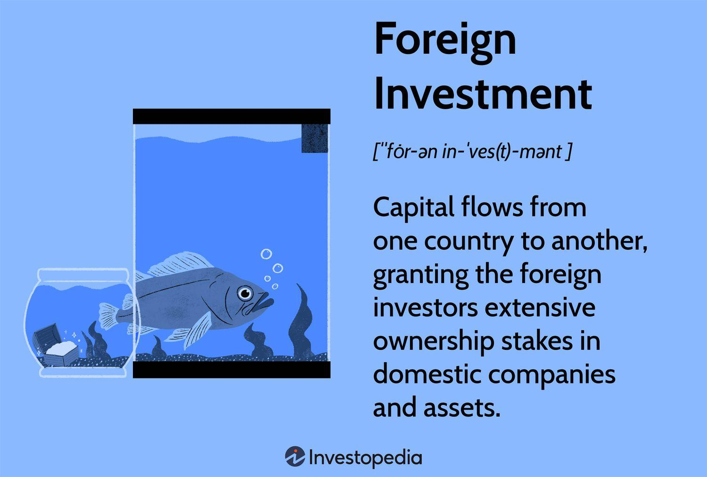

## Table of Contents

## What is foreign investment?

Foreign investment happens when people or companies from one country put their money into businesses or projects in another country. This can help the country getting the investment to grow its economy. It can create new jobs and bring in new technology and skills. For example, if a company from the United States builds a factory in India, that is foreign investment.

There are two main types of foreign investment. The first is called Foreign Direct Investment (FDI). This is when a company directly invests in another country by building factories, buying businesses, or starting new projects. The second type is called portfolio investment. This is when investors buy stocks, bonds, or other financial assets in another country. Both types can help countries grow, but they work in different ways.

## Why do countries seek foreign investment?

Countries seek foreign investment because it can help their economies grow. When foreign companies invest in a country, they often build new factories or start new businesses. This can create jobs for people in the country. More jobs mean more people earning money, which can help the whole economy. Foreign investment can also bring new technology and skills to a country. This can make businesses in the country more competitive and help them grow.

Another reason countries want foreign investment is that it can bring in money from other countries. This money can be used to improve things like roads, schools, and hospitals. When a country has better infrastructure, it can attract even more investment and help the economy grow even more. Foreign investment can also help a country's currency become stronger, which can make it easier for the country to buy things from other countries. Overall, foreign investment can be a big help to a country's economy.

## What are the main types of foreign investment?

There are two main types of foreign investment. The first type is called Foreign Direct Investment (FDI). This happens when a company from one country directly invests in another country. They might build a new factory, buy a business that already exists, or start a new project. This type of investment can create jobs and bring new technology and skills to the country where the investment is made.

The second type is called portfolio investment. This is when people or companies buy stocks, bonds, or other financial assets in another country. They are not directly managing a business, but they are still investing money in that country. This type of investment can help the country's economy by bringing in money, but it might not create as many jobs as FDI.

Both types of foreign investment can help a country's economy grow. FDI can have a bigger impact because it often leads to new jobs and new technology. Portfolio investment can bring in money, but it usually does not have the same direct impact on the economy.

## How does foreign direct investment (FDI) differ from foreign portfolio investment (FPI)?

Foreign Direct Investment (FDI) is when a company from one country puts money into another country to start a new business or buy an existing one. This means they are directly involved in running the business. For example, if a car company from Japan builds a factory in Brazil, that's FDI. This kind of investment can create jobs and bring new technology and skills to the country where the investment is made. It's like the company is putting roots down in the new country.

Foreign Portfolio Investment (FPI) is different because it's when people or companies buy stocks, bonds, or other financial assets in another country. They are not directly managing a business; they are just investing money. For example, if someone from the United States buys shares in a company in India, that's FPI. This type of investment can help bring money into the country, but it usually doesn't create as many jobs or bring new technology like FDI does. It's more like lending money to the country's economy without getting directly involved in running a business.

## What are the common mechanisms used to facilitate foreign investment?

Countries use different ways to make it easier for foreign investors to put money into their economy. One common way is through setting up special economic zones or free trade zones. These are areas where foreign companies can set up their businesses with fewer rules and lower taxes. This makes it more attractive for them to invest. Another way is by having clear and fair laws about investing. If foreign investors know they will be treated well and their investments will be safe, they are more likely to invest.

Governments also use investment promotion agencies to help foreign investors. These agencies give information and help with the steps needed to start a business in the country. They can also help connect foreign investors with local businesses. Treaties and agreements between countries can also help. For example, bilateral investment treaties can protect foreign investors from unfair treatment. All these things together make it easier and safer for foreign companies to invest in another country.

## How do bilateral investment treaties influence foreign investment?

Bilateral investment treaties (BITs) are agreements between two countries that help protect foreign investors. These treaties make it safer for companies to invest in another country because they know their investments will be protected. For example, if a company from one country invests in another country, the BIT can make sure the company is treated fairly and can take their money out of the country easily. This makes foreign companies feel more confident about investing, because they know they won't lose their money because of unfair rules or sudden changes in the law.

These treaties also help countries attract more foreign investment. When a country signs a BIT, it shows other countries that it wants to be a good place for foreign investors. This can lead to more companies from other countries wanting to invest there. More investment can help the country's economy grow by creating jobs and bringing in new technology and skills. So, BITs are important because they make foreign investors feel safer and can help bring more investment to a country.

## What role do special economic zones play in attracting foreign investment?

Special economic zones are special areas in a country where the government makes it easier for foreign companies to set up businesses. They do this by having fewer rules and lower taxes in these zones. This makes it more attractive for foreign companies to invest because they can save money and have an easier time starting their business. For example, if a company wants to build a factory, they might choose to do it in a special economic zone because it will cost them less and they won't have to deal with as many rules.

These zones help countries attract more foreign investment because they show that the country is open to business and wants to help foreign companies succeed. When foreign companies see that a country has special economic zones, they are more likely to invest there. This can lead to more jobs and new technology coming into the country, which helps the economy grow. So, special economic zones are important because they make it easier and more appealing for foreign companies to invest.

## What are the risks associated with foreign investment for both the investor and the host country?

Foreign investment can be risky for the investor. One big risk is that the money they invest might not make a profit. If the business they invest in does not do well, they could lose money. Another risk is that the laws or government in the country where they invest might change. If this happens, it could make it hard for them to get their money back or keep running their business. Political problems, like wars or protests, can also make it risky because they can stop businesses from working normally.

For the host country, foreign investment can also have risks. One risk is that the foreign company might not treat the local workers well or might harm the environment. This can cause problems for the people living there. Another risk is that the country might become too dependent on foreign companies. If these companies decide to leave, it could hurt the local economy a lot. Also, if the foreign investment does not create as many jobs or bring as much new technology as expected, the country might not see the benefits they hoped for.

## How can governments regulate and control foreign investment?

Governments can control foreign investment by making rules and laws about it. They can decide which industries foreign companies can invest in and which ones they can't. For example, a government might say that foreign companies can't invest in important areas like defense or energy. They can also set up rules about how much of a company a foreign investor can own. This helps make sure that important businesses stay under local control. Governments can also use taxes and fees to control foreign investment. If they want more investment, they might lower taxes. If they want less, they might raise them.

Another way governments control foreign investment is by setting up special agencies to watch over it. These agencies can check if foreign investments are good for the country and if they follow the rules. They can also help foreign investors by giving them information and helping them with the steps they need to take to invest. Governments can also sign treaties with other countries to protect foreign investors. These treaties can make sure that foreign companies are treated fairly and can take their money out of the country easily. By using these methods, governments can make sure that foreign investment helps their country grow without causing too many problems.

## What are the economic impacts of foreign investment on a host country?

Foreign investment can help a host country's economy grow in many ways. When foreign companies invest, they often build new factories or start new businesses. This can create jobs for people in the country. When more people have jobs, they earn money and can spend it on things like food, clothes, and homes. This can help the whole economy grow. Foreign investment can also bring new technology and skills to the country. This can make local businesses better and help them grow too. The money that comes from foreign investment can also be used to improve things like roads, schools, and hospitals, which makes the country a better place to live and work.

However, foreign investment can also have some negative effects on a host country. If the foreign company does not treat local workers well or harms the environment, it can cause problems for the people living there. The country might also become too dependent on foreign companies. If these companies decide to leave, it could hurt the local economy a lot. Sometimes, the benefits of foreign investment, like new jobs or technology, might not be as big as expected. This can make people in the country feel like the investment is not helping them as much as it should. So, while foreign investment can bring many good things to a country, it can also bring some challenges.

## How do multinational corporations manage their foreign investments?

Multinational corporations manage their foreign investments by setting up offices or factories in different countries. They do this to be close to new markets and to take advantage of lower costs in those countries. They often have teams of people who look at different countries to see which ones are good for investment. These teams think about things like the country's laws, how stable its government is, and if there are enough workers. They also look at how easy it is to get their products in and out of the country. Once they decide to invest, they work with local people and follow the country's rules to start their business.

After the investment is made, multinational corporations keep a close eye on how their businesses are doing in other countries. They do this by having managers who live in those countries and report back to the main office. These managers make sure the business is following the local laws and is doing well. The corporation also uses technology to keep track of money and how well the business is doing. If things are not going well, they might decide to change their plans or even move their investment to a different country. This way, they can make sure their foreign investments are helping the company grow and make money.

## What advanced strategies can be used to optimize returns on foreign investment?

To optimize returns on foreign investment, multinational corporations often use a strategy called diversification. This means they spread their money across different countries and industries. By doing this, they can lower the risk of losing money if one country or industry has problems. For example, if a company invests in both technology and farming in different countries, a bad year for farming in one country might be balanced by a good year for technology in another. They also use hedging, which is like insurance against changes in currency values. If the money in one country becomes worth less, hedging can help protect the company's investment.

Another strategy is to use local knowledge and partnerships. Companies work with people who know the local market well to make better decisions about where and how to invest. This can help them understand the culture, laws, and business practices of the country they are investing in. They also form partnerships with local businesses to share the risks and benefits of the investment. This can help them get started faster and make more money because they are working with people who already know the area well. By using these strategies, companies can make their foreign investments more successful and get better returns.

## References & Further Reading

[1]: "Foreign Direct Investment Statistics: Data, Analysis and Forecasts". [Organisation for Economic Co-operation and Development (OECD)](https://www.oecd.org/en/topics/foreign-direct-investment-fdi.html)

[2]: "Foreign Portfolio Investment". [World Bank](https://data.worldbank.org/indicator/BN.KLT.PTXL.CD)

[3]: "Algorithmic Trading and DMA: An introduction to direct access trading strategies" by Barry Johnson. Available on [Amazon](https://www.amazon.com/Algorithmic-Trading-DMA-introduction-strategies/dp/0956399207)

[4]: "Algorithmic Trading: Winning Strategies and Their Rationale" by Ernie Chan. Available on [Wiley](https://www.wiley.com/en-us/Algorithmic+Trading%3A+Winning+Strategies+and+Their+Rationale-p-9781118460146)

[5]: OECD Benchmark Definition of Foreign Direct Investment - Fourth Edition 2008. [OECD iLibrary](https://www.oecd.org/en/publications/oecd-benchmark-definition-of-foreign-direct-investment-2008_9789264045743-en.html)

[6]: Bank, J. M. (2015). "The Impact of FDI on Economic Growth: An Analysis for the Transition Countries of Central and Eastern Europe". [Journal of Economics and Business](https://link.springer.com/book/10.1007/3-7908-1735-X)