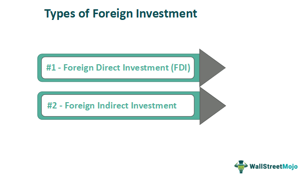

Foreign investment involves the allocation of capital across international borders to gain ownership or control over assets and companies located in foreign nations. As a fundamental component of the global economic system, foreign investment significantly contributes to economic development worldwide and fosters bilateral and multilateral relations among countries. This transcends mere financial transactions; it acts as a channel for technology transfer, enhances competitive environments, and introduces managerial expertise in host countries.

The recent growth in foreign investment has been bolstered by innovative mechanisms, including algorithmic trading. Algorithmic trading, which employs sophisticated computer algorithms to execute trades based on predetermined criteria, has revolutionized the way investments are made by enhancing the speed and precision of financial transactions. This advancement is particularly significant in foreign exchange markets and global investments, where it minimizes human error and optimizes decision-making processes.

This article aims to discuss the various types of foreign investments and the mechanisms that facilitate these cross-border transfers of capital. Additionally, it explores the impact of algorithmic trading on international investments, underscoring its growing importance. Understanding these mechanisms is essential for investors as they seek to diversify their portfolios globally, making informed decisions based on the dynamic landscape of international finance. The integration of automated trading strategies into investment processes marks a significant step forward, aligning with the digital transformation of global financial markets.

## Table of Contents

## Types of Foreign Investment

Foreign investment can be categorized into several types based on the nature and purpose of the investment. Understanding these different types is essential for both investors and recipient countries, as each offers unique opportunities and challenges.

Foreign Direct Investment (FDI) involves acquiring control over a foreign business or establishing new operations in another country. This type of investment is characterized by the investor’s intention to exert significant influence or control over the foreign enterprise. As outlined by the International Monetary Fund (IMF) and the Organisation for Economic Co-operation and Development (OECD), FDI is usually marked by a minimum of 10% ownership in the foreign entity. FDI can take various forms, such as mergers and acquisitions, building new facilities, reinvesting profits earned from overseas operations, and intra-company loans. It plays a substantial role in transferring technology, enhancing skills, and boosting the economic growth of the host country. An example of FDI's impact can be seen in countries like China and India, where substantial foreign investments have spurred industrial growth and infrastructure development.

Foreign Portfolio Investment (FPI) refers to investing in financial assets such as stocks and bonds in another country without seeking control over the business operations. Unlike FDI, FPI investors do not have a direct influence over the management of the companies in which they invest. This type of investment is typically more liquid and can be easily traded in the secondary markets, making it a preferred choice for investors looking for short-term gains or diversification. FPIs are sensitive to market conditions and can lead to capital flight in situations of economic instability, which may cause volatility in the financial markets of the recipient country. Studies, like those conducted by the World Bank, indicate that while FPIs provide capital inflows and deepen financial markets, they can also present challenges related to market volatility and exchange rate fluctuations.

Commercial loans constitute another form of foreign investment where banks and financial institutions provide loans to foreign companies or governments. These loans are often used to finance significant projects, including infrastructure development and industrial expansion. The conditions and interest rates attached to commercial loans can significantly impact the borrowing country's economy, influencing factors such as fiscal policy and external debt levels. For example, emerging economies often rely on commercial loans for development projects due to the scale of financing required, which domestic funds alone cannot fulfill.

Each type of foreign investment has distinct characteristics and serves different purposes. While FDI involves a longer-term commitment with significant managerial oversight, FPI provides flexibility and can be easily adjusted, matching investors’ risk tolerance and market conditions. Commercial loans offer funding for large-scale projects but require a careful evaluation of repayment capabilities and terms.

Both Foreign Direct Investment and Foreign Portfolio Investment profoundly influence the economic and political landscapes of recipient countries. FDI can lead to the transfer of technology and skills, influencing industrial growth, while FPI can enhance capital markets and provide [liquidity](/wiki/liquidity-risk-premium) but may also introduce risks of sudden capital movements.

Understanding these characteristics enables investors to align their strategies with their overall financial goals and helps recipient countries manage and benefit from foreign investments while mitigating potential challenges.

## Investment Mechanisms

Investment mechanisms facilitate the flow of capital across international borders, enabling foreign investors to participate in diverse markets and economies. These mechanisms serve as the fundamental channels through which foreign investment occurs, each with its specific features and requirements.

Equity investments are a primary form of foreign investment, where investors acquire shares or ownership stakes in foreign companies. This provides investors with a degree of control and influence over the business operations of the invested company, aligning their success with the company's performance. This type of investment is often favored for its potential to yield significant returns, albeit with corresponding risks associated with market [volatility](/wiki/volatility-trading-strategies) and operational challenges in foreign jurisdictions.

Loans constitute another common investment mechanism, allowing investors to lend capital to foreign entities, including governments and corporations. These loans are typically accompanied by interest payments, offering investors a relatively stable return on investment. Commercial loans, bonds, and debentures are prominent examples, each carrying varying levels of risk and expected yields. The choice between fixed or variable interest rates further influences the decision-making process within this investment category.

Joint ventures represent collaborative arrangements where foreign investors and local partners share assets, risks, and profits in a mutually beneficial enterprise. These ventures are strategic for investors seeking entry into foreign markets while leveraging local expertise and resources. A joint venture helps mitigate entry barriers, such as regulatory constraints and cultural differences, by aligning interests with a domestic counterpart.

Multilateral Development Banks (MDBs), such as the World Bank and the Asian Development Bank, play a crucial role in promoting foreign investments. MDBs provide financial products and advisory services to foster economic development, particularly in emerging economies. Through funding infrastructure projects and supporting private sector development, MDBs help create an enabling environment for foreign investors, addressing concerns such as political risk and market stability.

Investment instruments are selected based on various factors, including risk tolerance, liquidity preferences, and the level of control desired over the investment. High-risk investment profiles may involve equity stakes in volatile markets, while conservative investors may opt for debt instruments with predictable returns. Liquidity concerns influence whether investors choose readily tradable securities or long-term investments with locked-in funds.

Tax havens are jurisdictions that offer attractive tax incentives to foreign investors, often resulting in reduced tax liabilities on international earnings. These favorable tax conditions can significantly impact the selection of investment mechanisms. Countries with lower corporate tax rates or lenient tax structures draw substantial foreign capital, as investors seek to maximize their post-tax income. Nonetheless, the use of tax havens is subject to scrutiny, as it raises ethical considerations and potential regulatory challenges in the global economic landscape. 

In conclusion, the diversity of investment mechanisms reflects the complexity of the global economy, where varied instruments and institutions come together to facilitate foreign capital flows.

## Algorithmic Trading in Foreign Investments

Algorithmic trading leverages advanced computer programs to execute trades automatically based on predetermined criteria, vastly increasing the speed and precision of trading operations. By reducing human interference in trading, [algorithmic trading](/wiki/algorithmic-trading) minimizes emotional biases and errors associated with manual trading. This enhanced efficiency is particularly beneficial in the highly volatile and intricate foreign exchange and international markets, where swift decision-making and execution are paramount for capitalizing on market opportunities.

The rise in popularity of algorithmic trading within these markets can be attributed to its ability to process large volumes of data and execute trades within milliseconds, which is crucial when dealing with high-frequency trading environments. In algorithmic trading, various strategies are employed, each catering to different market conditions and objectives. Among these, trend-following strategies analyze market trends to make trading decisions based on the direction and strength of these trends. Arbitrage strategies identify price discrepancies of the same asset across different markets, allowing traders to profit from these inefficiencies. Additionally, statistical analysis is employed to determine the probability of certain market movements and to optimize trading decisions based on historical data patterns.

Despite the numerous benefits, algorithmic trading introduces certain risks. The possibility of system failures is a significant concern, as it can lead to substantial financial losses if trades are executed incorrectly or not at all. Furthermore, algorithmic trading can potentially contribute to market manipulations, such as flash crashes, where the rapid execution and subsequent withdrawal of large orders distort market prices and liquidity temporarily.

As algorithmic trading continues to evolve, it remains a pivotal component of foreign investment strategies, driving market efficiencies while presenting new challenges and considerations for traders and regulators alike.

## Advantages and Challenges of Foreign Investments

Foreign investments significantly contribute to the economic growth and development of host countries by introducing essential capital, advanced technology, and managerial expertise. These elements are crucial for enhancing the productivity and competitiveness of domestic industries. Capital influx enables the expansion of existing businesses and the establishment of new enterprises, thereby increasing the overall economic output. This investment often translates into improved infrastructure, such as transportation networks, telecommunications, and energy systems, due to the direct involvement of foreign investors in large-scale projects.

The creation of job opportunities is another vital benefit of foreign investments. As multinational corporations establish operations in host countries, they require a workforce, thereby reducing unemployment rates and improving living standards. Additionally, the introduction of new technologies and managerial practices fosters skill development and knowledge transfer to the local population.

Foreign investments also play a pivotal role in fostering global economic integration. By encouraging cross-border collaboration, these investments promote the sharing of resources and expertise, enabling countries to capitalize on each other's strengths. This integration can lead to economies of scale, reduced production costs, and enhanced global trade, contributing to overall economic prosperity.

Nevertheless, foreign investments come with significant challenges. One primary concern is the potential erosion of national sovereignty. Host countries might become overly dependent on foreign investors, allowing these investors to influence domestic policies and priorities. Such influence can sometimes result in decisions that favor foreign stakeholders over national interests.

Another challenge is the disruption of domestic markets. The entry of large multinational corporations may undermine local businesses that cannot compete with the resources and technology that foreign companies possess. This competition could lead to the closure of indigenous firms, negatively impacting local economies. Moreover, foreign companies might prioritize repatriation of profits rather than reinvesting in the host country's economy, limiting long-term economic benefits.

Therefore, it is crucial for policymakers and investors to thoroughly understand both the advantages and challenges associated with foreign investments. Policymakers need to craft regulations that protect national interests while encouraging foreign participation in the economy. Likewise, investors should consider the socio-economic and political contexts of the host countries to ensure beneficial and sustainable investment practices. A balanced approach can maximize the positive impacts of foreign investments while mitigating potential drawbacks, ultimately contributing to global economic stability and growth.

## Conclusion

Foreign investment is integral to the structure of the global economy, serving as both a conduit for opportunity and a source of potential challenges. It encompasses various types and mechanisms, such as Foreign Direct Investment (FDI) and Foreign Portfolio Investment (FPI), which collectively contribute to economic growth, technology transfer, and employment generation in host countries. Algorithmic trading has emerged as a crucial component in the evolution of investment strategies, significantly enhancing the speed and precision of transactions. By automating trading processes, algorithmic methodologies reduce the likelihood of human errors and emotional trading, thereby increasing market efficiency. 

However, the complexity introduced by algorithmic trading also necessitates a careful balance for investors and policymakers. The benefits of foreign investment and algorithmic strategies must be weighed against risks such as financial system vulnerabilities and market manipulation. Future advancements in technology and shifts in policy frameworks will invariably shape the global investment landscape. Stakeholders who possess a deep understanding of these evolving dynamics will be better positioned to optimize their strategies, ensuring sustainable and equitable participation in interconnected markets worldwide. Understanding these elements not only aids in strategic planning but also in fostering an environment conducive to long-term economic integration and growth.

## References & Further Reading

[1]: "Foreign Direct Investment Statistics: Data, Analysis and Forecasts". [Organisation for Economic Co-operation and Development (OECD)](https://www.oecd.org/en/topics/foreign-direct-investment-fdi.html)

[2]: "Foreign Portfolio Investment". [World Bank](https://data.worldbank.org/indicator/BN.KLT.PTXL.CD)

[3]: "Algorithmic Trading and DMA: An introduction to direct access trading strategies" by Barry Johnson. Available on [Amazon](https://www.amazon.com/Algorithmic-Trading-DMA-introduction-strategies/dp/0956399207)

[4]: "Algorithmic Trading: Winning Strategies and Their Rationale" by Ernie Chan. Available on [Wiley](https://www.wiley.com/en-us/Algorithmic+Trading%3A+Winning+Strategies+and+Their+Rationale-p-9781118460146)

[5]: OECD Benchmark Definition of Foreign Direct Investment - Fourth Edition 2008. [OECD iLibrary](https://www.oecd.org/en/publications/oecd-benchmark-definition-of-foreign-direct-investment-2008_9789264045743-en.html)

[6]: Bank, J. M. (2015). "The Impact of FDI on Economic Growth: An Analysis for the Transition Countries of Central and Eastern Europe". [Journal of Economics and Business](https://link.springer.com/book/10.1007/3-7908-1735-X)