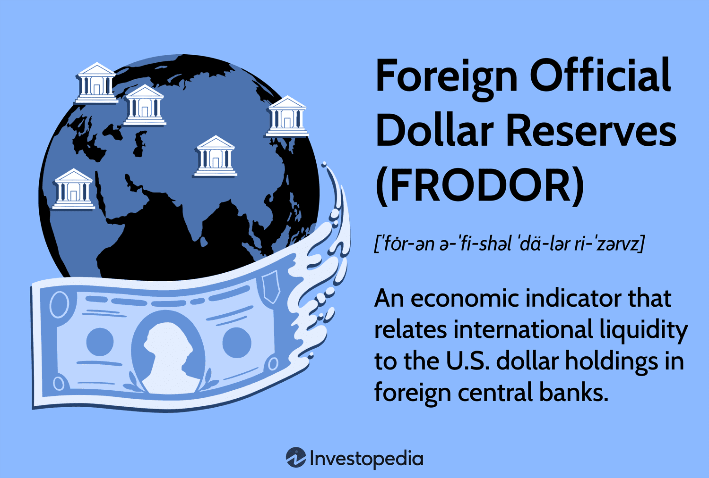

The global financial system operates with intricate complexity, largely influenced by the U.S. dollar's status as the primary reserve currency. This dominance underscores the importance of understanding the mechanisms and implications of dollar reserves, especially through the concept of Foreign Official Dollar Reserves (FRODOR). Foreign central banks have accumulated significant amounts of U.S. dollar reserves, using them as a tool to manage their own economies and facilitate international trade. The relationship between these reserves and global financial stability is profound, as shifts in dollar reserves can affect commodity prices, inflation rates, and overall economic health.

In recent years, a growing interest in algorithmic trading has emerged, impacting the strategies employed in financial markets. Algorithmic trading refers to the use of advanced mathematical models and computer programs to make high-frequency trading decisions. These strategies often rely on economic indicators, including those related to dollar reserves, to rapidly adjust positions and anticipate market movements. Therefore, the dynamics of global reserves play an increasingly significant role in the development and execution of these trading systems.



By examining the interaction between FRODOR and economic cycles, we can gain crucial insights into how dollar reserves influence financial markets. Economic professionals rely on this understanding to navigate complex market conditions and create robust trading strategies. Moreover, as the financial world advances toward greater automation, the integration of FRODOR data into algorithmic trading models becomes essential. This convergence of economic insights and technology highlights the need for professionals to keep abreast of global dollar reserve trends to predict potential shifts in economic conditions.

## Table of Contents

## Understanding Foreign Official Dollar Reserves (FRODOR)

Foreign Official Dollar Reserves (FRODOR) are comprised of U.S. Treasury and U.S. agency securities held by foreign banks. The concept, introduced by the economist Ed Yardeni, establishes a connection between international liquidity and the U.S. dollar holdings within foreign central banks. Since the dissolution of the gold standard in 1971, the U.S. dollar has assumed the role of global monetary standard, solidifying its position as the primary reserve currency. This transition is closely tied to the growing U.S. trade deficit, which has necessitated foreign countries to accumulate large U.S. dollar reserves.

The strategic holding of U.S. dollar reserves by various countries is pivotal for maintaining the stability of their own currencies and facilitating favorable trade dynamics. Such reserves are frequently utilized to balance international trade and investments, allowing countries to manage exchange rate fluctuations and support their economic objectives.

FRODOR's behavior is a critical barometer for assessing the overall health of the global economy. These reserves often exhibit a correlation with key economic indicators, such as commodity prices, inflation rates, and financial stability across international markets. By examining the levels and trends of FRODOR, economic professionals can gauge the sanity of global economic conditions and anticipate potential shifts that may impact trade balances, investment flows, and monetary policy decisions worldwide.

## The Role of FRODOR in Economic Cycles

Foreign Official Dollar Reserves (FRODOR) serve as an important metric for assessing economic cycles due to their ability to reflect trends in global economic activity. During periods of economic expansion, foreign central banks often accumulate U.S. Treasury securities as the U.S. Treasury increases its issuance to fund growth initiatives. This accumulation supports the U.S. trade deficit and can have a significant impact on currency values. As foreign governments amass these dollar reserves, it becomes easier for them to manage their own currency stability and trade balances.

In contrast, during economic recessions, FRODOR can reveal the strategies employed by foreign governments as they utilize their reserves to counteract economic downturns. By adjusting their holdings of U.S. dollars, countries aim to stabilize their economic conditions and maintain favorable currency valuations. This adjustment process often serves as a mechanism for mitigating adverse impacts on national economies during turbulent times.

An increase in FRODOR levels typically signals enhanced global monetary [liquidity](/wiki/liquidity-risk-premium), which can lead to higher asset prices in equities, commodities, and real estate markets. This phenomenon occurs because increased liquidity usually translates into more capital available for investment, thus driving up demand and prices for a wide array of assets. Conversely, a decline in FRODOR might indicate a strengthening U.S. dollar, as foreign central banks might be liquidating their reserves due to various economic pressures; this could potentially tighten global economic conditions by reducing the liquidity available in the international monetary system.

Overall, the fluctuations in FRODOR provide crucial insights into the balance of global economic forces, highlighting the interconnectedness of national economies and the importance of strategic reserve management as central banks navigate through different stages of economic cycles.

## Algorithmic Trading and Dollar Reserves

Algorithmic trading has transformed the financial industry by employing automated systems that execute trades with remarkable speed and efficiency. These systems harness complex algorithms to analyze market data and make informed trading decisions, often in a fraction of a second. A critical component of these algorithms is their ability to incorporate economic indicators, such as Foreign Official Dollar Reserves (FRODOR), which provide crucial insights into global financial conditions.

FRODOR plays an instrumental role in shaping [algorithmic trading](/wiki/algorithmic-trading) strategies. These dollar reserves are held by foreign central banks and reflect their confidence in the U.S. dollar as a stable reserve currency. Changes in FRODOR levels can significantly impact global currency markets, influencing exchange rates and revealing shifts in economic stability. Algorithmic trading systems use this information to anticipate currency movements and adjust their strategies accordingly. For instance, a decline in FRODOR may suggest a strengthening U.S. dollar, prompting algorithms to adjust positions in [forex](/wiki/forex-system) markets to exploit anticipated currency valuation changes.

Algorithmic traders gain a competitive edge by comprehending the dynamics of FRODOR, enabling them to predict trends in stock markets and other financial landscapes. For example, an increase in FRODOR may signal increased globalization liquidity, potentially boosting asset prices across equity and commodities markets. Algorithms can swiftly capture these signals to optimize trade executions and capitalize on market opportunities.

The sophistication of these algorithms has increased exponentially, demanding the integration of comprehensive economic data into trading solutions. Incorporating FRODOR alongside other indicators ensures that algorithms operate on a robust dataset, enabling nuanced decision-making. The complexity of market interactions necessitates the use of advanced programming techniques. Consider this basic Python snippet to illustrate a simplified model of how FRODOR data might be integrated into a trading algorithm:

```python
import pandas as pd

# Sample FRODOR data
data = {'date': ['2023-01-01', '2023-02-01', '2023-03-01'],
        'frodor_level': [3000, 3200, 3100]}
frodor_df = pd.DataFrame(data)

# Example function to adjust trades based on FRODOR trend
def adjust_trade_decision(frodor_df):
    frodor_df['decision'] = 'hold'
    for i in range(1, len(frodor_df)):
        if frodor_df.loc[i, 'frodor_level'] > frodor_df.loc[i - 1, 'frodor_level']:
            frodor_df.loc[i, 'decision'] = 'buy'
        elif frodor_df.loc[i, 'frodor_level'] < frodor_df.loc[i - 1, 'frodor_level']:
            frodor_df.loc[i, 'decision'] = 'sell'
    return frodor_df

# Apply trading decision logic
trade_decisions = adjust_trade_decision(frodor_df)
print(trade_decisions)
```

In the above example, the algorithm uses FRODOR data to make simple trading decisions based on the observed trend. This basic logic can be integrated into a larger system to automatically execute trades aligned with anticipated market shifts.

In conclusion, the intricate integration of FRODOR within algorithmic trading underscores the importance of detailed economic insight in sophisticated trading systems. As automation continues to rise, the reliance on FRODOR and similar indicators will be paramount in constructing resilient, data-driven market strategies.

## Conclusion

The intricate relationship between global dollar reserves, particularly Foreign Official Dollar Reserves (FRODOR), and economic cycles underscores their significant role in the financial landscape. These reserves, primarily consisting of U.S. Treasury and agency securities held by foreign central banks, serve as a strategic tool in managing economic stability and currency valuation. For traders and analysts, a comprehensive understanding of FRODOR is essential for navigating complex market conditions and crafting robust trading strategies. The ebb and flow of these reserves can signal shifts in monetary liquidity, influencing asset prices and economic growth trajectories.

As the financial world increasingly adopts automated trading systems, the integration of FRODOR and similar financial indicators into algorithmic frameworks is becoming essential. Algorithmic traders could leverage real-time data on dollar reserves to anticipate market movements and optimize trading executions, potentially enhancing profitability. By employing sophisticated algorithms that incorporate FRODOR data, traders can respond swiftly to changes in economic conditions, gaining a competitive edge in financial markets.

Monitoring FRODOR not only provides insights into national economic health but also allows for predictions of potential shifts in global financial conditions. Variations in these reserves can reflect broader economic trends, including changes in inflation rates, commodity prices, and global trade balances. Therefore, staying attuned to FRODOR dynamics enables financial professionals to make informed decisions and anticipate future economic developments, aiding in the development of strategies that are resilient to market [volatility](/wiki/volatility-trading-strategies).

## References & Further Reading

[1]: Bertolotti, G. (2017). ["Algorithmic Trading: Winning Strategies and Their Rationale."](https://www.wiley.com/en-us/Algorithmic+Trading%3A+Winning+Strategies+and+Their+Rationale-p-9781118460146) John Wiley & Sons.

[2]: Krugman, P. (1984). ["The International Role of the Dollar: Theory and Prospect."](https://www.nber.org/system/files/chapters/c6838/c6838.pdf) National Bureau of Economic Research Working Paper Series.

[3]: Fatum, R., & Hutchison, M. M. (2010). ["Foreign exchange intervention and monetary policy in the new millennium."](https://papers.ssrn.com/sol3/papers.cfm?abstract_id=642862) Journal of International Money and Finance, 29(3), 479-484.

[4]: ["The New Economics: One Decade Older"](https://archive.org/details/neweconomicsoned0000tobi) by James Tobin

[5]: ["Dynamic Asset Pricing Theory"](https://press.princeton.edu/books/hardcover/9780691090221/dynamic-asset-pricing-theory) by Darrell Duffie