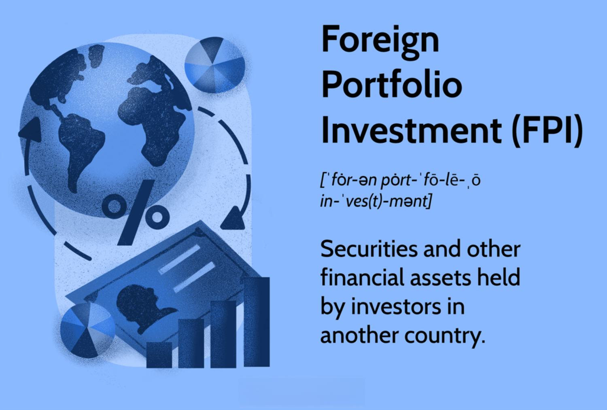

Foreign Portfolio Investment (FPI) is a pivotal component of international economics and financial markets, contributing to the diversification and potential returns for investors across the globe. FPI involves acquiring financial assets in a country other than the investor's own, such as stocks, bonds, and other securities. This investment strategy enhances portfolio diversification, which can help mitigate risks associated with domestic economic fluctuations.

Unlike Foreign Direct Investment (FDI), where investors gain management control over business operations in a foreign country, FPI is characterized by passive ownership. This means that investors do not exert direct control over the entities in which they invest. The distinction between FPI and FDI is crucial for understanding the different roles they play in a global investment strategy and the varying levels of engagement and risk involved.



This article delves into the multifaceted world of FPI by examining its benefits, such as liquidity and diversification, and its associated risks, including market volatility and foreign exchange fluctuations. Additionally, we explore how algorithmic trading can be utilized to manage FPIs effectively, offering investors a strategic edge in navigating complex market dynamics. By comparing FPI to FDI, we aim to highlight the unique opportunities FPIs present and guide investors on how to capitalize on this form of investment to enhance their global asset portfolios.

## Table of Contents

## Understanding Foreign Portfolio Investment (FPI)

Foreign Portfolio Investment (FPI) denotes the acquisition of financial assets such as stocks, bonds, mutual funds, and depository receipts by investors in a country other than their own. These investments are typically made with the objective of achieving diversification and gaining exposure to potential returns from foreign markets. FPI stands distinct from Foreign Direct Investment (FDI) as it involves passive ownership without conferring control or management over the foreign entities or assets. 

The liquidity of FPI is notably higher than that of FDI, as the former encompasses financial instruments that can be easily bought and sold on open markets. This attribute contributes to its attractiveness, enabling investors to enter and exit positions with relative ease. Given the passive nature of FPI, the risks associated with direct management and operational challenges are markedly reduced.

In terms of economic importance, FPI plays a crucial role in contributing to a country's balance of payments. It is a major facet of the capital account, representing portfolio flows from abroad. This can be mathematically articulated as part of the capital account balance in a nation's balance of payments equation:

$$
\text{Capital Account Balance} = \text{FDI} + \text{FPI} + \text{Other Financial Flows}
$$

Among common forms of FPI are American Depository Receipts (ADRs) and Global Depository Receipts (GDRs). These instruments allow investors to hold foreign stocks while trading them in local markets, hence providing additional access and convenience. Bonds and mutual funds in foreign markets offer debt securities and pooled investment schemes, respectively, to diversify an investor’s portfolio geographically.

In summary, Foreign Portfolio Investment is a strategic tool for investors seeking diversification and potentially enhanced returns without the commitment and complexities inherent in direct business operation management abroad. The passive nature of such investments confers [liquidity](/wiki/liquidity-risk-premium) advantages, thereby making FPIs a less risky alternative under volatile global market conditions.

## Benefits of Foreign Portfolio Investment

Foreign Portfolio Investment (FPI) offers several advantages that make it a valuable strategy for investors. One of the primary benefits of FPI is its ability to provide a quick return on investment. Due to the liquid nature of securities such as stocks and bonds, FPI allows investors to buy and sell assets with relative ease. This liquidity is a critical [factor](/wiki/factor-investing) in ensuring that investors can respond quickly to market changes and access funds when needed.

FPI enables investors to diversify their portfolios across various geographical regions and asset classes. This diversification reduces the impact of country-specific risks and mitigates potential losses from economic downturns in a single market. By spreading investments across multiple regions, investors can benefit from the growth of different economies, which may be at varying stages in the economic cycle. This geographical diversification helps in achieving a balanced risk-reward ratio, reducing overall portfolio [volatility](/wiki/volatility-trading-strategies).

Particularly appealing to retail investors, FPI does not require the substantial resources that direct investments in foreign enterprises typically demand. Retail investors can engage in FPI through financial instruments such as mutual funds and exchange-traded funds (ETFs), which pool resources and invest in diverse and international securities. This accessibility opens the door for individual investors to gain exposure to international markets without the complexities and constraints associated with Foreign Direct Investment (FDI).

Moreover, FPI can stimulate economic growth in the host country by increasing access to capital. The inflow of foreign investment enhances the liquidity of financial markets, leading to more efficient capital allocation. It provides businesses in the host country with the financial resources needed for expansion, innovation, and job creation. As capital becomes more readily available, it can lead to improved infrastructure, technological advancement, and increased competitiveness of domestic industries, contributing positively to the economic development of the host nation.

In summary, the benefits of FPI are multifaceted. From providing a quick return on investment and high liquidity to facilitating portfolio diversification and contributing to economic growth, FPI is a crucial component of a modern investment strategy. These advantages make it an attractive option for investors looking to optimize their portfolios and for host countries aiming to enhance economic development through foreign capital inflows.

## Investment Risks Associated with FPI

Foreign Portfolio Investment (FPI) attracts many investors due to its potential for high returns and portfolio diversification. However, it also exposes investors to several risks that can significantly affect the outcomes of their investments.

One primary risk associated with FPI is market volatility. Financial markets can experience rapid changes due to various factors such as economic reports, geopolitical tensions, or unexpected global events. This volatility can lead to sharp price swings in the securities held in foreign portfolios, affecting the value of investments. For example, a sudden downturn in a stock market can erode the value of stocks held by foreign investors, potentially leading to losses that are less predictable than those associated with more stable investments.

Investors also face foreign exchange risk when engaging in FPIs. This risk arises from fluctuations in currency exchange rates, which can alter the value of investments when they are converted back to the investor's home currency. For instance, if a U.S. investor holds assets in euros and the euro depreciates against the dollar, the investor might receive fewer dollars upon converting the euros back, reducing the return on investment. This risk is inherently unpredictable and can be particularly pronounced in economies with unstable currencies.

Another significant risk is political instability in the host country. Political events such as elections, changes in government policies, or civil unrest can impact the economic environment, affecting the performance of local companies and, consequently, the foreign investments in those companies. Political uncertainty can deter future investments and lead to a sell-off of existing assets, which can depreciate their value.

Moreover, large withdrawals of FPI can cause economic disruption in the host country. When many investors simultaneously decide to pull out their investments, it can lead to a liquidity crisis or a sudden devaluation in the host country's financial markets. This could further exacerbate market volatility, impacting both the departing investors and any remaining investors in those markets. 

Overall, while FPI offers opportunities for portfolio diversification and potential returns, investors must be keenly aware of the associated risks, including market volatility, foreign exchange fluctuations, political instability, and the impact of significant capital withdrawals. Proper risk assessment and management strategies are essential for navigating these complexities effectively.

## Algo Trading and FPIs

Algorithmic trading, commonly known as algo trading, plays a transformative role in the management of Foreign Portfolio Investments (FPIs) by deploying automated systems for trading activities. These algorithms are designed to execute orders at speeds and frequencies that are beyond the capability of a human trader, thereby enhancing the efficiency of trading operations. 

A key advantage of algorithmic systems is their ability to execute trades faster and more efficiently, which can significantly mitigate the impact of market volatility on FPI. In highly volatile markets, speed is crucial as prices can change rapidly. By using sophisticated algorithms, traders can capitalize on fleeting opportunities and avoid unfavorable market conditions. Algorithms can analyze market data in real-time, allowing for immediate decision-making that is essential to protect investments against adverse price movements.

Moreover, [algorithmic trading](/wiki/algorithmic-trading) allows for a more precise execution of trade strategies and portfolio adjustments. Unlike manual trading, where decisions might be influenced by human emotion or error, algos operate based on pre-defined criteria and extensive data analysis. This precision ensures that investment strategies are faithfully executed according to the investor's objectives, without deviation caused by human factors. 

Another significant benefit of algo trading in the context of FPIs is the ability to capitalize on small price differentials, a practice known as [arbitrage](/wiki/arbitrage). Algorithms can quickly identify and exploit these minute price variations across different markets or financial products, thereby enhancing the return on investments. For instance, an algorithm might detect a temporary price disparity between a stock's price on a local exchange and its equivalent price in a foreign market, executing trades to take advantage of this difference before the market corrects itself.

The use of algo trading in managing FPIs not only provides a competitive edge by improving trade execution and efficiency but also contributes to overall market liquidity and stability. Through a combination of speed, precision, and strategic exploitation of market conditions, algo trading has become an indispensable tool for investors looking to optimize the performance of their foreign portfolio investments.

## Comparison: FPI vs. FDI

Foreign Portfolio Investment (FPI) and Foreign Direct Investment (FDI) differ significantly in their nature, implications, and the level of control they offer. 

FPI is defined by passive ownership. Investors acquire financial assets such as stocks and bonds in a foreign market without gaining any control or influence over the management of the entities in which they invest. This passive nature translates to flexibility; FPIs can be easily bought and sold, providing investors with liquidity. However, this liquidity also results in higher exposure to market volatility, making FPIs relatively riskier.

In contrast, Foreign Direct Investment (FDI) involves active ownership. Investors directly acquire a controlling interest in a foreign business or establish operations in another country, which offers them an opportunity to partake in the management and operations of the business. This engagement confers greater stability compared to FPI, as it is typically long-term and less sensitive to short-term market fluctuations. However, FDIs are less liquid, as divesting from foreign business operations is more complex than trading in securities.

The regulatory frameworks governing FPI and FDI also vary. FPIs are often subject to regulations designed to manage cross-border investment flows and can include restrictions on the type or amount of investment allowed. FDIs, on the other hand, need to comply with more detailed regulations pertaining to foreign ownership, operational control, and possibly governmental approvals, reflecting the deeper involvement in local economies.

Despite their differences, both FPI and FDI provide valuable channels for investors looking to diversify internationally. Investors must weigh the liquidity and potential volatility of FPIs against the control and stability that come with FDIs, while also considering the regulatory landscape of their investment targets.

## How Retail Investors Can Participate in FPI

Retail investors can engage in Foreign Portfolio Investment (FPI) through several practical avenues, primarily involving mutual funds and exchange-traded funds (ETFs). These financial instruments offer a straightforward way for retail investors to gain exposure to foreign securities without requiring significant capital or extensive market knowledge.

Mutual funds pool money from various investors to purchase a diversified portfolio of stocks, bonds, or other securities in international markets. By investing in a mutual fund that focuses on foreign assets, retail investors can achieve diversification, mitigating individual security and market risks. ETFs, similar to mutual funds, track an index, commodity, or basket of assets but trade like stocks on an exchange. This trait provides liquidity and flexibility, allowing investors to buy and sell as needed.

Another method for retail investors to access foreign markets is through brokerage accounts that permit the purchase of international securities. Brokers often provide access to foreign stock exchanges, directly enabling purchases in companies outside the investor’s home country. It’s crucial for investors to verify if their broker supports international trading and understand the associated costs and tax implications.

Investors should diligently research to comprehend the risks related to FPIs. Currency risk is a significant factor, as fluctuations in exchange rates can influence returns. Political risk must also be considered, especially in countries with unstable governments or unpredictable regulatory environments.

Diversification remains a key strategy to manage these risks effectively. By spreading investments across multiple countries and asset classes, investors can reduce the impact of adverse events in any single market. This approach not only mitigates risk but also capitalizes on growth opportunities across different regions, thereby enhancing potential returns.

In sum, retail investors can participate in FPIs through various channels that offer access to foreign markets. Adequate research, risk assessment, and diversification strategies are essential to maximizing benefits while minimizing associated risks.

## Managing the Risks of FPI

Managing the risks associated with Foreign Portfolio Investment (FPI) involves several strategic approaches that investors can employ to safeguard their investments and enhance returns. One of the primary methods to mitigate risk is diversifying investments across various markets and sectors. Diversification reduces exposure to any single economic event or market trend, thus balancing the portfolio's performance and minimizing risk. By investing in a mix of asset classes and geographical regions, investors can cushion the impact of adverse market movements in a specific area.

Staying vigilant about global economic and political developments is crucial for managing FPI risks. Economic reports, geopolitical tensions, and changes in fiscal or monetary policy can greatly influence the performance of foreign investments. Investors can mitigate potential risks by staying informed about such developments, enabling them to make timely adjustments to their portfolios.

Algorithmic trading systems have become indispensable tools in managing FPI risks. These systems use computer algorithms to execute trades automatically based on predetermined criteria, such as market trends and historical data. Algo trading can enhance the precision and efficiency required for managing FPIs, particularly in volatile markets. For example, by using moving averages, an algorithm can decide when to buy or sell foreign assets to maximize returns while minimizing risks. Here is a simple Python example of calculating a moving average:

```python
def moving_average(data, window_size):
    results = []
    for i in range(len(data) - window_size + 1):
        window = data[i:i + window_size]
        average = sum(window) / window_size
        results.append(average)
    return results

# Sample data and usage
price_data = [10, 12, 13, 14, 13, 12, 11]
print(moving_average(price_data, 3))
```

Hedging against currency risk using foreign exchange ([forex](/wiki/forex-system)) instruments is another essential strategy for managing FPI risks. Currency fluctuations can affect the value of investments held in foreign currencies. Investors can use forex contracts and options to hedge against adverse currency movements, offering protection against potential losses due to unfavourable exchange rate shifts.

In summary, successful FPI risk management requires a comprehensive approach that includes diversification, staying informed about global affairs, leveraging algorithmic trading strategies, and hedging against currency fluctuations. By employing these strategies, investors can significantly enhance the resilience and performance of their foreign investment portfolios.

## Conclusion

Foreign Portfolio Investment (FPI) plays an instrumental role in offering investors the advantages of liquidity, diversification, and the potential for higher returns. As a highly liquid investment option, FPIs allow investors to respond swiftly to market changes, providing the agility to capitalize on favorable conditions and reduce exposure during downturns. Diversification through FPIs enables investors to broaden their portfolios across various countries and asset classes, reducing risks associated with any single market. This strategy is particularly beneficial for mitigating idiosyncratic risks that might affect specific sectors or geographic regions.

Despite these benefits, FPIs [carry](/wiki/carry-trading) inherent risks, notably those associated with market volatility and foreign exchange fluctuations. Market volatility can lead to rapid and unpredictable changes in asset prices, which can adversely impact the value of investments. On the other hand, foreign exchange risks arise due to the potential for unfavorable currency movements, which can erode returns when currencies from different countries are involved.

The integration of algorithmic trading presents a transformative approach to managing FPIs. By employing sophisticated algorithms, investors can execute trades with speed and precision, taking advantage of fleeting price differentials and managing portfolios in accordance with real-time market dynamics. Algorithmic trading not only enhances the ability to manage market volatility but also optimizes returns through strategic trading executions.

For retail investors, entering the FPI market necessitates a thorough understanding of the associated risks and opportunities. Comprehensive research and careful planning are crucial to effectively harness the benefits of FPIs while mitigating potential downsides. By employing hedging strategies using forex instruments or diversifying across multiple markets and sectors, investors can protect their investments against adverse market movements. Retail investors should remain vigilant about global economic trends and geopolitical developments, ensuring their investment strategies are adaptive and well-informed.

In summation, while FPI offers numerous financial advantages, its success largely hinges on strategic management and a keen awareness of the fluctuating global economic landscape. Through informed decision-making and the judicious use of advanced trading technologies, investors can adeptly navigate the complexities of foreign portfolio investments.

## References & Further Reading

[1]: ["The Theory and Practice of Foreign Portfolio Investment"](https://onlinelibrary.wiley.com/doi/book/10.1002/9781118267028), Journal of International Money and Finance, 2012.

[2]: ["Exchange Rates and Foreign Portfolio Investment"](https://www.tandfonline.com/doi/full/10.1080/1540496X.2018.1496419), Journal of International Economics, 2005.

[3]: ["The Impact of Foreign Direct Investment versus Foreign Portfolio Investment on Economic Growth in Sub-Saharan Africa"](https://www.sciencedirect.com/science/article/pii/S0022199697000330), World Development, 2015.

[4]: ["Algorithmic Trading and Market Dynamics"](https://www.cmegroup.com/education/files/Algo_and_HFT_Trading_0610.pdf), SIGMETRICS Performance Evaluation Review, 2013.

[5]: Grewal, R. (2020). ["Algorithmic Trading and Demand Learning"](https://www.sciencedirect.com/science/article/pii/S0022435916300872), Journal of Financial Markets. 

[6]: ["Global Asset Allocation: The Global Investment Frontier"](https://am.jpmorgan.com/us/en/asset-management/adv/insights/portfolio-insights/asset-class-views/asset-allocation/) by Meb Faber

[7]: ["International Investment Law and Foreign Direct Investment"](https://www.cambridge.org/core/journals/international-organization/article/abs/international-investment-law-and-foreign-direct-reinvestment/377B6C8F4F0204F17C0EEB732FCBF6EF) by Tobias Ackermann

[8]: ["Financial Risk Management for Dummies"](https://www.wiley.com/en-us/Financial+Risk+Management+For+Dummies-p-9781119082200) by Aaron Brown

[9]: ["Portfolio Diversification with Foreign Intermediary Trading"](https://www.investopedia.com/articles/investing/030116/portfolio-diversification-done-right.asp), Journal of Banking & Finance, 2018.