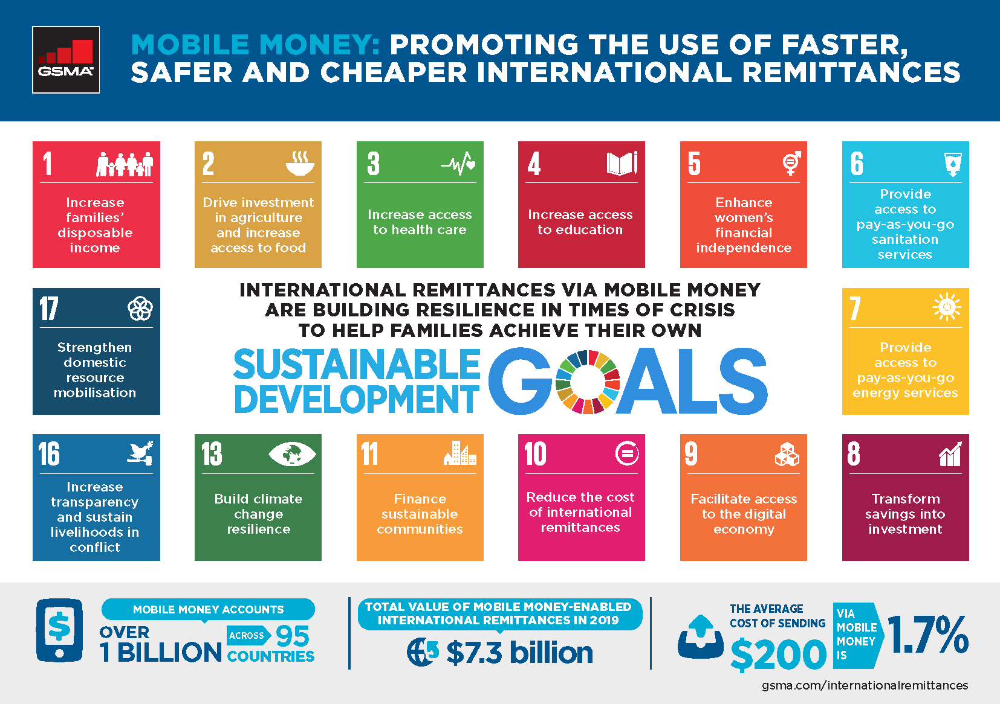

## Table of Contents

## What is foreign remittance?

Foreign remittance is when someone sends money from one country to another. It's common for people who work in a different country to send money back home to their families. This money helps support their loved ones and can be used for things like food, education, and housing.

The process of sending money abroad can be done through banks, money transfer services, or even mobile apps. Each method has its own fees and exchange rates, so it's important to choose the one that works best for you. Governments often keep track of these remittances because they can have a big impact on a country's economy.

## How does foreign remittance work?

Foreign remittance is when someone sends money from one country to another. It's like sending a gift, but instead of a present, it's money. People often do this when they work in a different country and want to help their family back home. They can use banks, special money transfer companies, or even apps on their phone to send the money. Each way has its own cost and rules about how much money you can send.

When you decide to send money, you go to a bank or use a service like Western Union or MoneyGram. You give them the money you want to send, and they take care of getting it to the right person in another country. They might charge you a fee for this service, and the amount of money that arrives might be a bit different because of something called the exchange rate. This is how much one country's money is worth compared to another country's money. Once the money is sent, the person receiving it can pick it up at a bank or another location, or it might go straight into their bank account.

## What are the common methods of sending foreign remittances?

There are several common ways to send foreign remittances. One way is through banks. You can go to your bank and ask to send money to another country. The bank will take your money, charge a fee, and then send it to the bank account of the person you want to help. Another way is to use special money transfer companies like Western Union or MoneyGram. You give them your money and they help get it to your family or friends in another country. They also charge a fee, but sometimes it's less than what banks charge.

Another popular method is using online services or mobile apps. Companies like PayPal, TransferWise, and WorldRemit let you send money from your phone or computer. You enter how much you want to send and where it should go, and the app takes care of the rest. These services can be quicker and sometimes cheaper than banks or money transfer companies. Lastly, some people use informal methods, like giving money to someone who is traveling to the country where you want the money to go. This can be risky because there's no guarantee the money will reach its destination, but it's sometimes used in places where other methods are hard to use.

## What are the benefits of foreign remittance for individuals?

Foreign remittance helps individuals in big ways. When someone works in another country and sends money back home, it can make a big difference for their family. This money can be used to buy food, pay for school, or fix up their home. It gives families a way to have a better life and not worry so much about money.

Not only does it help with daily needs, but it can also give people a chance to save up for the future. With the extra money, families might be able to start a small business or save for emergencies. This can make them feel more secure and hopeful about what's ahead. So, foreign remittance is like a lifeline that connects people across the world and helps them support each other.

## How do foreign remittances impact the economies of receiving countries?

Foreign remittances can have a big impact on the economies of the countries that receive them. When people working abroad send money back home, it adds a lot of money to the country's economy. This extra money can help families buy more things, which can make businesses grow and create more jobs. It's like giving the economy a boost. Governments also like remittances because they bring in money from other countries, which can help make the country's money more stable and strong.

But there can also be some challenges. If a country depends too much on money from abroad, it might not focus on growing its own businesses and industries. This can make the economy less strong in the long run. Also, if the money sent home is mostly used for daily needs and not for saving or investing, it might not help the economy grow as much as it could. So, while remittances can be a big help, it's important for countries to use them in a way that builds a stronger economy for the future.

## What are the fees associated with sending foreign remittances?

When you send money to another country, you usually have to pay a fee. This fee can be different depending on how you send the money. If you use a bank, they might charge you a fee that can be a few dollars or even a percentage of the money you're sending. Money transfer companies like Western Union or MoneyGram also charge fees, but sometimes their fees are less than what banks charge. When you use online services or apps like PayPal or TransferWise, the fees can be lower, but they still take a small amount for their service.

Another thing to think about is the exchange rate. This is how much one country's money is worth compared to another country's money. When you send money abroad, the company or bank you use might give you a different exchange rate than what you see online. This can make the amount of money that arrives in the other country less than you expected. So, when you're sending money, it's a good idea to look at both the fee and the exchange rate to see how much it will really cost you.

## What are the risks involved in sending foreign remittances?

Sending money to another country can have some risks. One big risk is that the money might not reach the person you want to help. Sometimes, the service you use to send the money can have problems or delays. Also, if you're using a less official way, like giving money to someone traveling to that country, there's a chance the money could get lost or stolen.

Another risk is losing money because of fees and exchange rates. When you send money, the bank or service you use will charge a fee. This fee can be a lot of money, especially if you're sending a small amount. Also, the exchange rate might not be in your favor. This means the amount of money that arrives in the other country could be less than you planned. It's important to check the fees and exchange rates before you send money to make sure you're getting a good deal.

Lastly, there's the risk of fraud and scams. Some people might try to trick you into sending them money by pretending to be someone you know or offering a fake service. It's really important to make sure you're using a trusted service and to be careful about who you're sending money to. Always double-check the details before you send any money.

## How can one choose the best service for sending foreign remittances?

When you want to send money to another country, it's important to pick the right service. First, think about the fees. Different services charge different amounts, so look for one with low fees. Banks might charge more than money transfer companies like Western Union or MoneyGram. Online services and apps like PayPal or TransferWise can sometimes be cheaper. Also, check the exchange rate. This is how much one country's money is worth compared to another's. A good exchange rate means more money for the person getting it.

Next, think about how fast and easy it is to send the money. Some services are quicker than others. If you need the money to arrive fast, look for a service that can do that. Also, think about how easy it is to use. Some services let you send money from your phone or computer, which can be very convenient. Lastly, make sure the service is safe and trusted. Read reviews and check if it has good security to protect your money. Choosing the right service can save you money and make sure your remittance gets where it needs to go safely and quickly.

## What role do mobile technologies play in foreign remittance?

Mobile technologies have made sending money to other countries easier and faster. With mobile apps like PayPal, TransferWise, and WorldRemit, you can send money from your phone anytime and anywhere. You don't need to go to a bank or a money transfer place. This is really helpful for people who live far from these places or who don't have time to visit them. Plus, these apps often have lower fees than banks, so you can save money while helping your family.

These apps also make it easier for the people receiving the money. They can get the money right into their bank account or pick it up at a nearby location. This means they can use the money quickly to buy food, pay for school, or fix their home. Mobile technologies have changed the way people send money across the world, making it simpler and more convenient for everyone involved.

## How do government regulations affect foreign remittance services?

Government rules can change how easy or hard it is to send money to another country. Some countries have strict rules about sending money out. They might limit how much money you can send or make you fill out a lot of paperwork. This can make it slower and more expensive to send money. Governments do this to keep track of money moving in and out of their country, to stop illegal activities like money laundering, and to protect their economy.

But these rules can also help make sending money safer and more reliable. Governments might require money transfer companies to follow certain security steps to protect people's money. They might also work with other countries to make sending money easier and cheaper. For example, some countries have agreements that let people send money without paying as many fees. So, while government rules can make sending money harder in some ways, they can also help make it safer and more fair for everyone.

## What are the future trends in foreign remittance technology?

In the future, sending money to other countries will get even easier and faster thanks to new technology. One big trend is the use of blockchain and cryptocurrencies. These are special types of money that use the internet to send payments quickly and with less cost. They can make sending money across borders easier because they don't need banks or other middlemen. This means you could send money to your family in another country almost instantly and pay less in fees.

Another trend is the growth of mobile payment apps. More and more people are using their phones to send and receive money. These apps are getting better at working in different countries, so you can send money from your phone no matter where you are. They're also adding new features, like being able to pay bills or buy things directly from the app. This makes it even more convenient for people to manage their money and help their families from far away.

## How can businesses leverage foreign remittance for international operations?

Businesses can use foreign remittance to help them work in other countries. When a business sends money to another country, it can pay for things like supplies, workers, or even opening a new office. This makes it easier for the business to grow and do well in new places. By using foreign remittance services, businesses can move money quickly and often at a lower cost than using banks. This can save them money and make it easier to manage their money in different countries.

Another way businesses can use foreign remittance is to help their workers who live in other countries. If a business has employees working abroad, it can send them money easily and quickly. This can help keep the workers happy and make sure they get paid on time. Using mobile apps and online services for remittance can make this even easier. It also helps businesses keep track of their money and make sure everything is done correctly and legally, following the rules of the countries they work in.

## References & Further Reading

[1]: ["The World Bank's Remittance Prices Worldwide Database"](https://remittanceprices.worldbank.org/) - Provides comprehensive data on remittance prices and trends, contributing to understanding the importance of transaction cost reductions in international remittance flows.

[2]: Quirk, P.J., & Wimpey, S. (2014). ["International Money Transfer Remittances Manual: Guide for Compilers and Users"](https://www.imf.org/external/np/sta/bop/remitt.htm). International Monetary Fund. Offers insights into compiling and utilizing remittance data effectively.

[3]: Lopez de Prado, M. (2018). ["Advances in Financial Machine Learning"](https://www.amazon.com/Advances-Financial-Machine-Learning-Marcos/dp/1119482089). Wiley. Discusses the application of machine learning techniques, relevant for algorithmic trading in financial services.

[4]: Aronson, D. R. (2006). ["Evidence-Based Technical Analysis: Applying the Scientific Method and Statistical Inference to Trading Signals"](https://www.amazon.com/Evidence-Based-Technical-Analysis-Scientific-Statistical/dp/0470008741). Wiley. Examines technical analysis using a scientific approach, applicable in algorithmic trading strategies.

[5]: Euromonitor International. (2023). ["Mobile Money Transfer and Payments Industry Overview"](https://www.euromonitor.com/contentassets/d065ccc665a94b2ca856e5dfbf95d4bd/navigating-the-global-digital-commercial-payments-landscape-for-large-corporates_high-res.pdf). Analysis of the mobile money transfer landscape, reflecting the shift from traditional banking to fintech solutions.

[6]: Higgins, S. (2015). ["Regulating Financial Remittances: Transforming Emigration, Poverty, and the Transnational State"](https://scholarship.law.uc.edu/cgi/viewcontent.cgi?article=1301&context=uclr). Routledge. A thorough examination of regulatory frameworks surrounding remittance flows, emphasizing their socio-economic impacts.

[7]: FATF (2021). ["International Standards on Combating Money Laundering and the Financing of Terrorism & Proliferation"](https://www.fatf-gafi.org/en/publications/Fatfrecommendations/Fatf-recommendations.html). Financial Action Task Force. Provides international guidelines crucial for safeguarding remittance services against financial crimes.

[8]: ["Algorithmic Trading and the Market for Liquidity"](https://www.jstor.org/stable/43303831) - Discusses the impact of algorithmic trading on market liquidity, relevant to its application in remittances.