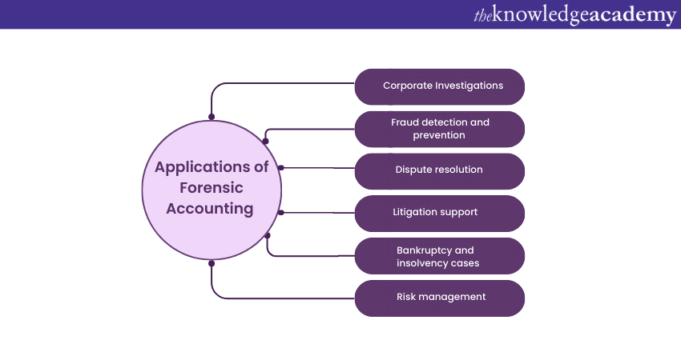

## Table of Contents

## What is forensic accounting?

Forensic accounting is a special kind of accounting that helps solve financial mysteries and problems. It is used to find out if someone has done something wrong with money, like stealing or cheating. Forensic accountants look at financial records very closely to find clues and evidence. They use their skills to help in legal cases, like when a company thinks an employee might have stolen money, or when there is a dispute about money between people or businesses.

In addition to looking for fraud, forensic accountants also help in other situations. They can be involved in divorce cases to figure out how to split money fairly. They also work on insurance claims to check if the claims are honest. Forensic accountants use their knowledge of accounting, along with investigation skills, to give clear answers and help solve financial puzzles. Their work is important because it helps make sure that financial dealings are fair and honest.

## What are the main objectives of forensic accounting?

The main goal of forensic accounting is to find out if there has been any wrongdoing with money. This means looking for signs of fraud, like when someone steals money from a company or lies about financial records. Forensic accountants dig through financial documents to find clues and evidence that can show if someone has done something illegal or dishonest. Their work helps businesses, courts, and other organizations understand what happened and who might be responsible.

Another important objective is to help solve financial disputes. This can happen in situations like divorces, where forensic accountants figure out how to divide money and assets fairly between the two people. They also work on insurance claims to check if the claims are honest and if the insurance company should pay out. By using their accounting skills and investigation techniques, forensic accountants provide clear answers that help resolve these disputes and ensure that financial dealings are handled correctly and justly.

## How does forensic accounting differ from traditional accounting?

Forensic accounting and traditional accounting both deal with numbers and money, but they have different goals. Traditional accounting focuses on keeping track of a company's financial transactions and making sure everything is recorded correctly. It's about preparing financial statements, like balance sheets and income statements, that show how a business is doing. Traditional accountants make sure that all the numbers add up and that the company follows the rules for reporting its finances.

On the other hand, forensic accounting is like detective work for money. It goes beyond just recording numbers and looks for signs of fraud or other financial wrongdoing. Forensic accountants dive deep into financial records to find clues that someone might have stolen money or lied about the company's finances. They use their skills to help solve legal cases, like when a company suspects an employee of theft, or to settle disputes in situations like divorces or insurance claims. While traditional accounting is about keeping things in order, forensic accounting is about uncovering the truth behind the numbers.

## What are the common areas where forensic accounting is applied?

Forensic accounting is used in many different situations where there might be problems with money. One common area is when a company thinks someone might have stolen money or cheated on their financial reports. Forensic accountants look at the company's financial records very closely to find any signs of fraud. They help the company figure out what happened and who might be responsible. This kind of work is important for businesses because it helps them catch people who do wrong things with money.

Another area where forensic accounting is used is in legal cases, like divorces. When a couple is splitting up, they need to figure out how to divide their money and things they own fairly. Forensic accountants help by looking at all the financial information and making sure everything is shared correctly. They also work on insurance claims to check if the claims are honest. If someone says they lost a lot of money because of an accident or a problem, forensic accountants check the numbers to see if the insurance company should pay out. This helps make sure that financial dealings are fair and honest.

## What skills are essential for a forensic accountant?

To be a good forensic accountant, you need to know a lot about accounting. This means understanding how to read and analyze financial statements and records. You should also be good at using accounting software and tools. But it's not just about numbers. Forensic accountants need to be good at investigating too. They need to be able to look at lots of information, find clues, and figure out if something fishy is going on with the money.

Besides accounting and investigation skills, forensic accountants need to be good at communicating. They have to explain what they find to people who might not understand accounting, like lawyers or judges. Writing clear reports and giving good presentations are important parts of the job. Also, forensic accountants need to be honest and ethical. They often work on cases where money and legal issues are involved, so people need to trust them to do the right thing. Being detail-oriented and patient is also key because finding fraud can take a long time and requires looking at everything very carefully.

## What are the typical steps involved in a forensic accounting investigation?

A forensic accounting investigation usually starts with someone asking for help because they think something is wrong with their money. The first step is to plan the investigation. The forensic accountant talks to the person who asked for help to understand what they need to find out. They decide what financial records to look at and how to go about the investigation. This planning helps make sure the investigation is focused and efficient.

Next, the forensic accountant collects all the financial documents they need. This can include bank statements, invoices, and other records. They look at these documents very closely to find any signs of fraud or other problems. They might use special software to help them analyze the data. If they find something suspicious, they dig deeper to gather more evidence. This part of the investigation can take a long time because they need to be very thorough.

Once the forensic accountant has all the evidence, they put it together in a report. This report explains what they found and what it means. They might need to explain their findings in court or to the person who asked for the investigation. The goal is to help solve the problem and make sure that any wrongdoing is dealt with properly. The whole process requires a lot of attention to detail and careful work.

## How is forensic accounting used in fraud detection and prevention?

Forensic accounting helps find and stop fraud by looking closely at financial records. When a company thinks someone might be stealing money or lying about their finances, they call in a forensic accountant. The accountant looks at bank statements, invoices, and other documents to find clues that something is wrong. They use special tools and software to spot unusual patterns or numbers that don't add up. By digging deep into the records, they can find evidence of fraud and help the company figure out what happened and who did it.

Once fraud is found, forensic accountants also help prevent it from happening again. They suggest ways to make the company's financial systems stronger and harder to cheat. This can include better checks and balances, more training for employees on how to spot fraud, and using software that watches for strange financial activity. By finding fraud early and making it harder to do, forensic accounting helps keep a company's money safe and makes sure everyone is playing fair.

## What role does forensic accounting play in legal disputes and litigation?

Forensic accounting plays a big role in legal disputes and litigation by helping to find the truth about money problems. When people or companies go to court over money issues, like in a divorce or a business disagreement, forensic accountants look at all the financial records to figure out what really happened. They can find out if someone has hidden money or lied about how much they have. This information is very important because it helps the court make fair decisions based on the facts.

In court cases, forensic accountants also help by explaining their findings in a way that everyone can understand. They write detailed reports and sometimes testify in court to explain what they found. This helps judges and lawyers understand the financial side of the case better. By using their skills to uncover the truth and explain it clearly, forensic accountants help make sure that legal disputes are settled fairly and that justice is served.

## Can you explain the use of forensic accounting in bankruptcy and insolvency cases?

Forensic accounting is really helpful in bankruptcy and insolvency cases. When a company can't pay its debts and has to go through bankruptcy, forensic accountants look at the company's financial records to find out why it got into trouble. They check if the company's leaders did anything wrong or if someone was stealing money. This helps figure out if the bankruptcy was caused by bad decisions or even fraud. By understanding what went wrong, forensic accountants can help the court decide what to do next.

In insolvency cases, where a company can't pay its debts but isn't necessarily going bankrupt, forensic accountants also play a big role. They look at the company's [books](/wiki/algo-trading-books) to see if there's a way to save it or if it's better to close it down. They might find hidden assets that can be used to pay off debts, or they might uncover fraud that made the company's problems worse. Their work helps everyone involved, like creditors and the court, make better decisions about what to do with the company and its money.

## How is technology, such as data analytics, utilized in forensic accounting?

Technology, like data analytics, helps forensic accountants a lot in their work. They use special software to look at big piles of financial data quickly and find things that don't look right. This can be like spotting numbers that are too high or too low, or finding patterns that don't make sense. By using data analytics, forensic accountants can find signs of fraud faster than if they had to look at everything by hand. It's like having a super smart helper that can sort through tons of information and point out what they need to check more closely.

Data analytics also helps forensic accountants make their reports better. They can use the software to show their findings in clear charts and graphs, which makes it easier for people who don't know much about accounting to understand what's going on. This is really important when they have to explain their work in court or to a company's leaders. By using technology, forensic accountants can do their job more quickly and accurately, which helps them catch people who do wrong things with money and stop it from happening again.

## What are some advanced techniques used in forensic accounting to uncover financial irregularities?

Forensic accountants use advanced techniques like data mining to find financial irregularities. Data mining means using special software to look through big piles of financial data and find patterns or numbers that don't make sense. This helps them spot things like fake invoices or strange transactions that might be signs of fraud. By using data mining, forensic accountants can quickly find clues that would be hard to see if they had to look at everything by hand.

Another technique they use is called Benford's Law. This is a rule about how numbers usually show up in financial records. If the numbers in a company's books don't follow Benford's Law, it might mean someone is messing with the numbers on purpose. Forensic accountants use this to check if the financial records are honest. It's like a special test that helps them find out if someone is trying to hide something.

Forensic accountants also use something called digital forensics. This means looking at computers and other electronic devices to find hidden financial information. They can recover deleted files or find secret messages that show someone was doing something wrong with money. By using digital forensics, forensic accountants can uncover evidence that might be hidden deep in a computer's memory. These advanced techniques help them catch people who try to cheat and make sure financial records are honest.

## What are the future trends and challenges facing the field of forensic accounting?

In the future, forensic accounting will use more technology to find fraud. Tools like [artificial intelligence](/wiki/ai-artificial-intelligence) and [machine learning](/wiki/machine-learning) will help forensic accountants look at big piles of data faster and find signs of cheating more easily. These tools can learn what normal financial patterns look like and spot anything strange. This means forensic accountants can focus on the most important clues and solve cases quicker. But using these new tools also means they need to keep learning and stay up to date with the latest technology.

One big challenge for forensic accountants is that fraudsters are getting smarter too. They use new tricks and technology to hide their cheating, so forensic accountants have to keep finding new ways to catch them. Another challenge is that there are more rules and laws about money and fraud, so forensic accountants need to know a lot about these rules to do their job right. Keeping up with all these changes can be hard, but it's important for making sure they can still find and stop fraud.

## References & Further Reading

[1]: Bergstra, J., Bardenet, R., Bengio, Y., & Kégl, B. (2011). ["Algorithms for Hyper-Parameter Optimization."](https://papers.nips.cc/paper/4443-algorithms-for-hyper-parameter-optimization) Advances in Neural Information Processing Systems 24.

[2]: ["Advances in Financial Machine Learning"](https://www.amazon.com/Advances-Financial-Machine-Learning-Marcos/dp/1119482089) by Marcos Lopez de Prado

[3]: ["Evidence-Based Technical Analysis: Applying the Scientific Method and Statistical Inference to Trading Signals"](https://www.amazon.com/Evidence-Based-Technical-Analysis-Scientific-Statistical/dp/0470008741) by David Aronson

[4]: ["Machine Learning for Algorithmic Trading"](https://github.com/stefan-jansen/machine-learning-for-trading) by Stefan Jansen

[5]: ["Quantitative Trading: How to Build Your Own Algorithmic Trading Business"](https://www.amazon.com/Quantitative-Trading-Build-Algorithmic-Business/dp/1119800064) by Ernest P. Chan