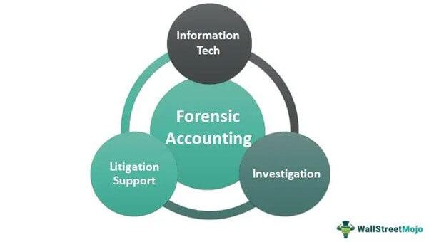

In a rapidly advancing digital world, the complexity of financial systems has surged, creating a landscape ripe with both opportunities and vulnerabilities. This evolving terrain poses nuanced challenges in financial transactions, primarily due to the heightened risk of fraudulent activities. Traditional financial practices are being reshaped by digital innovations, necessitating a convergence of fraud detection, forensic accounting, and financial investigations with contemporary trading strategies, such as algorithmic trading.

Technological advances have indeed spurred unprecedented growth, yet they simultaneously present new frontiers in financial security threats. As these threats evolve, so too must the methodologies employed to identify and scrutinize fraudulent activities. Forensic accounting emerges as a pivotal discipline, melding accounting expertise with investigative prowess to unveil financial discrepancies indicative of fraud or embezzlement.



Financial investigations, powered by cutting-edge techniques and tools, play an integral role in tracking intricate financial transactions and isolating fraudulent patterns. By marrying these traditional investigative skills with technology-driven trading mechanisms like algorithmic trading, we enhance the capacity to detect and prevent financial crimes. Algorithmic trading leverages complex algorithms to perform trades with remarkable speed and precision, optimizing outcomes by digesting and acting on vast data pools instantaneously. However, this same efficiency can be exploited, making algorithmic trading platforms susceptible to sophisticated fraudulent schemes.

This article will examine the symbiotic relationship between forensic accounting and algorithmic trading efforts in detecting fraud. By utilizing forensic accounting techniques within algorithmic trading, financial institutions can implement robust strategies to scrutinize and validate financial transactions. This integration not only enhances fraud detection capabilities but also fortifies market integrity by preemptively addressing potential malicious activities. Through this lens, we understand how maintaining security in financial markets requires a continuous evolution of strategies, ensuring financial ecosystems are equipped to counter the complexities of modern-day fraud effectively.

## Table of Contents

## Understanding Forensic Accounting

Forensic accounting merges traditional accounting with investigative techniques to analyze financial records, aiming to uncover instances of fraud and embezzlement. This specialized field requires forensic accountants to have a deep understanding of accounting practices alongside skills in auditing, law, and investigatory professions. The role of a forensic accountant extends beyond just identifying financial discrepancies; they meticulously examine financial documentation, conduct detailed analyses of complex transactions, and compile evidence that can be used in legal proceedings.

Professional forensic accountants are indispensable in legal contexts, where their expertise in financial crimes is invaluable. They often serve as expert witnesses in courtrooms, where they provide authoritative testimony and insights into financial irregularities and fraudulence. Their ability to present complex financial information clearly and accurately aids legal professionals and juries in understanding intricate financial crimes.

Their investigative work spans a variety of cases, including corporate fraud detection, criminal investigations, and litigation support. In corporate settings, forensic accountants might identify inconsistencies in financial statements, which could signal fraudulent activity within a business. Their expertise is crucial in criminal investigations, where they help track financial crimes such as money laundering or bribery. Litigation support is another area where forensic accountants apply their skills, assisting in divorces, business valuation disputes, and bankruptcy cases by providing clear financial evidence and valuations.

In summary, forensic accounting is a blend of accounting and thorough investigation. It plays a vital role in identifying and prosecuting financial crimes and providing critical insights for various legal and corporate applications.

## The Role of Fraud Detection in Financial Investigations

Fraud detection within financial investigations serves as a critical mechanism in identifying illegal activities in financial systems. At its core, fraud detection focuses on uncovering irregularities in financial statements or identifying patterns that deviate from standard practices. These irregularities can manifest in various ways, such as discrepancies in accounting records, unexplained financial transactions, or unusual behaviors in financial data.

Financial investigations leverage advanced techniques and tools to meticulously trace and analyze these complex transactions. This often involves the use of data analytics, [machine learning](/wiki/machine-learning) algorithms, and statistical methods to sift through large volumes of data and detect any anomalies indicative of fraudulent activity. Tools such as anomaly detection algorithms, which flag transactions deviating significantly from the norm, play a pivotal role in this process. For instance, clustering algorithms might be employed to detect groups of transactions that do not conform to typical transactional behavior.

Moreover, financial investigations not only focus on data analysis but also on tracing the flow of funds. This endeavor often reveals hidden schemes that may be deliberately obscured through complex structures or offshore accounts. Techniques such as forensic data analytics enable investigators to trace money trails and uncover relationships between suspicious entities.

Effective fraud detection is vital in protecting assets and maintaining trust within the financial system. When fraudulent activities are left undetected, they can cause significant financial losses, erode investor confidence, and harm the reputation of financial institutions. Furthermore, detecting and addressing fraud is integral to ensuring regulatory compliance. Financial systems are subject to various regulations designed to prevent money laundering, fraud, and other illicit activities. By effectively identifying and addressing fraudulent transactions, financial institutions can better comply with these regulations, thereby avoiding legal penalties and contributing to the overall integrity of financial markets.

In summary, fraud detection within financial investigations is an essential function in the modern financial landscape. By employing sophisticated analytical tools and methods, financial investigators can identify and mitigate fraudulent activities, ensuring the protection of assets, maintaining the trust of stakeholders, and adhering to necessary regulatory standards.

## Algorithmic Trading: Revolutionizing Financial Markets

Algorithmic trading utilizes sophisticated algorithms to autonomously execute trades at speeds and volumes that are beyond human capability. These algorithms are crafted to efficiently navigate market dynamics, optimizing trading strategies to enhance outcomes, mitigate risks, and increase profitability. By exploiting minute-by-minute market movements, [algorithmic trading](/wiki/algorithmic-trading) systems can quickly process large quantities of data to make informed decisions.

At its core, algorithmic trading leverages the principles of quantitative analysis, using mathematical models and statistical techniques to identify trading opportunities. A fundamental aspect of these algorithms is their ability to analyze vast datasets instantaneously, identifying patterns and correlations that may be invisible to human traders. For instance, algorithms can apply techniques like moving averages, exponential smoothing, or more complex processes such as machine learning models to predict price movements and execute trades accordingly.

The high-speed nature of algorithmic trading is often facilitated by high-frequency trading ([HFT](/wiki/high-frequency-trading-strategies)), which is a subset of this technology. HFT firms implement algorithmic execution to transact a large number of orders in fractions of a second, taking advantage of small price imbalances in the market. Python, with its diverse libraries like NumPy, pandas, and scikit-learn, serves as a prevalent language for developing these algorithms due to its robust data processing and machine learning capabilities. Here’s a simple Python example illustrating a moving average crossover strategy:

```python
import pandas as pd
import numpy as np

# Example stock price data
data = {'Price': [100, 102, 104, 101, 99, 98, 105, 107, 110, 108]}
df = pd.DataFrame(data)

# Calculate short and long moving averages
short_window = 3
long_window = 5
df['Short_MA'] = df['Price'].rolling(window=short_window, min_periods=1).mean()
df['Long_MA'] = df['Price'].rolling(window=long_window, min_periods=1).mean()

# Determine when to buy/sell
df['Signal'] = 0  # Default to no action
df['Signal'][short_window:] = np.where(
    df['Short_MA'][short_window:] > df['Long_MA'][short_window:], 1, -1)

print(df)
```

While algorithmic trading provides efficiency and enhances market [liquidity](/wiki/liquidity-risk-premium), it also introduces vulnerabilities. The opacity and complexity of these algorithms can be exploited by malicious actors, leading to fraudulent activities like spoofing, where false trade orders are placed to manipulate market prices. The 2010 Flash Crash is an emblematic example where algorithmic trading activities contributed to a rapid and significant market plunge. Consequently, this necessitates stricter surveillance and regulation to prevent and detect potential abuses, ensuring market integrity.

In conclusion, even as algorithmic trading transforms financial markets by offering unprecedented speed and efficiency, it also requires constant vigilance and robust security measures to combat the new challenges it introduces.

## Integrating Forensic Accounting with Algorithmic Trading

The integration of forensic accounting with algorithmic trading fosters a comprehensive approach to detecting and mitigating fraudulent activities within trading systems. Forensic accounting, with its investigative rigor, enhances the ability to scrutinize algorithmic trading by providing a methodical examination of trades and transactions, ensuring that any attempted fraud is promptly identified and addressed.

By applying forensic techniques, financial experts can dissect complex algorithm-based transactions. These techniques include employing data analytics to establish patterns and pinpoint anomalies that may signify fraudulent behavior. For example, forensic accountants might utilize statistical tools and machine learning algorithms to monitor and evaluate the behavior of trading algorithms continuously. The use of anomaly detection models, such as the Isolation Forest algorithm or Local Outlier Factor (LOF), enables the identification of irregular trading patterns that deviate from established norms.

```python
from sklearn.ensemble import IsolationForest
import pandas as pd

# Sample financial data
data = {'transaction_volume': [200, 220, 215, 230, 10000, 225, 210, 235]}
df = pd.DataFrame(data)

# Using Isolation Forest to detect anomalies in transaction volumes
isolation_forest = IsolationForest(contamination=0.1)
df['anomaly'] = isolation_forest.fit_predict(df[['transaction_volume']])

# Identifying anomalies
anomalies = df[df['anomaly'] == -1]
print("Anomalies detected:")
print(anomalies)
```

In this Python example, the Isolation Forest is utilized to flag anomalies in transactional data, helping experts focus on suspicious activities that may require further investigation. 

By vetting algorithmic trades through forensic lenses, fraudulent trading strategies—such as layering, spoofing, or wash trading—can be detected and prevented. This vetting process involves validating the consistency of trading algorithms with regulatory requirements and ensuring their alignment with the intended trading strategies.

Moreover, this synergistic integration serves as a deterrent to potential fraudsters by creating a virtual safety net that is difficult to penetrate without raising suspicions. The combined efforts of forensic accounting and algorithmic oversight not only protect market integrity but also bolster confidence among stakeholders by ensuring that market operations are conducted transparently and lawfully.

Such integration can further be fortified through collaboration between regulatory bodies, financial institutions, and technology developers, promoting a standardized approach to fraud detection and prevention. This collaborative environment encourages the sharing of best practices and technological innovations, leading to the development of more robust detection tools and frameworks that can effectively respond to the evolving nature of financial fraud.

Ultimately, the fusion of forensic accounting with algorithmic trading creates a dynamic and resilient mechanism, essential for safeguarding financial markets against increasingly sophisticated fraudulent strategies.

## Case Studies in Fraud Detection and Algorithmic Trading

Exploring case studies where forensic accounting has been utilized to uncover fraudulent activities within algorithmic trading is crucial for understanding the multifaceted nature of modern financial fraud. One notable case involved the detection of spoofing, a form of market manipulation where a trader places a large order with the intent to cancel it before execution to create a false impression of supply or demand. The technique often aims to induce other market participants to react in ways that benefit the trader engaging in spoofing.

In this context, forensic accountants played a pivotal role by meticulously analyzing trading patterns to identify discrepancies that aligned with known spoofing tactics. The use of high-frequency trading (HFT) data allowed these experts to trace trades down to the millisecond, revealing patterns suggestive of manipulative strategies. The analysis frequently employed statistical tools to detect anomalies that traditional audits might overlook.

For instance, forensic experts utilized machine learning algorithms to sift through vast amounts of trading data. By training models on historical data to recognize typical trading behaviors, they could flag transactions deviating from these norms. This approach was particularly effective in cases where perpetrators used rapidly evolving tactics to obscure illicit activities.

The case studies reveal that the identification of fraudulent activities within algorithmic trading platforms led to significant regulatory and market integrity improvements. In one particular investigation, which exposed extensive spoofing and layering activities, regulatory bodies levied substantial fines and implemented stricter surveillance measures for trading platforms, enforcing real-time trade monitoring requirements. These actions enhanced market transparency and reduced the likelihood of future manipulative practices.

In terms of methodology, forensic accountants employed both qualitative and quantitative analyses in these investigations. Qualitative analysis involved interviewing key personnel and examining communication records to understand the decision-making processes behind observed trading behaviors. Quantitative analysis, on the other hand, utilized sophisticated statistical models to validate findings and ensure robust evidential backing for legal proceedings.

Such investigations underscore the transformative impact forensic accounting can have on financial markets. By exposing fraudulent activities, forensic accountants not only help to bring manipulators to justice but also contribute to the development of more resilient financial regulations. These efforts are critical in maintaining the delicate balance of integrity and innovation within the rapidly evolving space of algorithmic trading. 

Ultimately, these cases highlight the necessity for continuous advancements in detection techniques and regulations, ensuring that financial markets remain fair and transparent in an age where technology both facilitates growth and poses new risks.

## Challenges and Future Directions

Despite technological advancements, financial fraud schemes continue to evolve, presenting significant challenges in the landscape of fraud detection and financial investigations. Traditional methods are often inadequate for addressing these sophisticated schemes, necessitating continuous innovation across forensic accounting techniques and algorithmic trading systems to anticipate and respond to potential threats effectively.

Forensic accounting, a critical component of fraud detection, must adapt by enhancing various methodologies to cope with complex financial offenses. This includes developing advanced data analytics and forensic technology tools capable of processing vast quantities of data efficiently. These tools can provide deeper insights into financial activities, revealing anomalies indicative of fraudulent behavior.

Algorithmic trading, on the other hand, while offering efficiency and speed in executing trades, can also be susceptible to exploitation by malicious actors if not adequately monitored. The algorithms used in trading can inadvertently facilitate fraudulent activities if they are not rigorously tested and validated. Hence, it is critical to implement more sophisticated algorithms that incorporate fraud detection mechanisms right from the trade execution process.

The adoption of emerging technologies, particularly [artificial intelligence](/wiki/ai-artificial-intelligence) (AI) and machine learning (ML), plays a pivotal role in enhancing analytical capabilities in financial investigations. AI and ML algorithms can automate pattern recognition and anomaly detection, learning from vast datasets to continuously improve their fraud identification capabilities. This automation not only streamlines the process of fraud detection but also allows for real-time monitoring and response, which is crucial in mitigating fraud risks.

### Example of Machine Learning Application

An illustrative example of machine learning application in fraud detection could involve using a supervised learning approach to classify transactions as fraudulent or legitimate. Here is a simple Python example using a decision tree classifier:

```python
from sklearn.tree import DecisionTreeClassifier
from sklearn.model_selection import train_test_split
from sklearn.metrics import accuracy_score
import pandas as pd

# Load dataset (assuming a CSV file with 'features' and 'label' indicating fraud or not)
data = pd.read_csv('financial_transactions.csv')
features = data.drop('label', axis=1)
labels = data['label']

# Split data into training and testing sets
X_train, X_test, y_train, y_test = train_test_split(features, labels, test_size=0.3, random_state=42)

# Initialize and train the classifier
clf = DecisionTreeClassifier()
clf.fit(X_train, y_train)

# Predict and evaluate accuracy
predictions = clf.predict(X_test)
accuracy = accuracy_score(y_test, predictions)
print(f'Accuracy: {accuracy:.2f}')
```

The future of financial investigations hinges on the integration of AI and ML with traditional forensic techniques to build a resilient framework against fraud. These technologies enable a proactive stance by predicting potential fraud scenarios and adapting strategies accordingly. However, this evolution requires constant vigilance, ethical considerations, and rigorous testing to ensure that these technologies serve their purpose without unintended consequences.

As we move forward, collaboration between financial institutions, regulatory bodies, and technology providers will be crucial in crafting robust anti-fraud frameworks. Emphasizing transparent and ethical AI deployments will further bolster the security and trust of financial systems, ultimately leading to a more resilient financial ecosystem.

## Conclusion

Forensic accounting, combined with financial investigations and algorithmic trading, offers a formidable approach to combatting fraud in today's digital landscape. The integration of these disciplines enhances the ability to detect and prevent fraud by leveraging the strengths of each field. Forensic accounting provides detailed financial analysis and evidence collection; financial investigations utilize advanced methods to trace and analyze complex transactions; and algorithmic trading provides real-time data processing and market monitoring capabilities.

As financial markets evolve with rapid technological advancements, integrating cutting-edge solutions is crucial for maintaining security and instilling trust. Technologies such as artificial intelligence and machine learning are becoming integral tools in this integration, as they enhance analytical capabilities and automate the detection of unusual patterns indicative of financial fraud. For instance, machine learning algorithms can be deployed to continuously analyze trading patterns, identifying anomalies that may signify fraudulent behavior.

The ongoing developments in these fields promise a more resilient financial management ecosystem. By incorporating sophisticated technologies and methodologies, it is possible to bolster defenses against increasingly complex schemes. This evolution ensures financial systems can withstand and counter fraudulent activities more effectively, thereby safeguarding assets and preserving the integrity of markets. The future of fraud prevention lies in the innovative fusion of forensic accounting, financial investigations, and advanced trading technologies, creating a robust framework for financial security in the digital age.

## References & Further Reading

[1]: Bergstra, J., Bardenet, R., Bengio, Y., & Kégl, B. (2011). ["Algorithms for Hyper-Parameter Optimization."](https://papers.nips.cc/paper/4443-algorithms-for-hyper-parameter-optimization) Advances in Neural Information Processing Systems 24.

[2]: ["Advances in Financial Machine Learning"](https://www.amazon.com/Advances-Financial-Machine-Learning-Marcos/dp/1119482089) by Marcos Lopez de Prado

[3]: ["Evidence-Based Technical Analysis: Applying the Scientific Method and Statistical Inference to Trading Signals"](https://www.amazon.com/Evidence-Based-Technical-Analysis-Scientific-Statistical/dp/0470008741) by David Aronson

[4]: ["Machine Learning for Algorithmic Trading"](https://github.com/stefan-jansen/machine-learning-for-trading) by Stefan Jansen

[5]: ["Quantitative Trading: How to Build Your Own Algorithmic Trading Business"](https://www.amazon.com/Quantitative-Trading-Build-Algorithmic-Business/dp/1119800064) by Ernest P. Chan