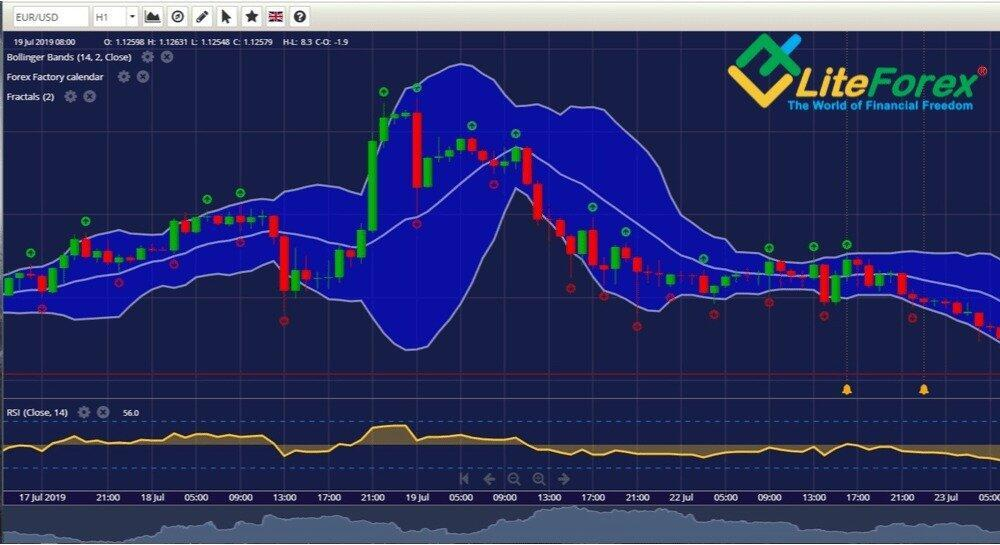

## Table of Contents

## What is a forex account and why is it necessary for trading?

A forex account is like a special bank account that you need to have if you want to trade currencies. It's where you keep the money you use to buy and sell different currencies from around the world. When you open a forex account, you can use it to make trades on the foreign exchange market, which is a big place where people exchange one country's money for another's.

Having a forex account is necessary for trading because it gives you a safe and organized way to manage your money when you're buying and selling currencies. Without a forex account, you wouldn't have a place to put your money or keep track of your trades. The account also helps you use tools and features that make trading easier, like charts and analysis, so you can make smart decisions about when to buy or sell.

## How do you open a forex account and what are the initial steps involved?

To open a forex account, you first need to choose a forex broker. A broker is like a middleman who helps you buy and sell currencies. You can find a broker by searching online and reading reviews to see which ones are trustworthy and have good services. Once you've picked a broker, you'll go to their website and look for a button or link that says something like "Open an Account" or "Sign Up." Click on it and you'll be asked to fill out a form with your personal information, like your name, address, and email.

After you submit the form, the broker will usually ask you to verify your identity. This is a safety step to make sure you are who you say you are. You might need to send them a copy of your ID, like a driver's license or passport, and maybe a utility bill to prove where you live. Once your identity is verified, you can fund your account by transferring money into it. This is the money you'll use to start trading. After your account is funded, you can log in and start using the trading platform to buy and sell currencies.

## What are the different types of forex accounts available to traders?

There are several types of [forex](/wiki/forex-system) accounts that traders can choose from, and each type is designed to meet different needs and levels of experience. The most common types are standard accounts, mini accounts, and micro accounts. A standard account is for experienced traders and usually requires a bigger minimum deposit. It lets you trade bigger amounts of money, which means you can make more money if you do well, but you can also lose more if things go wrong. A mini account is good for people who are starting out or who want to trade with less risk. It needs a smaller minimum deposit and lets you trade smaller amounts of money. A micro account is similar to a mini account but even smaller, so it's perfect for beginners who want to learn without risking too much money.

Another type of forex account is the managed account, where you let someone else trade for you. This is good if you don't have the time or knowledge to trade yourself. You give your money to a professional trader who makes the decisions for you. There are also Islamic accounts, which follow Sharia law and don't charge or pay interest, which is important for some Muslim traders. Lastly, some brokers offer demo accounts, which are free and let you practice trading with fake money. This is a great way to learn how to trade without any risk before you start using real money.

## What are the key features to look for when choosing a forex account?

When [picking](/wiki/asset-class-picking) a forex account, it's important to look at a few key things. First, you want to check the minimum deposit. This is how much money you need to put in to start trading. Some accounts need a lot of money, while others let you start with just a little. Next, think about the trading platform. This is the computer program you use to buy and sell currencies. A good platform should be easy to use and have tools like charts and news to help you make smart trades. Also, look at the spreads and fees. The spread is the difference between the buying and selling price of a currency, and lower spreads can save you money. Fees are what the broker charges for things like keeping your account open or making trades, so you want to find a broker with low fees.

Another thing to consider is the type of account. There are standard, mini, micro, managed, and Islamic accounts, each with different features. Choose one that fits your experience level and what you want to achieve. Also, make sure the broker is regulated. This means they follow rules to keep your money safe. You can check if a broker is regulated by looking at their website or searching online. Lastly, customer support is important. If you have a problem or a question, you want to be able to get help quickly. A good broker will have support available through phone, email, or live chat.

## How does leverage work in a forex account and what are the risks involved?

Leverage in a forex account is like borrowing money from your broker to trade bigger amounts than what you have in your account. Let's say you have $1,000, and your broker gives you a leverage of 100:1. This means you can trade as if you had $100,000. It's a way to make more money if your trades go well, because you're trading with more money than you actually have. But, you need to be careful because if the market moves against you, you can lose more money than you put in.

The big risk with leverage is that it can make your losses much bigger. If you're using a lot of leverage and the market moves the wrong way, you could lose all the money in your account very quickly. It's like a double-edged sword - it can help you make more money, but it can also make you lose more money. That's why it's important to understand how leverage works and use it carefully. Always think about how much you can afford to lose before you start trading with leverage.

## What are the costs associated with maintaining a forex account?

Maintaining a forex account comes with different costs that you need to know about. One of the main costs is the spread, which is the difference between the price you buy a currency at and the price you sell it at. Brokers make money from this difference, so a smaller spread can save you money. Another cost to look out for is the commission, which is what some brokers charge every time you make a trade. Not all brokers charge a commission, but if they do, it can add up over time. There are also fees for things like keeping your account open, withdrawing money, or not trading for a while. These fees can vary a lot between brokers, so it's a good idea to read the fine print before you choose one.

Another cost to think about is the cost of using leverage. When you use leverage, you're borrowing money from your broker to trade bigger amounts. This can be risky because if your trades don't go well, you might have to pay more money to cover your losses. Some brokers also charge a fee called a swap or rollover fee if you keep a trade open overnight. This fee can be positive or negative depending on the interest rates of the currencies you're trading. All these costs can affect how much money you make or lose from trading, so it's important to understand them and choose a broker with low costs.

## How do deposits and withdrawals work in a forex account?

Depositing money into your forex account is pretty easy. First, you need to log into your account on your broker's website or app. Then, you'll find a section that says something like "Deposit" or "Fund Your Account." You'll be asked to choose how you want to send the money, like using a bank transfer, a credit card, or an e-wallet like PayPal. After you pick your method, you'll enter the amount you want to deposit and follow the instructions. Once you've sent the money, it usually takes a little while for it to show up in your account, depending on the method you used. Some can be instant, while others might take a few days.

Withdrawing money from your forex account works in a similar way but in reverse. You log into your account and look for a section that says "Withdraw" or "Withdrawal." You'll choose how you want to get your money back, like having it sent to your bank account or e-wallet. You'll enter the amount you want to take out and follow the steps. Withdrawals can take a bit longer than deposits, sometimes a few days or even a week, depending on the broker and the method you choose. Also, some brokers might charge a fee for withdrawing money, so it's good to check that before you start.

## What are the security measures in place to protect a forex account?

When you open a forex account, brokers use different ways to keep your money and information safe. One big way is through encryption, which is like a secret code that keeps your data safe when you send it over the internet. Brokers also use two-[factor](/wiki/factor-investing) authentication, which means you need two ways to prove it's really you when you log in, like a password and a code sent to your phone. This makes it much harder for someone else to get into your account. Another important thing is that brokers are watched by groups called regulators, who make sure the brokers follow rules to keep your money safe.

Besides these, brokers have other ways to protect your account. They use firewalls to stop hackers from getting into their systems, and they keep an eye on your account for anything that looks strange, like someone trying to log in from a new place. If something doesn't seem right, they might ask you to check it out or even freeze your account until it's safe. It's also a good idea for you to help keep your account safe by using strong passwords, not sharing your login details, and being careful about emails or messages that ask for your information. By working together, you and your broker can keep your forex account secure.

## How can you manage and monitor your forex account effectively?

Managing and monitoring your forex account effectively starts with using the tools your broker gives you. Most brokers have a special program called a trading platform where you can see how your trades are doing. This platform usually has charts and numbers that show you how the currencies are moving. It's important to check these often so you know if you're making or losing money. You can also set up alerts to let you know when a currency hits a certain price, which can help you decide when to buy or sell. Another good idea is to keep a record of all your trades, so you can look back and see what worked and what didn't.

Another way to manage your account well is by using something called risk management. This means thinking about how much money you can afford to lose before you start trading. You can use tools like stop-loss orders, which automatically sell a currency if it drops to a certain price, to help protect your money. It's also smart to not put all your money into one trade. Instead, spread it out over different trades to lower your risk. And don't forget to keep learning about the market. The more you know, the better you can make decisions about your trades. By doing these things, you can keep a close eye on your account and make smarter choices.

## What advanced tools and platforms are available for expert forex account management?

For expert forex account management, traders can use advanced tools and platforms that offer more features and better control over their trades. One popular platform is MetaTrader 4 (MT4) and its newer version, MetaTrader 5 (MT5). These platforms are known for their powerful charting tools, which let you see detailed graphs of how currencies are moving. They also have something called Expert Advisors (EAs), which are like robots that can trade for you based on rules you set. Another useful tool is the ability to use different types of orders, like stop-loss and take-profit orders, to manage your risk better. You can also use [backtesting](/wiki/backtesting), which lets you see how well your trading ideas would have worked in the past, so you can make better plans for the future.

Another advanced platform is cTrader, which is known for its fast and easy-to-use interface. cTrader is great for traders who want to make quick trades because it has very low delays. It also has advanced charting tools and lets you use [algorithmic trading](/wiki/algorithmic-trading), where you can write your own trading rules to be followed automatically. Some traders also use platforms like TradingView, which is not just for forex but for all kinds of trading. TradingView has a lot of charts and tools, and you can share your ideas with other traders. All these platforms help expert traders manage their accounts better by giving them more ways to analyze the market and control their trades.

## How do regulatory requirements affect forex account operations and what should traders be aware of?

Regulatory requirements are rules that brokers have to follow to make sure they treat traders fairly and keep their money safe. These rules are made by groups called regulators, like the Financial Conduct Authority (FCA) in the UK or the Commodity Futures Trading Commission (CFTC) in the US. When a broker follows these rules, it means they have to keep your money separate from their own, so if the broker has money problems, your money is safe. They also have to be honest about the risks of trading and can't trick you into trading more than you should. This helps to make the forex market a safer place for everyone.

Traders should be aware of these rules because they affect how they can use their forex accounts. For example, some regulators might limit how much leverage you can use, which is like borrowing money from your broker to trade bigger amounts. This is to stop traders from taking too much risk and losing a lot of money. Also, if a broker isn't following the rules, you might not be able to get your money back if something goes wrong. So, it's a good idea to check if your broker is regulated by a well-known group and to read up on the rules that apply to your account. This way, you can trade with more confidence knowing that there are protections in place.

## What strategies can expert traders use to optimize their forex account performance?

Expert traders can use different strategies to make their forex account perform better. One important strategy is risk management. This means deciding how much money you're okay with losing before you start trading. You can use tools like stop-loss orders to automatically sell a currency if it drops too much, which helps protect your money. Another good idea is to spread your money out over different trades instead of putting it all into one. This way, if one trade doesn't go well, you won't lose everything. Also, expert traders often use something called technical analysis, which is looking at charts and patterns to guess where the market might go next. By understanding these patterns, they can make smarter decisions about when to buy and sell.

Another strategy is to keep learning about the market. This means staying up to date with news and events that can affect currency prices, like changes in interest rates or big economic reports. Expert traders also use [fundamental analysis](/wiki/fundamental-analysis), which is looking at a country's economy to understand why its currency might go up or down. Using a mix of technical and fundamental analysis can give traders a better picture of the market. Finally, using advanced tools like trading robots or Expert Advisors can help automate some of the trading process. These tools can follow rules that the trader sets up, making trades even when the trader is not watching the market. By using these strategies, expert traders can improve their chances of making money and managing their forex account well.

## References & Further Reading

[1]: Bank for International Settlements. (2021). ["Triennial Central Bank Survey of Foreign Exchange and Derivatives Market Activity."](https://www.bis.org/statistics/rpfx22.htm)

[2]: Marcos Lopez de Prado. ["Advances in Financial Machine Learning."](https://www.amazon.com/Advances-Financial-Machine-Learning-Marcos/dp/1119482089) Wiley.

[3]: David Aronson. ["Evidence-Based Technical Analysis: Applying the Scientific Method and Statistical Inference to Trading Signals."](https://www.amazon.com/Evidence-Based-Technical-Analysis-Scientific-Statistical/dp/0470008741) Wiley.

[4]: Stefan Jansen. ["Machine Learning for Algorithmic Trading."](https://github.com/stefan-jansen/machine-learning-for-trading) Packt Publishing.

[5]: Chan, Ernest P. ["Quantitative Trading: How to Build Your Own Algorithmic Trading Business."](https://github.com/ftvision/quant_trading_echan_book) Wiley Trading.