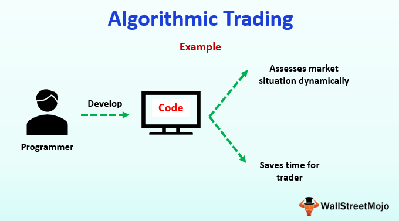

Trading has experienced a profound transformation over the decades, driven primarily by technological advancements. One of the most significant innovations in this landscape is algorithmic trading, particularly within the forex market. This article will focus on the integral components of trading, emphasizing the roles of algorithmic and forex trading, and how these elements intertwine to enhance trading strategies.

Algorithmic trading involves the use of computer programs to execute trades based on predefined rules. This technological advancement allows for real-time trading decisions, dramatically reducing human error and removing the emotional biases that can influence trading outcomes. In the context of the forex market, algorithmic trading has become a cornerstone, enabling participants to navigate the world's largest and most liquid financial market with greater efficiency.



The integration of technology has democratized access to the forex market, empowering both institutional and retail investors. Institutional entities, like banks and hedge funds, leverage sophisticated algorithms to maintain market competitiveness and manage risk effectively. Simultaneously, retail investors can tap into forex opportunities that were once limited to larger financial institutions. This technological shift has streamlined trading processes, resulting in lower transaction costs and increased market liquidity.

However, the benefits of algorithmic trading are accompanied by inherent risks and challenges. For instance, market fragmentation and liquidity shortages can arise from the disproportionate technological capabilities between traders. Furthermore, events such as the stock market flash crash illustrate the potential pitfalls of excessive reliance on algorithms. To mitigate these risks, continuous monitoring and appropriate regulatory oversight are essential to safeguard the stability of financial markets.

In conclusion, algorithmic trading has fundamentally reshaped the forex market, enhancing trading efficiency and providing new opportunities for a wide array of market participants. As technological advancements continue to evolve, it is crucial for traders to stay informed and adept in leveraging these innovations while managing the accompanying risks. This balance will ensure both the growth and stability of trading in the future.

## Table of Contents

## Understanding Forex Market Basics

The foreign exchange market, commonly known as the forex market, is the largest and most liquid financial market globally, with a daily trading volume surpassing $6 trillion as of 2023. This substantial volume underscores its critical role in the global financial architecture, facilitating the exchange of currencies. Participants in the forex market include a diverse array of entities, ranging from central and commercial banks, financial institutions, multinational corporations, governments, and individual investors.

Trades in the [forex](/wiki/forex-system) market involve currency pairs, where one currency is exchanged for another. The most traded currency pair is the Euro/US Dollar (EUR/USD), which illustrates the high level of activity between the euro and the US dollar. Currency pairs are quoted using standardized prices that reflect the current value of one currency in terms of another. For example, if the EUR/USD pair is quoted at 1.10, this means one euro is equivalent to 1.10 US dollars.

The primary function of the forex market is to enable currency conversion essential for international trade and investment. Businesses engaged in cross-border transactions rely on forex markets to exchange currencies for importing goods, paying overseas employees, or making overseas investments. Central banks also participate to manage reserves and stabilize exchange rates to support their economic policy objectives.

Beyond its fundamental role, speculative trading is a significant component of forex market activity. Speculators, ranging from individual retail traders to large hedge funds, aim to profit from fluctuations in currency exchange rates. These traders analyze economic indicators, geopolitical events, and market sentiment to predict future movements in currency values. Speculative trading impacts global economic factors by influencing exchange rates and [liquidity](/wiki/liquidity-risk-premium). Enhanced liquidity makes it easier for participants to execute large transactions with minimal price changes.

The forex market operates continuously, opening on Sunday evening and closing on Friday evening, in line with major financial centers across different time zones. This round-the-clock operation allows for seamless trading and price discovery. However, it also means that the market is susceptible to rapid changes in response to unexpected events or economic reports, requiring traders and investors to be vigilant and adaptive to evolving conditions.

## Basics of Algorithmic Trading

Algorithmic trading uses computer programs to execute trades according to predefined rules and conditions, transforming the way trading is conducted in financial markets. This systematic approach minimizes human intervention and is designed to capitalize on opportunities by leveraging computational algorithms which allow for real-time monitoring and quick adaptation to market changes.

One of the primary benefits of [algorithmic trading](/wiki/algorithmic-trading) is its ability to reduce human error. By programming rules based on historical data and specific indicators, traders can avoid emotional biases that often lead to poor decision-making. This is particularly important in volatile markets where rapid fluctuations can prompt impulsive transactions.

Several strategies define algorithmic trading, each with its specific focus. Trend-following strategies rely on algorithms to identify and capitalize on market [momentum](/wiki/momentum). By analyzing moving averages and other indicators, these algorithms determine optimal entry and [exit](/wiki/exit-strategy) points based on historical price movements rather than predicting future trends. Such strategies are particularly effective in markets displaying long-term trends.

Arbitrage is another prevalent algorithmic trading strategy, exploiting price differentials of identical or similar financial instruments across different markets or forms. Algorithms are adept at quickly identifying and executing these [arbitrage](/wiki/arbitrage) opportunities due to their ability to process vast amounts of data faster than human traders. For example, if a currency is priced differently on separate exchanges, an algorithm can buy at the lower price and sell at the higher price almost instantaneously, securing a profit from the discrepancy.

Index fund rebalancing is a strategy wherein algorithmic trading is used to adjust the holdings of an index fund to reflect changes in the benchmark index it tracks. This involves buying or selling the necessary stocks to match the new weighting of the index, which algorithms can accomplish efficiently with minimal transaction costs.

High-frequency trading ([HFT](/wiki/high-frequency-trading-strategies)) is an extension of algorithmic trading characterized by executing large volumes of transactions at exceptionally high speeds. HFT firms utilize sophisticated algorithms to scan multiple markets and execute orders in fractions of a second, taking advantage of short-lived market inefficiencies. The ability to process high-speed data streams and execute trades faster than competitors is critical in this form of trading.

To summarize, algorithmic trading revolutionizes market participation by automating the execution of trades based on mathematical models and statistical analyses. It improves the execution speed and accuracy of trades, reducing slippage and taking advantage of price inefficiencies. However, the complexity and speed of algorithmic trading require robust technology and infrastructure, as well as stringent risk management protocols to safeguard against potential market disruptions.

## Algorithmic Trading in Forex

Algorithmic trading has significantly transformed forex trading by automating many processes, leading to increased efficiency and reduced reliance on manual labor. This automation enables traders to execute trades based on predefined algorithms, which evaluate vast amounts of data in real-time. Consequently, algorithmic trading allows for faster decision-making and more precise execution of trades, benefiting a broad range of market participants.

Banks and financial institutions have been at the forefront of adopting algorithmic trading in the forex market. By employing sophisticated algorithms, these entities can maintain competitive pricing and manage their risk exposure more effectively. The algorithms can automatically adjust to changing market conditions, ensuring optimal execution prices and helping institutions to mitigate risk. For instance, a bank might use an algorithm to dynamically hedge its currency exposure, minimizing the potential for significant losses due to unfavorable currency movements.

Speculative traders also leverage algorithms to capture market inefficiencies. These traders employ various strategies such as arbitrage and hedging to maximize their profits. Arbitrage opportunities, which involve capitalizing on price discrepancies between different currency pairs, can be exploited more rapidly and accurately using algorithms. Similarly, hedging strategies can be automated to protect against adverse price movements, providing an additional layer of security for traders.

The advent of algorithmic trading has notably decreased transaction costs and increased market depth in the forex market. Since algorithms can execute trades with minimal latency, this reduces the costs associated with manual trading and improves the overall liquidity of the market. Enhanced market depth means that larger trades can be conducted without significantly affecting the market price, thereby providing greater stability and efficiency in the forex trading environment.

In summary, the integration of algorithmic trading in forex markets has been a game-changer, offering numerous advantages over traditional trading methods. While it provides banks with tools for maintaining competitive edges and managing risks, it also offers speculative traders new opportunities to profit from market inefficiencies. The benefits of reduced transaction costs and improved market depth further underscore the value of algorithmic trading in modern forex markets.

## Risks Involved in Algorithmic Forex Trading

Algorithmic trading, while offering numerous benefits such as increased efficiency and lower transaction costs, also presents several risks. These risks are particularly pronounced in the forex market due to its highly dynamic and global nature.

One of the primary concerns is market fragmentation. As market participants employ various algorithmic trading platforms and strategies, the forex market can become more fragmented. This fragmentation can lead to inconsistencies in pricing and reduced transparency, where different platforms may report slightly varying prices for the same currency pairs. Such discrepancies can pose challenges for traders trying to determine the true market price at any given moment.

Liquidity shortages are another significant risk associated with algorithmic forex trading. Although automated systems can process large volumes of trades swiftly, these systems can also withdraw liquidity abruptly. This occurs when many traders use similar strategies and exit positions concurrently in response to certain market signals, potentially leading to a liquidity crunch. Such scenarios can result in increased [volatility](/wiki/volatility-trading-strategies) and the potential for substantial losses, especially in times of economic uncertainty or geopolitical events.

The disparity in technological capabilities among traders is a critical [factor](/wiki/factor-investing) that can create unfair advantages. Large financial institutions often possess more advanced algorithms and greater computational power than individual or smaller institutional traders. This technological gap can lead to market situations where institutional traders are able to react faster to market changes, exploiting smaller players and causing sudden price swings that lead to volatility.

Historical instances, such as the U.S. stock market flash crash of May 6, 2010, underscore the risks inherent in algorithmic trading. During this event, a rapid selling algorithm inadvertently triggered a massive sell-off, causing the Dow Jones Industrial Average to drop by about 1,000 points in just minutes. These events highlight the potential for algorithms to exacerbate market moves and induce systemic risks, sometimes with little to no warning.

To manage these risks, continuous monitoring of algorithmic trading systems is essential. Traders must ensure that their algorithms function as intended and adapt to changing market conditions. Additionally, regulatory oversight plays a crucial role in maintaining market integrity. Regulatory bodies need to establish and enforce guidelines that promote transparency, fair trading practices, and risk management to prevent systemic threats. This is particularly true for forex markets, where decentralized structures make consistent regulation challenging but necessary.

Overall, while algorithmic trading can enhance market operation and efficiency, it also necessitates careful risk assessment and management to safeguard against potential pitfalls in the forex market.

## Frequently Asked Questions (FAQs)

How do individuals profit from forex trading? Forex trading profit is generated by speculating on the price movement of currency pairs. Individuals buy a currency pair when they anticipate its value will rise and sell when they expect it to fall, realizing gains from the differences in prices. This is achieved through various strategies, such as trend-following, where traders identify and ride on price trends, or [scalping](/wiki/gamma-scalping), which involves making numerous small trades over a short period to capitalize on minor price shifts. Another common strategy is leveraging fundamental and technical analyses to make informed decisions regarding market entry and exit points. For instance, studying economic indicators like GDP, interest rates, and political stability can form the basis of [fundamental analysis](/wiki/fundamental-analysis). In contrast, technical analysis involves examining past market data, such as price charts and trading volumes, to predict future movements.

What role do algorithms play in enhancing forex trading strategies? Algorithms significantly enhance forex trading strategies by allowing for precise execution of trades, real-time market analysis, and improved risk management. By utilizing complex mathematical models and algorithms, traders can identify profitable trading opportunities more efficiently than manual methods. Algorithms can monitor multiple currency pairs simultaneously and execute trades based on pre-set criteria, such as price levels, trading volumes, and other market conditions. For instance, algorithms employed in trend-following strategies can automatically enter or exit trades when prices break above or below certain resistance or support levels. This automation reduces the likelihood of human error and emotional decision-making, which can hinder trading performance. Moreover, algorithms are crucial for high-frequency trading (HFT), enabling traders to execute large volumes of trades at speeds unattainable by human traders, thus leveraging small price increments for profit.

How can traders test and optimize their algorithmic strategies before live execution? Traders can test and optimize their algorithmic strategies through [backtesting](/wiki/backtesting) and paper trading. Backtesting involves applying a trading algorithm to historical market data to evaluate how it would have performed over a specified period. This process helps traders understand the strategy's strengths and weaknesses under different market conditions. Python, for instance, provides libraries like `Backtrader` for developing and testing trading strategies:

```python
import backtrader as bt

class TestStrategy(bt.Strategy):
    def __init__(self):
        self.dataclose = self.datas[0].close

    def next(self):
        if self.dataclose[0] < self.dataclose[-1]:
            if self.dataclose[-1] < self.dataclose[-2]:
                self.buy()
        elif self.dataclose[0] > self.dataclose[-1]:
            if self.dataclose[-1] > self.dataclose[-2]:
                self.sell()

if __name__ == '__main__':
    cerebro = bt.Cerebro()
    data = bt.feeds.YahooFinanceData(dataname='EURUSD=X', fromdate=datetime(2020, 1, 1),
                                     todate=datetime(2022, 1, 1))
    cerebro.adddata(data)
    cerebro.addstrategy(TestStrategy)
    cerebro.run()
    cerebro.plot()
```

Furthermore, paper trading allows traders to simulate their algorithms in real-time market conditions without risking actual capital. This environment helps assess strategy robustness, reaction to live market data, and necessary adjustments. Additionally, optimization techniques can be employed to fine-tune algorithm parameters, improving performance outcomes. Techniques such as genetic algorithms or [machine learning](/wiki/machine-learning) may be used to optimize the parameters by iteratively testing different parameter sets and retaining those that maximize profits or reduce risks.

## The Bottom Line

Algorithmic trading has significantly transformed the forex market by improving trading efficiency and reducing costs. The automation of trades through algorithms allows for faster execution, minimizes human error, and provides traders with access to real-time market data. These improvements have democratized access to forex trading by allowing both institutional and individual investors to participate more effectively.

However, the widespread adoption of algorithmic trading is not without challenges. One primary concern is the need for careful management of the potential risks associated with algorithms. Market fragmentation and liquidity shortages can arise due to the high [volume](/wiki/volume-trading-strategy) and speed of trades executed algorithmically. This risk necessitates increased transparency and robust regulatory oversight to ensure fair trading practices and stability in the financial markets.

Looking forward, the focus should be on balancing the benefits of algorithmic trading with the inherent risks. Future advancements in technology can provide opportunities to enhance trading strategies while mitigating the possibility of systemic risks. Developing algorithms that are not only efficient but also adaptive to changing market conditions is crucial. Techniques such as backtesting strategies and stress-testing against historical data can be employed to optimize algorithms before live execution, reducing the probability of adverse market events.

As the complexities of the forex market continue to evolve, staying informed and open to adopting new technologies is essential for traders. Continuous education and awareness of regulatory changes and technological progress will enable traders to navigate the challenges and capitalize on the opportunities presented by algorithmic trading. Maintaining this balance will be key to harnessing the full potential of algorithmic innovations while safeguarding the market's integrity.

## References & Further Reading

[1]: Bergstra, J., Bardenet, R., Bengio, Y., & Kégl, B. (2011). ["Algorithms for Hyper-Parameter Optimization."](https://proceedings.neurips.cc/paper/2011/file/86e8f7ab32cfd12577bc2619bc635690-Paper.pdf) Advances in Neural Information Processing Systems 24.

[2]: ["Advances in Financial Machine Learning"](https://www.amazon.com/Advances-Financial-Machine-Learning-Marcos/dp/1119482089) by Marcos Lopez de Prado

[3]: ["Evidence-Based Technical Analysis: Applying the Scientific Method and Statistical Inference to Trading Signals"](https://www.amazon.com/Evidence-Based-Technical-Analysis-Scientific-Statistical/dp/0470008741) by David Aronson

[4]: ["Machine Learning for Algorithmic Trading"](https://github.com/stefan-jansen/machine-learning-for-trading) by Stefan Jansen

[5]: ["Quantitative Trading: How to Build Your Own Algorithmic Trading Business"](https://www.amazon.com/Quantitative-Trading-Build-Algorithmic-Business/dp/1119800064) by Ernest P. Chan