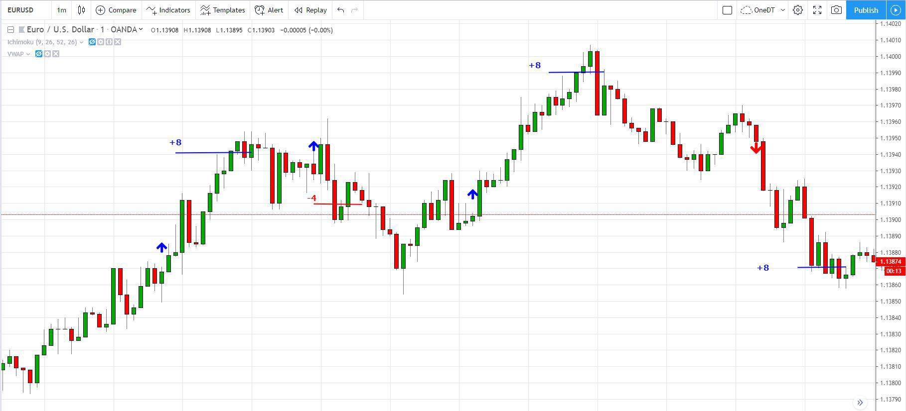

The foreign exchange market, commonly known as Forex, is internationally recognized as the largest and most liquid financial market. It involves a massive volume of currency trading activities occurring daily, with participants looking to capitalize on fluctuating exchange rates. This market operates 24 hours a day, five days a week, allowing trading to occur across various time zones globally.

Currency trading in Forex is inherently complex and requires an understanding of both economic and technical factors that influence currency movements. Traders employ a variety of strategies to maximize profitability, one of which is algorithmic trading—an increasingly influential approach in the Forex landscape.

This article will explore Forex analysis and trading strategies, focusing particularly on algorithmic trading. We will examine the methodologies used in Forex analysis, including fundamental and technical analysis, and investigate the evolution of algorithmic trading within this market. Furthermore, we will discuss the potential risks and benefits associated with algorithmic trading in Forex.

Our objective is to equip readers with valuable insights to effectively navigate the Forex market and make better-informed trading decisions. Understanding these concepts can provide traders with a competitive advantage, helping them to implement strategies that balance risk management with profit potential. Through a comprehensive exploration of these topics, we aim to uncover the integral components that define successful currency trading today.

## Table of Contents

## Understanding Forex Analysis

Forex analysis is a critical component in currency trading, involving the evaluation of currency pair price changes and the identification of forces that drive these fluctuations. Proficient traders typically engage in a dual approach, employing both fundamental and technical analyses to anticipate currency movements and execute buy or sell actions accordingly.

Fundamental analysis focuses on understanding the economic, geopolitical, and monetary factors that impact currency valuations. Economic indicators such as gross domestic product (GDP), employment figures, inflation rates, and interest rates are pivotal in influencing currency strength. Moreover, geopolitical events, such as political instability or international conflicts, can lead to significant market volatility, thereby affecting currency prices. Monetary policy decisions by central banks, including interest rate adjustments and quantitative easing measures, also play a crucial role in shaping currency trends. These elements, when analyzed, offer insights into the macroeconomic landscape, assisting traders in forecasting potential market directions.

On the other hand, technical analysis relies on historical price data and patterns to predict future market behavior. This method involves the use of chart patterns, such as head and shoulders or double tops, and statistical indicators, like moving averages and relative strength index (RSI), to discern trends and potential reversal points. By examining past price movements, traders aim to identify probabilities of future price actions, thus making informed trading decisions. 

The amalgamation of fundamental and technical analyses forms a comprehensive approach to Forex analysis. A hybrid strategy allows traders to benefit from the insights provided by both methods, mitigating the limitations inherent in relying solely on one. For instance, while [fundamental analysis](/wiki/fundamental-analysis) can offer long-term market direction based on economic principles, technical analysis can provide short-term trading signals based on price action. Being adept in both areas enhances a trader's ability to capture opportunities and manage risks effectively.

Understanding and integrating both forms of analysis are essential for anyone engaged in Forex trading. By harnessing the strengths of each approach, traders can develop a nuanced perspective on market dynamics, leading to more strategic and informed trading operations.

## How Forex Analysis Works in Practice

The foreign exchange market, also known as Forex, is characterized by a vast daily trading [volume](/wiki/volume-trading-strategy) that reaches trillions of dollars. Both individual investors and large institutional entities participate in this market. The primary activity in Forex involves trading currency pairs, such as USD/CAD or EUR/USD, where the relative strength of one currency is measured against the other. This is an essential feature of the market, allowing traders to speculate on the rise or fall of currency values and providing hedging options against currency risks.

### Currency Pair Trading: USD/CAD Example

When performing Forex analysis, traders take into account various factors that can influence currency values. A practical example can be illustrated by analyzing the USD/CAD pair. This involves several critical aspects:

1. **Interest Rates**: Central banks, such as the Federal Reserve (Fed) in the United States and the Bank of Canada, play a significant role through their monetary policies. Interest rate differentials can influence traders' perceptions and decisions. If the Fed raises interest rates while the Bank of Canada keeps them steady, the USD may strengthen against the CAD due to higher returns on U.S. assets.

2. **Economic Indicators**: Economic data releases provide vital signals about the health of a country's economy. For example, a robust U.S. employment report might boost the USD, as it indicates economic strength, while weak Canadian GDP figures could put pressure on the CAD.

3. **Market Sentiment**: This encompasses the collective mood or attitude of investors towards the market. Geopolitical stability, trade negotiations, and global economic outlooks contribute significantly to market sentiment. During periods of global uncertainty, a risk-off sentiment may drive investors towards the USD, considered a safe-haven currency, thereby influencing the USD/CAD pair.

### Case Studies and Real-World Scenarios

Successful Forex traders often employ a mix of technical and fundamental analysis to make informed trading decisions. A case study could involve a trader analyzing the USD/CAD using both methods:

- **Fundamental Analysis**: The trader might evaluate upcoming announcements from the Bank of Canada regarding interest rate changes. By forecasting whether rates might be increased, decreased, or maintained, the trader can predict potential short-term movements in the pair.

- **Technical Analysis**: The trader could utilize historical data, examining chart patterns and technical indicators such as moving averages or the Relative Strength Index (RSI), to predict future price actions. For example, if the USD/CAD breaks a significant resistance level on the chart, it may suggest further bullish momentum.

Additionally, [algorithmic trading](/wiki/algorithmic-trading) strategies can provide an edge by incorporating complex algorithms to execute trades based on these analyses automatically. Algorithms can quickly process numerous data points and execute trades within milliseconds, which is vital in such a dynamic market.

In conclusion, navigating the Forex market requires a comprehensive approach, integrating economic analysis, [interest rate](/wiki/interest-rate-trading-strategies) trends, and market sentiment to evaluate currency pairs effectively. This combination allows traders to capitalize on trading opportunities and manage risks associated with currency fluctuations comprehensively.

## The Role of Algorithmic Trading in Forex

Algorithmic trading in Forex refers to the use of computer programs to automate the process of executing currency trades based on predefined strategies and rules. These algorithms can analyze vast amounts of market data at speeds far beyond the capability of human traders, executing trades that adhere strictly to the set parameters without deviation due to emotion or human error.

The genesis of algorithmic trading can be traced back to the early adoption of electronic trading systems in the late 20th century, which revolutionized the stock markets by introducing automated order execution processes. As technology advanced, similar methodologies found their way into the Forex market, allowing for the automation of complex trading strategies. Initially, algorithmic trading was primarily used by institutional investors, but its adoption has broadened over time with the availability of platforms that cater to individual traders as well.

Advanced algorithmic strategies encompass various techniques such as statistical [arbitrage](/wiki/arbitrage), auto-hedging, and high-frequency trading ([HFT](/wiki/high-frequency-trading-strategies)). Statistical arbitrage involves the identification of pricing inefficiencies between currency pairs using statistical methods and executing trades to exploit these inefficiencies profitably. Auto-hedging automates risk management by creating counterbalancing positions to protect against adverse market movements. High-frequency trading, characterized by the execution of thousands of transactions within fractions of a second, aims to capture small profit margins on each trade through sheer volume.

The advantages of incorporating algorithmic trading into Forex operations are substantial. Algorithms enhance the speed of trade execution substantially, reducing the lag between the decision and the market action. This speed can lead to reduced transaction costs and increased efficiency. Moreover, algorithmic trading removes the emotional component of trading, which often leads to overtrading or erratic trading behaviors, thus providing a more consistent performance over time.

Despite its benefits, algorithmic trading introduces several challenges and risks. The sheer speed and volume of trades executed via algorithms can potentially cause market disruptions. For instance, a flawed algorithm could lead to unintended market consequences, such as price anomalies or even market crashes, exemplified by the infamous "Flash Crash" of 2010. Ethical considerations also arise, particularly concerning the fairness of the market, as high-frequency traders may have an undue advantage over traditional traders owing to their access to advanced technology and data feeds.

Algorithmic trading in Forex continues to evolve with advancements in technology, necessitating continuous monitoring and regulatory measures to mitigate detrimental effects and ensure a stable trading environment.

## Risks and Challenges of Forex Algo Trading

Algorithmic trading in the Forex market, despite its numerous advantages, presents several significant challenges and risks that both individual and institutional traders must navigate. 

Firstly, the technology imbalance is a noteworthy concern. Not all market participants have equal access to high-frequency trading systems or advanced algorithms, leading to a disparity in how trades are executed. This imbalance can result in fragmented markets, where only those with superior technologies can fully exploit the market inefficiencies, potentially disadvantaging smaller or less technologically-equipped traders.

Additionally, the rapid transaction speeds facilitated by algorithmic trading can lead to [liquidity](/wiki/liquidity-risk-premium) shortages. While high-frequency trading is often lauded for adding liquidity to the market, it can paradoxically also remove it during periods of stress. When algorithms identify an advantageous condition, they execute trades almost instantaneously, which can create situations where liquidity is rapidly withdrawn and spread out too thinly across various markets, leading to [volatility](/wiki/volatility-trading-strategies) spikes.

One of the most critical risks associated with algorithmic trading is the potential for significant market volatility, similar to events like the "Flash Crash" experienced in the stock markets. In these incidents, a cascade of automated trades triggered by algorithmic programs can lead to rapid market sell-offs, with prices plummeting before they eventually stabilize. This kind of volatility poses substantial risks to market stability and can have far-reaching implications for all participants involved.

Mitigating these risks requires the implementation of robust risk management strategies and regulatory measures. Effective risk management involves sophisticated monitoring systems capable of detecting errant algorithmic behavior in real-time and tools to halt such trading if necessary. Regulators need to continually adapt their frameworks to cover the evolving landscape of algorithmic trading. This includes setting standards for pre-trade risk controls, mandating circuit breakers and ensuring transparency in algorithmic strategies to prevent undue market manipulation.

In conclusion, while algorithmic trading offers efficiency and precision in Forex transactions, it is not without its inherent risks. A balanced approach involving enhanced technology access, sophisticated risk management, and adaptive regulation is crucial for maintaining market integrity and stability in an increasingly automated trading environment.

## Future Trends in Forex Algorithmic Trading

As the Forex market continues to evolve, ongoing advancements in [artificial intelligence](/wiki/ai-artificial-intelligence) (AI) and [machine learning](/wiki/machine-learning) are poised to significantly shape algorithmic trading strategies. AI technologies enhance predictive capabilities, offering refined models to forecast market trends with greater accuracy. These models analyze vast datasets, recognizing patterns that are often indistinguishable to human traders. In doing so, they aid in optimizing trading strategies by providing insights into potential market movements.

Machine learning, as a subset of AI, plays a pivotal role in risk management. Algorithms are constantly learning from historical data, adapting and improving decision-making processes over time. This adaptability is crucial in a market characterized by high volatility and rapid changes, allowing for more dynamic and responsive trading strategies.

The proliferation of AI-driven tools necessitates a robust regulatory framework to manage emerging challenges. As trading algorithms become more sophisticated, they operate at speeds and efficiencies that may increase market volatility or facilitate market manipulation. Regulatory bodies are tasked with ensuring that these technologies do not compromise market integrity or fairness. Establishing clear guidelines and monitoring systems can mitigate risks associated with high-frequency trading and algorithmic manipulation.

The democratization of sophisticated trading tools is another imminent trend, expanding access to powerful AI-driven analytics for retail investors. Platforms are increasingly integrating these advanced technologies, enabling less experienced traders to leverage complex algorithms previously available only to institutional investors. This trend is facilitated by the reduction in computational costs and the increased availability of cloud-based services, empowering retail traders with tools to execute informed decisions and strategies.

Overall, the integration of AI and machine learning in Forex algorithmic trading promises enhanced efficiency, accuracy, and accessibility. As technology progresses, it will undoubtedly reshape the landscape of Forex trading, offering both opportunities and challenges for investors at all levels.

## Conclusion

The integration of Forex analysis and algorithmic trading has redefined the landscape of currency markets, offering enhanced precision and efficiency in trading. A primary takeaway from this evolution is the crucial role played by the synergistic use of traditional and modern analytical techniques. Combining fundamental and technical analysis with algorithmic strategies provides traders with a comprehensive toolkit, enabling them to make well-informed decisions based on both historical and real-time data.

Continuous education is imperative for traders to remain competitive and adaptable in the rapidly evolving [forex](/wiki/forex-system) environment. With technological advancements such as artificial intelligence and machine learning consistently reshaping trading methodologies, staying informed about the latest tools and strategies is vital. Moreover, ethical considerations must be at the forefront of trading strategies. The potential market disruptions caused by high-speed algorithmic trading highlight the need for responsible usage and the implementation of robust regulatory frameworks.

The future of forex trading promises expanded opportunities for both individual and institutional investors. As technology democratizes access to sophisticated trading tools, more participants can engage in forex markets strategically. Ultimately, the continued evolution of forex trading underscores the importance of innovation, regulation, and ethical responsibility in capitalizing on its opportunities. As the market advances, traders who embrace these facets are likely to thrive.

## References & Further Reading

[1]: Bergstra, J., Bardenet, R., Bengio, Y., & Kégl, B. (2011). ["Algorithms for Hyper-Parameter Optimization."](https://dl.acm.org/doi/10.5555/2986459.2986743) Advances in Neural Information Processing Systems 24.

[2]: ["Advances in Financial Machine Learning"](https://www.amazon.com/Advances-Financial-Machine-Learning-Marcos/dp/1119482089) by Marcos Lopez de Prado

[3]: ["Evidence-Based Technical Analysis: Applying the Scientific Method and Statistical Inference to Trading Signals"](https://www.amazon.com/Evidence-Based-Technical-Analysis-Scientific-Statistical/dp/0470008741) by David Aronson

[4]: ["Machine Learning for Algorithmic Trading"](https://github.com/stefan-jansen/machine-learning-for-trading) by Stefan Jansen

[5]: ["Quantitative Trading: How to Build Your Own Algorithmic Trading Business"](https://www.amazon.com/Quantitative-Trading-Build-Algorithmic-Business/dp/1119800064) by Ernest P. Chan