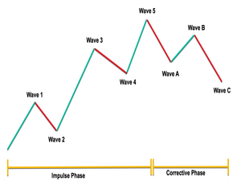

## Table of Contents

## What is Forex analysis?

Forex analysis is the process of examining the foreign exchange market to make trading decisions. Traders use different methods to understand how currency prices might change in the future. This helps them decide when to buy or sell currencies to make a profit.

There are two main types of Forex analysis: technical analysis and fundamental analysis. Technical analysis involves studying charts and using past price data to predict future movements. Traders look for patterns and trends to guide their decisions. On the other hand, fundamental analysis focuses on economic, social, and political events that can affect currency values. This includes things like interest rates, employment rates, and political stability.

Both types of analysis are important and many traders use a combination of both to make informed decisions. By understanding these methods, traders can better navigate the Forex market and increase their chances of success.

## Why is Forex analysis important for traders?

Forex analysis is important for traders because it helps them make better decisions about when to buy and sell currencies. By looking at the market closely, traders can predict how currency prices might change. This is key because the Forex market can be very unpredictable. Without analysis, traders would be guessing, which is risky and can lead to losing money. Using analysis, traders can find good opportunities and avoid bad ones, making their trading more successful.

There are two main types of Forex analysis: technical and fundamental. Technical analysis looks at past price data and charts to spot patterns and trends. This helps traders guess where prices might go next. Fundamental analysis, on the other hand, looks at bigger things like economic news, interest rates, and political events that can affect currency values. By using both types of analysis, traders get a fuller picture of the market. This helps them make smarter choices and manage their risks better.

## What are the main types of Forex analysis?

The main types of Forex analysis are technical analysis and fundamental analysis. Technical analysis involves looking at charts and past price data to find patterns and trends. Traders use this to guess where prices might go next. It's like trying to predict the weather by looking at past weather patterns.

Fundamental analysis looks at bigger things that can affect currency values. This includes things like economic news, interest rates, and political events. Traders use this information to understand why a currency might go up or down. Both types of analysis are important and many traders use them together to make better trading decisions.

## How does technical analysis work in Forex trading?

Technical analysis in Forex trading is all about looking at past price data and charts to guess where prices might go next. Traders use different tools and charts to find patterns and trends. These patterns help them predict if a currency's price will go up or down. For example, if they see a pattern that usually means prices will rise, they might decide to buy that currency.

Traders use things like moving averages, support and resistance levels, and other indicators to help them. Moving averages smooth out price data to show the overall direction of the market. Support and resistance levels are like invisible lines on the chart where prices often stop and turn around. By understanding these tools, traders can make better guesses about future price movements and decide when to buy or sell currencies.

## What are some common technical indicators used in Forex analysis?

In Forex trading, traders often use technical indicators to help them make decisions. Some common ones are moving averages, which help smooth out price data to show the overall direction of the market. Traders look at different moving averages, like the 50-day or 200-day, to see if the market is trending up or down. Another popular indicator is the Relative Strength Index (RSI), which measures how fast prices are changing to see if a currency is overbought or oversold. This helps traders guess when a price might turn around.

Other useful indicators include the Moving Average Convergence Divergence (MACD), which shows the relationship between two moving averages to help spot changes in the strength and direction of a trend. Traders also use Bollinger Bands, which are lines drawn above and below a moving average to show how much prices are changing. When the bands get wider, it means prices are more volatile, and when they get narrower, prices are more stable. By using these indicators, traders can get a better idea of what might happen next in the market and make smarter trading choices.

## How does fundamental analysis differ from technical analysis in Forex?

Fundamental analysis and technical analysis are two different ways to look at the Forex market. Fundamental analysis is about understanding the big things that can change currency values. It looks at things like a country's economy, interest rates, and even political events. For example, if a country's economy is doing well, its currency might get stronger. Traders use this information to guess if a currency will go up or down in the future.

Technical analysis, on the other hand, is all about looking at past price data and charts. Traders use this to find patterns and trends that can help them predict where prices might go next. They use tools like moving averages and other indicators to see if a currency is going up or down. While fundamental analysis focuses on why prices might change, technical analysis is more about when they might change. Both types of analysis are important, and many traders use them together to make the best trading decisions.

## What economic indicators should be monitored for fundamental Forex analysis?

When doing fundamental analysis in Forex trading, it's important to keep an eye on several key economic indicators. One of the most important ones is the Gross Domestic Product (GDP), which shows how well a country's economy is doing. If the GDP is growing, it usually means the country's currency will get stronger. Another big indicator is the interest rate set by a country's central bank. Higher interest rates can attract more foreign investment, making the currency stronger. Unemployment rates also matter a lot because they show how healthy the job market is. If unemployment is low, it's a sign of a strong economy, which can make the currency stronger.

Other important indicators include inflation rates, which measure how much prices are going up. If inflation is too high, it can make a currency weaker. The Consumer Price Index (CPI) and Producer Price Index (PPI) are used to track inflation. Trade balances are also key because they show if a country is exporting more than it's importing. A positive trade balance, or surplus, can strengthen a currency, while a negative trade balance, or deficit, can weaken it. Lastly, political stability and events like elections or policy changes can have a big impact on currency values. By watching these indicators, traders can better understand what might happen to currency prices in the future.

## How can sentiment analysis be used in Forex trading?

Sentiment analysis in Forex trading is about figuring out how people feel about different currencies. Traders look at things like news articles, social media, and market reports to see if people are feeling positive or negative about a currency. If most people feel good about a currency, it might go up in value because more people will want to buy it. On the other hand, if people feel bad about a currency, it might go down because fewer people will want to buy it.

By using sentiment analysis, traders can get a better idea of what might happen next in the market. They can see if there's a lot of excitement or worry about a currency and use that information to make better trading choices. For example, if there's a lot of positive news about the US economy, traders might expect the US dollar to get stronger and decide to buy it. Sentiment analysis helps traders understand the mood of the market and use that to their advantage.

## What are the best practices for combining different types of Forex analysis?

Combining different types of Forex analysis, like technical, fundamental, and sentiment analysis, can help traders make better decisions. The key is to use each type of analysis to get a full picture of the market. For example, technical analysis can show you patterns and trends in price movements, while fundamental analysis can tell you why those movements are happening based on economic news and events. By looking at both, you can see if the price movements make sense with what's going on in the world. Sentiment analysis adds another layer by showing you how people feel about a currency, which can help you predict short-term changes in the market.

It's important to not rely too much on just one type of analysis. Instead, use them together to check your ideas. If your technical analysis shows a currency is about to go up, but your fundamental analysis says the country's economy is doing badly, you might want to be careful. Also, keep an eye on sentiment to see if people's feelings match what you're seeing in the other analyses. By combining these methods, you can make more informed trades and manage your risks better.

## How can a beginner start applying Forex analysis effectively?

For a beginner, starting with Forex analysis can feel a bit tricky, but it's all about taking small steps and learning as you go. First, you should get to know the basics of technical analysis. This means looking at charts and past price data to spot patterns. You can start with simple tools like moving averages, which help you see the overall direction of the market. As you practice, try using indicators like the Relative Strength Index (RSI) to see if a currency is overbought or oversold. There are lots of free resources and demo accounts online where you can practice without risking real money.

Next, you should also learn about fundamental analysis, which looks at bigger things like a country's economy and news events. Pay attention to important economic indicators like GDP, interest rates, and unemployment rates. These can tell you why a currency might go up or down. You can find this information in economic calendars and news websites. As you get more comfortable, try combining technical and fundamental analysis. For example, if your technical analysis shows a currency is about to go up, check if the fundamental news supports that. By using both types of analysis together, you'll get a better understanding of the market and make smarter trading decisions.

## What advanced techniques can expert traders use to enhance their Forex analysis?

Expert traders can use advanced techniques like algorithmic trading and machine learning to improve their Forex analysis. Algorithmic trading involves using computer programs to make trades based on specific rules. These rules can be based on technical indicators, patterns, or even fundamental data. By using algorithms, traders can analyze the market much faster than they could on their own. This can help them spot opportunities that might be hard to see otherwise. Machine learning takes this a step further by letting computers learn from past data and find new patterns that might not be obvious to human traders. This can help experts make more accurate predictions and fine-tune their trading strategies.

Another advanced technique is using intermarket analysis, which looks at how different markets affect each other. For example, changes in the stock market or commodity prices can impact currency values. By understanding these connections, expert traders can get a better sense of what might happen next in the Forex market. They can also use sentiment analysis tools that go beyond just looking at news and social media. These tools can analyze large amounts of data from various sources to gauge market sentiment more accurately. By combining all these advanced techniques, expert traders can enhance their Forex analysis and make more informed trading decisions.

## Can you provide a real-world example of how Forex analysis led to a successful trade?

In early 2021, a trader named Sarah used Forex analysis to make a successful trade with the Euro against the US Dollar (EUR/USD). Sarah noticed that the EUR/USD had been in a strong uptrend on her charts, which was a sign of technical analysis. The 50-day moving average was clearly above the 200-day moving average, indicating a bullish trend. At the same time, she checked the fundamental analysis and saw that the European Central Bank (ECB) was expected to keep interest rates steady, while the US Federal Reserve was hinting at keeping rates low due to economic recovery efforts. This suggested that the Euro might continue to strengthen against the Dollar.

Based on this combined analysis, Sarah decided to buy the EUR/USD. Shortly after her trade, positive economic news came out of Europe, boosting the Euro's value even more. The US Dollar weakened as expected due to the Fed's policies. Sarah's trade paid off as the EUR/USD continued its upward movement, and she was able to sell at a profit. By using both technical and fundamental analysis, Sarah was able to make a well-informed decision that led to a successful trade.

## References & Further Reading

[1]: Bergstra, J., Bardenet, R., Bengio, Y., & Kégl, B. (2011). ["Algorithms for Hyper-Parameter Optimization."](https://dl.acm.org/doi/10.5555/2986459.2986743) Advances in Neural Information Processing Systems 24.

[2]: ["Advances in Financial Machine Learning"](https://www.amazon.com/Advances-Financial-Machine-Learning-Marcos/dp/1119482089) by Marcos Lopez de Prado

[3]: ["Evidence-Based Technical Analysis: Applying the Scientific Method and Statistical Inference to Trading Signals"](https://www.amazon.com/Evidence-Based-Technical-Analysis-Scientific-Statistical/dp/0470008741) by David Aronson

[4]: ["Machine Learning for Algorithmic Trading"](https://github.com/stefan-jansen/machine-learning-for-trading) by Stefan Jansen

[5]: ["Quantitative Trading: How to Build Your Own Algorithmic Trading Business"](https://www.amazon.com/Quantitative-Trading-Build-Algorithmic-Business/dp/1119800064) by Ernest P. Chan