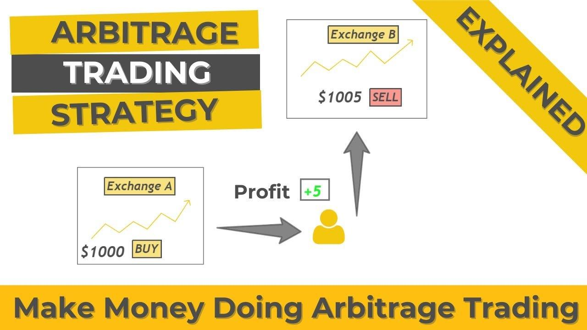

## Table of Contents

## What is forex arbitrage?

Forex arbitrage is a trading strategy where you take advantage of price differences for the same currency in different markets. Imagine you see that the price of the US dollar is a bit higher on one trading platform compared to another. You can buy the dollar where it's cheaper and sell it where it's more expensive, making a small profit from the difference.

This strategy sounds easy, but it can be tricky. The price differences are usually very small, so you need to act quickly and use special software to spot these opportunities. Also, there are risks involved, like the costs of trading and the chance that prices might change before you can complete your trades. Despite these challenges, some traders still use forex arbitrage to try and make consistent profits.

## How does forex arbitrage work?

Forex arbitrage works by taking advantage of small differences in the price of a currency across different markets or trading platforms. Let's say the price of the Euro is a bit higher on one platform than on another. A trader using arbitrage would buy Euros on the platform where they are cheaper and then quickly sell them on the platform where they are more expensive. The goal is to make a small profit from the difference in prices.

However, doing this successfully is not easy. The price differences are usually very small, so traders need to act fast and often use special computer programs to find these opportunities. There are also risks involved, like the costs of making trades and the chance that prices could change before the trader can complete their transactions. Despite these challenges, some traders use forex arbitrage as a way to try and make steady profits.

## What are the different types of forex arbitrage?

There are a few types of forex arbitrage that traders use. The first one is called "spatial arbitrage." This is when a trader buys a currency on one market where it's cheaper and sells it on another market where it's more expensive. The second type is "triangular arbitrage." This happens when a trader uses three different currencies to make a profit. They might buy one currency, use it to buy a second currency, and then use that second currency to buy back the first one, making a small profit from the differences in exchange rates.

Another type is "statistical arbitrage." This is a bit more complicated. Traders use computer programs to look at past price data and find patterns. They then use these patterns to predict when prices might go up or down and make trades based on those predictions. All these types of arbitrage need quick action and often special software to work well. They can help traders make small profits, but they also come with risks like trading costs and the chance that prices might change suddenly.

## What are the basic requirements to start forex arbitrage?

To start forex arbitrage, you need a few basic things. First, you need to have a good understanding of how the forex market works and how to spot price differences between different markets or trading platforms. You also need to have some money to start trading with. This is called your trading capital. Without enough money, you won't be able to take advantage of the small price differences that arbitrage is all about.

Another important thing you need is a fast and reliable internet connection. Since arbitrage involves buying and selling currencies quickly, any delay can make you miss out on profit opportunities. You'll also need access to multiple trading platforms or brokers so you can compare prices and make trades. Lastly, having special software or tools can help a lot. These tools can automatically find price differences and help you make trades faster than you could on your own.

## What are the potential benefits of forex arbitrage?

Forex arbitrage can be a good way to make money because it lets you take advantage of small price differences in the market. When you see that a currency is cheaper on one platform and more expensive on another, you can buy it where it's cheaper and sell it where it's more expensive. This can help you make small but steady profits over time. Since you're buying and selling the same currency, you're not as worried about big changes in its value, which can make this strategy less risky than other kinds of trading.

However, there are some challenges to keep in mind. You need to act quickly because the price differences are usually very small and don't last long. You also need special software to spot these opportunities and make trades fast. Plus, there are costs for trading that can eat into your profits. But if you can handle these challenges, forex arbitrage can be a smart way to make money in the forex market.

## What are the common challenges faced in forex arbitrage?

One big challenge in forex arbitrage is the speed you need to act. The price differences between markets are usually very small and don't last long. You have to be fast to buy and sell the currency before the prices change. This means you need a fast internet connection and special software that can spot these opportunities and make trades quickly. Without these tools, it's hard to make a profit from arbitrage.

Another challenge is the cost of trading. Every time you buy or sell a currency, there are fees or commissions you have to pay. These costs can eat into your profits, especially since the price differences you're trying to take advantage of are so small. You need to make sure your profits are bigger than these costs to make money from arbitrage.

There's also the risk that prices can change suddenly. Even with the best tools, there's always a chance that the market will move against you before you can complete your trades. This means you could end up losing money instead of making a profit. So, while forex arbitrage can be a way to make steady gains, it comes with these challenges that you need to be ready for.

## How can one identify arbitrage opportunities in the forex market?

To identify arbitrage opportunities in the forex market, you need to keep an eye on the prices of currencies across different trading platforms or brokers. The idea is to find a currency that is being sold for a lower price on one platform and a higher price on another. This small difference in price is what you can use to make a profit. For example, if you see that the Euro is cheaper on Platform A and more expensive on Platform B, you can buy Euros on Platform A and sell them on Platform B. To do this effectively, you need to use special software or tools that can quickly scan multiple platforms and find these price differences for you.

However, spotting these opportunities is just the first step. You also need to act very quickly because these price differences usually don't last long. A fast and reliable internet connection is crucial so you can make your trades before the prices change. Plus, you have to be aware of the costs involved in trading, like fees and commissions, because these can eat into your profits. Even with the best tools and fast action, there's always a risk that the market could move against you before you finish your trades. So, while forex arbitrage can help you make money, it requires careful planning and quick action to be successful.

## What role does technology play in forex arbitrage?

Technology is super important for forex arbitrage. It helps traders find small differences in currency prices between different trading platforms. Special software can quickly look at lots of data from different markets and spot these price differences. This software makes it easier for traders to see where they can buy a currency cheap and sell it for more money somewhere else. Without this technology, it would be really hard to find these opportunities fast enough to make a profit.

But technology does more than just find opportunities. It also helps traders make their trades quickly. Since the price differences don't last long, you need to act fast. Good software can do this for you automatically, which means you don't have to sit and watch the markets all the time. Plus, technology can help manage the risks of trading, like keeping track of costs and making sure you don't lose money. So, while technology makes forex arbitrage possible, it also helps make it more efficient and less risky.

## How do transaction costs affect forex arbitrage strategies?

Transaction costs can really change how well forex arbitrage works. Every time you buy or sell a currency, you have to pay fees or commissions. These costs can make the small profit you get from arbitrage smaller or even go away completely. If the price difference between two markets is very small, the cost of trading might be more than what you can make from the trade. So, you need to think about these costs and make sure the profit you can get is bigger than what you have to pay.

Even though transaction costs can make arbitrage harder, there are ways to deal with them. Some traders use special software to find the best times to trade when the price differences are big enough to cover the costs. Others might choose brokers with lower fees to save money. But no matter what, you always have to keep an eye on these costs because they can affect whether you make money or not from forex arbitrage.

## What are the regulatory considerations for forex arbitrage?

When you do forex arbitrage, you need to know about the rules in the countries where you trade. Different places have different laws about trading currencies. Some countries might have strict rules about who can trade and how much money you can move around. You might need to get special permission or a license to do arbitrage. If you don't follow these rules, you could get in trouble or have to pay fines.

Also, the rules can change, so you need to keep up with them. Sometimes, the government might put limits on trading certain currencies or change the fees you have to pay. It's a good idea to talk to a lawyer or someone who knows about these rules to make sure you're doing everything right. Following the rules can help you avoid problems and keep your arbitrage business running smoothly.

## How can risk management be applied to forex arbitrage?

Risk management is really important when you do forex arbitrage. You need to watch out for the costs of trading, like fees and commissions, because they can eat into your profits. If the price difference you're trying to use is too small, these costs might make you lose money instead of making a profit. So, it's a good idea to use special software that can help you find times when the price differences are big enough to cover these costs. Also, you should always have a plan for what to do if things don't go the way you expect. This could mean setting limits on how much money you're willing to risk on each trade.

Another way to manage risk is to spread out your trades. Instead of putting all your money into one arbitrage opportunity, you can try a few different ones at the same time. This can help you balance out any losses you might have in one trade with gains from another. It's also smart to keep an eye on the market and be ready to change your plans if something big happens, like a sudden change in currency prices. By being careful and having good risk management, you can make forex arbitrage safer and more likely to make you money.

## What advanced techniques can be used to enhance forex arbitrage strategies?

One advanced technique to enhance forex arbitrage strategies is to use algorithmic trading. This means using computer programs that can look at lots of data very quickly and make trades without you having to do it yourself. These programs can find price differences between markets even faster than a person could, which is really important because these differences don't last long. The programs can also help you manage your trades better by automatically setting limits on how much money you're willing to risk and making sure you don't lose too much if things go wrong.

Another technique is to use multiple currency pairs at the same time. This is called multi-pair arbitrage. Instead of just looking at one currency pair, you look at several. For example, you might use the Euro, the US Dollar, and the Japanese Yen all at once. By doing this, you can find more opportunities to make a profit because you're watching more markets. It's like having more chances to win. But it's also more complicated, so you need good software to help you keep track of everything and make the right trades at the right time.

## What are the Mechanics of Forex Arbitrage?

Forex arbitrage is a systematic trading strategy that seeks to profit from discrepancies in currency prices across various markets or platforms. It capitalizes on inefficiencies inherent in the decentralized Forex (foreign exchange) market. To comprehend the mechanics of [forex](/wiki/forex-system) arbitrage, it’s essential to grasp its operation among different traders and markets.

Forex arbitrage typically involves three primary steps: identifying a price divergence, executing simultaneous trades, and realizing a risk-free profit. This process requires quick transaction execution due to the fleeting nature of these price discrepancies, which are swiftly corrected by market forces.

### Arbitrage Example

Consider a hypothetical scenario where EUR/USD is quoted at 1.1050 on Forex market A, and simultaneously, on market B, it's quoted at 1.1060. A trader could buy euros for dollars in market A and, at the same moment, sell euros for dollars in market B. The trader profits by capturing the 10-pip difference between the two quotes. Theoretically, this results in a profit without exposure to exchange rate risk.

The profit calculation for this opportunity might be:

$$
\text{Profit} = (\text{Sell Price} - \text{Buy Price}) \times \text{Transaction Volume}
$$

Assuming a transaction [volume](/wiki/volume-trading-strategy) of 100,000 units (a standard lot), the profit would be:

$$
\text{Profit} = (1.1060 - 1.1050) \times 100,000 = 1000 \text{ USD}
$$

### Influencing Factors

Several factors influence the execution and profitability of arbitrage trades:

1. **Transaction Costs**: Spreads, commissions, and slippage can significantly diminish arbitrage profits. Effective arbitrage strategies typically depend on having minimal transaction costs.

2. **Technology and Speed**: Fast execution systems are crucial. Advanced algorithms and colocated servers near exchange data centers can provide critical speed advantages in executing trades before market prices correct themselves.

3. **Market Liquidity**: High liquidity reduces the probability of notable price disparities between markets. However, sufficiently liquid markets are necessary to facilitate the execution of large trades quickly without substantial price fluctuations.

4. **Regulatory Environment**: Different legal and regulatory frameworks across markets may create barriers to executing arbitrage trades, impacting both accessibility and legality.

5. **Data Accuracy and Availability**: Real-time access to accurate market data is critical to detect and leverage arbitrage opportunities promptly.

These factors underscore the complexity of executing Forex arbitrage successfully. Despite the apparent simplicity of the arbitrage concept, the efficient implementation relies heavily on robust technology, rapid execution capabilities, and strategic market participation. While theoretically risk-free, practical execution involves close attention to transaction costs and market dynamics.

## References & Further Reading

[1]: Bank for International Settlements. "Triennial Central Bank Survey: Global foreign exchange market turnover in 2019."

[2]: Lopez de Prado, M. (2018). ["Advances in Financial Machine Learning."](https://www.amazon.com/Advances-Financial-Machine-Learning-Marcos/dp/1119482089) John Wiley & Sons.

[3]: Chan, E. P. (2009). ["Quantitative Trading: How to Build Your Own Algorithmic Trading Business."](https://github.com/ftvision/quant_trading_echan_book) John Wiley & Sons.

[4]: Jansen, S. (2020). ["Machine Learning for Algorithmic Trading."](https://github.com/stefan-jansen/machine-learning-for-trading) Packt Publishing.

[5]: Aronson, D. R. (2006). ["Evidence-Based Technical Analysis: Applying the Scientific Method and Statistical Inference to Trading Signals."](https://www.amazon.com/Evidence-Based-Technical-Analysis-Scientific-Statistical/dp/0470008741) John Wiley & Sons.