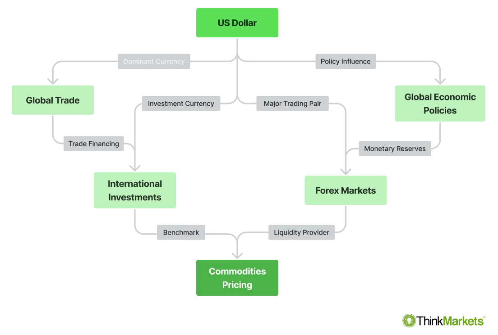

The foreign exchange (forex) market stands as a substantial pillar in the global financial system, characterized by its immense scale and rapid tempo. Engaging billions of dollars daily, it surpasses other financial markets with its constant flow of currencies traded across international borders. A pivotal aspect of participating in this market involves grasping the combined impact of financial associations and algorithmic trading. These entities and technologies are now foundational to informed trading decisions and market participation. 

Financial associations, comprising groups of professionals, brokers, and dealers, set ethical standards and provide education within the forex landscape, enhancing market credibility. At the same time, the advent of algorithmic trading has transformed the forex market, enabling trades to be conducted with unparalleled speed and precision. Algorithmic trading utilizes computer algorithms to automate trading strategies, providing traders an edge through enhanced decision-making processes devoid of human emotion. 



This article focuses on how these elements of currency trading, financial associations, and algorithmic trading intertwine within the forex market. An understanding of their roles profoundly impacts strategies deployed by traders seeking to navigate and succeed in this vibrant global marketplace.

## Table of Contents

## Understanding Forex Associations

Forex associations are structured organizations comprising professionals actively engaged in the foreign exchange market, including dealers, brokers, and financial experts. These associations play a critical role in enhancing the forex industry by setting and maintaining high standards, offering educational resources, and providing networking platforms for their members.

One of their primary functions is the establishment of standards aimed at fostering integrity, transparency, and efficiency within the forex market. By advocating best practices and ethical conduct, these organizations contribute to a more stable and reliable trading environment. For instance, they might develop frameworks and guidelines that professionals are encouraged to adopt, thereby ensuring that all market participants operate on a level playing field.

Education is another cornerstone of forex associations. They offer a variety of learning opportunities, including workshops, certifications, and real-time trading simulations. These programs are designed to enhance the knowledge base of their members, keeping them informed about the latest developments, tools, and technologies in the forex market. By equipping professionals with up-to-date information and skills, these associations help their members to maintain a competitive edge.

Networking is facilitated through events like conferences, seminars, and forums, where [forex](/wiki/forex-system) professionals can connect and exchange valuable insights. Such interactions often lead to collaborations that push the boundaries of forex trading and innovation. Networking opportunities also extend beyond mere professional interactions, fostering a sense of community and shared purpose among members.

A leading example of such an association is the ACI Financial Markets Association (ACI FMA). With a global reach that spans numerous countries, ACI FMA unites a diverse membership base, encompassing a myriad of financial market professionals. The association is instrumental in shaping market practices through its advocacy for the [FX](/wiki/fx-anomaly) Global Code—an initiative designed to instil principles of fairness, transparency, and ethics across the forex market. As part of its commitment to education, ACI FMA provides a comprehensive certification program, enhancing the expertise and credibility of forex professionals worldwide.

Through these initiatives, forex associations like ACI FMA play an indispensable role in the ongoing development and sophistication of the forex market, setting the stage for a more integrated and efficient global trading system.

## ACI FMA and Industry Standards

The ACI Financial Markets Association (ACI FMA) has been instrumental in establishing and promoting global principles of good practice within the foreign exchange (forex) market through the FX Global Code. This code constitutes a comprehensive set of guidelines designed to enhance integrity and ensure ethical conduct among market participants. It is a pivotal tool for fostering transparency and efficiency across forex trading activities globally.

A key objective of the FX Global Code is to cultivate a high standard of behavior, encouraging practices that support the fair and efficient functioning of the forex market. This includes maintaining transparency in pricing, executing trades with integrity, and ensuring market participants adhere to clear ethical guidelines. As such, the FX Global Code serves as a benchmark for professional conduct in the forex market.

Recent amendments to the FX Global Code have underscored the growing importance of [algorithmic trading](/wiki/algorithmic-trading), which utilizes computer programs to automate trading strategies. As algorithmic trading continues to gain traction, it introduces unique challenges and opportunities within the forex landscape. The code provides updated guidelines to ensure that algorithmic trading practices align with established ethical standards, particularly concerning the fair treatment of clients and the prevention of undue market disruption.

Additionally, the FX Global Code addresses data transparency, emphasizing the need for clarity and openness in sharing market information. This focus on transparency aims to reduce information asymmetry, which can lead to inefficient market conditions and potentially manipulative practices. By promoting transparency, the FX Global Code helps market participants make informed decisions, thereby contributing to overall market stability.

Settlement risk mitigation is another critical area covered by the FX Global Code. Effective management of settlement risk—the possibility that one party may fail to deliver a payment or security—remains a fundamental concern in forex markets due to their global and over-the-counter nature. The FX Global Code advocates for robust systems and processes that minimize the likelihood and potential impact of settlement failures, thus bolstering market resilience.

Overall, the ACI FMA, through the FX Global Code, plays a crucial role in upholding the integrity of the forex market. By aligning trading practices with these industry standards, market participants can contribute to a more transparent, efficient, and ethically sound trading environment.

## Membership Benefits in Forex Associations

Members of forex associations such as the ACI Financial Markets Association (ACI FMA) enjoy numerous benefits that contribute to their professional growth and the broader advancement of the forex market. One of the key advantages is access to specialized educational programs and certifications. These programs are designed to enhance the skills and knowledge of forex professionals, ensuring they remain competitive and informed about the latest industry practices.

The educational offerings often cover a wide range of topics, from basic forex principles to advanced trading techniques and regulatory updates. Certifications such as the ACI Dealing Certificate and ACI Diploma provide members with a recognized credential that attests to their expertise and commitment to ethical standards in trading. This educational foundation equips members with the necessary tools to navigate the complex forex landscape effectively.

Networking opportunities represent another significant benefit for ACI FMA members. The association facilitates interactions among a diverse group of professionals, including individuals from central banks, brokerage firms, and academic institutions. This diversity ensures a rich exchange of ideas and perspectives, fostering collaboration and innovation within the forex community. Networking events, conferences, and seminars organized by the association provide platforms for members to connect, share insights, and develop partnerships that may lead to new business opportunities.

Furthermore, being part of a forex association encourages the exchange of best practices and the latest market insights. Members have access to exclusive research reports, market analyses, and industry newsletters, keeping them abreast of trends and developments. This information sharing is vital for maintaining a competitive edge and ensuring that members are equipped to make informed trading decisions.

In summary, membership in forex associations like the ACI FMA offers valuable educational opportunities, a robust professional network, and access to crucial market insights. Together, these benefits support the growth and success of forex professionals, enabling them to contribute positively to the evolving global financial market.

 to Forex Algo Trading

Algorithmic trading in the forex market involves the use of computer algorithms to execute trades based on predetermined strategies. This approach has gained immense popularity due to its ability to process vast amounts of data with speed and accuracy, offering significant advantages over traditional manual trading methods. One of the primary benefits of algorithmic trading is the elimination of emotional influence in trading decisions. By ensuring trades are executed based solely on predefined parameters, this method reduces the likelihood of human error and bias, which can be particularly advantageous in the highly volatile forex market.

The ability to execute trades at the optimal time and price is another critical advantage of algorithmic trading. Algorithms can monitor market conditions and execute trades within milliseconds, a feat unachievable by human traders. This speed not only allows traders to capitalize on fleeting market opportunities but also to manage large volumes of trades more effectively.

Furthermore, algorithmic trading can enhance efficiency by conducting transactions at lower transaction costs. The automated nature of these systems reduces the need for a large workforce to oversee trades, thereby decreasing operational expenses. Additionally, automated strategies can be backtested using historical data, allowing traders to refine strategies based on empirical evidence before deploying them live. 

Understanding the inner workings of algorithmic trading is thus essential for modern forex traders aiming to leverage technology to maximize their trading efficacy. Given the complexity of developing successful trading algorithms, traders must familiarize themselves with both the technical and strategic aspects of this methodology. Doing so enables them to construct robust trading systems capable of adapting to the ever-evolving landscape of the forex market.

To summarize, algorithmic trading in forex provides unparalleled speed, accuracy, and emotion-free decision-making advantages, making it a critical tool for traders seeking to optimize their trading strategies through technology. As technology advances, the role of algorithmic trading in the forex market is expected to grow, underscoring the importance of understanding and applying these concepts effectively.

## Developing a Robust Algo Trading System

Successful algorithmic trading systems in the forex market hinge on the establishment of clear goals, comprehensive risk management, and the leverage of a reliable trading platform. These systems are designed to execute trades automatically based on a set of predetermined criteria, ensuring precision and efficiency.

### Key Steps for Validating Trading Algorithms

**Backtesting and Optimization**: The process of backtesting involves simulating the trading strategy on historical data to assess its viability without risking actual capital. It allows traders to gauge how the trading algorithm would have performed in the past. Incorporating optimization in this step helps refine the strategy, adjusting parameters to enhance profitability and reduce risks. The goal is to fine-tune the algorithm until it reaches optimal performance criteria.

For instance, consider a simple moving average crossover strategy. The Python code snippet below demonstrates a basic framework for [backtesting](/wiki/backtesting) such a strategy:

```python
import pandas as pd
import numpy as np

# Load historical data
data = pd.read_csv('forex_data.csv')
data['SMA_50'] = data['Close'].rolling(window=50).mean()
data['SMA_200'] = data['Close'].rolling(window=200).mean()

# Determine buy/sell signals
data['Signal'] = np.where(data['SMA_50'] > data['SMA_200'], 1, 0)
data['Position'] = data['Signal'].diff()

# Calculate returns
data['Return'] = data['Close'].pct_change()
data['Strategy_Return'] = data['Return'] * data['Position'].shift(1)

# Performance metrics
cumulative_return = (1 + data['Strategy_Return'].dropna()).prod()
print('Cumulative Return:', cumulative_return)
```

This script evaluates a simple strategy on respective historical forex data, providing insights into its efficacy and areas for potential optimization.

### Commonly Used Strategies

**Trend Following**: This strategy capitalizes on directional market movements. It assumes that assets that are trending will continue to trend, allowing traders to "ride the wave" of price movements. Indicators such as moving averages, MACD, and trend lines are often employed to identify trends.

**Mean Reversion**: In contrast, mean reversion strategies are based on the notion that prices will revert to their historical mean or average level. Traders utilizing this approach look for deviations from the mean, entering trades when prices are deemed to have moved too far from their average value.

### Risk Management

Effective risk management is fundamental to the sustainability of algo trading systems. This includes setting risk parameters such as maximum drawdowns and position sizing, ensuring that the algorithm does not expose the trader to undue risk. Adaptive measures, such as automatically adjusting position sizes during volatile market conditions, can further protect against losses.

### Conclusion

Creating a robust algorithmic trading system is an intricate process that demands careful consideration of strategic, technical, and risk management factors. Through diligent backtesting, optimization, and the appropriate application of trend-following and mean-reversion strategies, traders can significantly enhance their market efficiency. This structured approach not only elevates trading precision but also helps in the systematic reduction of trading risks.

## Managing Risks in Forex Algo Trading

Algorithmic trading in the forex market involves the use of computer programs to execute trading decisions based on predefined criteria. This approach, while offering significant advantages, also presents unique challenges and risks. Two common pitfalls in algorithmic trading are overfitting and data snooping bias. Overfitting occurs when a trading model is excessively tailored to historical data, capturing noise rather than underlying market patterns. As a result, the model may perform well on past data but fail in real-time trading due to its lack of generalizability. Data snooping bias arises when multiple hypotheses are tested using the same dataset, increasing the likelihood of discovering a spurious correlation by chance.

Mitigating these risks requires robust risk management strategies. Firstly, implementing cross-validation techniques helps evaluate the algorithm's performance on unseen data, reducing the risk of overfitting. Techniques such as k-fold cross-validation can be employed, where the data is divided into k subsets, and the model is trained and tested k times.

```python
from sklearn.model_selection import cross_val_score
from sklearn.linear_model import LinearRegression
import numpy as np

# Example of cross-validation
X = np.random.rand(100, 5)  # Sample features
y = np.random.rand(100)     # Sample target values
model = LinearRegression()

# Perform 5-fold cross-validation
scores = cross_val_score(model, X, y, cv=5)
print("Cross-validation scores:", scores)
```
In this example, a linear regression model is evaluated using 5-fold cross-validation to assess its stability and performance on different data splits.

Risk management also involves defining clear and conservative risk limits, including maximum drawdown thresholds and position sizing rules. These can protect the trader from substantial losses due to unforeseen market events or system failures. Furthermore, employing diversification strategies can mitigate individual strategy risks. By spreading investments across various algorithms or currency pairs, the overall risk exposure can be reduced.

Continuous monitoring and adaptation are critical to navigating the dynamic forex market. Traders should regularly review the performance of their algorithms and make adjustments as necessary to account for changes in market conditions. Adaptive algorithms, which leverage [machine learning](/wiki/machine-learning) techniques to continually update their parameters based on new data, can be particularly beneficial in this regard.

The dynamic nature of the forex market necessitates a proactive approach to risk management. By addressing common pitfalls like overfitting and data snooping bias and implementing robust risk management strategies, traders can enhance the resilience of their algorithmic trading systems. As technology and markets evolve, continuous monitoring and adaptation remain essential for maintaining a competitive edge.

## The Future of Forex Algorithmic Trading

Advancements in technology and data analytics are significantly influencing the growth trajectory of algorithmic trading in the foreign exchange (forex) market. Enhanced computational power and sophisticated algorithms allow traders to process vast amounts of data in real time, leading to more informed trading decisions. The development of machine learning and [artificial intelligence](/wiki/ai-artificial-intelligence) technologies enables the creation of adaptive trading models that can learn and evolve with changing market conditions.

Algorithmic trading has introduced a paradigm shift, significantly increasing both the efficiency and the speed at which trades are executed. This shift has been facilitated by low latency trading systems, which minimize the time delay between data reception and order execution. Such systems are crucial in high-frequency trading ([HFT](/wiki/high-frequency-trading-strategies)), where every microsecond can influence profitability.

Despite these advancements, algorithmic trading is not without its challenges. Ethical considerations are becoming increasingly significant as the use of autonomous systems in financial markets raises questions about accountability and fairness. The potential for market manipulation via algorithms has prompted regulatory bodies to impose stricter oversight. For instance, the European Securities and Markets Authority (ESMA) has implemented regulations to ensure transparency and reduce the risks associated with high-frequency trading.

Moreover, data privacy and security pose substantial concerns. With data being central to algorithmic strategies, traders must navigate regulations like the General Data Protection Regulation (GDPR) in the European Union that govern the use of personal data.

Regulatory challenges are compounded by the dynamic nature of financial markets, which demands continuous adaptation from traders. Successful algorithmic traders must remain informed about both technological advancements and regulatory changes. This involves staying updated on market trends, integrating cutting-edge technologies, and adhering to evolving regulatory frameworks.

Traders who effectively balance these aspects position themselves to harness the benefits of algorithmic trading while mitigating associated risks. As the forex market continues to evolve, technological innovation and adherence to ethical standards will play a critical role in shaping the future landscape of forex algorithmic trading.

## Conclusion

The integration of financial associations and algorithmic trading is fundamentally transforming the forex market. These entities and technologies are not merely complementary but synergistic, offering traders robust frameworks and cutting-edge tools for optimizing their strategies. Financial associations, like the ACI Financial Markets Association, provide crucial industry standards and foster environments where best practices and ethical trading are paramount. Such standards are vital as they ensure market integrity and facilitate smoother operations which can be of immense advantage when aligned with the precision and speed offered by algorithmic trading.

Algorithmic trading itself brings unparalleled efficiency and objectivity to forex trading. By leveraging server-based algorithms that implement complex mathematical models, traders can react to market conditions in microseconds, far surpassing the capabilities of manual trading. This level of sophistication can be a significant determinant in gaining competitive advantage, as it allows for quick adaptation to market [volatility](/wiki/volatility-trading-strategies)— a common feature in forex markets. Thus, traders who combine their association-derived insights with algorithmic precision can significantly enhance their trading outcomes.

The future landscape of forex trading promises further innovations, propelled by advancements in technology and data analytics. As machine learning and artificial intelligence begin to play larger roles in trading algorithms, staying informed and adapting to new tools and methodologies will be more crucial than ever. However, with these technological advancements come increased ethical considerations and regulatory challenges. Traders and organizations must remain vigilant, ensuring that their practices meet industry standards and ethical guidelines.

Ultimately, the successful integration of financial associations' governance and algorithmic innovations will be key in navigating the complexities of the evolving forex market. Embracing technological innovation alongside adherence to established practices will be indispensable for traders aiming to maintain and bolster their competitive edge in this dynamic environment.

## References & Further Reading

[1]: Bergstra, J., Bardenet, R., Bengio, Y., & Kégl, B. (2011). ["Algorithms for Hyper-Parameter Optimization."](https://dl.acm.org/doi/10.5555/2986459.2986743) Advances in Neural Information Processing Systems 24.

[2]: ["Advances in Financial Machine Learning"](https://www.amazon.com/Advances-Financial-Machine-Learning-Marcos/dp/1119482089) by Marcos Lopez de Prado

[3]: ["Evidence-Based Technical Analysis: Applying the Scientific Method and Statistical Inference to Trading Signals"](https://www.amazon.com/Evidence-Based-Technical-Analysis-Scientific-Statistical/dp/0470008741) by David Aronson

[4]: ["Machine Learning for Algorithmic Trading"](https://github.com/PacktPublishing/Machine-Learning-for-Algorithmic-Trading-Second-Edition) by Stefan Jansen

[5]: ["Quantitative Trading: How to Build Your Own Algorithmic Trading Business"](https://www.amazon.com/Quantitative-Trading-Build-Algorithmic-Business/dp/1119800064) by Ernest P. Chan