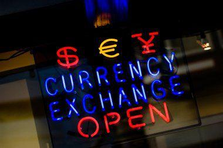

Forex trading represents one of the largest and most liquid markets globally, boasting an average daily trading volume exceeding $6 trillion. This financial domain is inherently complex, driven by various factors such as broker compensation mechanisms, stringent regulations, and the significant rise of algorithmic trading. Each element significantly influences market dynamics and trader strategies.

Understanding the role of forex brokers is crucial as they serve as intermediaries, facilitating access to the currency trading market for individual traders. Brokers provide essential services, including trading platforms and access to financial instruments, which require careful consideration by traders when selecting the appropriate intermediary.



Broker compensation is derived primarily through the bid-ask spread, which represents the difference between the prices to buy and sell currency pairs. This spread can influence a trader’s profitability, and additional fees may apply for platform access or dedicated services. Therefore, comprehending these compensation structures is essential for managing trading costs effectively.

Financial regulation also holds a pivotal role in forex trading, aimed at safeguarding market integrity and protecting traders. Regulatory bodies, such as the Commodity Futures Trading Commission (CFTC) in the U.S., the Financial Conduct Authority (FCA) in the UK, and the Australian Securities and Investments Commission (ASIC), establish standards to promote transparency and fairness. Adhering to these regulations assures traders of a secure trading environment, though it also imposes stringent operational guidelines on brokers.

Algorithmic trading, characterized by the use of computer programs to execute trades based on predetermined criteria, is increasingly prevalent in forex markets. This method offer traders the advantage of executing large trades with speed and efficiency, minimizing the need for manual intervention. However, implementing algorithmic trading systems demands advanced technological infrastructure and adherence to regulatory practices to mitigate risks of manipulation and malpractices.

For traders, both novices and seasoned professionals, grasping these critical aspects is integral to navigating the foreign exchange market’s complexities successfully. By understanding the interplay between broker roles, compensation structures, regulatory environments, and technological advancements, traders can better position themselves to thrive in this dynamic and fast-paced landscape.

## Table of Contents

## Understanding Forex Brokers and Their Role

Forex brokers are essential entities within the [forex](/wiki/forex-system) trading environment, serving as intermediaries that facilitate transactions between traders and the interbank system, where currency exchanges take place. Their role is multifaceted, encompassing various services crucial for executing trades effectively and efficiently.

One of the primary services offered by forex brokers is providing trading platforms. These platforms are critical as they allow traders to execute trades, analyze market trends, and access real-time data. Platforms vary widely in terms of user interface, technical features, and accessibility on different devices, making it important for traders to select one that best suits their trading style and technical proficiency.

Another critical service provided by brokers is leverage. Leverage enables traders to control a larger position with a smaller amount of capital, potentially amplifying gains but also increasing the risk of losses. For instance, a leverage ratio of 100:1 would allow a trader to hold a position worth $100,000 with only $1,000 of actual capital. While this mechanism can significantly enhance trading opportunities, it also necessitates a robust understanding of risk management practices.

Spreads are a central element of how forex brokers operate, representing the difference between the bid and ask price of a currency pair. This spread is typically how brokers are compensated for their services, with narrower spreads generally more favorable to traders. The spread can be fixed or variable, and understanding these variations can impact trading strategies and profitability.

In addition to these core services, many brokers provide educational resources that aim to equip traders with necessary knowledge and skills. These resources might include webinars, tutorials, trading articles, and simulations which are particularly beneficial for novice traders seeking to build a foundation in forex trading.

Selecting a suitable forex broker is a critical decision for traders. It involves evaluating factors such as the broker's regulatory compliance, fee structures, platform offerings, and customer support quality. Traders should ensure that the broker aligns with their specific trading objectives and offers terms that support their strategies, such as competitive spreads and reliable execution speeds.

In conclusion, the role of forex brokers extends beyond mere facilitation of trades. They provide essential infrastructure and resources that support traders in navigating the complexities of forex markets. Making informed decisions when choosing a broker can significantly impact a trader's success and efficiency in the market.

## Broker Compensation Methods

Forex brokers are crucial intermediaries in the currency trading landscape and are compensated through methods primarily involving the bid-ask spread and additional fees. Understanding these compensation structures can significantly influence trading strategies and overall profitability.

The bid-ask spread is the most common form of broker compensation. It represents the difference between the price at which a broker is willing to buy (bid) and sell (ask) a currency pair. For instance, if the bid price for EUR/USD is 1.1000 and the ask price is 1.1002, the spread is 2 pips. This difference essentially acts as the broker's fee for executing the trade. Wider spreads can erode a trader’s profits, especially for high-frequency trading, where trades are executed more frequently within tighter margins.

In addition to the bid-ask spread, some brokers impose commissions or fees. These charges may vary based on the trading account type, the currency pairs involved, or the trading [volume](/wiki/volume-trading-strategy). For example, brokers may offer tighter spreads on major currency pairs while charging a commission per trade or a percentage of the trade volume. Alternatively, a broker might provide a fixed spread account but introduce additional charges for using advanced trading platforms or accessing premium services such as personalized market analysis or higher leverage.

To illustrate broker compensation calculation, consider a scenario where a broker imposes a fixed commission along with the spread. Suppose the spread is 1 pip, and the broker charges a commission of $5 per traded lot (a standard lot equals 100,000 units of the base currency). For a single trade involving a standard lot with a bid-ask spread of 1 pip and a pip value of $10, the broker's compensation would be:

$$
\text{Total Compensation} = \text{Spread Compensation} + \text{Commission}
$$

$$
\text{Spread Compensation} = 1 \text{ pip} \times \$10 = \$10
$$

$$
\text{Total Compensation} = \$10 + \$5 = \$15
$$

Traders must carefully evaluate broker compensation structures in relation to their trading strategies. While some traders might prefer brokers offering tight spreads with additional commissions, others might prioritize fixed spreads with no additional fees, depending on their trading style, frequency, and objectives. By selecting the right broker compensation model, traders can optimize their trading costs and potentially enhance their overall profitability.

## Importance of Financial Regulation in Forex Trading

Financial regulation plays a crucial role in forex trading by ensuring the integrity of the market and protecting traders from fraudulent activities. These regulations are designed to foster a transparent and fair trading environment which is essential for maintaining the trust of participants in the forex market.

Key regulatory bodies across the globe enforce standards to uphold the principles of transparency and fairness in forex trading. In the United States, the Commodity Futures Trading Commission (CFTC) and the National Futures Association (NFA) are the primary regulators. The CFTC oversees the trading of futures and options markets, including forex, ensuring compliance with regulatory standards and promoting market competition and efficiency. The NFA is a self-regulatory organization that works alongside the CFTC to protect market participants and enforce strict conduct rules among its members.

In the United Kingdom, the Financial Conduct Authority (FCA) serves as the main regulatory authority overseeing forex trading activities. The FCA is responsible for ensuring that financial markets operate with integrity and that consumers are protected. Its stringent regulatory framework demands that brokers maintain adequate capital reserves, operate with transparency, and adhere to ethical trading practices.

The Australian Securities and Investments Commission (ASIC) is the primary regulator in Australia, tasked with overseeing financial services and markets, including forex trading activities. ASIC's regulations focus on transparency, the financial health of brokers, and the prevention of market manipulation.

Compliance with these regulatory standards offers traders peace of mind by safeguarding their investments and ensuring market stability. Regulations often restrict the maximum leverage that brokers can offer to traders, as high leverage can lead to significant losses. For instance, the FCA limits leverage to 30:1 for major currency pairs. While these restrictions protect traders from excessive risk, they may also limit the trading flexibility and potential returns for experienced traders who are capable of managing higher leverage.

Regulations also impose strict operational guidelines on brokers, including the requirement for these entities to segregate client funds from their own operational funds. This measure protects client assets in the event of a broker's insolvency.

Overall, financial regulation is paramount in maintaining the order and security of the forex market. It creates a structured trading environment that benefits both brokers and traders by discouraging fraudulent practices and encouraging ethical conduct. Compliance with regulation is not only a legal obligation but a cornerstone for sustaining long-term success within the forex trading landscape.

## Algorithmic Trading in the Forex Market

Algorithmic trading, commonly known as algo trading, utilizes computer algorithms to execute orders in financial markets. In the forex market, algo trading facilitates rapid execution of trade orders automatically as per predetermined criteria, which may include price, timing, or volume.

The main advantage of [algorithmic trading](/wiki/algorithmic-trading) lies in its ability to handle large order volumes and execute trades in milliseconds without requiring manual intervention. This efficiency is crucial in the forex market, which is highly liquid and characterized by substantial [volatility](/wiki/volatility-trading-strategies). By leveraging algo trading, traders can capitalize on fleeting market opportunities that would be missed through manual trading.

In practice, these algorithms are programmed to analyze market data, identify trading signals, and execute orders automatically while minimizing human error. Python, a versatile programming language, offers robust libraries such as NumPy and pandas which are commonly used for algorithmic strategy development in forex trading. For instance, a simple algorithm to execute trades based on moving average crossovers can be implemented in Python as follows:

```python
import pandas as pd

# Assuming 'df' is a DataFrame with forex prices and 'Close' column represents closing prices
df['SMA_20'] = df['Close'].rolling(window=20).mean()
df['SMA_50'] = df['Close'].rolling(window=50).mean()

# Define a simple Buy/Sell signal
df['Signal'] = 0
df['Signal'][df['SMA_20'] > df['SMA_50']] = 1
df['Signal'][df['SMA_20'] < df['SMA_50']] = -1

# Exclude the first 'n' rows where n is the maximum window size used in moving averages
df.dropna(inplace=True)

# Display signals
df[['Close', 'SMA_20', 'SMA_50', 'Signal']].tail()
```

Despite its advantages, algorithmic trading requires a robust technological infrastructure to handle the complexities of the forex market. High-speed internet, powerful computing hardware, and secure data feeds are essential to ensure the reliability and speed of algo trading systems.

Additionally, regulatory compliance is a critical aspect to prevent market manipulation and protect market integrity. For instance, financial authorities have set rules and standards for algorithmic trading systems to avoid flash crashes and other disruptive incidents. Compliance often involves stress-testing algorithms under various market conditions and maintaining transparency with regulatory bodies.

In summary, algorithmic trading in the forex market enables efficient trade execution but demands significant technological investment and adherence to regulatory standards. Balancing these elements is key to leveraging the full potential of algo trading.

## Choosing the Right Forex Broker

Selecting a regulated forex broker is a crucial step for traders looking to navigate the forex market effectively. The first aspect to consider is the broker's regulatory status. Reputable brokers should be registered with recognized financial authorities, such as the Commodity Futures Trading Commission (CFTC) and the National Futures Association (NFA) in the United States, the Financial Conduct Authority (FCA) in the United Kingdom, or the Australian Securities and Investments Commission (ASIC) in Australia. Regulatory oversight ensures that brokers adhere to stringent standards, providing a level of security and transparency that protects traders from fraudulent activities.

The fee structure is another critical [factor](/wiki/factor-investing) to evaluate when choosing a forex broker. Brokers typically earn through the bid-ask spread, additional commissions, or fees for certain services. It's essential to compare these costs across different brokers to find competitive options that suit your trading style and objectives. Some brokers may offer tighter spreads but might compensate for this with higher commissions or fees for advanced trading platforms.

Trading platforms are integral to the trading experience, providing access to market analysis tools, charts, and execution capabilities. A good trading platform should be user-friendly, reliable, and equipped with the necessary features for both technical and [fundamental analysis](/wiki/fundamental-analysis). Some brokers also offer educational resources and demo accounts, which can be particularly useful for beginners to practice trading strategies risk-free.

Customer support quality is a vital aspect to consider, especially for traders who may need timely assistance with technical issues or queries. Checking the responsiveness and availability of customer support can provide insights into the broker's reliability and commitment to its clients.

Demo accounts and user reviews are valuable resources for assessing the practicality and dependability of a forex broker before opening a real trading account. Demo accounts allow traders to test the broker's platform and execution services in a real-time environment without risking actual funds. User reviews can offer firsthand experiences and highlight any potential issues with the broker's service.

Ultimately, it's imperative to choose a forex broker that aligns with your trading objectives, offers competitive spreads, and ensures reliable execution. By thoroughly evaluating these aspects, traders can enhance their chances of success and maintain compliance with financial regulations. Continuous research and adaptation to market changes are crucial for thriving in the dynamic forex landscape.

## The Future of Forex Trading and Regulation

The future of forex trading is poised at the intersection of rapid technological advances and increasingly stringent regulatory measures. With the evolution of sophisticated algorithmic trading strategies, the forex market is becoming more efficient, offering high-speed and complex trading operations. Algorithmic trading leverages computer algorithms to execute trades at optimal prices, capitalizing on minimal price fluctuations within extremely short time frames. This form of trading not only increases the volume and velocity of transactions but also aids in reducing transaction costs and eliminating human biases.

As these algorithms become more advanced, they incorporate [machine learning](/wiki/machine-learning) and [artificial intelligence](/wiki/ai-artificial-intelligence) (AI) to analyze larger datasets, predict market movements, and execute trades accordingly. For instance, a machine learning model might be trained on historical price data to forecast future currency movements. Using Python, traders can create a simple model using libraries such as Pandas, NumPy, and Scikit-learn:

```python
import pandas as pd
from sklearn.model_selection import train_test_split
from sklearn.ensemble import RandomForestRegressor

# Load historical price data
data = pd.read_csv('historical_prices.csv')

# Define features and target variable
features = data[['open', 'high', 'low', 'volume']]
target = data['close']

# Split data into train and test sets
X_train, X_test, y_train, y_test = train_test_split(features, target, test_size=0.2, random_state=42)

# Train a RandomForest model
model = RandomForestRegressor(n_estimators=100, random_state=42)
model.fit(X_train, y_train)

# Make predictions
predictions = model.predict(X_test)
```

In parallel with technological advancements, regulatory frameworks are becoming increasingly important in maintaining the stability and integrity of the forex market. Regulatory bodies worldwide are adapting to these changes by implementing more comprehensive regulations to control high-frequency trading and ensure market transparency. Regulations aim to prevent market manipulation, reduce systemic risk, and protect investor interests.

One of the central challenges is achieving a balance between fostering innovation and enforcing regulation. While advanced trading strategies offer opportunities for enhanced profitability and market efficiency, they also pose potential risks, such as flash crashes and increased market volatility. Therefore, traders must stay informed about regulatory changes and comply with new guidelines to mitigate these risks. They need to consistently monitor changes from regulatory authorities, such as the Commodity Futures Trading Commission (CFTC) in the U.S., the Financial Conduct Authority (FCA) in the UK, and the Australian Securities and Investments Commission (ASIC).

In conclusion, the future of forex trading will undoubtedly be shaped by the dual forces of innovation and regulation. Traders who adapt to technological advancements while adhering to evolving regulatory standards will likely gain a competitive edge in the forex market, navigating both its challenges and opportunities.

## Conclusion

Navigating the forex market demands a comprehensive understanding of the integral roles brokers play, the importance of financial regulation, and the growing influence of algorithmic trading. Forex brokers are indispensable intermediaries in this market, connecting traders with the global currency exchange system while offering essential services such as trading platforms and leverage options. Their compensation methods, often reflected in the bid-ask spread and additional fees, can substantially influence traders' profitability. Therefore, selecting a suitable broker who aligns with an individual's trading strategies and offers competitive terms is vital for optimizing trading outcomes and maintaining regulatory compliance.

Financial regulation serves as a safeguard, ensuring market integrity and protecting traders from fraudulent activities. Renowned regulatory bodies, including the Commodity Futures Trading Commission (CFTC) and the National Futures Association (NFA) in the United States, the Financial Conduct Authority (FCA) in the United Kingdom, and the Australian Securities and Investments Commission (ASIC) in Australia, enforce stringent standards to enhance transparency and fairness within the forex market. Adhering to these regulations not only protects traders but also imposes operational guidelines that brokers must follow, thereby fostering a safer trading environment.

Algorithmic trading, or algo trading, represents a significant evolution in forex trading by leveraging computer programs to execute trades based on pre-set algorithms. While it offers the potential for executing complex and high-frequency trades efficiently and without human intervention, it necessitates a robust technological infrastructure and adherence to regulatory frameworks to avert manipulative practices in the market.

In this dynamic and continually evolving forex landscape, traders must prioritize continuous learning and adaptability. Staying informed about regulatory changes and technological advancements is crucial for sustaining a competitive edge. Ultimately, the balance between embracing innovation and adhering to regulations will dictate the future of forex trading, presenting both opportunities and challenges for traders worldwide.

## References & Further Reading

[1]: ["Algorithmic Trading: Winning Strategies and Their Rationale"](https://www.wiley.com/en-us/Algorithmic+Trading%3A+Winning+Strategies+and+Their+Rationale-p-9781118460146) by Ernie Chan

[2]: ["The Forex Trading Course: A Self-Study Guide to Becoming a Successful Currency Trader"](https://www.amazon.com/Forex-Trading-Course-Self-Study-Successful/dp/1118998650) by Abe Cofnas

[3]: ["Traders at Work: How the World's Most Successful Traders Make Their Living in the Markets"](https://www.amazon.com/Traders-Work-Worlds-Successful-Markets/dp/1430244437) by Tim Bourquin

[4]: CFTC and NFA. Commodity Futures Trading Commission and National Futures Association websites provide information on U.S. regulations. [CFTC](https://www.cftc.gov/check) [NFA](https://www.cftc.gov/check)

[5]: FCA. Information on the Financial Conduct Authority's regulatory standards can be found on the [FCA website](https://www.fca.org.uk/).

[6]: ASIC. [Australian Securities and Investments Commission](https://asic.gov.au/) website contains regulatory guidelines for forex trading in Australia.

[7]: ["Python for Finance: Analyze Big Financial Data"](https://books.google.com/books/about/Python_for_Finance.html?id=E93SBQAAQBAJ) by Yves Hilpisch

[8]: ["Trading and Exchanges: Market Microstructure for Practitioners"](https://www.amazon.com/Trading-Exchanges-Market-Microstructure-Practitioners/dp/0195144708) by Larry Harris