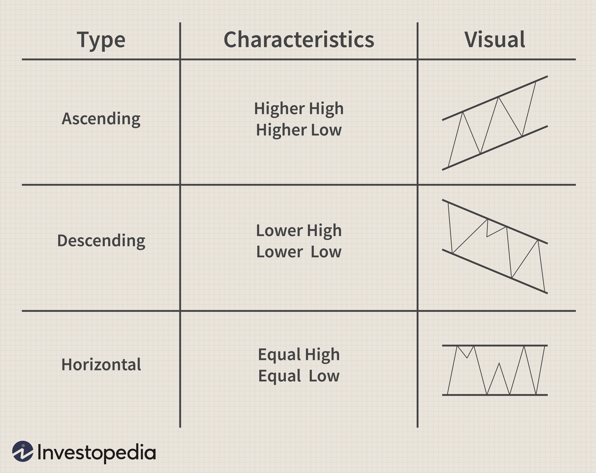

Forex trading, the exchange of currencies in the foreign exchange market, is a dynamic and complex discipline where technical analysis is crucial for making informed trading decisions. Technical analysis employs historical price data and market patterns to anticipate future price movements, providing traders with valuable insights into potential market trends. This article examines various components of forex charting and technical analysis, highlighting the importance of algorithmic trading.

Technical analysis in forex trading focuses on identifying patterns within price charts, which are used to estimate future price directions. By analyzing price action through charts, traders can discern patterns and trends that might indicate either continuation or reversal of the current market direction. These insights are drawn from a vast array of technical indicators and chart patterns that serve as essential tools for traders aiming to enhance their decision-making abilities.

Programming knowledge has also revolutionized technical analysis by introducing algorithmic trading, allowing the execution of trading strategies based on predefined rules. This innovation facilitates the swift analysis of market data and prompt trade execution, reducing the impact of emotional biases and ensuring consistent strategy application.

Throughout this article, we will cover the crucial tools and strategies involved in technical analysis, which assist traders in refining their trading performance. By integrating insights from technical indicators and chart patterns, traders can better navigate the complexities of the forex market. Whether a novice or experienced trader, understanding and applying these methodologies can significantly contribute to achieving success in the forex trading arena.

## Table of Contents

## Understanding Forex Charting

Forex charting presents currency pair price movements in a visual format over specified periods, acting as a foundational tool for technical analysis. Charts not only illustrate price fluctuations but also offer a framework for identifying patterns and trends essential for making informed trading decisions.

There are three primary types of charts used in forex trading: line charts, bar charts, and candlestick charts. Each type offers distinct insights and advantages:

1. **Line Charts**: These charts plot a simple line from one closing price to the next, enabling traders to see the general price direction over a set period. While they do not provide detailed market data, line charts offer a clear view of long-term trends.

2. **Bar Charts**: Offering more detail than line charts, bar charts provide information about the opening, closing, high, and low prices for each period. The top of the vertical bar reflects the highest price, while the bottom indicates the lowest. A horizontal tick on the left shows the opening price, and one on the right shows the closing price. This detailed view aids traders in understanding daily price fluctuations and market strength.

3. **Candlestick Charts**: Candlestick charts are highly popular due to their detailed information and visual appeal. Each 'candlestick' represents price movements within a specific time frame, showing the opening, closing, high, and low prices. The body of the candlestick indicates the difference between the opening and closing prices, while the wicks or shadows reflect the high and low prices. Patterns formed by candlesticks can indicate potential market reversals or continuations.

Traders can customize these charts with various time frames ranging from one minute to monthly intervals, depending on their analysis objectives. This flexibility allows traders to observe short-term fluctuations or long-term trends according to their trading strategies. Additionally, overlaying indicators such as moving averages, Bollinger Bands, or Fibonacci retracement levels can enhance the analytical power of charts, providing layered insights into market behavior and potential trade signals. 

Overall, [forex](/wiki/forex-system) charting is an indispensable aspect of technical analysis, enabling traders to visualize and interpret market data effectively. Understanding how to utilize different chart types and customization options is crucial for navigating the complexities of forex trading.

## Key Concepts in Forex Technical Analysis

Technical analysis in forex trading is fundamentally grounded on the interpretation of price movements, trading [volume](/wiki/volume-trading-strategy), and historical data to inform trading decisions. These elements serve as the cornerstone for identifying patterns and predicting future market behaviors.

One of the essential aspects of technical analysis is the identification of support and resistance levels. Support levels are zones where the price tends to stop falling and potentially reverses upward. Conversely, resistance levels are points where the price typically halts its upward movement and may revert downward. Traders use these levels to predict potential entry and [exit](/wiki/exit-strategy) points, as prices are likely to bounce off these levels, leading to reversals. The psychological and historical significance of these levels, as many traders watch them, cannot be underestimated.

Trend analysis constitutes another pivotal component of technical analysis. Trends represent consistent price movement direction over time, classified as uptrend, downtrend, or sideways. Identifying these trends allows traders to align their trading strategies with the market's prevailing direction. For instance, in an uptrend, a trader might look to buy or hold long positions, whereas a downtrend may indicate opportunities for selling or shorting. Simple moving averages (SMA) and exponential moving averages (EMA) are tools frequently used to smooth price data, helping traders confirm trend directions.

Understanding price action and chart patterns such as the "head and shoulders" and "triangles" is crucial for providing actionable entry and exit signals. The head and shoulders pattern, for instance, suggests a potential reversal of the existing trend, while triangle patterns can indicate continuation or reversal, depending on their orientation and placement. These patterns encapsulate collective market sentiment and, when identified correctly, can offer significant trading opportunities.

The interplay of these concepts enables traders to formulate comprehensive trading strategies. Establishing a robust plan often involves combining support and resistance analysis, trend identification, and pattern recognition, allowing traders to make informed decisions and mitigate risks. By leveraging these techniques, traders can enhance their ability to navigate the forex market's [volatility](/wiki/volatility-trading-strategies) effectively.

## Utilizing Technical Indicators

Technical indicators are instrumental in forex trading, serving as mathematical tools that help traders analyze price movements and discern market trends. These indicators apply mathematical algorithms to price data patterns, aiming to provide objective trading signals.

Moving Averages (MA) are among the most widely used technical indicators. They are designed to smooth out price data, creating a single flowing line that makes it easier to identify trends. The two most common types of moving averages are the Simple Moving Average (SMA) and the Exponential Moving Average (EMA). The SMA is a straightforward calculation, computed as the average of a set number of closing prices. In contrast, the EMA gives more weight to recent prices, offering a more responsive reflection of current market conditions.

The Relative Strength Index (RSI) is a [momentum](/wiki/momentum) oscillator that measures the speed and change of price movements. It is calculated using the formula:

$$
\text{RSI} = 100 - \left(\frac{100}{1 + \frac{\text{Average Gain}}{\text{Average Loss}}}\right)
$$

With a range from 0 to 100, an RSI above 70 typically indicates an overbought condition, suggesting a potential sell signal, whereas an RSI below 30 points to an oversold condition, implying a possible buy signal.

The Moving Average Convergence Divergence (MACD) is another momentum indicator that follows trends and identifies potential buy and sell signals. It is obtained by subtracting the 26-period EMA from the 12-period EMA. A nine-day EMA, called the "signal line," is then plotted on top of the MACD line, which can indicate bullish and bearish market conditions. Traders often look for MACD crossover signals to determine entry or exit points: a bullish signal occurs when the MACD line crosses above the signal line, and a bearish signal when it crosses below.

Bollinger Bands are volatility indicators that consist of two lines plotted at standard deviations above and below a simple moving average of the price. These bands expand and contract based on market volatility. A key observation is that prices often tend to revert to the average, signaling potential trade opportunities when they approach the outer bands.

Each technical indicator offers unique insights, and traders can combine them to gain a more comprehensive view of market dynamics. Their strength lies in providing quantitative data that support a trader's decision-making process, augmenting the art of technical analysis with scientific precision.

## Integration of Algorithmic Trading

Algorithmic trading employs sophisticated computer algorithms to execute trades automatically based on predefined criteria. These algorithms are capable of rapidly analyzing vast amounts of market data, identifying potential trading opportunities, and executing trades with a precision and speed that surpass those of manual trading.

One of the primary advantages of [algorithmic trading](/wiki/algorithmic-trading) is its ability to leverage technical analysis efficiently. Traders can develop specific strategies by programming the algorithms with various technical indicators. Popular indicators such as Moving Averages, Relative Strength Index (RSI), and Moving Average Convergence Divergence (MACD) can be integrated into the trading system to prompt automated decisions. For instance, an algorithm could be designed to execute a buy order when the RSI indicator shows that a currency is oversold, or a sell order when a currency reaches an overbought condition.

Algorithmic trading also plays a significant role in risk management. By defining parameters such as stop-loss and profit-target levels, traders ensure that the algorithms manage trades within the acceptable risk thresholds. This capability minimizes emotional decision-making, reduces the chances of significant losses, and improves the likelihood of maintaining profitability over the long term.

The integration of technical analysis with algorithmic trading enhances trade execution accuracy. Algorithms can monitor multiple currency pairs and market conditions simultaneously, making it possible to identify and act on profitable opportunities even in highly volatile markets. This meticulous approach not only augments precision but also enables traders to exploit fleeting market inefficiencies that would be challenging to capture manually.

Furthermore, algorithmic trading allows [backtesting](/wiki/backtesting), which involves using historical data to evaluate the performance of a trading strategy. By assessing how a strategy would have performed in the past, traders can optimize their approach, refine the algorithms, and ensure robustness before deploying them in live market scenarios.

In summary, algorithmic trading amplifies the efficacy of technical analysis in forex trading. It does so by automating processes, optimizing risk management, and ensuring agile responses to market conditions. As a result, traders who effectively harness both algorithmic tools and technical indicators can achieve substantial improvements in their trading outcomes.

## Common Technical Analysis Strategies

Trend-following strategies aim to exploit persistent price movements in a particular direction over time. These strategies typically involve identifying and trading in the direction of the current market trend. The primary objective is to profit from the continuation of established trends, whether they are upward, downward, or sideways. A widely-used technique in trend-following is the moving average crossover. Traders may use a combination of short-term and long-term moving averages to generate buy or sell signals. For instance, a common method is buying when a short-term moving average crosses above a long-term moving average and selling when it crosses below.

Breakout strategies thrive on market volatility and seek to capitalize on sudden price movements beyond defined support or resistance levels. When the price breaks through these levels, it signals the potential beginning of a new trend. Breakout traders often use chart patterns like triangles and flag formations to anticipate these movements. Implementing alert systems can help traders enter positions quickly when [breakout](/wiki/breakout-trading) conditions are met.

Reversal strategies focus on identifying points where the current trend might change direction. These strategies aim to buy at market bottoms and sell at tops, thus reversing positions in anticipation of the market's shift. Technical indicators like the Relative Strength Index (RSI) and candlestick patterns such as the hammer or shooting star can be valuable in signaling overbought or oversold conditions, suggesting potential reversals.

Range trading strategies operate within markets that display horizontal price movements, where prices tend to oscillate between specified levels of support and resistance. These strategies involve buying near support and selling near resistance, anticipating the price to continue its oscillation within the range. Range traders may also use oscillators such as the Stochastic Oscillator to determine entry and exit points within the defined range.

Each of these strategies can be refined through the use of various technical tools and indicators. For instance, combining multiple indicators can provide a more robust framework for decision-making, mitigating the risk of false signals. Employing risk management principles such as setting stop-loss orders and position sizing helps preserve capital and ensures a methodical approach to trading.

## Tools for Conducting Technical Analysis

Trading platforms play a fundamental role in enabling traders to perform technical analysis efficiently, providing them with an array of tools to interpret and execute trades based on technical insights.

Popular platforms like MetaTrader and TradingView are widely regarded for their sophisticated charting capabilities and the ability to customize indicators. MetaTrader, particularly MetaTrader 4 and MetaTrader 5, offers a comprehensive suite of technical analysis tools, including various chart types, time frames, and the ability to overlay technical indicators such as Moving Averages and Bollinger Bands. Furthermore, these platforms support the integration of Expert Advisors (EAs), facilitating automated trading and strategy testing. TradingView complements these features with a cloud-based interface, allowing traders to access charts and data on multiple devices. It also provides proprietary scripting through Pine Script, enabling the creation and customization of indicators and alerts.

Backtesting tools are crucial in strategy development and validation, allowing traders to assess the potential effectiveness of their strategies using historical data. These tools simulate trades under defined conditions over historical market data, enabling traders to refine their approaches without financial risk. By evaluating performance metrics such as profit [factor](/wiki/factor-investing), drawdown, and win rate, traders can discern the viability of their strategies before deploying them in live markets.

Alert systems and automation are instrumental in enhancing a trader's responsiveness to market movements. Automated alerts can be set for specific price levels or indicator conditions, ensuring traders can react promptly to potential trading opportunities. Moreover, automation minimizes manual input in executing trades, thus reducing the likelihood of human error and allowing for more consistent execution.

Risk management is a critical component of sustainable trading, and tools like stop-loss orders are vital in this regard. A stop-loss order sets a predetermined level at which a position will be closed to prevent further losses, thereby managing downside risk. Proper risk management with stop-loss orders helps traders preserve capital and maintain discipline in volatile markets.

The integration of these tools within trading platforms empowers traders to conduct technical analysis with greater precision and efficiency, enhancing their decision-making processes in the forex market ecosystem.

## The Limitations of Technical Analysis

Technical analysis serves as a foundation for many traders' decision-making processes in the forex market, yet it is not without its limitations. One of the primary limitations is that technical analysis does not incorporate external market events, such as major economic announcements or geopolitical incidents. These factors can lead to significant market movements that are not necessarily reflected in historical price patterns or predicted by existing chart formations. As a result, traders relying solely on technical analysis may find themselves ill-prepared for sudden and impactful market shifts.

Another noteworthy limitation is the reliance on historical data. The foundational premise of technical analysis is that historical price movement patterns can predict future market behavior. However, market conditions are influenced by a myriad of factors that may not have been present in the past. Thus, historical data analysis may not always accurately forecast future price actions, especially in rapidly changing markets.

Traders who depend heavily on indicators might encounter a phenomenon known as analysis paralysis. This occurs when the abundance of technical indicators leads to conflicting signals, making it challenging for traders to make decisive actions. The over-reliance on numerous technical tools without a clear, cohesive strategy can cause indecision and may result in missed opportunities or poor trading outcomes.

Furthermore, chart pattern recognition introduces a degree of subjectivity into technical analysis. Different traders may interpret the same chart differently, leading to inconsistent decision-making. The identification of patterns such as heads and shoulders or triangles requires experience and can vary significantly between individuals, potentially resulting in disparate trading strategies and outcomes based on the same market data.

Lastly, technical analysis tends to be less effective in low-volume or highly illiquid markets. In such markets, price data can be unreliable, as low volumes may lead to irregular price movements that do not reflect broader market trends. This lack of reliable data can render technical analysis tools less effective, as the usual patterns and indicators may not apply or provide misleading signals. In these situations, traders must exercise caution and consider supplementing their analysis with other forms of market evaluation.

## Conclusion

Technical analysis serves as a crucial instrument for comprehending the dynamics of the forex market and making informed trading decisions. By analyzing historical price data, traders can identify patterns and trends that help predict future movements. However, relying on technical analysis alone may not provide a comprehensive picture of the market. To enhance decision-making, it should be complemented with robust risk management strategies. This includes setting stop-loss orders and profit targets to protect capital and ensure sustainable trading.

Moreover, integrating [fundamental analysis](/wiki/fundamental-analysis) with technical analysis can offer a more holistic view of the market. Fundamental analysis examines economic indicators, geopolitical events, and other external factors that influence currency values, providing additional context that pure technical analysis cannot.

As the forex market is constantly evolving, traders must remain adaptive, continuously updating their strategies in response to new patterns and market conditions. A commitment to ongoing learning and adaptation is essential in maintaining a competitive edge.

The integration of algorithmic tools presents an opportunity to enhance the efficiency and accuracy of trading practices. Algorithms allow traders to automate strategies, analyze vast amounts of data quickly, and execute trades with precision. By leveraging technology, traders can reduce human error and increase the consistency of their trading activities.

Ultimately, success in forex trading requires a balanced approach that respects and utilizes both the strengths and limitations of technical analysis. By combining it with sound risk management, fundamental insights, and algorithmic tools, traders can develop a robust strategy that aligns with their goals and the ever-changing market landscape.

## References & Further Reading

[1]: Bergstra, J., Bardenet, R., Bengio, Y., & Kégl, B. (2011). ["Algorithms for Hyper-Parameter Optimization."](https://dl.acm.org/doi/10.5555/2986459.2986743) Advances in Neural Information Processing Systems 24.

[2]: ["Advances in Financial Machine Learning"](https://www.amazon.com/Advances-Financial-Machine-Learning-Marcos/dp/1119482089) by Marcos Lopez de Prado

[3]: ["Evidence-Based Technical Analysis: Applying the Scientific Method and Statistical Inference to Trading Signals"](https://www.amazon.com/Evidence-Based-Technical-Analysis-Scientific-Statistical/dp/0470008741) by David Aronson

[4]: ["Machine Learning for Algorithmic Trading"](https://github.com/stefan-jansen/machine-learning-for-trading) by Stefan Jansen

[5]: ["Quantitative Trading: How to Build Your Own Algorithmic Trading Business"](https://www.amazon.com/Quantitative-Trading-Build-Algorithmic-Business/dp/1119800064) by Ernest P. Chan