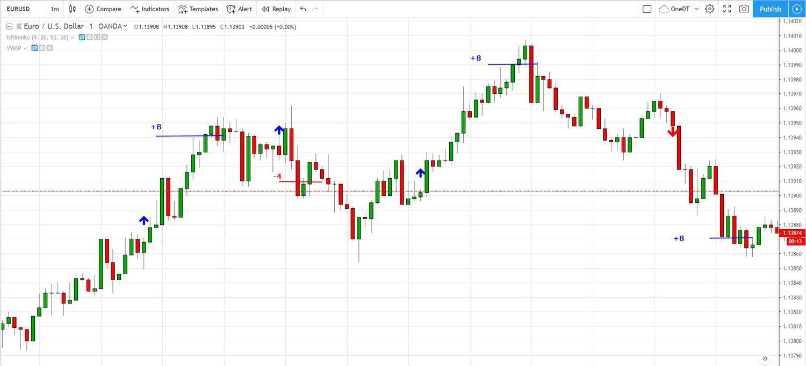

## Table of Contents

## What is Forex charting and why is it important for trading?

Forex charting is a way to show the price movements of different currencies over time using graphs and charts. These charts help traders see how currency pairs have moved in the past and can help them guess where the prices might go next. There are different types of charts, like line charts, bar charts, and candlestick charts, each showing the price in a different way. Traders use these charts to find patterns and trends that can help them make better trading decisions.

Charting is important for trading because it helps traders make smarter choices. By looking at the charts, traders can see if a currency is going up or down and decide when to buy or sell. Charts also show important levels where the price might change direction, which can help traders set their goals and limits. Without charts, trading would be like trying to find your way in the dark, making it much harder to make profitable trades.

## What are the basic types of Forex charts and how do they differ?

The basic types of Forex charts are line charts, bar charts, and candlestick charts. A line chart is the simplest type. It shows the closing prices of a currency pair over time, connected by a line. This chart is easy to read and gives a quick look at the general trend of the price. A bar chart shows more information than a line chart. Each bar represents a period of time and shows the opening price, the highest price, the lowest price, and the closing price. The top of the bar is the highest price, the bottom is the lowest price, and small ticks on the sides show the opening and closing prices.

Candlestick charts are similar to bar charts but are more popular among traders because they are easier to read. Each "candlestick" also represents a period of time and shows the opening, highest, lowest, and closing prices. The main part of the candlestick, called the "body," shows the opening and closing prices. If the body is filled or colored, it means the closing price was lower than the opening price. If it's empty or a different color, the closing price was higher. The thin lines above and below the body, called "wicks" or "shadows," show the highest and lowest prices during that time. Traders use these charts to see patterns that can help them decide when to buy or sell.

## How can beginners read and interpret Forex charts effectively?

For beginners, reading and interpreting Forex charts can seem hard at first, but it gets easier with practice. Start by [picking](/wiki/asset-class-picking) a simple chart type like a line chart. This chart shows the closing prices of a currency pair over time. Look at the line to see if it's going up or down. If it's going up, it means the price is rising, and if it's going down, the price is falling. This can help you see the general trend. Next, try using a candlestick chart, which gives more details. Each candlestick shows the opening, highest, lowest, and closing prices for a period of time. If the candlestick is filled or a darker color, it means the price closed lower than it opened. If it's empty or a lighter color, the price closed higher than it opened. The lines above and below the main part of the candlestick show the highest and lowest prices during that time.

To interpret these charts effectively, beginners should look for patterns and trends. For example, if you see a series of higher highs and higher lows on a candlestick chart, it might mean the price is in an uptrend. If you see lower highs and lower lows, it might mean the price is in a downtrend. Pay attention to support and resistance levels, which are prices where the currency tends to stop and change direction. These levels can help you decide when to buy or sell. Also, try to use different time frames, like daily or hourly charts, to get a better view of the market. The more you practice reading charts, the better you'll get at understanding what the price movements mean and making good trading decisions.

## What are the key technical indicators used in Forex charting?

Technical indicators are tools that help traders understand and predict price movements in Forex charts. Some common indicators include moving averages, which smooth out price data to show the trend over time. A simple moving average (SMA) calculates the average price over a set period, while an exponential moving average (EMA) gives more weight to recent prices. Traders often use moving averages to identify trends and potential reversal points. Another important indicator is the Relative Strength Index (RSI), which measures the speed and change of price movements. RSI values range from 0 to 100, and traders use it to see if a currency is overbought (above 70) or oversold (below 30), which can signal potential price corrections.

Other key indicators include the Moving Average Convergence Divergence (MACD), which shows the relationship between two moving averages of a currency's price. The MACD line is calculated by subtracting the 26-period EMA from the 12-period EMA. A signal line, which is a 9-period EMA of the MACD line, is then plotted on top of the MACD line. When the MACD line crosses above the signal line, it's a bullish signal, and when it crosses below, it's a bearish signal. The Bollinger Bands are also widely used; they consist of a middle band being an SMA and two outer bands that are standard deviations away from the middle band. These bands help traders identify whether prices are high or low on a relative basis, which can indicate potential breakouts or reversals. By understanding and using these indicators, traders can make more informed decisions based on the patterns and trends shown in Forex charts.

## How do candlestick patterns influence Forex trading decisions?

Candlestick patterns are important for Forex traders because they help show what might happen next with the price. Each candlestick on a chart shows the opening, highest, lowest, and closing prices for a time period. When these candlesticks make certain shapes or patterns, they can tell traders if the price might go up or down soon. For example, a "bullish engulfing" pattern happens when a small red candlestick is followed by a larger green one that covers it completely. This can mean that buyers are getting stronger and the price might go up. On the other hand, a "bearish engulfing" pattern is the opposite, with a small green candlestick followed by a larger red one, suggesting that sellers are taking over and the price might go down.

Traders use these patterns to decide when to buy or sell. If they see a bullish pattern like a "hammer," which has a small body and a long lower wick, they might think the price will start going up and decide to buy. If they see a bearish pattern like a "shooting star," with a small body and a long upper wick, they might think the price will start going down and decide to sell. By watching for these candlestick patterns, traders can make better guesses about future price movements and make smarter trading choices.

## What are the common time frames used in Forex charting and when should they be used?

In Forex charting, common time frames include the 1-minute, 5-minute, 15-minute, 1-hour, 4-hour, daily, and weekly charts. Each time frame shows how the price of a currency pair changes over a different length of time. Short time frames like 1-minute and 5-minute charts are good for traders who want to make quick trades and take advantage of small price changes. These are called scalpers. Medium time frames like 15-minute and 1-hour charts are useful for day traders who hold their trades for a few hours. Longer time frames like 4-hour, daily, and weekly charts are better for swing traders and long-term investors who want to see bigger trends and hold their trades for days or weeks.

Choosing the right time frame depends on your trading style and goals. If you want to make fast trades and focus on small price movements, then short time frames are best. They give you a lot of signals, but they can also be more confusing because the price can change a lot in a short time. If you want to understand bigger trends and are okay with holding your trades longer, then longer time frames are better. They give you fewer signals, but the signals are usually more reliable. Many traders also use multiple time frames to get a better view of the market. For example, they might use a daily chart to see the overall trend and a 1-hour chart to find good entry points for their trades.

## How can traders use support and resistance levels in Forex charting?

Support and resistance levels are important lines on Forex charts that traders use to make trading decisions. Support is a price level where a currency tends to stop falling and start going up again. It's like a floor that the price bounces off. Resistance is the opposite; it's a price level where a currency tends to stop rising and start going down again. It acts like a ceiling that the price hits and turns back from. Traders look at these levels to guess where the price might change direction. If the price gets close to a support level, traders might think it's a good time to buy because they expect the price to go up. If the price gets close to a resistance level, traders might think it's a good time to sell because they expect the price to go down.

Traders can use support and resistance levels in different ways. One way is to set their entry and [exit](/wiki/exit-strategy) points based on these levels. For example, a trader might buy a currency pair when the price reaches a support level, hoping to sell it later at a higher price. They might also set a stop-loss order just below the support level to limit their losses if the price keeps going down. Another way is to watch for breakouts. If the price breaks through a resistance level, it might mean that the price will keep going up, so traders might buy more. If the price breaks through a support level, it might mean that the price will keep going down, so traders might sell or short the currency. By paying attention to support and resistance levels, traders can make better trading decisions and manage their risks.

## What advanced charting tools are available for experienced Forex traders?

Experienced Forex traders often use advanced charting tools to get a deeper understanding of the market. One popular tool is the Fibonacci retracement, which helps traders find potential support and resistance levels based on the key Fibonacci ratios. Traders draw lines between major highs and lows on the chart, and the tool automatically shows levels like 23.6%, 38.2%, 50%, 61.8%, and 100%. These levels can help traders see where the price might stop and change direction. Another advanced tool is the Ichimoku Cloud, which gives a lot of information in one chart. It shows support and resistance, trend direction, and momentum all at once. The cloud itself can act as a support or resistance area, and traders look for price movements relative to the cloud to make trading decisions.

Another useful tool for experienced traders is the Elliot Wave Theory, which helps traders understand market cycles and predict future price movements. This theory says that prices move in waves, with five waves in the direction of the main trend and three waves in the opposite direction. By identifying these waves, traders can guess where the price might go next. Additionally, many traders use advanced indicators like the Average Directional Index (ADX) to measure the strength of a trend, or the Parabolic SAR to find potential reversal points. These tools can be combined with other indicators and chart patterns to create a more complete trading strategy. By using these advanced charting tools, experienced traders can make more informed decisions and improve their chances of success in the Forex market.

## How does volume analysis enhance Forex chart analysis?

Volume analysis helps Forex traders understand how strong a price move is. When a lot of people are trading a currency pair, it means the [volume](/wiki/volume-trading-strategy) is high. If the price goes up and the volume is also high, it shows that many traders believe the price will keep going up. This can make the price move stronger. On the other hand, if the price goes up but the volume is low, it might mean that not many people believe in the price move, and it could be weaker. By looking at volume, traders can see if a trend is likely to continue or if it might change direction soon.

Traders also use volume to find important levels on the chart. For example, if the price reaches a level where the volume was very high in the past, it might act as a strong support or resistance level. This is because many traders remember these levels and might buy or sell when the price gets close to them again. Volume can also help traders spot when a price [breakout](/wiki/breakout-trading) might be real or fake. If the price breaks through a level with high volume, it's more likely to keep moving in that direction. But if the breakout happens with low volume, it might not last long. By adding volume analysis to their chart reading, traders can make better guesses about future price moves and improve their trading decisions.

## What role do Fibonacci retracement levels play in Forex charting?

Fibonacci retracement levels help Forex traders find important places on a chart where the price might stop and change direction. These levels are based on special numbers called Fibonacci ratios, like 23.6%, 38.2%, 50%, 61.8%, and 100%. Traders draw lines between big highs and lows on the chart, and the tool shows these levels. When the price gets close to a Fibonacci level, it might act like a support or resistance, making the price bounce back up or down. This can help traders decide when to buy or sell a currency pair.

Traders use Fibonacci retracement levels to make better trading decisions. For example, if the price goes down and then starts to go back up, it might stop at a Fibonacci level before going higher. A trader might buy at this level, hoping the price will keep going up. If the price goes up and then starts to go back down, it might stop at a Fibonacci level before going lower. A trader might sell at this level, hoping the price will keep going down. By watching these levels, traders can find good places to enter and exit trades and improve their chances of making money.

## How can algorithmic trading be integrated with Forex charting?

Algorithmic trading can be integrated with Forex charting by using computer programs that follow rules based on what they see in the charts. These programs look at the price movements, patterns, and indicators on the charts to decide when to buy or sell a currency pair. For example, an algorithm might be set up to buy a currency when it reaches a certain support level on the chart and sell it when it reaches a resistance level. The program can also use technical indicators like moving averages or the RSI to make these decisions. By using charts, the algorithm can quickly analyze a lot of data and make trades without human emotions getting in the way.

Traders can set up their algorithms to work with different time frames on the charts, like hourly or daily, depending on their trading strategy. Some algorithms might look for short-term patterns on minute charts to make quick trades, while others might use daily charts to find longer-term trends. By combining [algorithmic trading](/wiki/algorithmic-trading) with Forex charting, traders can automate their strategies and take advantage of market movements 24 hours a day. This can help them make more consistent decisions and possibly improve their trading results.

## What are the latest trends and technologies in Forex charting functionality?

The latest trends in Forex charting include the use of [artificial intelligence](/wiki/ai-artificial-intelligence) (AI) and [machine learning](/wiki/machine-learning) to help traders make better decisions. These technologies can look at a lot of data quickly and find patterns that might be hard for people to see. For example, AI can analyze past price movements and predict what might happen next. This can help traders know when to buy or sell a currency pair. Some charting platforms now have AI tools that give traders tips and signals based on what the AI sees in the charts. This makes it easier for traders to use the latest technology without having to learn a lot about how it works.

Another big trend is the use of mobile apps for Forex charting. More and more traders are using their phones and tablets to check the markets and make trades. These apps have gotten better at showing charts and letting traders use technical indicators right on their devices. They also often have features like real-time alerts and the ability to trade from anywhere. This makes it easier for traders to keep an eye on the markets even when they're not at their computers. The combination of AI, machine learning, and mobile technology is making Forex charting more powerful and easier to use for traders of all levels.

## How can technical indicators be utilized?

Technical indicators are instrumental in [forex](/wiki/forex-system) trading, serving as mathematical tools that help traders analyze price movements and discern market trends. These indicators apply mathematical algorithms to price data patterns, aiming to provide objective trading signals.

Moving Averages (MA) are among the most widely used technical indicators. They are designed to smooth out price data, creating a single flowing line that makes it easier to identify trends. The two most common types of moving averages are the Simple Moving Average (SMA) and the Exponential Moving Average (EMA). The SMA is a straightforward calculation, computed as the average of a set number of closing prices. In contrast, the EMA gives more weight to recent prices, offering a more responsive reflection of current market conditions.

The Relative Strength Index (RSI) is a [momentum](/wiki/momentum) oscillator that measures the speed and change of price movements. It is calculated using the formula:

$$
\text{RSI} = 100 - \left(\frac{100}{1 + \frac{\text{Average Gain}}{\text{Average Loss}}}\right)
$$

With a range from 0 to 100, an RSI above 70 typically indicates an overbought condition, suggesting a potential sell signal, whereas an RSI below 30 points to an oversold condition, implying a possible buy signal.

The Moving Average Convergence Divergence (MACD) is another momentum indicator that follows trends and identifies potential buy and sell signals. It is obtained by subtracting the 26-period EMA from the 12-period EMA. A nine-day EMA, called the "signal line," is then plotted on top of the MACD line, which can indicate bullish and bearish market conditions. Traders often look for MACD crossover signals to determine entry or exit points: a bullish signal occurs when the MACD line crosses above the signal line, and a bearish signal when it crosses below.

Bollinger Bands are [volatility](/wiki/volatility-trading-strategies) indicators that consist of two lines plotted at standard deviations above and below a simple moving average of the price. These bands expand and contract based on market volatility. A key observation is that prices often tend to revert to the average, signaling potential trade opportunities when they approach the outer bands.

Each technical indicator offers unique insights, and traders can combine them to gain a more comprehensive view of market dynamics. Their strength lies in providing quantitative data that support a trader's decision-making process, augmenting the art of technical analysis with scientific precision.

## References & Further Reading

[1]: Bergstra, J., Bardenet, R., Bengio, Y., & Kégl, B. (2011). ["Algorithms for Hyper-Parameter Optimization."](https://dl.acm.org/doi/10.5555/2986459.2986743) Advances in Neural Information Processing Systems 24.

[2]: ["Advances in Financial Machine Learning"](https://www.amazon.com/Advances-Financial-Machine-Learning-Marcos/dp/1119482089) by Marcos Lopez de Prado

[3]: ["Evidence-Based Technical Analysis: Applying the Scientific Method and Statistical Inference to Trading Signals"](https://www.amazon.com/Evidence-Based-Technical-Analysis-Scientific-Statistical/dp/0470008741) by David Aronson

[4]: ["Machine Learning for Algorithmic Trading"](https://github.com/stefan-jansen/machine-learning-for-trading) by Stefan Jansen

[5]: ["Quantitative Trading: How to Build Your Own Algorithmic Trading Business"](https://www.amazon.com/Quantitative-Trading-Build-Algorithmic-Business/dp/1119800064) by Ernest P. Chan