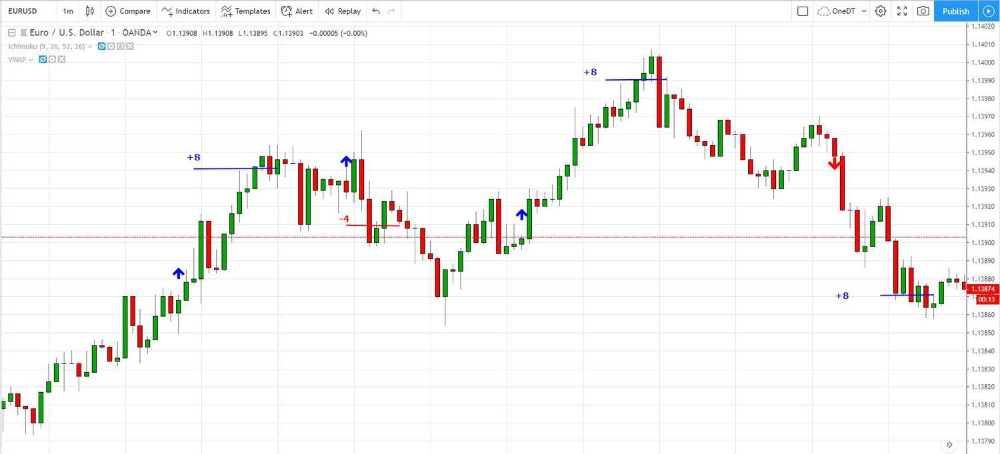

In the fast-paced world of Forex trading, charts and algorithmic strategies play a crucial role. In this article, we will explore different chart types, their applications in Forex trading, and their integration with algorithmic trading platforms. Charts and algorithms are indispensable tools that enable traders to make more informed decisions and automate their trading processes. 

Forex charts are graphical representations that depict currency pairs over a designated time period. These charts provide traders with essential insights into price movements, offering a visual representation that is fundamental for technical analysis. Technical analysis involves examining past market data to predict future market behaviors.



Understanding these chart types is vital, as they offer unique perspectives on price trends and trading opportunities. Among the popular chart types, line charts, bar charts, and candlestick charts each serve distinct purposes. Line charts are ideal for visualizing overall trends by connecting closing prices, while bar charts offer more detail by including open, high, low, and close prices (OHLC). Candlestick charts provide comprehensive details similar to bar charts but do so through visual 'candlesticks' that depict bullish or bearish trends.

These insights find their application within algorithmic trading, where predefined rules drive trading decisions through sophisticated computer algorithms. By integrating charts with technical indicators, such as moving averages or the Relative Strength Index (RSI), algorithmic systems can automate decisions, minimizing human error and emotional bias.

Recognizing the interplay between chart types and algorithmic trading is essential for traders. It not only enhances trading efficiency but also revolutionizes trading strategies and execution. With the evolving landscape of AI and machine learning, the potential for innovation and optimization in Forex trading strategies is immense. This exploration of charts and algorithmic trading lays a foundation for traders to enhance their trading approach, ensuring they remain adaptive and informed in a dynamically changing Forex market.

## Table of Contents

## Understanding Forex Charts

Forex charts are essential tools in the field of foreign exchange trading, providing graphical representations of currency pairs over a specified period. These charts encapsulate critical market data, showcasing price movements that traders analyze to predict future market behaviors. By visualizing historical price data, traders gain valuable insights into the potential directions of currency pairs, enabling more informed trading decisions.

Central to technical analysis, Forex charts serve as a foundation for strategies that analyze past market data to forecast future price movements. Technical analysis operates on the principle that historical price movements follow recurring patterns, which can be used to anticipate future trends. Traders observe the interactions between price levels, identifying support and resistance zones, and patterns like head and shoulders, triangles, and flags.

Various chart types are popular within Forex trading, each offering unique perspectives on price trends. Line charts, for example, are simple yet effective, representing the price history of a currency pair by connecting consecutive closing prices with a continuous line. This provides a clear overview of the overall trend, allowing traders to identify long-term directions without the distraction of market noise.

Bar charts add depth by displaying more detailed information, such as open, high, low, and close prices (OHLC) for each time interval. This detailed depiction aids traders in assessing price [volatility](/wiki/volatility-trading-strategies) and recognizing distinct price patterns. For instance, a longer bar might indicate greater volatility, while the position of the open and close prices reveals market sentiment during the specific period.

Candlestick charts further enhance the visual representation by depicting price movements through 'candlesticks.' Each candlestick represents a time interval and clearly distinguishes bullish (rising) and bearish (falling) trends. The shape and color of the candlestick provide insights into market sentiment, with patterns such as doji, hammers, and engulfing patterns being integral to traders' analysis.

The selection of a chart type often influences an investor's trading strategy, as different charts highlight distinct trends and price reversal patterns. A trader looking for long-term trends might prefer line charts for their simplicity and clarity, while someone focused on short-term price action might choose candlestick charts for their detailed visual cues. Thus, the appropriate chart type is contingent on individual trading goals and the specific level of detail required by the trader.

By understanding the various types of Forex charts and their capabilities, traders can enhance their technical analysis processes. This understanding facilitates the development of robust trading strategies that align with market trends, assisting traders in achieving more consistent and profitable results in the dynamic Forex market.

## Types of Forex Charts and Their Applications

In Forex trading, charts are invaluable tools that provide traders with a comprehensive view of market trends and price movements. The three most prevalent types of charts used in Forex trading are line charts, bar charts, and candlestick charts. Each type offers unique insights, catering to different trading preferences and strategies.

### Line Charts

Line charts are the simplest form of Forex charts, connecting the closing prices of a currency pair over a defined period. This type of chart is particularly advantageous for traders who wish to focus on overarching trends without getting bogged down in the minute details of the market. By filtering out the noise associated with price fluctuations during a trading session, line charts offer a clean, easily interpretable representation of price trends.

### Bar Charts

Bar charts provide more intricate details compared to line charts. Each bar encapsulates a specific time period and displays the opening, high, low, and closing prices (OHLC) for that interval. This allows traders to gauge both the price range and volatility within each period. By examining OHLC data, traders can identify patterns that may indicate potential price movements, making bar charts particularly useful for technical analysis. The inclusion of high and low prices further aids in interpreting market volatility and identifying possible entry or [exit](/wiki/exit-strategy) points.

### Candlestick Charts

Candlestick charts are one of the most favored chart types due to their visually intuitive representation of price action. Like bar charts, candlesticks show the open, high, low, and close prices. However, they have the added benefit of using color to denote bullish (price rise) or bearish (price fall) movements, offering immediate visual insights into market sentiment. The 'body' of the candlestick shows the range between the opening and closing prices, while the 'wicks' or 'tails' represent the high and low prices within the period. This format facilitates quick recognition of patterns and trends, such as bullish or bearish engulfing patterns, shooting stars, and hammers, which can signify potential turning points in the market.

### Application and Choice

Each chart type serves distinct trading needs, tailored to match specific trading goals and the detail required by traders. Line charts might be preferred for long-term analysis, where the focus is on identifying sustained trends. In contrast, bar and candlestick charts are better suited for traders who require detailed insights into daily price movements or wish to exploit shorter-term market shifts.

Deciding on the right chart type hinges on the trader’s objectives and the level of complexity they are comfortable with. A comprehensive trading strategy may integrate multiple chart types to leverage their respective strengths, thus enhancing a trader's ability to analyze the market effectively.

Incorporating these charts into trading practices allows Forex traders to harness the power of visual data analysis, enabling them to make well-informed trading decisions and adapt to prevailing market conditions.

## Application of Forex Charts in Algorithmic Trading

Algorithmic trading, often abbreviated as algo trading, represents a significant advancement in the world of Forex markets, allowing traders to execute trades with computer algorithms based on established criteria. These algorithms perform a pivotal role in analyzing Forex charts, which serve as the visual foundation for recognizing market trends and patterns. 

### Integration of Charts with Algorithms

Forex charts, encompassing line, bar, and candlestick charts, are integral to algo trading systems due to their ability to offer a visual representation of price data over specified periods. Algorithms utilize these charts to interpret trends and detect specific patterns, crucial for formulating trading strategies. The reliance on these visual data points allows for a more objective approach to trade execution, minimizing the subjective influence of human emotions and biases.

### Technical Indicators for Automated Decision-Making

For effective [algorithmic trading](/wiki/algorithmic-trading), integrating charts with various technical indicators is essential. Indicators such as moving averages, Bollinger Bands, and the Relative Strength Index (RSI) are commonly used alongside charts to automate trading decisions. For instance, a moving average can help identify the overall direction of the market, with algorithms programmed to buy when the price is above its moving average and sell when it is below. Bollinger Bands provide insight into market volatility, enabling algorithms to identify potential [breakout](/wiki/breakout-trading) points, while the RSI offers data on possible overbought or oversold conditions.

### Enhancing Strategies through Backtesting

The ability to backtest strategies using historical chart data is one of the key advantages of algorithmic trading. Backtesting involves applying an algorithm to historical data to evaluate how it would have performed in past markets. This process helps traders identify the robustness of their strategies before deploying them in live trading. Comprehensive chart data allows for thorough [backtesting](/wiki/backtesting), ensuring that strategies can be fine-tuned for optimal performance. It also provides a framework for continuous improvement, as algorithms can be adjusted based on backtesting results to enhance future trading outcomes.

In Python, backtesting can be implemented using libraries such as Backtrader, which facilitate the development and testing of trading strategies.

```python
import backtrader as bt

# Define the strategy
class MovingAverageCrossStrategy(bt.SignalStrategy):
    def __init__(self):
        self.dataclose = self.datas[0].close
        self.sma_fast = bt.ind.SMA(period=10)  # Fast moving average
        self.sma_slow = bt.ind.SMA(period=50)  # Slow moving average
        self.crossover = bt.ind.CrossOver(self.sma_fast, self.sma_slow)  # Crossover indicator

    def next(self):
        if self.crossover > 0:  # Buy signal
            self.buy()
        elif self.crossover < 0:  # Sell signal
            self.sell()

# Set up the backtesting environment
cerebro = bt.Cerebro()
cerebro.addstrategy(MovingAverageCrossStrategy)

# Load data
data = bt.feeds.YahooFinanceData(dataname='EURUSD=X',
                                 fromdate=datetime(2020, 1, 1),
                                 todate=datetime(2023, 1, 1))

cerebro.adddata(data)

# Run backtest
cerebro.run()
```

By leveraging such tools, traders can refine their strategies and ensure they are well-suited to current market conditions, thereby enhancing the efficiency and profitability of their trading operations.

## Building a Robust Algo Trading System with Charts

Successful algorithmic trading systems rely on a robust framework of well-defined rules and strategies. Charts play a critical role in this framework by providing the historical data needed to develop, test, and refine these strategies. This historical perspective allows traders to identify patterns and behaviors in the market that can be codified into algorithmic rules.

The selection of an appropriate trading platform and data feeds is essential for ensuring accurate and real-time analysis. High-quality data feeds offer precise charting information, allowing algorithms to react swiftly to market changes. Many platforms provide APIs for automated trading, which facilitate the integration of chart data with algorithmic strategies. Python, a popular language in the trading community, offers libraries like `pandas` and `numpy` for data manipulation, and `matplotlib` for data visualization, empowering traders to build sophisticated models.

Risk management is a crucial aspect of algorithmic trading, and charts are instrumental in setting effective stop-loss and take-profit levels. By analyzing past price movements and volatility through chart patterns, traders can determine appropriate risk thresholds. For example, the Atr (Average True Range) indicator can be used to set dynamic stop-loss levels based on recent market volatility:

```python
import pandas as pd

def calculate_atr(data, window=14):
    data['tr1'] = data['high'] - data['low']
    data['tr2'] = abs(data['high'] - data['close'].shift(1))
    data['tr3'] = abs(data['low'] - data['close'].shift(1))
    data['tr'] = data[['tr1', 'tr2', 'tr3']].max(axis=1)
    data['atr'] = data['tr'].rolling(window=window).mean()
    return data['atr']
```

Implementing and continuously monitoring these systems is crucial for adapting to market changes and ensuring profitability. Regular testing and optimization help in fine-tuning algorithms to align with current market conditions. Backtesting strategies using historical chart data is an essential step in this process, enabling traders to evaluate performance and adjust as needed. Continuous monitoring also helps in identifying any technical issues or market anomalies that could affect algorithm performance.

In conclusion, building a robust algo trading system with charts involves a combination of historical data analysis, platform and data feed selection, risk management, and continuous system monitoring. By leveraging these elements, traders can create reliable and effective algorithmic trading systems that are adaptable to evolving market dynamics.

## The Future of Forex Algorithmic Trading

The integration of [artificial intelligence](/wiki/ai-artificial-intelligence) (AI) and [machine learning](/wiki/machine-learning) (ML) is significantly enhancing the capabilities of algorithmic trading systems in the Forex market. These technologies empower traders with improved data analysis techniques, allowing for more sophisticated model building and a deeper understanding of market dynamics.

AI and ML algorithms can process vast amounts of data at unprecedented speeds, leading to improved predictive accuracy. For example, machine learning models can learn patterns from historical price data and other financial indicators to forecast future price movements. Common techniques include supervised learning algorithms such as linear regression, decision trees, and neural networks. These algorithms can be implemented in Python, which offers a range of libraries such as TensorFlow and Scikit-learn for building and training models.

Advanced data analytics and real-time market analysis are becoming increasingly accessible, thanks to the proliferation of easy-to-use tools and platforms. Traders can now harness the power of big data to analyze trends as they emerge, allowing quick adjustments to trading strategies. Real-time data feeds ensure that algo trading systems can react instantaneously to market changes, a crucial advantage in a fast-paced environment like Forex trading.

Future developments in algorithmic trading could include more sophisticated predictive models that incorporate natural language processing (NLP) to gauge market sentiment from news articles, social media, and other text-based sources. These models could enhance traditional quantitative analysis, providing a more holistic view of the market environment. Additionally, improved risk management features are anticipated, leveraging AI to dynamically adjust risk parameters in response to fluctuating market conditions.

To remain effective, traders must stay informed about technological advancements. Continuous learning and adaptation are crucial in an environment where strategies can quickly become obsolete. This might involve participating in online courses, attending conferences, or regularly updating and backtesting trading algorithms.

The potential for increased efficiency and profitability in Forex trading is vast, given these technological advancements. With the right application of charts, AI, and machine learning technologies, traders are better equipped than ever to optimize their trading operations, improve consistency in their returns, and capitalize on market opportunities. As these technologies continue to evolve, they will undoubtedly present even more innovative and lucrative possibilities for Forex trading.

## Conclusion

Understanding and utilizing different chart types is essential for both manual and algorithmic Forex trading. Forex charts provide critical insights into the market by displaying historical data through visual representations. This information is indispensable for devising effective trading strategies. The use of charts is not limited to visual analysis but extends to forming the backbone of algorithmic trading systems, which rely on clear data visualizations to make precise, rule-based decisions.

Algorithmic trading significantly enhances trading efficiency by integrating real-time chart data with automated systems. This integration allows for rapid analysis and execution of trades, minimizing the latency and human error that can occur with manual trading. The use of charts in these systems supports better forecasting and optimized trading strategies. For example, traders can implement Python scripts to analyze historical data and test strategies using libraries like pandas and matplotlib:

```python
import pandas as pd
import matplotlib.pyplot as plt

# Load Forex historical data
data = pd.read_csv('forex_data.csv', parse_dates=['Date'], index_col='Date')

# Plot moving average to identify trends
data['MA30'] = data['Close'].rolling(window=30).mean()
plt.plot(data['Close'], label='Close Price')
plt.plot(data['MA30'], label='30-Day Moving Average', linestyle='--')
plt.legend()
plt.show()
```

Traders who leverage these tools can achieve more consistent results by optimizing their entry and exit strategies. By understanding the nuances of each chart type, traders can select the most appropriate tools for their specific trading strategies, whether the focus is on identifying long-term trends or capturing short-term price movements.

As technology in Forex trading evolves, new opportunities arise, necessitating continuous adaptation and innovation from traders. Advances in artificial intelligence and machine learning are beginning to merge with trading strategies, offering more sophisticated models and predictive capabilities. Staying informed about these technological developments is crucial, as they promise to improve risk management and potential profitability.

In summary, the successful integration of Forex charts into both manual and automated trading systems offers a pathway to improved trading performance. By continuously refining their approaches in line with technological progress, traders can maintain a competitive edge in the dynamic Forex market.

## References & Further Reading

[1]: Bergstra, J., Bardenet, R., Bengio, Y., & Kégl, B. (2011). ["Algorithms for Hyper-Parameter Optimization."](https://dl.acm.org/doi/10.5555/2986459.2986743) Advances in Neural Information Processing Systems 24.

[2]: ["Advances in Financial Machine Learning"](https://www.amazon.com/Advances-Financial-Machine-Learning-Marcos/dp/1119482089) by Marcos Lopez de Prado

[3]: ["Evidence-Based Technical Analysis: Applying the Scientific Method and Statistical Inference to Trading Signals"](https://www.amazon.com/Evidence-Based-Technical-Analysis-Scientific-Statistical/dp/0470008741) by David Aronson

[4]: ["Machine Learning for Algorithmic Trading"](https://github.com/PacktPublishing/Machine-Learning-for-Algorithmic-Trading-Second-Edition) by Stefan Jansen

[5]: ["Quantitative Trading: How to Build Your Own Algorithmic Trading Business"](https://books.google.com/books/about/Quantitative_Trading.html?id=j70yEAAAQBAJ) by Ernest P. Chan