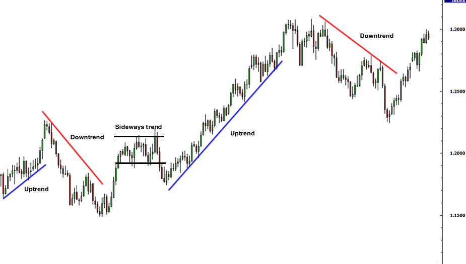

## Table of Contents

## What are Forex charts and why are they important in trading?

Forex charts are visual representations of currency price movements over time. They show how the value of one currency compared to another changes, which is important for people who trade currencies. Traders use these charts to see patterns and trends that can help them decide when to buy or sell a currency. The charts can be shown in different time frames, like minutes, hours, days, or even months, depending on what the trader needs.

These charts are very important in trading because they help traders make better decisions. By looking at the charts, traders can spot trends and predict where the price might go next. This can help them make money by buying low and selling high. Also, charts can show important levels where the price might change direction, which helps traders manage their risks. Without Forex charts, trading would be much harder and more like guessing, which is risky.

## What are the basic types of Forex charts?

There are three basic types of Forex charts that traders use: line charts, bar charts, and candlestick charts. Line charts are the simplest. They show the closing price of a currency pair over time, connected by a line. This type of chart is good for seeing the overall trend but doesn't show much detail about what happens during the trading period.

Bar charts give more information than line charts. Each bar on a bar chart shows the opening price, the highest price, the lowest price, and the closing price of a currency pair for a specific time period. The top of the bar is the highest price, the bottom is the lowest price, and small lines on the sides show the opening and closing prices. This helps traders see more about how the price moved during the time period.

Candlestick charts are similar to bar charts but are easier to read for many traders. Each "candlestick" shows the same information as a bar: the open, high, low, and close prices. The main part of the candlestick, called the body, shows the opening and closing prices. If the body is filled or a different color, it means the closing price was lower than the opening price. If it's empty or another color, it means the closing price was higher. The lines above and below the body, called wicks or shadows, show the highest and lowest prices. Candlestick charts are popular because they make it easy to see the price action at a glance.

## How do line charts work and what are their limitations?

Line charts are simple tools used in Forex trading to show how a currency's price changes over time. They are made by connecting the closing prices of a currency pair with a line. This line goes from left to right on the chart, with each point on the line showing the price at a specific time. Traders use line charts to see the big picture of how a currency's value is moving, like if it's going up, down, or staying the same over time.

But, line charts have some limits. They only show the closing prices, so they don't tell you what happened during the time period between those closing prices. This means you can't see the highest or lowest prices that the currency reached, which can be important for making trading decisions. Because of this, line charts are good for getting a quick look at trends but not so good for understanding all the details of price movements.

## What are bar charts and how do they differ from line charts?

Bar charts are another way to show how the price of a currency changes over time. Each bar on the chart shows four important prices: the highest price, the lowest price, the opening price, and the closing price for a certain time period. The top of the bar is the highest price, the bottom is the lowest price, and there are small lines on the sides of the bar. The line on the left side shows where the price started, which is the opening price, and the line on the right side shows where the price ended, which is the closing price. This makes bar charts more detailed than line charts because they show more information about what happened during each time period.

Bar charts are different from line charts because line charts only connect the closing prices with a line. This means line charts are simpler and only show the overall trend of the price going up or down. But, they don't show the highest and lowest prices or where the price started, which are things you can see on a bar chart. So, bar charts give traders more information to help them understand the price movements better, while line charts are good for a quick look at the overall trend.

## Can you explain candlestick charts and their significance in Forex trading?

Candlestick charts are a popular way to show how the price of a currency changes over time. Each "candlestick" on the chart shows four important prices: the highest price, the lowest price, the opening price, and the closing price for a certain time period. The main part of the candlestick, called the body, shows the opening and closing prices. If the body is filled or a different color, it means the closing price was lower than the opening price. If it's empty or another color, it means the closing price was higher. The lines above and below the body, called wicks or shadows, show the highest and lowest prices during that time. This makes candlestick charts easy to read because you can see a lot of information at a glance.

Candlestick charts are very important in Forex trading because they help traders see patterns and trends in the price movements. Traders look at these patterns to try to predict where the price might go next. For example, certain patterns, like "doji" or "hammer," can signal that the price might change direction soon. By understanding these patterns, traders can make better decisions about when to buy or sell a currency. This can help them make money and manage their risks better. So, candlestick charts are a powerful tool for anyone trading in the Forex market.

## What additional data can be included on Forex charts to enhance analysis?

Forex charts can be made more useful by adding extra information that helps traders understand the market better. One common thing to add is moving averages, which are lines that show the average price of a currency over a certain time. This helps traders see the overall trend more clearly and can show if the price is going up or down over time. Another thing traders often add is [volume](/wiki/volume-trading-strategy), which shows how many people are buying and selling the currency. High volume can mean that the price is more likely to keep moving in the same direction, while low volume might mean the price could change soon.

Indicators are also very helpful to add to Forex charts. These are tools that use math to help predict where the price might go next. Some popular indicators are the Relative Strength Index (RSI), which shows if a currency is overbought or oversold, and the Moving Average Convergence Divergence (MACD), which can show when the trend might change. By looking at these indicators, traders can get more clues about what might happen with the price. Adding these extra pieces of information to Forex charts can make it easier for traders to make smart decisions and understand the market better.

## How do traders use Forex charts to identify trends?

Traders use Forex charts to spot trends by looking at the overall direction of the price over time. They do this by drawing lines on the chart that connect the highs and lows of the price. If the line goes up, it means the price is going up, which is called an uptrend. If the line goes down, it means the price is going down, which is called a downtrend. Sometimes, the price moves sideways, which means there is no clear trend. By looking at these lines, traders can see if the trend is strong or weak and decide if they should buy or sell the currency.

To make it easier to see trends, traders often add moving averages to the charts. A moving average is a line that shows the average price over a certain time. If the price is above the moving average, it can mean the trend is up. If the price is below the moving average, it can mean the trend is down. Traders can use different time periods for moving averages, like 50 days or 200 days, to see both short-term and long-term trends. By comparing these moving averages, traders can get a better idea of where the price might go next and make better trading decisions.

## What are some common chart patterns traders look for in Forex charts?

Traders often look for certain patterns on Forex charts to help them predict where the price might go next. One common pattern is the "head and shoulders" pattern, which can show that a trend might be about to change direction. It looks like three peaks, with the middle peak being the highest (the head) and the other two peaks being lower (the shoulders). If this pattern appears after an uptrend, it can mean the price might start going down. Another pattern traders watch for is the "double top" or "double bottom." A double top looks like two peaks at about the same level and can signal that an uptrend is ending. A double bottom is the opposite, with two lows at the same level, suggesting that a downtrend might be over.

Other patterns traders pay attention to are the "triangle" patterns, which can be ascending, descending, or symmetrical. These patterns show that the price is moving in a smaller and smaller range, which can mean that a big move is coming soon. Ascending triangles have a flat top and an upward-sloping bottom, suggesting that the price might break out upwards. Descending triangles have a flat bottom and a downward-sloping top, hinting at a downward [breakout](/wiki/breakout-trading). Symmetrical triangles have both lines moving towards each other, and the breakout can go either way. By recognizing these patterns, traders can make better guesses about where the price might go and plan their trades accordingly.

## How can Forex charts be used to set entry and exit points in trading?

Forex charts help traders decide when to start and stop trading by showing them good times to buy and sell. Traders look for patterns and trends on the charts to find the best entry points. For example, if they see a "double bottom" pattern, it might mean the price is about to go up. So, they might decide to buy at the second bottom, hoping to make money as the price rises. They also use tools like moving averages to find the right time to enter a trade. If the price goes above a moving average, it can be a good sign to buy.

Once traders are in a trade, they use the charts to decide when to get out. They look for signs that the trend might be ending, like a "head and shoulders" pattern, which could mean the price is about to drop. If they see this, they might sell to avoid losing money. Traders also set stop-loss points, which are prices where they will automatically sell if the price goes down too much. By using Forex charts, traders can make smarter choices about when to start and stop trading, helping them make more money and lose less.

## What advanced technical indicators can be applied to Forex charts for deeper analysis?

Traders use advanced technical indicators on Forex charts to get a better understanding of the market. One popular indicator is the Relative Strength Index (RSI), which measures how fast and strong the price is moving. It tells traders if a currency is overbought, meaning the price might go down soon, or oversold, meaning the price might go up. Another useful indicator is the Moving Average Convergence Divergence (MACD), which helps traders see if the trend is getting stronger or weaker. It shows when it might be a good time to buy or sell by looking at the difference between two moving averages.

Another advanced indicator is the Bollinger Bands, which are lines drawn above and below the price on the chart. They show how much the price is moving around. When the price gets close to the top band, it might mean the price is too high and could go down. When it's near the bottom band, it might mean the price is too low and could go up. Traders also use the Fibonacci retracement levels, which are lines on the chart that show where the price might stop and turn around. These levels are based on a special number pattern and help traders find good places to enter or [exit](/wiki/exit-strategy) trades. By using these advanced indicators, traders can make more informed decisions and better predict what the market will do next.

## How do different time frames on Forex charts affect trading strategies?

Different time frames on Forex charts can change how traders make their plans. When traders look at short time frames, like minutes or hours, they are usually trying to make quick trades. They want to catch small changes in the price and make money fast. This kind of trading is called [scalping](/wiki/gamma-scalping) or [day trading](/wiki/day-trading-spy). It needs a lot of attention because the market can move quickly, and traders need to be ready to act right away. Short time frames can be good for people who like to trade a lot and can watch the market all the time.

On the other hand, when traders use longer time frames, like days or weeks, they are looking at bigger trends. They want to see how the price is moving over a longer time and make trades that last longer. This kind of trading is called swing trading or position trading. It doesn't need as much watching because the market moves slower over longer times. Traders using longer time frames can make fewer trades but might make more money from each one if they guess the big trends right. So, the time frame a trader chooses can change how they trade and what they need to do to be successful.

## What are the best practices for using Forex charts in algorithmic trading?

When using Forex charts for [algorithmic trading](/wiki/algorithmic-trading), it's important to keep things simple and clear. Start by choosing the right time frame for your trading strategy. If you're doing short-term trading, use shorter time frames like minutes or hours. For longer-term trading, use days or weeks. Then, pick a few key indicators like moving averages, RSI, or MACD that fit your strategy. Don't use too many indicators because that can make your trading plan confusing and hard to follow. Also, make sure your trading rules are clear and easy to understand so your computer can follow them without making mistakes.

Testing your trading plan is also a big part of using Forex charts in algorithmic trading. Before you start trading for real, use past data to see how well your plan would have worked. This is called [backtesting](/wiki/backtesting). It helps you find any problems and fix them before you lose money. Once you start trading, keep watching how well your plan is doing and be ready to make changes if things aren't working out. Remember, the market can change, so your plan might need to change too. By keeping your plan simple, clear, and well-tested, you can use Forex charts to make better trading decisions with your computer.

## References & Further Reading

[1]: Bergstra, J., Bardenet, R., Bengio, Y., & Kégl, B. (2011). ["Algorithms for Hyper-Parameter Optimization."](https://dl.acm.org/doi/10.5555/2986459.2986743) Advances in Neural Information Processing Systems 24.

[2]: ["Advances in Financial Machine Learning"](https://www.amazon.com/Advances-Financial-Machine-Learning-Marcos/dp/1119482089) by Marcos Lopez de Prado

[3]: ["Evidence-Based Technical Analysis: Applying the Scientific Method and Statistical Inference to Trading Signals"](https://www.amazon.com/Evidence-Based-Technical-Analysis-Scientific-Statistical/dp/0470008741) by David Aronson

[4]: ["Machine Learning for Algorithmic Trading"](https://github.com/PacktPublishing/Machine-Learning-for-Algorithmic-Trading-Second-Edition) by Stefan Jansen

[5]: ["Quantitative Trading: How to Build Your Own Algorithmic Trading Business"](https://books.google.com/books/about/Quantitative_Trading.html?id=j70yEAAAQBAJ) by Ernest P. Chan