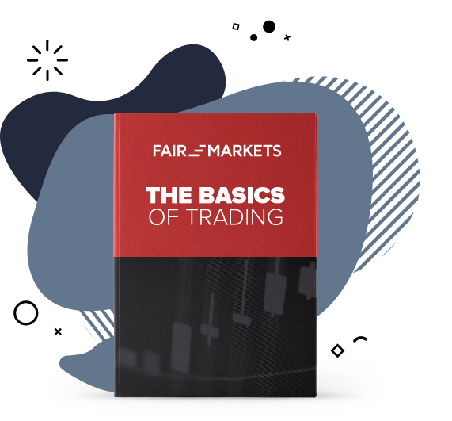

## Table of Contents

## What is Forex and why is it important for beginners to understand?

Forex, short for foreign exchange, is the global marketplace where people buy and sell different currencies. It's like a big market where you can trade dollars for euros, or yen for pounds, and so on. The main reason people trade in the Forex market is to make money from changes in currency values. For example, if you think the euro will become more valuable compared to the dollar, you might buy euros now and sell them later for more dollars.

Understanding Forex is important for beginners because it's the largest financial market in the world, with trillions of dollars traded every day. This means there are many opportunities to make money, but also many risks. If beginners learn about Forex, they can make better decisions about when to buy and sell currencies. They can also understand how global events, like elections or economic reports, can affect currency values. This knowledge helps them to trade more safely and potentially earn more money.

## How can a Forex e-book help someone new to trading?

A Forex e-book can be a great tool for someone new to trading because it explains the basics of the Forex market in an easy-to-understand way. It can teach you what Forex is, how it works, and why people trade currencies. The e-book might also include simple examples and stories to help you see how trading works in real life. This can make learning less confusing and more fun.

Additionally, a good Forex e-book can give you tips on how to start trading safely. It might talk about important things like how to manage your money, what to look out for when [picking](/wiki/asset-class-picking) a broker, and common mistakes to avoid. By reading an e-book, a beginner can feel more ready and confident to start trading, knowing they have a solid base of knowledge to help them make smart choices.

## What are the key components that should be included in a Forex e-book for beginners?

A Forex e-book for beginners should start by explaining what Forex is and how it works. It should describe the basics of currency trading, like how people buy and sell different currencies to make money. The e-book should also talk about the main terms and ideas that new traders need to know, like pips, lots, leverage, and margin. By understanding these basics, beginners can start to see how the Forex market fits together and what they need to focus on when they begin trading.

The e-book should also include practical advice on how to start trading. This means talking about how to choose a good broker, how to set up a trading account, and how to make a trading plan. It's important for the e-book to explain how to manage money wisely, so beginners don't risk losing too much. The e-book should also warn about common mistakes that new traders often make, like trading too much or not doing enough research. By covering these key components, a Forex e-book can help beginners feel more prepared and confident as they start their trading journey.

## What are the basic terms and concepts that a beginner should learn from a Forex e-book?

A Forex e-book should teach beginners about key terms like pips, lots, leverage, and margin. A pip is a small change in the value of a currency pair, and it's important because it helps traders see how much money they can make or lose. A lot is the standard amount of currency to trade, and it can be big or small depending on how much money you want to risk. Leverage lets you borrow money from your broker to trade more than you have, but it's risky because you can lose a lot if the market moves against you. Margin is the money you need to have in your account to keep your trades open, and it's important to understand so you don't get a margin call, which is when your broker asks for more money.

The e-book should also explain concepts like currency pairs, bid and ask prices, and spreads. A currency pair is two currencies that are traded against each other, like the euro and the dollar. The bid price is what you get when you sell a currency, and the ask price is what you pay when you buy it. The spread is the difference between these two prices, and it's how brokers make money. Understanding these terms and concepts will help beginners see how the Forex market works and make better decisions when they start trading.

## How does one choose the right Forex e-book for their learning level?

To choose the right Forex e-book for your learning level, start by figuring out how much you already know about trading. If you are completely new to Forex, look for e-[books](/wiki/algo-trading-books) that are labeled as "beginner-friendly" or "for beginners." These e-books will explain things in simple terms and won't assume you know a lot about trading. They will cover the basics like what Forex is, how it works, and important terms like pips and leverage. If you have some experience but want to learn more, look for e-books that say they are for "intermediate" or "advanced" learners. These will dive deeper into topics like trading strategies and risk management.

Next, read reviews and check the table of contents of the e-book. Reviews can tell you if other people found the e-book helpful and easy to understand. The table of contents will show you what topics the e-book covers, so you can see if it matches what you want to learn. If you're a beginner, you'll want an e-book that starts with the basics and builds up slowly. If you're more advanced, you'll want one that goes into more detail about trading techniques and market analysis. By taking these steps, you can pick an e-book that fits your learning level and helps you get better at Forex trading.

## What are some advanced strategies that can be found in Forex e-books for intermediate traders?

For intermediate traders, Forex e-books often introduce more complex trading strategies like [trend following](/wiki/trend-following) and range trading. Trend following is about spotting when a currency's value is going up or down over time and then trading in the same direction as the trend. For example, if the euro is getting stronger against the dollar, a trend follower would buy euros hoping to sell them later at a higher price. Range trading, on the other hand, is used when a currency's value stays within a certain range. Traders buy when the price is low and sell when it's high, making money from the ups and downs within that range.

Another advanced strategy covered in these e-books is the use of technical indicators like moving averages and the Relative Strength Index (RSI). Moving averages help traders see the overall direction of a currency's price by smoothing out short-term changes. For instance, if the 50-day moving average is above the 200-day moving average, it might be a good time to buy. The RSI measures how fast and how much a currency's price is changing, helping traders decide if a currency is overbought or oversold. By learning these strategies, intermediate traders can make more informed decisions and potentially increase their profits.

## How do Forex e-books address risk management and psychological aspects of trading?

Forex e-books often talk about risk management by teaching traders how to protect their money. They explain the importance of setting stop-loss orders, which are like safety nets that stop a trade if it's losing too much money. E-books also talk about not putting all your money into one trade, which is called diversification. They might suggest only risking a small part of your money on any single trade, like 1% or 2%. This way, even if you lose on a trade, you won't lose everything. By learning these risk management techniques, traders can feel more confident and less worried about losing all their money.

Psychological aspects of trading are also covered in Forex e-books because trading can be an emotional roller coaster. E-books often talk about the need to stay calm and stick to your trading plan, even when things don't go as expected. They might warn about common emotions like fear and greed, which can make traders make bad decisions. For example, if a trade is losing money, fear might make you sell too soon, or if a trade is winning, greed might make you hold on too long hoping for even more profit. By understanding these emotions, traders can learn to control them and make better decisions, leading to more successful trading in the long run.

## What role do Forex e-books play in teaching technical analysis and chart patterns?

Forex e-books are really helpful for teaching technical analysis and chart patterns. They explain how traders use charts to see where a currency's price might go next. Technical analysis is about looking at past prices and trying to guess future prices. E-books show beginners how to read different types of charts, like line charts, bar charts, and candlestick charts. They also explain important tools like moving averages and the Relative Strength Index (RSI), which help traders see trends and decide when to buy or sell.

These e-books also teach about chart patterns, which are shapes on a chart that can tell you something about what might happen next. For example, a "head and shoulders" pattern might mean the price is going to go down, while a "double bottom" might mean it's going to go up. By learning these patterns, traders can make better guesses about the market. E-books make this easier by giving lots of examples and pictures, so even beginners can understand and start using these patterns in their trading.

## Can Forex e-books provide insights into algorithmic trading and automated systems?

Forex e-books can definitely give you insights into [algorithmic trading](/wiki/algorithmic-trading) and automated systems. They explain how these systems work by using computer programs to trade currencies automatically. The e-books might talk about how these algorithms look at lots of data, like past prices and market news, to decide when to buy or sell. This can be really helpful for traders who want to trade without watching the market all the time. The e-books also cover important things like how to set up these systems and what to watch out for, so you can use them safely and effectively.

These e-books often go into details about different types of algorithms, like trend-following or mean-reversion strategies. They might show you how to build your own simple trading robot or how to use existing software. By reading these e-books, you can learn about the benefits of algorithmic trading, like faster trades and less emotion in decision-making. But they also warn about the risks, like technical problems or the need for constant updates to keep the system working well. Overall, Forex e-books are a great way to get started with understanding and using algorithmic trading and automated systems.

## How do expert-level Forex e-books differ from those aimed at beginners and intermediates?

Expert-level Forex e-books are different from those for beginners and intermediates because they go into much deeper detail about advanced trading strategies and techniques. While beginner e-books explain the basics like what Forex is and how to start trading, expert e-books focus on complex topics like high-frequency trading, advanced algorithmic systems, and sophisticated risk management strategies. They also discuss detailed market analysis methods, like using multiple time frames for trading and advanced chart pattern recognition, which are beyond the scope of basic or intermediate learning.

In addition, expert e-books often include case studies and real-world examples that show how top traders make decisions in different market conditions. They might also cover psychological aspects of trading at a deeper level, like how to maintain discipline and manage stress over long periods of trading. This is different from beginner and intermediate e-books, which might only touch on these topics briefly. Expert e-books aim to refine the skills of experienced traders, offering them the tools and knowledge needed to take their trading to the next level.

## What are the latest trends in Forex trading that are covered in up-to-date e-books?

Up-to-date Forex e-books often talk about the growing use of [artificial intelligence](/wiki/ai-artificial-intelligence) (AI) and [machine learning](/wiki/machine-learning) in trading. These technologies help traders make better decisions by quickly analyzing a lot of data. AI can find patterns that humans might miss and can even predict how prices might move in the future. Many traders are now using AI-powered tools to help them trade more effectively. These e-books explain how to use these tools and what to watch out for, so traders can stay ahead in the fast-changing Forex market.

Another trend covered in recent Forex e-books is the increased focus on social trading and copy trading. Social trading lets traders share their strategies and learn from each other through online platforms. Copy trading takes this a step further by allowing less experienced traders to automatically copy the trades of more successful traders. These e-books discuss how to choose the right people to follow and how to use these platforms safely. By understanding these trends, traders can use new tools and strategies to improve their trading and connect with a community of other traders.

## How can one evaluate the credibility and effectiveness of a Forex e-book?

To evaluate the credibility of a Forex e-book, start by looking at who wrote it. The author should have a good background in Forex trading and be well-known in the trading community. You can check their credentials and see if they have a history of successful trading or if they are respected experts. Also, read reviews from other people who have read the e-book. If many people say it helped them learn and trade better, it's a good sign. Look at the publication date too, because the Forex market changes a lot, and you want an e-book that has the latest information.

To check the effectiveness of a Forex e-book, see if it covers all the important topics you need to learn. A good e-book should explain the basics clearly, like what Forex is and how to start trading, but also go into more detail about strategies, risk management, and technical analysis. It should have examples and maybe even exercises to help you practice. The language should be easy to understand, especially if you're new to trading. Finally, try to apply what you learn from the e-book in a demo account to see if it really helps you make better trading decisions.

## References & Further Reading

[1]: Bergstra, J., Bardenet, R., Bengio, Y., & Kégl, B. (2011). ["Algorithms for Hyper-Parameter Optimization."](https://papers.nips.cc/paper/4443-algorithms-for-hyper-parameter-optimization) Advances in Neural Information Processing Systems 24.

[2]: ["Advances in Financial Machine Learning"](https://www.amazon.com/Advances-Financial-Machine-Learning-Marcos/dp/1119482089) by Marcos Lopez de Prado

[3]: ["Evidence-Based Technical Analysis: Applying the Scientific Method and Statistical Inference to Trading Signals"](https://www.amazon.com/Evidence-Based-Technical-Analysis-Scientific-Statistical/dp/0470008741) by David Aronson

[4]: ["Machine Learning for Algorithmic Trading"](https://github.com/stefan-jansen/machine-learning-for-trading) by Stefan Jansen

[5]: ["Quantitative Trading: How to Build Your Own Algorithmic Trading Business"](https://www.amazon.com/Quantitative-Trading-Build-Algorithmic-Business/dp/1119800064) by Ernest P. Chan