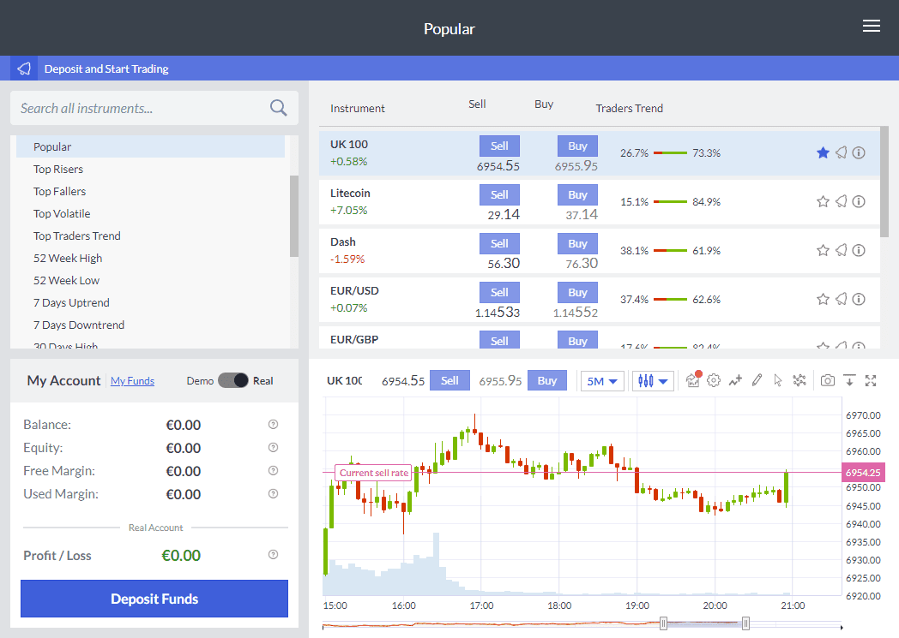

In today's fast-paced financial world, Forex trading has gained immense popularity due to its potential for profits and market liquidity. The Forex market, characterized by its high volatility and 24-hour trading cycle, requires traders to make quick, informed decisions. This environment has driven the development and adoption of forecasting software, essential tools that enable currency traders to predict market movements and make data-driven decisions.

Forecasting software is designed to analyze vast amounts of financial data, using sophisticated algorithms to identify trends and potential trading opportunities. By integrating technical and fundamental analysis, these tools provide traders with insights that are critical for developing successful trading strategies. The analytical capabilities of forecasting software mean that traders can better anticipate changes in currency prices, allowing them to enter and exit positions with increased confidence.

This article will explore the intricacies of forecasting software and other financial tools, such as algorithmic trading systems, used in the Forex market. We will discuss how these tools function, their advantages, and ways traders can harness their power for improved trading outcomes. Algorithmic trading, or "algo trading," automates the decision-making process, executing trades at speeds unattainable by human traders. By removing emotional bias, algorithmic systems ensure consistent strategy execution and can adapt to evolving market conditions more efficiently than manual trading methods.

Whether you're a novice trader or an experienced financial professional, understanding these technologies is vital for effective navigation of the Forex market. The evolving landscape of Forex trading technology offers significant opportunities, but also presents challenges and risks that require careful consideration and management. By comprehending how forecasting software and algorithmic trading systems enhance market analysis and decision-making processes, traders can gain a competitive edge and improve their chances of success in the dynamic world of Forex trading.

## Table of Contents

## Understanding Forex Forecasting Software

Forex forecasting software is a pivotal tool for currency traders, utilizing technical analysis to offer predictions about market trends. This technology employs various charts and indicators tailored to analyze currency pairs, aiding traders in pinpointing optimal entry and exit points within the market. 

Technical analysis involves studying historical market data, primarily price and volume, to forecast future price movements. Forex forecasting software automates this process, using advanced algorithms to sift through data and detect patterns indicative of future trends. One of the core elements of these systems is the integration of both technical and macroeconomic data. This provides a holistic view of market dynamics, incorporating economic indicators such as GDP growth rates, interest rates, and geopolitical developments alongside traditional chart patterns and indicators.

Suppliers of forecasting software offer diverse functionalities, catering to the varying needs of traders. Common technical indicators provided include moving averages, Bollinger Bands, and Fibonacci sequences. Each of these tools has its strengths:
- **Moving Averages**: These smooth out price data to create a single flowing line, making it easier to identify the direction of the trend.
- **Bollinger Bands**: These provide a visual representation of volatility and potential overbought or oversold conditions.
- **Fibonacci Sequences**: These are used to predict potential support and resistance levels based on mathematical relationships.

The underlying principle of these tools is statistical analysis. For instance, a simple moving average (SMA) can be calculated using the formula:

$$
\text{SMA} = \frac{\sum_{i=1}^{N} P_i}{N}
$$

where $P_i$ is the price at time $i$, and $N$ is the number of periods over which the average is calculated. Such calculations are automated in forecasting software, enabling quick data analysis and decision-making.

While forecasting software enhances the decision-making process, it's important to acknowledge its limitations. These tools are not foolproof; they are based on historical data and assumptions that may not hold under future market conditions. However, they significantly mitigate guesswork, empowering traders to base their strategies on data-driven insights rather than intuition alone.

In conclusion, Forex forecasting software is a vital resource for traders aiming to navigate market complexities effectively. By leveraging technical analysis and integrating comprehensive datasets, these platforms facilitate informed trading decisions, although they should be used judiciously alongside other market analysis techniques.

## Benefits of Algorithmic Trading in Forex

Algorithmic trading in Forex offers numerous advantages that streamline trading processes and enhance efficiency. One of the primary benefits is the automation of trading actions, which eliminates the influence of emotions and ensures adherence to predefined trading strategies. By using algorithms, traders can execute trades at speeds and frequencies far exceeding human capabilities, thereby maximizing their efficiency in capturing market opportunities.

Advanced [algorithmic trading](/wiki/algorithmic-trading) systems are equipped to continuously monitor market conditions and adjust strategies based on real-time data. This capability not only enhances the responsiveness of the trading process but also ensures that strategies remain aligned with dynamic market changes. These systems are designed to identify patterns and execute trades with precision, further optimizing trading outcomes.

Moreover, algorithmic trading offers significant risk management benefits. By implementing automated stop-loss and take-profit orders, traders can manage risks more effectively and ensure that potential losses are minimized. The ability to backtest trading strategies on historical data is another advantage, allowing traders to optimize their strategies and assess reliability before applying them in live markets. This process involves using historical data to simulate trades and evaluate the effectiveness of a given strategy, helping to identify potential weaknesses and areas for improvement.

However, the adoption of algorithmic trading is not without challenges. The complexity of developing and maintaining these systems often requires significant resources and expertise, presenting a barrier for novice traders or those with limited technical knowledge. The necessity for high-quality data feeds and robust technological infrastructure also adds to the resource requirements, underscoring the importance of ensuring that the strategy implementation matches the trader’s skill level and resources.

Overall, while algorithmic trading presents substantial benefits by increasing efficiency and providing robust risk management tools, understanding and navigating its complexities are crucial for successful implementation in the Forex market.

## Selecting the Right Forex Forecasting and Algo Trading Tools

Selecting the right Forex forecasting and algorithmic trading tools is an important task for traders and involves several key considerations. Software choices should align with a trader's specific strategies, the technical indicators they intend to use, and the data integration capabilities required. By carefully evaluating these factors, traders can optimize their trading efficiency and outcomes.

To begin with, traders should focus on choosing tools that complement their unique trading strategies. Each strategy may demand different technical indicators such as moving averages, Bollinger Bands, or RSI (Relative Strength Index). Therefore, selecting software that supports customizable and comprehensive indicator options is essential. For instance, a trader who relies heavily on technical analysis needs a platform that offers robust charting tools and the ability to overlay multiple analyses.

A critical aspect of selecting trading tools is the associated costs and whether these can be justified by the potential benefits. Some platforms charge subscription fees, while others may take a commission per trade. Analyzing cost structures along with projected trading [volume](/wiki/volume-trading-strategy) and potential returns can help determine if investing in a particular software is warranted. Traders should conduct a cost-benefit analysis, highlighting the expected improvement in trade accuracy, speed, or insights gained against the expenditure on software.

User experience is another pivotal consideration. Platforms that offer user-friendly interfaces are likely to facilitate quicker adaptation and more efficient trading operations. Ease of navigation and clear, intuitive design help traders focus on decision-making rather than grappling with complex software interfaces. Additionally, platforms offering robust customer and technical support can be extremely valuable, especially during the initial stages of usage or when troubleshooting issues.

Reliable real-time data feeds and seamless integration with existing trading setups are non-negotiable features in any decent forecasting and algorithmic trading tool. To ensure accurate and timely data processing, traders should verify the credibility of data sources and the tool's ability to integrate with APIs from leading financial data providers. This connectivity ensures that traders work with up-to-date and comprehensive information, critical for informed decision-making.

Many service providers offer demo accounts or trial periods, which allow traders to evaluate software efficacy before making any financial commitments. Taking advantage of these trials can provide insights into the tool's performance under real-world conditions, helping to identify any potential issues or limitations early on. Testing during a trial period also allows traders to assess the reliability and speed of trade execution facilitated by the software, which are critical components in fast-paced Forex markets.

In summary, selecting the right Forex forecasting and algorithmic trading tools involves a detailed assessment of strategy alignment, cost justification, user experience, data reliability, and platform integration. By weighing these factors and utilizing trial periods for assessment, traders can make informed decisions that enhance their trading activities.

## Challenges and Risks in Using Forex Forecasting Tools

Forex forecasting and algorithmic trading tools have become pivotal in modern trading strategies, offering significant advantages such as speed, efficiency, and automation. However, these technologies are not without their challenges and potential risks, which traders must carefully consider to optimize their usage and mitigate potential losses.

One of the primary challenges associated with these tools is their inherent lack of adaptability to rapidly changing market conditions. Forex markets are notoriously volatile, and unexpected geopolitical events, economic announcements, or sudden shifts in investor sentiment can lead to abrupt changes. Forecasting software, while sophisticated, is typically grounded in historical data and mathematical models, which might not capture the nuances of emergent market dynamics swiftly enough. Consequently, traders may encounter scenarios where the software's recommendations become outdated or irrelevant, potentially leading to suboptimal trading decisions.

Moreover, [backtesting](/wiki/backtesting), a crucial feature of most forecasting software, presents its own set of limitations. Backtesting involves the process of evaluating a trading strategy by testing it against historical market data to estimate its potential performance. While useful, backtesting does not provide guarantees for future success. This discrepancy arises because past market conditions, which the software uses as a benchmark, might not replicate future environments, particularly during periods of heightened [volatility](/wiki/volatility-trading-strategies) or unprecedented economic conditions.

Another risk is the potential over-reliance on automated systems, which might lead traders to neglect [fundamental analysis](/wiki/fundamental-analysis) and thorough market research. While algorithms can efficiently process and analyze massive datasets, human insight is still vital to account for qualitative factors such as political changes, regulatory adjustments, or shifts in market sentiment. An over-dependence on these tools can result in a narrowed perspective, where traders might overlook critical information not directly analyzed by the software.

To navigate these challenges effectively, proper education and continuous learning are crucial. Traders must not only understand the technical aspects of the tools they are using but also remain informed about the broader economic context and specific market forces that could impact their trades. Regularly updating their knowledge and adapting strategies to incorporate new data and insights can enhance the efficacy of these technologies.

In conclusion, while Forex forecasting and algorithmic trading tools offer significant advantages, they also come with intrinsic challenges that require careful consideration and management. Traders who balance these advanced tools with human judgment and continuous learning stand to gain the most in the ever-evolving Forex landscape.

## Conclusion

Forecasting software and algorithmic trading have transformed the landscape of Forex trading through their ability to process large volumes of data rapidly and make informed predictions about market trends. These technologies enable traders to utilize quantitative analysis, automate trading strategies, and make split-second decisions that can significantly affect trading outcomes. However, the benefits they bring must be carefully balanced with the inherent risks, emphasizing the need for diligent risk management.

The capabilities of forecasting and algorithmic tools provide traders with a competitive edge by offering them insights and efficiencies that manual trading cannot achieve. Understanding the complexities and functionalities of these technologies is essential for maximizing their potential benefits. Traders need to be aware of the limitations and ensure they are not overly reliant on these systems without considering fundamental market factors.

Looking to the future, advancements in AI and [machine learning](/wiki/machine-learning) hold the promise of significantly enhancing the effectiveness of trading software. These technologies can further refine predictive analytics, improve pattern recognition, and enable more adaptive decision-making processes. The integration of AI into trading strategies could lead to even greater efficiencies and insights, enhancing the ability of traders to anticipate and respond to market movements.

Ultimately, the most successful trading outcomes arise from a synergistic blend of human intuition and technological efficiency. While machines excel at processing data and executing trades at speed, human judgment remains crucial in interpreting broader economic indicators and contextualizing data-driven insights. By combining these strengths, traders can achieve robust and adaptable trading strategies that withstand the complexities and volatilities of the Forex market.

## References & Further Reading

[1]: Bergstra, J., Bardenet, R., Bengio, Y., & Kégl, B. (2011). ["Algorithms for Hyper-Parameter Optimization."](https://papers.nips.cc/paper/4443-algorithms-for-hyper-parameter-optimization) Advances in Neural Information Processing Systems 24.

[2]: ["Advances in Financial Machine Learning"](https://www.amazon.com/Advances-Financial-Machine-Learning-Marcos/dp/1119482089) by Marcos Lopez de Prado

[3]: ["Evidence-Based Technical Analysis: Applying the Scientific Method and Statistical Inference to Trading Signals"](https://www.amazon.com/Evidence-Based-Technical-Analysis-Scientific-Statistical/dp/0470008741) by David Aronson

[4]: ["Machine Learning for Algorithmic Trading"](https://github.com/stefan-jansen/machine-learning-for-trading) by Stefan Jansen

[5]: ["Quantitative Trading: How to Build Your Own Algorithmic Trading Business"](https://www.amazon.com/Quantitative-Trading-Build-Algorithmic-Business/dp/1119800064) by Ernest P. Chan