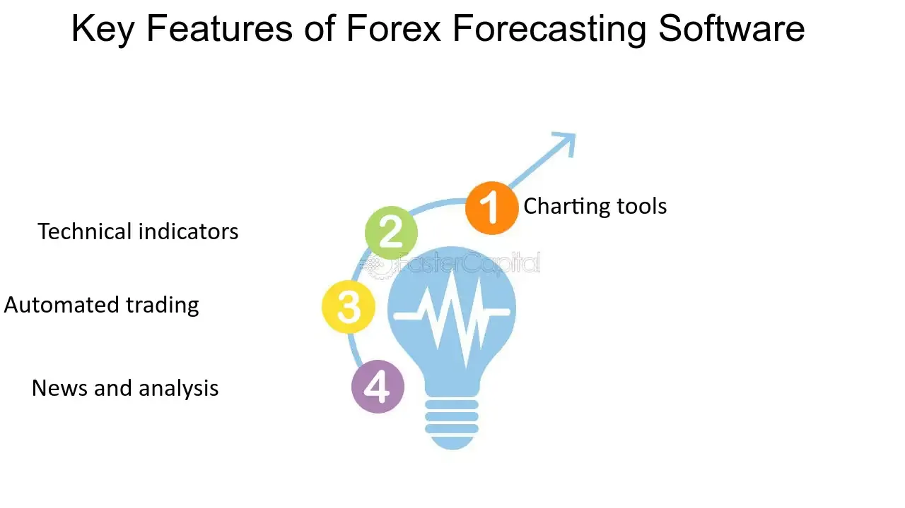

## Table of Contents

## What is Forex forecasting software?

Forex forecasting software is a tool that helps people who trade currencies predict how the exchange rates will change in the future. It uses different methods, like looking at past data and using math models, to guess what might happen next in the currency markets. This can be helpful for traders because it gives them an idea of when to buy or sell currencies to make a profit.

These software programs often include features like charts, graphs, and alerts that make it easier for traders to understand the market trends. Some programs use artificial intelligence and machine learning to improve their predictions over time. While no software can predict the future perfectly, using Forex forecasting software can give traders an advantage by providing them with better information and analysis.

## Why is Forex forecasting important for traders?

Forex forecasting is important for traders because it helps them make smart choices about when to buy or sell currencies. By predicting how exchange rates might change, traders can decide the best times to make their trades. This can lead to making more money or losing less money. Without forecasting, traders would be guessing, which is risky and can lead to big losses.

Also, Forex forecasting helps traders plan their strategies better. They can see patterns and trends that might not be obvious just by looking at the market day to day. This long-term view can help them set goals and manage their money more wisely. Good forecasting tools give traders the information they need to feel more confident and in control of their trading decisions.

## What are the basic features of Forex forecasting software?

Forex forecasting software has some basic features that help traders a lot. One main feature is the use of charts and graphs. These help traders see how currency prices have changed over time. By looking at these charts, traders can spot patterns and trends that can help them guess what might happen next. Another important feature is the use of technical indicators. These are tools that use math to predict how prices might move. Examples include moving averages and the Relative Strength Index (RSI). These indicators can help traders decide when to buy or sell.

Another key feature is real-time data and alerts. Forex markets change very quickly, so having up-to-date information is crucial. The software can send alerts to traders when certain conditions are met, like when a currency reaches a certain price. This helps traders act fast and not miss good trading opportunities. Lastly, many Forex forecasting software programs offer [backtesting](/wiki/backtesting). This lets traders test their trading strategies using past data to see how well they would have worked. This can help traders improve their strategies before using them in real trading.

## How does Forex forecasting software work?

Forex forecasting software works by using different methods to predict how currency exchange rates will change in the future. It looks at past data to find patterns and trends. The software uses math models and technical indicators like moving averages and the Relative Strength Index (RSI) to guess what might happen next. These tools help traders see how prices have moved in the past and use that information to make predictions. The software also uses real-time data to keep traders updated on what's happening in the market right now.

The software often includes features like charts and graphs to make it easier for traders to understand the market trends. It can send alerts to traders when certain conditions are met, like when a currency hits a specific price. This helps traders act quickly and not miss out on good trading opportunities. Some advanced software even uses [artificial intelligence](/wiki/ai-artificial-intelligence) and [machine learning](/wiki/machine-learning) to get better at predicting over time. By using all these tools, Forex forecasting software gives traders a better chance at making smart trading decisions and hopefully making more money.

## What are the different types of Forex forecasting methods used in software?

Forex forecasting software uses different methods to predict how currency exchange rates will change. One common method is technical analysis. This involves looking at past price data and using charts and technical indicators to find patterns and trends. Tools like moving averages, the Relative Strength Index (RSI), and Bollinger Bands help traders guess what might happen next. Another method is [fundamental analysis](/wiki/fundamental-analysis), which looks at economic news and events, like [interest rate](/wiki/interest-rate-trading-strategies) changes or employment reports, to predict how these might affect currency values. This method helps traders understand the bigger picture and make longer-term predictions.

Another type of forecasting method used in software is sentiment analysis. This involves looking at what traders and investors are feeling about the market. By analyzing things like news articles, social media posts, and market surveys, the software can guess if people are feeling positive or negative about certain currencies. This can help predict short-term movements in the market. Some advanced software also uses artificial intelligence and machine learning. These methods let the software learn from past data and improve its predictions over time. By combining all these methods, Forex forecasting software gives traders a better chance at making smart trading decisions.

## Can you explain the accuracy of Forex forecasting software?

The accuracy of Forex forecasting software can vary a lot. No software can predict the future perfectly because the Forex market is very unpredictable. Things like big news events, changes in government policies, or even natural disasters can make currency prices move in ways that are hard to guess. So, while Forex forecasting software can give traders useful information and help them make better guesses, it's not always right. The accuracy of the software depends on many things, like how good its math models are and how much data it uses.

Even though Forex forecasting software isn't perfect, it can still be very helpful. By using the software's predictions, traders can make smarter choices and maybe make more money than they would without it. The software can spot patterns and trends that are hard for people to see just by looking at the market. And because the software keeps learning and getting better, its predictions can become more accurate over time. So, while traders should not rely only on the software, it can be a useful tool to have in their trading toolbox.

## What are some popular Forex forecasting software tools available in the market?

There are several popular Forex forecasting software tools that traders use. One of them is MetaTrader 4 (MT4). It's very popular because it's easy to use and has many features like charts, indicators, and the ability to backtest trading strategies. Another popular tool is TradingView, which is great for looking at charts and sharing ideas with other traders. It also has a lot of technical indicators and can send alerts when certain conditions are met. Forex Tester is another tool that traders like because it lets them practice trading with historical data, which can help them improve their strategies before using real money.

Some other tools worth mentioning are eSignal and NinjaTrader. eSignal is known for its real-time data and powerful charting tools, which can help traders make quick decisions. NinjaTrader is also popular, especially among more experienced traders, because it offers advanced charting, backtesting, and automation features. All these tools use different methods like technical analysis, fundamental analysis, and sometimes even AI to help traders predict how currency prices might change. While no software can predict the future perfectly, using these tools can give traders a better chance at making smart trading decisions.

## How do you evaluate the effectiveness of Forex forecasting software?

Evaluating the effectiveness of Forex forecasting software involves looking at how well it helps traders predict currency exchange rates. One way to do this is by checking the software's accuracy over time. Traders can use backtesting, which means they run the software's predictions against historical data to see how often it gets things right. If the software often predicts correctly, it's considered more effective. Another way is to see if using the software leads to better trading results. If traders make more money or lose less money when they use the software, that's a good sign that it's working well.

It's also important to think about how easy the software is to use. If it's hard to understand or takes a long time to learn, it might not be very helpful even if it's accurate. Good software should be user-friendly and provide clear information that traders can act on quickly. Lastly, traders should look at what other people say about the software. Reviews and feedback from other users can give a good idea of how effective the software really is. By considering all these things, traders can decide if a Forex forecasting software tool is worth using.

## What advanced features should expert traders look for in Forex forecasting software?

Expert traders should look for Forex forecasting software that has advanced features like [algorithmic trading](/wiki/algorithmic-trading) and automation. This means the software can make trades automatically based on the predictions it makes. This can save time and help traders act quickly on the market's movements. Another important feature is the ability to customize indicators and strategies. Expert traders often have their own ways of predicting the market, so they need software that lets them set up their own rules and tools. The software should also support multiple time frames and data sources, so traders can look at the market from different angles and make more accurate predictions.

Another key feature for expert traders is advanced risk management tools. These tools help traders set limits on how much they can lose on a trade, which is very important for protecting their money. The software should also have real-time data feeds and fast execution speeds, so traders can get the most up-to-date information and make trades without delays. Lastly, expert traders should look for software that uses artificial intelligence and machine learning. These technologies can help the software learn from past data and improve its predictions over time, giving traders a better chance at making money in the Forex market.

## How can Forex forecasting software be integrated with other trading tools?

Forex forecasting software can be integrated with other trading tools to help traders make better decisions. One way to do this is by using the software with trading platforms like MetaTrader 4 or NinjaTrader. These platforms let traders see the software's predictions right on their trading screens. This makes it easier for traders to act on the predictions without having to switch between different programs. The software can also send alerts to the trading platform, so traders know when to buy or sell without missing any opportunities.

Another way to integrate Forex forecasting software is by using it with risk management tools. These tools help traders set limits on how much they can lose on a trade. By connecting the forecasting software to these tools, traders can make sure they are not taking too much risk based on the predictions. Some traders also use the software with charting and analysis tools like TradingView. This lets them combine the software's predictions with other market data and indicators, giving them a fuller picture of what might happen next in the market.

## What are the common challenges faced when using Forex forecasting software?

One common challenge when using Forex forecasting software is that it's not always accurate. The Forex market can be very unpredictable because of things like news events, government policies, and even natural disasters. These things can make currency prices move in unexpected ways, so even the best software can get it wrong sometimes. Traders need to remember that the software's predictions are just guesses, not guarantees. They should use the software as a helpful tool, but not rely on it completely.

Another challenge is that Forex forecasting software can be hard to use, especially for new traders. Some software has a lot of features and technical terms that can be confusing. It takes time to learn how to use the software well and understand what all the charts and indicators mean. Even if the software is accurate, it won't help if traders don't know how to use it properly. Traders should take the time to learn about the software and practice using it before they start trading with real money.

## How does machine learning and AI impact the development of Forex forecasting software?

Machine learning and AI are making Forex forecasting software better and smarter. They help the software learn from past data and find patterns that are hard for people to see. This means the software can make better guesses about how currency prices might change in the future. As the software keeps learning, its predictions can become more accurate over time. This is a big help for traders because it gives them a better chance at making money in the Forex market.

Using machine learning and AI also means the software can change and improve itself without needing people to update it all the time. The software can look at new data as it comes in and adjust its predictions based on what it learns. This makes the software more useful and reliable for traders. Even though no software can predict the future perfectly, machine learning and AI are making Forex forecasting software a more powerful tool for traders to use.

## What is Understanding Forex Forecasting Software?

Forex forecasting software is a pivotal tool for currency traders, utilizing technical analysis to offer predictions about market trends. This technology employs various charts and indicators tailored to analyze currency pairs, aiding traders in pinpointing optimal entry and [exit](/wiki/exit-strategy) points within the market. 

Technical analysis involves studying historical market data, primarily price and [volume](/wiki/volume-trading-strategy), to forecast future price movements. Forex forecasting software automates this process, using advanced algorithms to sift through data and detect patterns indicative of future trends. One of the core elements of these systems is the integration of both technical and macroeconomic data. This provides a holistic view of market dynamics, incorporating economic indicators such as GDP growth rates, interest rates, and geopolitical developments alongside traditional chart patterns and indicators.

Suppliers of forecasting software offer diverse functionalities, catering to the varying needs of traders. Common technical indicators provided include moving averages, Bollinger Bands, and Fibonacci sequences. Each of these tools has its strengths:
- **Moving Averages**: These smooth out price data to create a single flowing line, making it easier to identify the direction of the trend.
- **Bollinger Bands**: These provide a visual representation of volatility and potential overbought or oversold conditions.
- **Fibonacci Sequences**: These are used to predict potential support and resistance levels based on mathematical relationships.

The underlying principle of these tools is statistical analysis. For instance, a simple moving average (SMA) can be calculated using the formula:

$$
\text{SMA} = \frac{\sum_{i=1}^{N} P_i}{N}
$$

where $P_i$ is the price at time $i$, and $N$ is the number of periods over which the average is calculated. Such calculations are automated in forecasting software, enabling quick data analysis and decision-making.

While forecasting software enhances the decision-making process, it's important to acknowledge its limitations. These tools are not foolproof; they are based on historical data and assumptions that may not hold under future market conditions. However, they significantly mitigate guesswork, empowering traders to base their strategies on data-driven insights rather than intuition alone.

In conclusion, Forex forecasting software is a vital resource for traders aiming to navigate market complexities effectively. By leveraging technical analysis and integrating comprehensive datasets, these platforms facilitate informed trading decisions, although they should be used judiciously alongside other market analysis techniques.

## References & Further Reading

[1]: Bergstra, J., Bardenet, R., Bengio, Y., & Kégl, B. (2011). ["Algorithms for Hyper-Parameter Optimization."](https://papers.nips.cc/paper/4443-algorithms-for-hyper-parameter-optimization) Advances in Neural Information Processing Systems 24.

[2]: ["Advances in Financial Machine Learning"](https://www.amazon.com/Advances-Financial-Machine-Learning-Marcos/dp/1119482089) by Marcos Lopez de Prado

[3]: ["Evidence-Based Technical Analysis: Applying the Scientific Method and Statistical Inference to Trading Signals"](https://www.amazon.com/Evidence-Based-Technical-Analysis-Scientific-Statistical/dp/0470008741) by David Aronson

[4]: ["Machine Learning for Algorithmic Trading"](https://github.com/stefan-jansen/machine-learning-for-trading) by Stefan Jansen

[5]: ["Quantitative Trading: How to Build Your Own Algorithmic Trading Business"](https://www.amazon.com/Quantitative-Trading-Build-Algorithmic-Business/dp/1119800064) by Ernest P. Chan