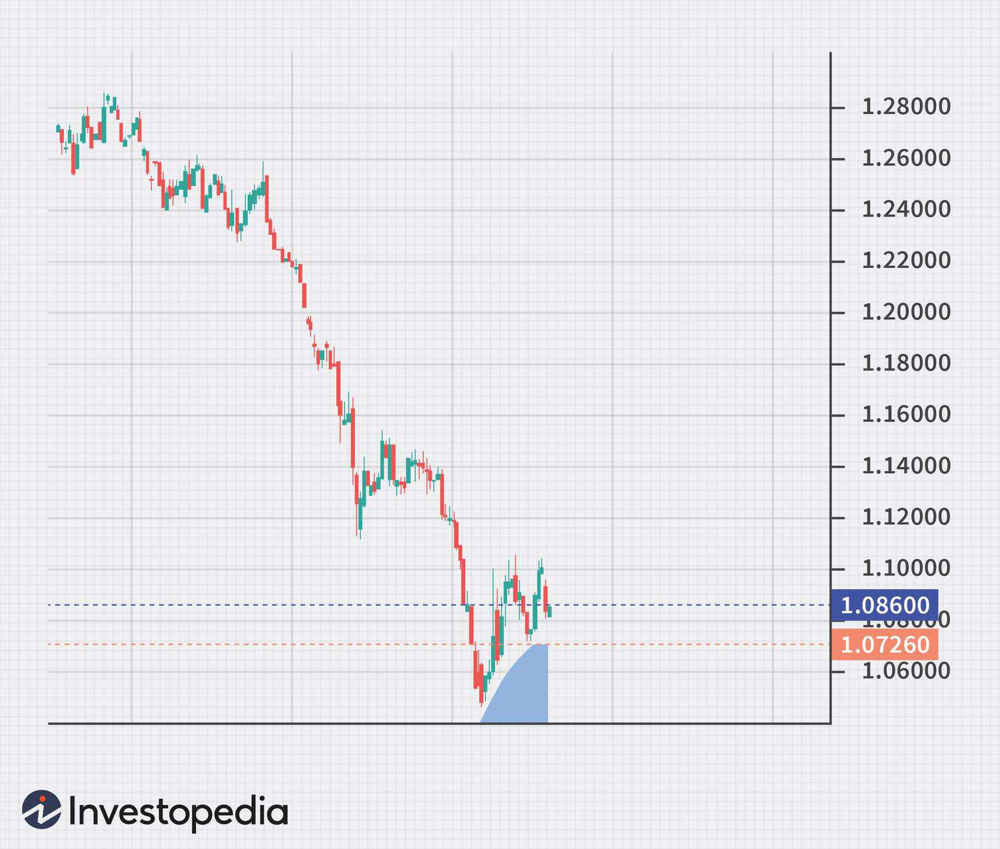

Currency trading is a prominent area within the financial sector, characterized by its rapid pace and dynamic nature. As the financial markets evolve, currency trading remains a focal point, garnering attention due to its potential for substantial returns and inherent volatility. The continuous development of trading methodologies, particularly the introduction and expansion of financial derivatives, has empowered traders with advanced tools to engage with currency markets more effectively.

One significant advancement in this field is the use of algorithmic trading, which incorporates computer algorithms to automate and execute trades based on predefined criteria. This method has revolutionized the trading landscape by enhancing the speed and precision of trade executions, while minimizing human error and emotional biases. Algorithmic trading now plays a crucial role in currency trading, influencing a large percentage of trades in the foreign exchange market.



Another critical component in the modern currency trading toolkit is forex futures. These are standardized contracts that enable traders to buy or sell a currency at a predetermined price on a specified future date. Forex futures offer a structured mechanism for hedging against currency risk and are instrumental for speculative purposes. Traded on established platforms such as the Chicago Mercantile Exchange (CME), these contracts bring a level of transparency and stability to the otherwise volatile forex market.

By gaining insights into forex futures and algorithmic trading, traders can enhance their strategies and improve market performance. Understanding these sophisticated tools allows for better navigation of the complexities of the financial markets, potentially leading to increased trading success.

## Table of Contents

## Understanding Currency Trading Financial Derivatives

Currency trading involves the exchange of different currencies in the foreign exchange market, a decentralized marketplace where participants trade currencies, typically for the purposes of facilitating international trade, investment, or speculation. This market operates globally on a 24-hour basis, driven by fluctuations in currency values due to economic, political, and environmental factors.

Financial derivatives are crucial instruments in currency trading. These derivatives derive their value from the underlying currency assets and come in various forms, including futures and options. They serve multiple purposes in trading strategies:

1. **Hedging Risks**: Derivatives are widely used to mitigate potential losses resulting from adverse currency movements. For instance, a business looking to protect itself from currency risk due to future payments in a foreign currency may enter into a futures contract to lock in an exchange rate.

2. **Speculation**: Traders often use derivatives to speculate on future currency price movements. This speculative activity can lead to significant profits if predictions about the currency directions are correct. 

3. **Enhancing Trading Strategies**: By employing derivatives, traders can implement complex trading strategies that might not be feasible in the spot market. Options, for example, provide opportunities for leveraging positions and managing market exposure in a non-linear payoff structure.

Futures and options are the most notable derivatives used in currency trading. Each has its own characteristics:

- **Futures Contracts**: These are standardized agreements traded on an exchange, requiring the exchange of a specific amount of currency at a future date for a price that is agreed upon at the time of the contract. The standardization provides a clear framework of rules, reducing counterparty risk.

- **Options Contracts**: Options give the buyer the right, but not the obligation, to buy or sell currency at a predetermined price within a specified time frame. This flexibility allows traders to tailor their risk management and speculative strategies.

The existence and use of financial derivatives in currency trading offer participants the tools to navigate the complexities and volatilities of the [forex](/wiki/forex-system) market effectively. These instruments, with their ability to be tailored to fit various risk profiles and strategic goals, have become indispensable in modern financial trading.

## Forex Futures Explained

Forex futures are a type of financial derivative that represent standardized contracts, obligating the exchange of specific currency amounts at a future date and predetermined price. These contracts are traded on regulated exchanges, such as the Chicago Mercantile Exchange (CME), providing a formalized trading environment. Forex futures offer significant advantages for both hedging purposes and speculative opportunities.

As a tool for hedging, forex futures allow businesses and investors to mitigate risk associated with currency fluctuations. For instance, a U.S.-based company expecting a future payment in euros can lock in a specific exchange rate, protecting its revenue stream from adverse currency movements. This form of risk management is essential for firms operating in multiple currency zones, and for financial institutions managing foreign exchange exposure.

From a speculative perspective, traders utilize forex futures to capitalize on anticipated currency movements without directly holding the physical currency. Investors might predict currency appreciation and take a long position in a futures contract, aiming to profit from such movements. Conversely, those anticipating depreciation may short the futures contract to benefit from falling prices. The standardized nature of these contracts, including set expiration dates and contract sizes, introduces a level of predictability that can aid in strategy formulation.

Trade execution in this domain frequently occurs in a structured manner through platforms like CME’s Globex. The exchange ensures compliance with set regulations and contract specifications, such as contract size (e.g., the euro/U.S. dollar forex futures contract has a standard size of €125,000). This standardization ensures [liquidity](/wiki/liquidity-risk-premium), market transparency, and fair pricing, crucial attributes for successful trading strategies.

In summary, forex futures play an essential role in the financial ecosystem, offering sophisticated tools for hedging and speculative operations. The structured trading environment afforded by regulated exchanges ensures that these derivatives remain an accessible and valuable part of currency trading.

## The Rise of Algorithmic Trading in Forex

Algorithmic trading, commonly referred to as algo trading, has revolutionized the forex market by automating the execution of trades based on pre-defined strategies and rules. This method leverages advanced algorithms to analyze vast amounts of data, identify trading opportunities, and execute orders with remarkable speed and precision. One of the most compelling advantages of [algorithmic trading](/wiki/algorithmic-trading) is its ability to eliminate human emotional biases. Traditional trading decisions can often be influenced by fear, greed, or other emotional factors that lead to inefficiencies. By relying on algorithms, traders ensure that decisions are made based on data and logic rather than emotion.

The prevalence of algorithmic trading in the forex market is significant, with approximately 92% of forex trades now executed by algorithms. This widespread adoption underscores the effectiveness and efficiency that algo trading provides. The underlying technology involves complex models and quantitative analysis, capable of operating 24/7, which is crucial in the global forex market that never sleeps.

Algo trading offers traders several distinct advantages:
1. **Speed**: Algorithms can process high volumes of data and execute trades faster than a human trader ever could. This speed is especially crucial in markets like forex, where currency prices can fluctuate rapidly.
2. **Precision**: Precise entry and exit points can be established using algorithms, ensuring trades are executed at optimal moments.
3. **Backtesting**: Strategies can be backtested using historical market data. This allows traders to validate the viability and effectiveness of their strategies before actual execution.
4. **Diversity of Strategies**: Algorithms can be designed to execute various trading strategies, including trend following, arbitrage, and scalping. This flexibility enables traders to adapt to different market conditions.

As the technology behind algorithmic trading continues to evolve, it becomes increasingly sophisticated, often incorporating elements of [machine learning](/wiki/machine-learning) and [artificial intelligence](/wiki/ai-artificial-intelligence). These advancements enable algorithms to refine their strategies over time, learning from past trading data to improve future performance.

The current dominance of algorithmic trading in the forex market is a testament to its success in providing traders with a competitive edge. However, traders must understand that the development and maintenance of trading algorithms require a solid understanding of both coding and financial markets. Additionally, thorough testing and continual refinement are essential to address challenges such as market [volatility](/wiki/volatility-trading-strategies) and overfitting.

## Benefits of Algorithmic Trading in Currency Markets

Algorithmic trading in currency markets offers multiple benefits that enhance trading efficiency and effectiveness. The automation of trade execution enables rapid decision-making, which is crucial in the fast-paced environment of the forex market. Algorithmic trading eliminates human biases by employing pre-defined rules and strategies, ensuring consistency and precision in trading activities.

Various trading strategies can be implemented using algorithmic trading. Trend following, for instance, involves identifying and capitalizing on persistent movements in currency prices. Arbitrage strategies exploit price discrepancies in different markets, while [scalping](/wiki/gamma-scalping) focuses on executing numerous trades within short time frames to profit from small price changes. Each strategy can be tailored to a trader's specific objectives, offering a personalized approach to trading.

A significant advantage of algorithmic trading is the ability to backtest and optimize strategies using historical data. Traders can evaluate the potential success of their trading algorithms by running them against past market data, refining their strategies for improved accuracy and effectiveness. This process involves using statistical measures and criteria to assess strategy performance, such as the Sharpe ratio or maximum drawdown, which help quantify risk-adjusted returns. By continuously refining algorithms based on [backtesting](/wiki/backtesting) results, traders can enhance their strategies' robustness and adapt to evolving market conditions.

```python
# Example: Backtesting a simple moving average crossover strategy in Python
import pandas as pd

# Load historical forex data
data = pd.read_csv('historical_data.csv', parse_dates=True, index_col=0)

# Define moving averages
data['SMA50'] = data['Close'].rolling(window=50).mean()
data['SMA200'] = data['Close'].rolling(window=200).mean()

# Generate trading signals: 1 for buy, -1 for sell
data['Signal'] = 0
data['Signal'][data['SMA50'] > data['SMA200']] = 1
data['Signal'][data['SMA50'] < data['SMA200']] = -1

# Calculate returns
data['Return'] = data['Close'].pct_change().shift(-1)
data['StrategyReturn'] = data['Signal'] * data['Return']

# Summarize performance
performance = data['StrategyReturn'].cumsum().iloc[-1]
print(f"Strategy Cumulative Return: {performance:.2%}")
```

In addition to enhancing decision-making and execution speed, algorithmic trading facilitates the continuous refinement of trading strategies. By leveraging powerful computing capabilities and extensive datasets, traders can gain a competitive edge, increasing their potential for successful outcomes in currency markets.

## Challenges and Risks of Algorithmic Forex Trading

Algorithmic forex trading, while offering significant advantages, presents a range of challenges and risks that traders must navigate. One of the foremost challenges arises from market volatility. Forex markets can experience rapid and unpredictable price movements due to geopolitical events, economic data releases, or sudden shifts in market sentiment. Algorithms, designed based on historical data and pre-defined rules, may struggle to adapt to such unforeseen events, leading to unexpected trading outcomes.

Another significant risk is overfitting. Overfitting occurs when trading strategies are excessively tailored to past data, capturing noise rather than underlying market patterns. Although these strategies may perform well during backtesting, they often fail to translate those results into actual market conditions. Addressing overfitting requires rigorous testing, including out-of-sample testing and cross-validation, to ensure that algorithms remain robust across different market scenarios. Traders can implement statistical techniques, such as regularization, to mitigate overfitting and enhance the generalization of their models.

Additionally, technical challenges might arise from the algorithmic infrastructure itself. High-frequency trading relies on advanced technology that requires substantial investment in both hardware and software. Any latency or failure within this infrastructure can adversely affect trading performance. Ensuring system reliability and speed involves continuous maintenance and upgrades, alongside a robust risk management framework.

Regulatory compliance is another area requiring attention. As regulators increasingly scrutinize algorithmic trading, ensuring adherence to evolving compliance standards becomes crucial. Non-compliance can result in penalties or trading restrictions, impacting profitability and operational continuity.

In summary, while algorithmic trading offers increased efficiency and the potential for higher returns, it demands careful risk management and strategy validation. Traders should continuously refine their algorithms to adapt to the dynamic and often unpredictable nature of forex markets.

## How to Get Started with Algorithmic Trading

To begin with algorithmic trading in the forex markets, a foundational understanding of both forex market dynamics and programming is crucial. This involves familiarity with the mechanics of currency price movements, economic indicators, and geopolitical events that influence the forex markets. Additionally, traders should be comfortable with basic coding skills, particularly in languages such as Python, which is widely used for developing and implementing trading algorithms due to its robust libraries and ease of use.

For those not well-versed in coding, no-code trading platforms provide an alternative, enabling users to automate trades using visual interfaces without diving into the complexities of programming. These platforms offer tools to design trading strategies with drag-and-drop features, facilitating a broader audience to partake in algorithmic trading.

Choosing a dependable broker that supports algorithmic trading is critical. Traders should evaluate brokers based on key factors such as execution speed, transaction costs, and the availability of API access, which is necessary for executing algorithmic strategies. Brokers should also offer reliable trading platforms that support real-time data feeds and backtesting capabilities.

Continuous education and staying informed about market trends are vital for maintaining and improving the performance of trading algorithms. This includes regularly updating strategies based on new market data, testing them rigorously across different market conditions, and learning from both successful and unsuccessful trades. Engaging with trading communities and accessing educational resources can further enhance a trader's knowledge and adaptability.

Traders might engage in practices such as backtesting, where they simulate the performance of a trading strategy using historical data to evaluate its potential effectiveness before deploying it in live markets. This helps in identifying potential flaws or adjustments needed in the algorithm.

Here is a simple example in Python illustrating how a trader might simulate a basic moving average crossover strategy using historical forex data:

```python
import pandas as pd

# Load historical forex data
data = pd.read_csv('forex_data.csv')

# Calculate moving averages
data['SMA_50'] = data['Close'].rolling(window=50).mean()
data['SMA_200'] = data['Close'].rolling(window=200).mean()

# Generate trading signals
data['Signal'] = 0
data['Signal'][50:] = np.where(data['SMA_50'][50:] > data['SMA_200'][50:], 1, -1)

# Calculate daily returns
data['Daily_Return'] = data['Close'].pct_change()

# Calculate strategy returns
data['Strategy_Return'] = data['Signal'].shift(1) * data['Daily_Return']

# Plot strategy performance
data['Cumulative_Strategy_Returns'] = (1 + data['Strategy_Return']).cumprod()
data[['Close', 'Cumulative_Strategy_Returns']].plot(figsize=(10, 5))
plt.title('Moving Average Crossover Strategy')
plt.show()
```

The code above demonstrates how to compute two simple moving averages and generate buy/sell signals based on their crossover points. This systematic approach replaces emotional decision-making with predefined criteria. Backtesting this strategy provides insights into its viability under various historical market conditions, enabling traders to tweak parameters to optimize performance before committing real capital.

Ultimately, the success in algorithmic trading depends on the balance between theoretical knowledge, practical experience, and the ability to adapt strategies in response to evolving market dynamics.

## Conclusion

Currency trading, particularly through derivatives like forex futures and algorithmic trading, presents significant opportunities for both individual and institutional investors. Embracing these advanced trading techniques requires a commitment to ongoing education and adaptability. Traders who invest time in understanding the intricacies of these instruments and the strategies for their effective use can position themselves for success in the competitive forex market.

Nevertheless, it is essential to remain vigilant regarding the inherent risks involved. Market conditions are continually evolving, and strategies that are effective today may not be tomorrow. Continuous refinement of trading strategies is crucial to maintain alignment with current market dynamics. This involves a combination of staying informed about market developments, backtesting strategies with historical data, and applying rigorous risk management practices.

Moreover, as technological advancements continue to shape the landscape of forex trading, keeping up with these trends can provide a competitive edge. This could involve leveraging machine learning techniques to improve algorithmic trading models, or using real-time data analytics to gain deeper insights into market movements.

To summarize, while the potential rewards of currency trading through derivatives and algorithmic approaches are enticing, success in this field demands dedication, discipline, and a proactive approach to learning and risk management.

## Frequently Asked Questions

### What are forex futures and how do they differ from spot forex trading?

Forex futures are standardized financial contracts obligating the currency exchange at a specified future date and price. These contracts are traded on centralized exchanges like the Chicago Mercantile Exchange (CME). Key characteristics of forex futures include standardized contract sizes, centralized trading, and regulated environments, which provide transparency and reduce counterparty risks. For instance, a forex futures contract might stipulate exchanging 100,000 British pounds for U.S. dollars at a rate of 1.3000, three months from the contract date.

In contrast, spot forex trading involves the direct exchange of currencies at current market rates, often settled within two business days. The spot market operates over-the-counter (OTC), providing greater flexibility and a wider variety of currency pairs but with more counterparty risk compared to futures contracts. 

### How does algorithmic trading work, and what are its key advantages?

Algorithmic trading utilizes computer algorithms to execute trades based on pre-defined criteria, such as timing, price, or [volume](/wiki/volume-trading-strategy). The automation offered by this method enables traders to process vast amounts of data quickly, execute trades at optimal prices, and reduce the impact of human emotional biases.

Key advantages of algorithmic trading include:

1. **Speed and Efficiency**: Algorithms can instantly analyze market data and execute orders in a fraction of a second, crucial in the fast-paced forex market.

2. **Precision**: Defining strict parameters can minimize errors associated with manual trading.

3. **Backtesting Capabilities**: Traders can test their strategies on historical data to evaluate their effectiveness before deploying them in live markets.

4. **Diversification**: Algorithms can simultaneously manage multiple trading accounts or portfolios, providing better diversification strategies.

Here is a simple Python code snippet that illustrates an algorithmic trading strategy using a moving average crossover:

```python
def moving_average(prices, window):
    return sum(prices[-window:]) / window

def execute_trade(prices, short_window, long_window):
    short_ma = moving_average(prices, short_window)
    long_ma = moving_average(prices, long_window)

    if short_ma > long_ma:
        return "Buy"
    elif short_ma < long_ma:
        return "Sell"
    else:
        return "Hold"

prices = [1.15, 1.17, 1.14, 1.18, 1.19, 1.21, 1.20]
trade_decision = execute_trade(prices, short_window=3, long_window=5)
print(trade_decision)  # Output: Buy
```

### What are common pitfalls in algorithmic trading, and how can they be mitigated?

Despite its numerous advantages, algorithmic trading presents several challenges and risks:

1. **Market Volatility**: Algorithms might struggle with unexpected price movements, leading to losses in highly volatile conditions.

   *Mitigation*: Implementing risk management tools such as stop-loss orders and volatility filters can minimize potential downsides.

2. **Overfitting**: Strategies that perform well on backtested data might fail in live markets due to market condition changes.

   *Mitigation*: Apply strategies across different time frames and market conditions in out-of-sample testing to ensure robustness.

3. **Technical Failures**: Algorithm trading systems can suffer from bugs, connectivity issues, and hardware failures.

   *Mitigation*: Regularly test and update the algorithms, maintain comprehensive monitoring systems, and have fail-safes and back-up systems in place.

By remaining vigilant about these pitfalls, traders can mitigate risks and make the most of algorithmic trading's potential.

## References & Further Reading

[1]: Bergstra, J., Bardenet, R., Bengio, Y., & Kégl, B. (2011). ["Algorithms for Hyper-Parameter Optimization."](https://dl.acm.org/doi/10.5555/2986459.2986743) Advances in Neural Information Processing Systems 24.

[2]: ["Advances in Financial Machine Learning"](https://www.amazon.com/Advances-Financial-Machine-Learning-Marcos/dp/1119482089) by Marcos Lopez de Prado

[3]: ["Evidence-Based Technical Analysis: Applying the Scientific Method and Statistical Inference to Trading Signals"](https://www.amazon.com/Evidence-Based-Technical-Analysis-Scientific-Statistical/dp/0470008741) by David Aronson

[4]: ["Machine Learning for Algorithmic Trading"](https://github.com/stefan-jansen/machine-learning-for-trading) by Stefan Jansen

[5]: ["Quantitative Trading: How to Build Your Own Algorithmic Trading Business"](https://www.amazon.com/Quantitative-Trading-Build-Algorithmic-Business/dp/1119800064) by Ernest P. Chan