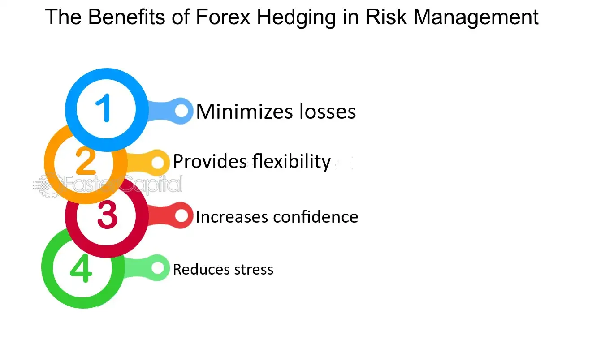

## Table of Contents

## What is Forex hedging?

Forex hedging is a strategy used by traders to reduce the risk of unfavorable currency movements. It involves taking a position in the forex market that is opposite to an existing position, so if the value of one currency goes down, the other position might go up, helping to balance out any losses. For example, if a trader has a large amount of Euros and is worried that the Euro might lose value compared to the US Dollar, they might buy US Dollars to hedge their position.

Hedging can be done in several ways, such as using forward contracts, options, or futures. A forward contract allows a trader to buy or sell a currency at a set price on a future date, which can protect against currency fluctuations. Options give the trader the right, but not the obligation, to buy or sell a currency at a specific price before a certain date. Futures are similar to forward contracts but are standardized and traded on an exchange. By using these tools, traders can manage their risk and protect their investments from unexpected market changes.

## Why is Forex hedging important for traders?

Forex hedging is important for traders because it helps them manage risk. The forex market can be very unpredictable, with currency values changing quickly. If a trader has a lot of money in one currency and that currency loses value, they could lose a lot of money. By using hedging, traders can protect themselves from these sudden changes. They do this by taking another position that will gain value if their main position loses value, balancing out their losses.

Hedging also gives traders more confidence to make trades. When traders know they have a way to limit their losses, they might be more willing to take chances and try new trading strategies. This can lead to more opportunities for making profits. Overall, hedging is a key tool that helps traders feel safer and more in control when dealing with the ups and downs of the [forex](/wiki/forex-system) market.

## What are the basic types of Forex hedging strategies?

Forex hedging strategies help traders protect their money from big changes in currency values. One common strategy is using forward contracts. This means a trader agrees to buy or sell a currency at a set price on a future date. If the currency's value changes a lot, the trader is safe because they locked in the price earlier. Another way is using options. Options give the trader the right, but not the duty, to buy or sell a currency at a specific price before a certain date. This can be helpful if the trader thinks the currency might go down but isn't sure.

Another popular strategy is using futures. Futures are like forward contracts but are traded on an exchange and have standard terms. They help traders lock in prices for the future, reducing the risk of currency changes. Lastly, there's the strategy of currency pairs. Traders can take opposite positions in two currencies that are related. For example, if a trader thinks the Euro might fall against the US Dollar, they can buy US Dollars to balance out any losses from the Euro. These strategies help traders manage risk and feel more secure in the forex market.

## How does a simple Forex hedge work?

A simple Forex hedge works by taking two opposite positions in the currency market. Imagine you have a lot of Euros, and you're worried that the Euro might lose value compared to the US Dollar. To protect yourself, you can buy US Dollars. If the Euro does go down, the US Dollars you bought will go up in value, helping to balance out your losses. This way, you're not as affected by the changes in the Euro's value.

For example, let's say you have 10,000 Euros and you think the Euro might fall against the US Dollar. You decide to buy US Dollars with some of your Euros. If the Euro does drop, the US Dollars you bought will be worth more Euros than before. This means you won't lose as much money as you would have if you just kept all your money in Euros. Hedging like this helps you manage risk and feel safer in the unpredictable Forex market.

## What are the benefits of Forex hedging for beginners?

Forex hedging can be really helpful for beginners because it helps them feel safer when they start trading. When you're new to trading, the idea of losing money because the currency values change can be scary. Hedging lets you take steps to protect your money. For example, if you have Euros and you're worried they might lose value, you can buy US Dollars to balance things out. This way, even if the Euros go down, the US Dollars you bought might go up, so you don't lose as much money.

Another benefit of Forex hedging for beginners is that it can help you learn and try new things without being too worried about big losses. When you know you have a way to limit your losses, you might feel more confident to try different trading strategies. This can help you learn more about the market and how to trade better. Overall, hedging is a good tool for beginners because it helps manage risk and gives you more freedom to explore the world of Forex trading.

## Can Forex hedging completely eliminate risk?

Forex hedging cannot completely eliminate risk. It helps to reduce risk by balancing out losses with gains from another position, but it doesn't make trading completely safe. The forex market can be unpredictable, and even with hedging, there's always a chance that things won't go as planned. For example, if you hedge by buying US Dollars to protect your Euros, and both currencies drop in value, you could still lose money.

Hedging is a useful tool to manage risk, but it's not a perfect solution. It can make trading feel safer and give you more confidence, but you need to understand that some risk will always be there. It's important for traders to use hedging wisely and not rely on it to remove all risk from their trades.

## What are the costs associated with Forex hedging?

Forex hedging can help you protect your money, but it comes with costs. One cost is the fees you might have to pay when you use hedging tools like forward contracts, options, or futures. These fees can add up and eat into your profits. Another cost is the potential loss of opportunity. When you hedge, you might miss out on making more money if the currency moves in a way that would have been good for you.

Also, hedging can make things more complicated. You need to keep track of more trades and positions, which can take more time and effort. This can be tricky, especially if you're new to trading. While hedging can help reduce risk, it's important to think about these costs and see if they fit with your trading plan and goals.

## How do advanced Forex hedging techniques differ from basic ones?

Advanced Forex hedging techniques are more complex and use a wider range of tools and strategies compared to basic ones. While basic hedging might involve simple actions like buying a different currency to balance out your main position, advanced techniques can include using multiple financial instruments like options, futures, and swaps. These tools allow traders to create more detailed and flexible hedging strategies. For example, an advanced trader might use options to hedge against potential losses while still keeping the chance to make profits if the market moves in their favor.

Advanced hedging also often involves more sophisticated analysis and planning. Traders might use technical analysis, economic indicators, and even algorithms to decide when and how to hedge. This can help them predict market movements more accurately and adjust their hedging strategies accordingly. In contrast, basic hedging usually relies on simpler, more straightforward decisions based on current market conditions. While advanced techniques can offer better protection and more opportunities for profit, they also require more knowledge, experience, and resources to use effectively.

## What are some common mistakes to avoid when implementing Forex hedging?

One common mistake when implementing Forex hedging is over-hedging. This happens when a trader uses too many hedges, which can lead to extra costs and might limit potential profits. It's important to find a balance and not hedge more than you need to. Another mistake is not understanding the costs of hedging. Fees for using options, futures, or other hedging tools can add up, and if you don't consider these costs, you might end up losing money even with a good hedge.

Another mistake is ignoring the correlation between currencies. If you hedge with a currency that moves in the same way as the one you're trying to protect, it won't help much. You need to choose currencies that move in opposite ways to balance out your risks. Also, some traders forget to adjust their hedges as market conditions change. It's important to keep an eye on your hedges and make changes when needed to keep them effective.

## How can Forex hedging be used in conjunction with other risk management strategies?

Forex hedging can be used with other risk management strategies to make trading safer. One way to do this is by setting stop-loss orders. A stop-loss order automatically sells a currency when it reaches a certain low price, limiting how much money you can lose. If you use hedging to balance out your positions and also set stop-loss orders, you can protect yourself from big losses in two different ways. Another strategy is diversification, which means spreading your money across different currencies or investments. By hedging your main currency position and also diversifying, you can reduce the risk of losing all your money if one currency goes down.

Another important risk management strategy to use with hedging is position sizing. This means deciding how much money to put into each trade based on how much risk you're willing to take. If you hedge your positions and also carefully choose the size of your trades, you can control your risk even better. Together, these strategies can help you manage risk more effectively and feel more confident when trading in the Forex market.

## What are the regulatory considerations for Forex hedging?

When you use Forex hedging, you need to think about the rules that different countries have. Some countries have strict rules about what you can do with hedging. For example, in the United States, the Commodity Futures Trading Commission (CFTC) and the National Futures Association (NFA) set rules for using futures and options for hedging. These rules are there to make sure that trading is fair and safe. If you don't follow these rules, you could get in trouble or have to pay fines.

In other places, like the European Union, the rules might be different. The European Securities and Markets Authority (ESMA) has its own set of rules for Forex trading and hedging. These rules can affect what kinds of hedging tools you can use and how you can use them. It's important to know the rules in your country or the country where you're trading, so you can use hedging the right way and stay out of trouble.

## How can one evaluate the effectiveness of a Forex hedging strategy?

To evaluate how well a Forex hedging strategy is working, you need to look at how much it's helping to reduce your risk. One way to do this is by comparing your losses with and without the hedge. If you're losing less money when you use the hedge, it's a sign that the strategy is effective. You can also look at how much the hedge costs you in fees and other expenses. If the costs are too high, the hedge might not be worth it, even if it's reducing your risk.

Another important thing to check is how the hedge affects your overall profits. A good hedge should balance out losses without stopping you from making money when the market moves in your favor. You can use tools like [backtesting](/wiki/backtesting), where you apply your hedging strategy to past market data, to see how it would have worked. This can give you a good idea of whether the strategy is likely to be effective in the future. By keeping an eye on these things, you can figure out if your Forex hedging strategy is doing its job well.

## References & Further Reading

[1]: ["Currency Management: Research Perspectives for Institutional Investors"](https://www.edhec.edu/sites/default/files/ckeditor-inlines/thefinal.edhecxxii.pdf) by Jessica James, Scott Richard, and William W. F. Ng

[2]: ["Options, Futures, and Other Derivatives"](https://www.amazon.com/Options-Futures-Other-Derivatives-9th/dp/0133456315) by John C. Hull

[3]: ["Risk Management and Financial Institutions"](https://www.amazon.com/Management-Financial-Institutions-Wiley-Finance/dp/1119932483) by John C. Hull

[4]: ["The Economics of Foreign Exchange and Global Finance"](https://link.springer.com/book/10.1007/978-3-662-59271-7) by Peijie Wang

[5]: ["Algorithmic Trading and DMA: An introduction to direct access trading strategies"](https://www.amazon.com/Algorithmic-Trading-DMA-introduction-strategies/dp/0956399207) by Barry Johnson