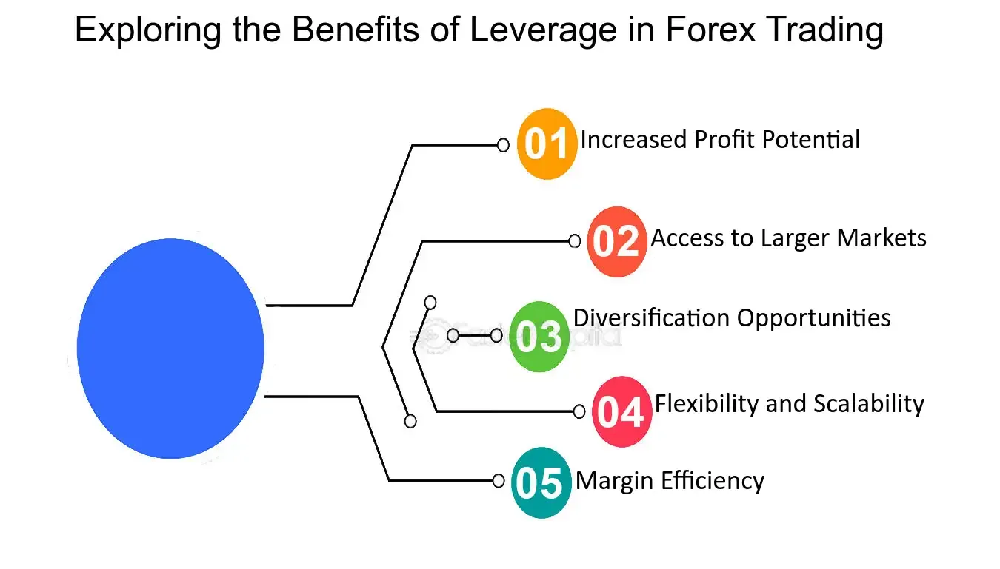

## Table of Contents

## What is forex leverage?

Forex leverage is a tool that allows traders to control a large amount of money in the forex market with a relatively small amount of their own money. It's like borrowing money from a broker to increase the potential return on an investment. For example, if you have $1,000 and use a leverage of 100:1, you can control $100,000 in the market. This means you can buy or sell more currency than you could with just your own money.

However, leverage is a double-edged sword. While it can amplify profits, it can also increase losses. If the market moves against your position, the losses are magnified just as much as the potential gains. This is why it's important for traders to use leverage carefully and understand the risks involved. Proper risk management, such as setting stop-loss orders, can help mitigate these risks.

## How does leverage work in forex trading?

In forex trading, leverage lets you control a big amount of money with just a little bit of your own money. Think of it like borrowing money from your broker. If you have $1,000 and use 100:1 leverage, you can trade with $100,000. This is great because it means you can make bigger trades and possibly earn more money than if you only used your $1,000.

But, leverage can be risky too. If the market goes against you, your losses can be much bigger. For example, if you lose 1% on your $100,000 trade, that's $1,000, which is all your money. So, it's important to be careful with leverage and use tools like stop-loss orders to protect yourself. Always think about how much you can afford to lose before you start trading with leverage.

## What are the potential benefits of using leverage in forex trading?

Using leverage in [forex](/wiki/forex-system) trading can help you make more money with less of your own cash. If you have a small amount of money, leverage lets you trade with a lot more. For example, with $1,000 and 100:1 leverage, you can control $100,000. This means you can take bigger positions and potentially earn bigger profits than if you were just using your own money. It's like getting a boost that can help you grow your trading account faster.

But, you need to be careful because leverage can also make your losses bigger. If the market moves against you, you could lose more money than you put in. That's why it's important to use leverage wisely and have a good plan for managing risks. Tools like stop-loss orders can help protect you from big losses. So, while leverage can be a powerful tool, it's important to understand how it works and use it carefully.

## What are the risks associated with forex leverage?

Using leverage in forex trading can make your losses bigger if the market moves against you. Imagine you're using a lot of leverage and the market goes down. You could lose more money than you put in, and sometimes even all of your money. This is because leverage lets you trade with more money than you actually have, so any loss is magnified. It's like borrowing money to bet on something, and if you lose, you still have to pay back what you borrowed.

To manage these risks, it's important to use tools like stop-loss orders. A stop-loss order can automatically close your trade if it starts losing too much money, which can help protect your account. But even with these tools, there's still a chance you could lose money. That's why it's crucial to understand how much you can afford to lose before you start trading with leverage. Always think about the worst-case scenario and make sure you're okay with it before you take on the risk.

## How can a beginner safely use leverage in forex trading?

For beginners, using leverage in forex trading can be tricky but manageable if done carefully. Start by understanding how leverage works. It's like borrowing money from your broker to trade with more money than you have. If you have $1,000 and use 10:1 leverage, you can trade with $10,000. But remember, if the market goes against you, your losses can be bigger. So, it's smart to start with low leverage, like 10:1 or even 5:1, to keep your risks small while you learn.

To stay safe, always use a stop-loss order. This is a tool that can automatically close your trade if it starts losing too much money, helping to protect your account. Also, only trade with money you can afford to lose. Think about how much you're okay with losing before you start trading. And don't forget to learn as much as you can about the forex market. The more you know, the better you can manage your trades and use leverage safely.

## What is the difference between high leverage and low leverage in forex?

High leverage and low leverage in forex trading are about how much money you can borrow from your broker to trade. High leverage, like 100:1 or 500:1, lets you control a lot more money than you have. For example, if you have $1,000 and use 100:1 leverage, you can trade with $100,000. This means you can make bigger trades and possibly earn more money, but it also means your losses can be much bigger if the market goes against you. High leverage is riskier because small market movements can wipe out your account quickly.

Low leverage, like 10:1 or 5:1, is safer because you're borrowing less money. With $1,000 and 10:1 leverage, you can trade with $10,000. This limits how much you can lose if the market moves against you, making it a better choice for beginners or those who want to manage their risk more carefully. While low leverage might mean smaller potential profits, it also means smaller potential losses, which can be a good trade-off for many traders.

## How does leverage affect margin requirements in forex trading?

In forex trading, leverage and margin requirements go hand in hand. Leverage lets you trade with more money than you have by borrowing from your broker. The margin is the amount of your own money you need to put down to open a trade. When you use high leverage, like 100:1, you need less margin because you're borrowing more. For example, if you want to trade $100,000 with 100:1 leverage, you might only need $1,000 as margin. But if you use low leverage, like 10:1, you'll need more of your own money, maybe $10,000 for the same $100,000 trade.

The amount of margin you need depends on the leverage you choose. Higher leverage means lower margin requirements, which can be good because it lets you start trading with less money. But it's also riskier because if the market moves against you, you could lose your margin quickly. Lower leverage means higher margin requirements, which can protect you from big losses but also means you need more money to start trading. So, choosing the right leverage is important because it affects how much of your own money you need to put up and how much risk you're taking on.

## What are some strategies to manage risk when using forex leverage?

When using forex leverage, one of the best ways to manage risk is by setting stop-loss orders. A stop-loss order automatically closes your trade if it starts losing too much money. This helps you limit your losses and protect your account. Another strategy is to only use money you can afford to lose. Before you start trading, think about how much money you're okay with losing. This way, if things go wrong, it won't hurt your finances too much.

Another important strategy is to start with low leverage. Using less leverage, like 10:1 or 5:1, means your potential losses are smaller. It's a safer way to trade while you're learning. Also, always keep an eye on your account balance and be ready to add more money if needed. This is called meeting margin calls, and it can help keep your trades open. By combining these strategies, you can use forex leverage more safely and reduce your risk of big losses.

## How does leverage impact the potential profit and loss in forex trading?

Leverage in forex trading can make your potential profits bigger because it lets you trade with more money than you have. If you have $1,000 and use 100:1 leverage, you can control $100,000. This means you can make bigger trades and earn more money if the market moves in your favor. For example, if you make a 1% profit on a $100,000 trade, that's $1,000, which is a lot more than if you only used your $1,000 without leverage.

But, leverage can also make your losses bigger if the market goes against you. If you lose 1% on that same $100,000 trade, you lose $1,000, which is all of your money. This is why using leverage can be risky. It's like borrowing money to bet on something, and if you lose, you still have to pay back what you borrowed. So, while leverage can help you make more money, it can also lead to big losses if you're not careful.

## What are the regulatory limits on leverage for retail forex traders?

Regulatory limits on leverage for retail forex traders can be different depending on where you live. In the United States, the Commodity Futures Trading Commission (CFTC) and the National Futures Association (NFA) set the rules. They say that retail forex traders can use up to 50:1 leverage for major currency pairs like EUR/USD and 20:1 for other pairs. This is to help protect traders from losing too much money because of high leverage.

In Europe, the European Securities and Markets Authority (ESMA) has its own rules. They say that retail traders can use up to 30:1 leverage for major currency pairs, 20:1 for minor pairs, 10:1 for major stock market indices, and even less for other assets like gold or oil. These rules are there to make sure trading is safer for people who are new to forex trading.

## How can experienced traders optimize their use of leverage in different market conditions?

Experienced traders can optimize their use of leverage by adjusting it based on market conditions. In highly volatile markets, where prices can change a lot in a short time, it's smart to use less leverage. This helps to keep losses smaller if the market moves against them. On the other hand, in more stable markets, where prices don't change as much, traders might use more leverage to try and make bigger profits. They can also use tools like technical analysis to understand market trends and make better decisions about how much leverage to use.

Another way experienced traders optimize leverage is by keeping a close eye on their account balance and being ready to adjust their positions. If the market starts to move against them, they might lower their leverage or add more money to their account to meet margin calls. This helps them stay in the trade longer and gives them a chance to turn things around. By understanding the market and being flexible with their leverage, experienced traders can use it to their advantage while still managing their risks carefully.

## What are some common mistakes traders make when using forex leverage and how can they be avoided?

One common mistake traders make when using forex leverage is using too much of it. They think they can make big profits fast, but they forget that high leverage can also lead to big losses. If the market moves against them, they can lose all their money quickly. To avoid this, traders should start with low leverage, like 10:1 or 5:1, and only increase it as they gain more experience and understand the market better. It's also important to only trade with money you can afford to lose, so if things go wrong, it won't hurt your finances too much.

Another mistake is not using stop-loss orders. A stop-loss order can automatically close a trade if it starts losing too much money, which helps protect your account. Some traders don't use them because they hope the market will turn around, but this can lead to big losses. To avoid this, always set a stop-loss order when you open a trade. This way, even if the market moves against you, your losses will be limited. By using stop-loss orders and starting with low leverage, traders can manage their risks better and trade more safely.

## What are the strategies to mitigate risks in leverage forex algo trading?

In leverage forex [algorithmic trading](/wiki/algorithmic-trading), mitigating risk is crucial for preserving capital and ensuring long-term success. Implementing robust risk management strategies can help traders navigate the complexities of the market and minimize potential losses.

**Risk Management Techniques**

1. **Stop-Loss Orders and Proper Position Sizing**: Stop-loss orders are essential tools to limit potential losses by automatically closing a position when it reaches a specified price level. This prevents further losses beyond a predetermined point. Proper position sizing is equally important and involves determining the amount of capital to allocate to each trade, considering the risk tolerance and the leverage used. For example, the formula for calculating position size is:
$$
   \text{Position Size} = \frac{\text{Account Risk \%} \times \text{Account Balance}}{\text{Pip Risk}}

$$

   This approach ensures that traders do not overexpose themselves to any single trade.

2. **Backtesting Algorithms**: Backtesting involves evaluating the performance of a trading strategy using historical market data to assess its effectiveness. It helps traders understand how their algorithms would have performed under different market conditions. Successful backtesting requires a comprehensive dataset and realistic assumptions. By testing strategies across diverse market environments, traders can optimize their algorithms for better performance and reliability.

3. **Continuous Monitoring and Parameter Adjustment**: Constantly monitoring trading algorithms is crucial. Market conditions can change rapidly, necessitating adjustments in trading parameters to align with the prevailing market environment. Regular reviews of algorithm performance metrics and real-time data should inform necessary changes to trading strategies, ensuring they remain effective and aligned with the trader’s objectives.

4. **Utilizing Demo Accounts**: Demo accounts offer a risk-free platform for testing trading strategies. They simulate real market conditions without financial implications, allowing traders to refine their algorithms and risk management techniques. Using demo accounts enables them to understand the nuances of leverage trading and fine-tune their strategies before implementing them with real capital.

5. **Continuous Education and Market Awareness**: Staying informed about market trends, new trading technologies, and enhancements in algorithmic systems is vital. Engaging in continuous education through webinars, courses, and workshops helps traders maintain a competitive edge. Knowledge of market changes, regulatory developments, and technical advancements ensures that traders are well-prepared to adapt their strategies and mitigate risks effectively.

By combining these strategies, traders can enhance their ability to manage risks in leverage forex algo trading, thereby optimizing their potential for success while maintaining a disciplined approach in the market.

## References & Further Reading

[1]: ["Algorithmic Trading: Winning Strategies and Their Rationale"](https://www.wiley.com/en-us/Algorithmic+Trading%3A+Winning+Strategies+and+Their+Rationale-p-9781118460146) by Ernie Chan

[2]: ["Forex Trading: The Basics Explained in Simple Terms"](https://www.amazon.com/FOREX-TRADING-Explained-Beginners-Strategies/dp/1535198567) by Jim Brown

[3]: ["Technical Analysis of the Financial Markets"](https://drive.google.com/file/d/1OcDrGakDhaejT7J7xGEE3HHKy7xmrafy/preview) by John J. Murphy

[4]: Investopedia – ["Leverage"](https://www.investopedia.com/terms/l/leverage.asp)

[5]: Kathy Lien's Blog - [KathyLien.com](https://www.bktraders.com/)

[6]: Babypips School of Pipsology - [Babypips.com](https://www.babypips.com/learn/forex)

[7]: ForexFactory Forums - [ForexFactory.com](https://www.forexfactory.com/forums)

[8]: ["Artificial Intelligence in Finance"](https://www.ibm.com/topics/artificial-intelligence-finance) by Yves Hilpisch

[9]: TradingWithRayner - [TradingWithRayner.com](https://www.tradingwithrayner.com/)