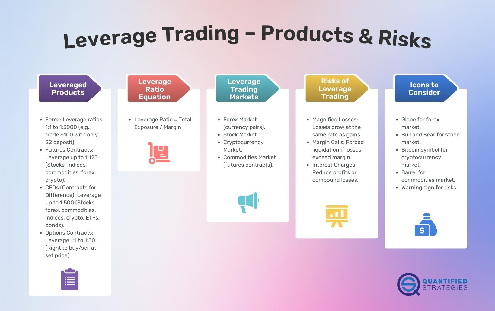

Leverage trading in the foreign exchange (forex) market has gained significant traction in recent years due to its potential for larger returns with a smaller amount of invested capital. Leverage allows traders to control larger positions by borrowing funds to boost their trading power. This capability magnifies both potential gains and losses, making it an alluring yet risky strategy. The forex market, characterized by high liquidity and 24-hour trading, provides an ideal environment for those seeking to capitalize on small price movements using leverage.

Simultaneously, algorithmic trading, or algo trading, has revolutionized the way forex markets operate. Unlike manual trading, which relies on human decision-making, algo trading utilizes pre-set algorithms to execute trades at speeds and efficiencies beyond human capability. These algorithms, designed to capitalize on market opportunities, remove emotional biases from decision-making, offering a strategic advantage in capturing profits.

The focus of this article is to examine the risks associated with leverage in forex algo trading. While both leverage and algorithmic trading can enhance trading outcomes, their combination introduces unique challenges and potential pitfalls. Understanding these risks is crucial for traders at all levels, as the misuse of leverage in automated systems can lead to significant financial losses. It is essential for both newcomers and seasoned traders to recognize these dangers to enhance their risk management strategies.

This article will explore the risks inherent in employing leverage within automated trading systems, paving the way for a deeper understanding of the complexities and potential hazards. By dissecting these risks, traders can better equip themselves to navigate the intricate world of leveraged algo trading, thus optimizing their trading strategies for a more secure and successful experience in the forex market.

## Table of Contents

## Understanding Leverage Trading in Forex

Leverage in forex trading refers to the practice of using borrowed funds to amplify the potential return on investment. This mechanism allows traders to control larger positions than their capital would typically permit. In essence, leverage provides exposure to a larger volume of the forex market with a relatively small capital investment.

For example, consider a trader who wishes to trade a currency pair but only has $1,000. If the broker offers leverage at a ratio of 100:1, the trader can theoretically control a position worth $100,000. This leveraged trading significantly magnifies the trader's potential to achieve substantial gains. If the market moves in the trader’s favor by just 1%, the gain on the $100,000 position would be $1,000, effectively doubling the initial investment. This potential for amplified gains is a primary attraction for many forex traders, as it enables them to maximize their profit potential on relatively modest price movements.

However, leverage is a double-edged sword. While it can magnify gains, it also increases the risk of substantial losses. If the market moves against the trader’s position, the losses are calculated on the full leveraged amount, not just the trader's capital. Using the previous example, a 1% adverse move in the market would result in a $1,000 loss, entirely wiping out the initial investment. Given this, traders might face what is known as a "margin call". This occurs when the broker requires additional funds to keep the trading position open due to the account’s equity dropping below a specified level.

Moreover, heavily leveraged positions in volatile market conditions can lead to rapid losses. Unanticipated events, such as political developments or economic announcements, can cause swift and significant market movements, putting highly leveraged positions at risk. Traders must manage their risk exposure carefully to prevent significant financial setbacks.

In summary, while leverage presents the opportunity to access larger trading positions and substantial returns, it simultaneously brings the potential for significant financial loss. Understanding how leverage functions and exercising disciplined risk management is crucial for traders seeking to capitalize on its benefits while mitigating its risks.

## The Basics of Forex Algorithmic Trading

Algorithmic trading, often abbreviated as algo trading, is a method of executing trades utilizing automated and pre-programmed trading instructions to account for variables such as timing, price, and [volume](/wiki/volume-trading-strategy). This automation is achieved through sophisticated algorithms, which are sets of rules written in computer programs designed to match each trading operation to the optimal conditions defined by the user's strategy.

In the [forex](/wiki/forex-system) market, [algorithmic trading](/wiki/algorithmic-trading) plays a crucial role by providing several notable advantages. First, the speed at which algorithms can execute trades far surpasses human capabilities, allowing for instant reactions to market changes. This speed is complemented by enhanced efficiency since algorithms can process vast amounts of market data accurately, minimizing human errors typically associated with manual trading. Furthermore, algo trading removes emotional biases from trading decisions, ensuring that trades are executed based on predefined criteria rather than emotional responses to market fluctuations.

There are various types of algorithmic trading strategies employed in forex trading. Trend-following strategies, for example, attempt to capitalize on [momentum](/wiki/momentum) by buying when prices are rising and selling when they are declining. These strategies rely on technical indicators like moving averages or trend lines to identify ongoing trends and generate buy or sell signals.

Another popular method is [arbitrage](/wiki/arbitrage), where traders exploit price discrepancies of the same asset across different markets or forms. It involves buying low in one market and simultaneously selling high in another to profit from the price difference. This strategy demands fast execution and is ideally suited to algorithmic trading due to the necessity for swift and precise trade execution.

Typical users of forex algorithmic trading include hedge funds and other institutional investors, who utilize sophisticated algorithms to manage large portfolios and execute trades across global markets. However, individual traders have increasingly adopted algorithmic trading as well. With the rise of online trading platforms offering powerful algorithm development tools and [backtesting](/wiki/backtesting) capabilities, retail traders can now create and deploy their own algorithmic strategies.

In summary, algorithmic trading in forex markets offers significant advantages of speed, efficiency, and emotional detachment. Common strategies like [trend following](/wiki/trend-following) and arbitrage provide diverse approaches for different trading goals. These characteristics have made algo trading appealing not only to institutional players but also to individual traders seeking to enhance their trading operations.

## The Risks of Leverage in Forex Algo Trading

Leverage in forex algorithmic trading serves as a double-edged sword, capable of magnifying both profits and losses. This amplification occurs because leverage allows traders to control a larger position with a smaller amount of capital. For instance, a 100:1 leverage ratio means that with $1,000 of actual capital, a trader can control $100,000 worth of currency. While this can lead to substantial gains, it can also result in equally substantial losses if the market moves unfavorably.

A significant risk associated with algorithmic trading is the over-optimization of trading algorithms. Over-optimization, often known as "curve-fitting," involves excessively tweaking a trading strategy to perform exceptionally well on historical data. This can create a misleading façade of profitability, as these algorithms may fail to adapt to the dynamic conditions in real market scenarios, leading to poor performance.

Market [volatility](/wiki/volatility-trading-strategies) and unexpected events pose additional risks to leveraged forex algorithmic trading. Leveraged positions are particularly vulnerable to sudden market shifts that can lead to rapid losses. For example, unexpected economic data releases, geopolitical events, or central bank announcements can cause drastic price swings, potentially liquidating leveraged positions before a trader has time to react.

Margin calls represent a critical risk [factor](/wiki/factor-investing) in leveraged trading. If the market moves against a leveraged position significantly, the trader may face a margin call, demanding additional funds to maintain the position. Failing to meet a margin call can result in the forced closure of positions, leading to losses that may exceed the initial investment.

Moreover, the dependency on technology in algorithmic trading introduces risks related to system failures. Glitches, software bugs, and connectivity issues can disrupt trading operations. For instance, a temporary loss of internet connection might cause a trading algorithm to miss crucial market data, leading to delayed or erroneous trades. These technological failures can have pronounced impacts on leveraged positions, potentially resulting in unexpected financial losses.

In conclusion, while leverage in forex algo trading can enhance potential returns, it also necessitates careful consideration of its associated risks. Over-optimization, market volatility, margin requirements, and technology dependencies each contribute to the complexities traders must navigate. Understanding and managing these factors is vital to mitigate losses and achieve long-term trading success.

## Strategies to Mitigate Risks in Leverage Forex Algo Trading

In leverage forex algorithmic trading, mitigating risk is crucial for preserving capital and ensuring long-term success. Implementing robust risk management strategies can help traders navigate the complexities of the market and minimize potential losses.

**Risk Management Techniques**

1. **Stop-Loss Orders and Proper Position Sizing**: Stop-loss orders are essential tools to limit potential losses by automatically closing a position when it reaches a specified price level. This prevents further losses beyond a predetermined point. Proper position sizing is equally important and involves determining the amount of capital to allocate to each trade, considering the risk tolerance and the leverage used. For example, the formula for calculating position size is:
$$
   \text{Position Size} = \frac{\text{Account Risk \%} \times \text{Account Balance}}{\text{Pip Risk}}

$$

   This approach ensures that traders do not overexpose themselves to any single trade.

2. **Backtesting Algorithms**: Backtesting involves evaluating the performance of a trading strategy using historical market data to assess its effectiveness. It helps traders understand how their algorithms would have performed under different market conditions. Successful backtesting requires a comprehensive dataset and realistic assumptions. By testing strategies across diverse market environments, traders can optimize their algorithms for better performance and reliability.

3. **Continuous Monitoring and Parameter Adjustment**: Constantly monitoring trading algorithms is crucial. Market conditions can change rapidly, necessitating adjustments in trading parameters to align with the prevailing market environment. Regular reviews of algorithm performance metrics and real-time data should inform necessary changes to trading strategies, ensuring they remain effective and aligned with the trader’s objectives.

4. **Utilizing Demo Accounts**: Demo accounts offer a risk-free platform for testing trading strategies. They simulate real market conditions without financial implications, allowing traders to refine their algorithms and risk management techniques. Using demo accounts enables them to understand the nuances of leverage trading and fine-tune their strategies before implementing them with real capital.

5. **Continuous Education and Market Awareness**: Staying informed about market trends, new trading technologies, and enhancements in algorithmic systems is vital. Engaging in continuous education through webinars, courses, and workshops helps traders maintain a competitive edge. Knowledge of market changes, regulatory developments, and technical advancements ensures that traders are well-prepared to adapt their strategies and mitigate risks effectively.

By combining these strategies, traders can enhance their ability to manage risks in leverage forex algo trading, thereby optimizing their potential for success while maintaining a disciplined approach in the market.

## Conclusion

In examining the risks inherent in leveraging forex algo trading, we have underscored several critical aspects that are paramount for traders to comprehend. Leverage, while offering the enticing prospect of amplified returns, equally elevates the potential for significant financial loss. This dual-edged nature necessitates a profound grasp of leverage mechanics and risks, ensuring that traders are not blindsided by adverse outcomes.

Effective management of these risks is crucial for trading success. By integrating robust risk management strategies, such as setting stop-loss orders and employing sound position sizing, traders can mitigate the adverse impacts of leverage. Concurrently, understanding the susceptibility of trading algorithms to over-optimization and the ramifications of market volatility and technological failures is essential in maintaining a balanced trading approach.

Traders are encouraged to embrace a comprehensive strategy that marries the potent advantages of leverage with vigilant risk mitigation practices. This balanced approach will not only preserve capital but also pave the way for more consistent trading performance.

Further exploration of educational resources is advocated to deepen traders' understanding of leverage and algorithmic trading. Engaging with authoritative literature and platform tools can significantly enhance a trader's strategic depth and adaptiveness in the ever-evolving forex market. By continuously educating themselves and adapting to market changes, traders can bolster their confidence and competence, ensuring they are well-equipped to navigate the complex landscape of forex algo trading.

## References

1. **Babypips School of Pipsology**: This educational resource is excellent for beginners and experienced traders wanting to understand leverage and its implications in forex trading. It provides a fundamental understanding of forex mechanics and risk management strategies. Website: [www.babypips.com/school](https://www.babypips.com/school).

2. **"Algorithmic Trading: Winning Strategies and Their Rationale" by Ernie Chan**: This book is a must-read for anyone interested in algorithmic trading. It outlines various strategies, discusses their effectiveness, and examines the risks, including those associated with leverage. Available on Amazon and other major book retailers.

3. **Investopedia – Leverage**: Investopedia's comprehensive guide explains the concept of leverage, its advantages, and the inherent risks, making it an invaluable resource for both introductory and advanced topics. Website: [www.investopedia.com/terms/l/leverage.asp](https://www.investopedia.com/terms/l/leverage.asp).

4. **"Forex Trading: The Basics Explained in Simple Terms" by Jim Brown**: This book provides a detailed tutorial on forex trading, including leveraged trading. It emphasizes risk management and discusses potential pitfalls in trading. Available through Amazon and other book distributors.

5. **Kathy Lien's Blog**: Kathy Lien, a respected forex analyst and author, shares insights on forex trading strategies, including algorithmic trading and leverage. Her blog is updated regularly with analysis and tips. Website: [www.kathylien.com/site/](https://www.kathylien.com/site/).

6. **TradingWithRayner - Forex Trading for Beginners**: This platform offers video guides and articles that break down forex trading strategies, risk management, and how leverage works. Website: [www.tradingwithrayner.com](https://www.tradingwithrayner.com).

7. **"Artificial Intelligence in Finance" by Yves Hilpisch**: This book investigates into the application of AI in finance, including algorithmic trading. It explores both the opportunities and risks, including those from the use of leverage. Available via major book retailers.

8. **ForexFactory Forums**: An online community where traders discuss various aspects of forex trading, including algorithmic strategies and leverage. This forum is a great resource for shared experiences and advice from other traders. Website: [www.forexfactory.com](https://www.forexfactory.com).

9. **"Technical Analysis of the Financial Markets" by John J. Murphy**: This work explains the principles of technical analysis, which underlie many algorithmic trading strategies. It covers the risks and benefits of using leverage in such methods. Available from major booksellers. 

These sources provide a blend of theoretical knowledge and practical insights, helping traders gain a comprehensive understanding of leverage trading and algorithmic strategies in the forex market.

## References & Further Reading

[1]: ["Algorithmic Trading: Winning Strategies and Their Rationale"](https://www.wiley.com/en-us/Algorithmic+Trading%3A+Winning+Strategies+and+Their+Rationale-p-9781118460146) by Ernie Chan

[2]: ["Forex Trading: The Basics Explained in Simple Terms"](https://www.amazon.com/FOREX-TRADING-Explained-Beginners-Strategies/dp/1535198567) by Jim Brown

[3]: ["Technical Analysis of the Financial Markets"](https://drive.google.com/file/d/1OcDrGakDhaejT7J7xGEE3HHKy7xmrafy/preview) by John J. Murphy

[4]: Investopedia – ["Leverage"](https://www.investopedia.com/terms/l/leverage.asp)

[5]: Kathy Lien's Blog - [KathyLien.com](https://www.bktraders.com/)

[6]: Babypips School of Pipsology - [Babypips.com](https://www.babypips.com/learn/forex)

[7]: ForexFactory Forums - [ForexFactory.com](https://www.forexfactory.com/forums)

[8]: ["Artificial Intelligence in Finance"](https://www.ibm.com/topics/artificial-intelligence-finance) by Yves Hilpisch

[9]: TradingWithRayner - [TradingWithRayner.com](https://www.tradingwithrayner.com/)