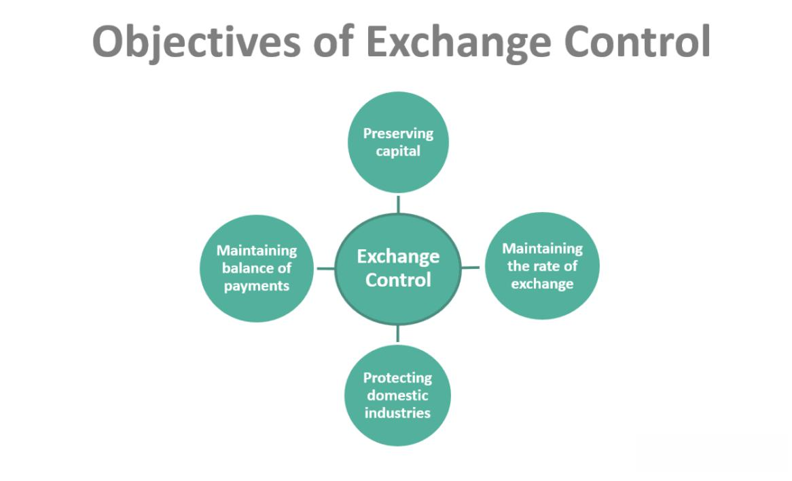

## Table of Contents

## What is the Forex market?

The Forex market, also known as the foreign exchange market, is where people buy and sell different currencies from around the world. It's the largest financial market globally, with trading happening 24 hours a day, five days a week. People and businesses use the Forex market to trade one currency for another, often to do business in other countries or to invest.

The Forex market is different from other markets because it doesn't have a central location. Instead, it's a network of banks, brokers, and traders all over the world, connected by computers and phones. This means that currency prices can change quickly based on what's happening in the world, like economic news or political events. People who trade in the Forex market try to make money by guessing which way currency prices will move.

## Who are considered the main players in the Forex market?

The main players in the Forex market are big banks, governments, and big companies. These big banks, called commercial banks, trade a lot of money every day. They help their customers buy and sell different currencies. Governments also play a big role. They might buy or sell their own country's money to make it stronger or weaker. Big companies that do business in different countries need to use the Forex market too. They change their money into the currency of the country where they are doing business.

There are also smaller players in the Forex market, like smaller banks, investment firms, and regular people. Smaller banks and investment firms help their customers trade currencies. Regular people can also trade in the Forex market, but they usually do it through a broker. Brokers are companies that help people buy and sell currencies. They make it easier for regular people to join the Forex market, but they also charge a fee for their services.

Overall, the Forex market is a big place with many different kinds of players. The big banks, governments, and big companies move a lot of money and can affect the prices of currencies. Smaller players, like regular people, can also join in, but they usually need help from brokers to do so.

## How do central banks influence the Forex market?

Central banks have a big impact on the Forex market. They can change the value of their country's money by buying or selling it. For example, if a central bank wants to make its currency stronger, it might buy a lot of its own money. This makes the currency more valuable because there is more demand for it. On the other hand, if a central bank wants to make its currency weaker, it might sell a lot of its own money. This makes the currency less valuable because there is more supply of it.

Central banks also influence the Forex market by setting interest rates. When a central bank raises interest rates, it can make its currency more attractive to investors. This is because higher interest rates mean people can earn more money by holding that currency. So, more people might want to buy that currency, which makes it stronger. If a central bank lowers interest rates, it can make its currency less attractive to investors. This might make people sell that currency, which makes it weaker. Overall, central banks have a lot of power to affect the Forex market through their actions.

## What role do commercial banks play in the Forex market?

Commercial banks are very important in the Forex market. They are the biggest players and handle a lot of the trading. When people or businesses want to change their money into a different currency, they usually go to a commercial bank. The bank helps them make the trade. Commercial banks also trade currencies for themselves. They try to make money by guessing which way currency prices will move. Because they trade so much, commercial banks can affect the prices of currencies.

Commercial banks also help the Forex market run smoothly. They work with each other to make sure there is always someone to buy or sell a currency. This is called market [liquidity](/wiki/liquidity-risk-premium). When there is good liquidity, it's easier for everyone to trade. Commercial banks also help smaller banks and brokers. They give them the prices they need to trade with their own customers. So, commercial banks are not just big players in the Forex market, they also help keep it working well for everyone.

## How do investment banks affect Forex market dynamics?

Investment banks play a big role in the Forex market. They trade a lot of money every day, just like commercial banks. Investment banks help big companies and other clients buy and sell different currencies. They also trade for themselves, trying to make money by guessing which way currency prices will move. Because they trade so much, investment banks can affect the prices of currencies. They can make a currency stronger or weaker depending on what they buy or sell.

Investment banks also help the Forex market work better. They provide research and advice to their clients about what might happen to currency prices. This helps people make better decisions about when to buy or sell. Investment banks also help create new financial products that people can use to trade currencies in different ways. These products can make the Forex market more interesting and give people more choices. Overall, investment banks are important players that help shape how the Forex market works.

## What is the impact of hedge funds on Forex trading?

Hedge funds play a big role in the Forex market. They are like big investment clubs that pool money from rich people and big investors. Hedge funds trade a lot of money every day, trying to make profits by guessing which way currency prices will move. Because they trade so much, hedge funds can affect the prices of currencies. If a lot of hedge funds decide to buy or sell a certain currency, it can make that currency stronger or weaker.

Hedge funds also help make the Forex market more exciting. They use different strategies and tools to trade currencies. Sometimes, they use complicated methods to bet on currency prices. This can make the market more interesting and give other traders more ideas about how to trade. Overall, hedge funds are important players in the Forex market. They can move currency prices and bring new ideas to the market.

## How do retail Forex brokers facilitate trading for individuals?

Retail Forex brokers make it easy for regular people to trade currencies. They provide a platform, which is like a special computer program, where people can buy and sell different currencies. These platforms are usually easy to use and have tools that help people make decisions about trading. Retail Forex brokers also give people access to the big Forex market, where all the trading happens. Without a broker, it would be hard for regular people to join in because they would need to trade directly with big banks or other big players.

Retail Forex brokers also offer something called leverage. This means people can trade with more money than they actually have. For example, a broker might let someone trade with 100 times the money they put in. This can make bigger profits, but it can also lead to bigger losses. Brokers make money by charging fees or by taking a small part of the difference between buying and selling prices. So, retail Forex brokers are important because they help regular people get into the Forex market and give them the tools they need to trade.

## What are the functions of multinational corporations in Forex?

Multinational corporations, which are big companies that do business in many different countries, play an important role in the Forex market. They need to trade currencies to do business in other countries. For example, if a company in the United States wants to buy something from a company in Japan, it needs to change its U.S. dollars into Japanese yen. These companies often trade a lot of money, so they can affect the prices of currencies. When a big company buys or sells a lot of a certain currency, it can make that currency stronger or weaker.

These companies also use the Forex market to manage their money better. They might use different strategies to protect themselves from changes in currency prices. For example, if a company thinks the value of a currency will go down, it might buy a special financial product to protect itself. This can help the company save money and reduce risk. Overall, multinational corporations are important players in the Forex market because they trade a lot of money and use different strategies to manage their money.

## How do governments regulate the Forex market?

Governments have a big role in making sure the Forex market works fairly and safely. They do this by making rules that everyone has to follow. These rules can be about how much money people can trade, what kind of information they need to share, and how they should behave when trading. Governments also watch the market to make sure no one is cheating or doing anything wrong. If someone breaks the rules, the government can punish them. This helps keep the market honest and trustworthy for everyone.

Some countries have special groups or agencies that look after the Forex market. These groups make the rules and check that everyone follows them. They can also step in if something goes wrong, like if the market gets too crazy or if prices start moving too fast. By doing this, governments help make sure the Forex market stays stable and works well for everyone who uses it.

## What strategies do algorithmic traders use in the Forex market?

Algorithmic traders use computer programs to trade in the Forex market. These programs follow special rules, called algorithms, to decide when to buy or sell currencies. One common strategy is called [trend following](/wiki/trend-following). This means the program looks at past prices to see if a currency is going up or down. If it sees a trend, it will trade in the same direction, hoping the trend will continue. Another strategy is called mean reversion. This is when the program thinks that if a currency's price moves too far away from its normal level, it will come back. So, it will trade expecting the price to return to normal.

Another strategy used by algorithmic traders is called [arbitrage](/wiki/arbitrage). This is when they find small differences in currency prices between different places and trade to make a profit from these differences. They might also use something called high-frequency trading. This means they trade very quickly, often many times in a second, to take advantage of tiny price changes. All these strategies help algorithmic traders make money in the Forex market by using computers to make fast and smart trading decisions.

## How do economic indicators and news events influence Forex market players?

Economic indicators and news events have a big impact on the Forex market. When new economic data comes out, like reports on jobs, inflation, or how much a country's economy is growing, it can make currency prices move a lot. Traders look at these indicators to guess what might happen next. For example, if a country's economy is doing well, its currency might get stronger because more people want to invest there. On the other hand, if the economy is doing badly, the currency might get weaker because people might want to take their money out.

News events also play a big role. Things like elections, changes in government, or big world events can make currency prices change quickly. Traders watch the news closely to see what might affect currency values. If there is good news about a country, like a new trade deal, its currency might go up. But if there is bad news, like a war or a big financial problem, the currency might go down. So, both economic indicators and news events are very important for Forex market players because they help them make decisions about buying and selling currencies.

## What are the advanced techniques used by professional Forex traders to control market movements?

Professional Forex traders use many advanced techniques to try to control market movements. One technique is called "position sizing." This means they decide how much money to put into a trade based on how risky it is. By choosing the right size for their trades, they can manage their risk better and make bigger profits. Another technique is "hedging." This is when traders make trades that protect them from big losses. For example, if they think a currency might go down, they might buy a special financial product that will make money if the currency does go down. This way, they can still make money even if the market moves against them.

Another important technique is "technical analysis." This is when traders use charts and special tools to look for patterns in currency prices. They believe that these patterns can help them guess where prices will go next. For example, they might see a pattern that often means a currency will go up, so they will buy that currency hoping to make a profit. Professional Forex traders also use "[fundamental analysis](/wiki/fundamental-analysis)." This means they look at big economic news and data to understand what might happen to currency prices. By combining these techniques, professional traders try to make smart decisions that help them control market movements and make money.

## References & Further Reading

[1]: Goodhart, C. A. E. (1988). ["The Foreign Exchange Market: A Random Walk with a Dragging Anchor"](https://www.semanticscholar.org/paper/The-Foreign-Exchange-Market%3A-A-Random-Walk-with-a-Goodhart/a3f6cd43b6eaf80220bd7fd60d16a3aed1871b37). Economica, New Series, Vol. 55, No. 220.

[2]: "Algorithmic Trading and DMA: An Introduction to Direct Access Trading Strategies" by Barry Johnson. (Available on [Amazon](https://www.amazon.com/Algorithmic-Trading-DMA-introduction-strategies/dp/0956399207))

[3]: Aldridge, I. (2013). ["High-Frequency Trading: A Practical Guide to Algorithmic Strategies and Trading Systems"](https://www.wiley.com/en-us/High+Frequency+Trading%3A+A+Practical+Guide+to+Algorithmic+Strategies+and+Trading+Systems-p-9780470579770). Wiley.

[4]: Pojarliev, M., & Levich, R. M. (2012). ["A New Look at Currency Investing"](https://www.cfainstitute.org/-/media/documents/book/rf-publication/2012/rf-v2012-n4-1-pdf.pdf). Financial Analysts Journal, Vol. 68, No. 4.

[5]: Treleaven, P., Galas, M., & Yoon, Y. (2013). ["Algorithmic Trading Review"](https://dl.acm.org/doi/pdf/10.1145/2500117). IET Software, Vol. 6, Issue 4.

[6]: Chaboud, A. P., Chiquoine, B., Hjalmarsson, E., & Vega, C. (2014). ["Rise of the Machines: Algorithmic Trading in the Foreign Exchange Market"](https://www.jstor.org/stable/43612951). The Review of Financial Studies, Volume 27, Issue 7.