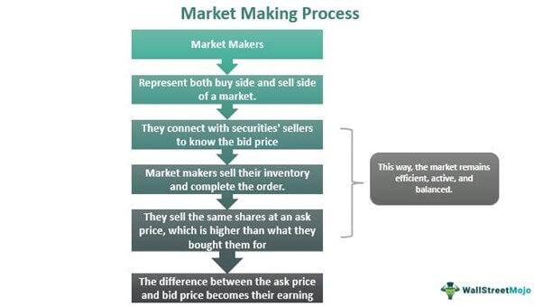

In the rapidly evolving world of financial markets, the importance of market makers continues to grow, enhancing both liquidity and efficiency. Market making involves setting and maintaining both buy and sell prices in a financial market, consistently providing liquidity and facilitating smoother price discovery. In increasingly complex markets, market making as a strategy within algorithmic trading frameworks has emerged as a pivotal function, helping to balance supply and demand while minimizing transaction costs.

Algorithmic trading, which uses computer programs to execute trading strategies at high speeds, has significantly impacted market making. These algorithms have the ability to process vast amounts of data and respond to market conditions with an efficiency that would be impossible for human traders. As a result, algorithmic market makers can adjust their prices rapidly in response to market fluctuations, ensuring they provide competitive quotes that stabilize and support the market ecosystem.



This article will investigate the components and benefits of market making within the context of algorithmic trading and examine the critical role technological advancements play in executing these strategies effectively. By understanding the market maker's function, traders and investors can gain valuable insights into the financial ecosystem's operations, enhancing their decision-making and strategy development.

## Table of Contents

## What is Market Making?

Market making is a critical financial service that ensures liquidity in various markets. It involves the continuous quotation of buy and sell prices for a specific financial instrument, such as stocks, currencies, or derivatives. This activity is pivotal in ensuring that trades can be completed swiftly and with minimal friction, thereby providing a stable and efficient trading environment.

Market makers commit to being ready to buy or sell at publicly quoted prices, a role that requires a constant presence in the market. By doing so, they offer a double-sided market where participants can engage in transactions immediately. This service is essential in markets with lower natural liquidity, such as less-traded stocks or certain commodities, where the absence of a market maker might result in significant price volatility and trading delays.

The primary source of profit for market makers is the 'spread,' the difference between the price at which they buy an asset (bid price) and the price at which they sell it (ask price). This spread compensates them for the risk of holding inventory and provides the revenue necessary to maintain their operations. For instance, if a market maker buys a stock at $100 and sells it at $100.05, the $0.05 spread represents potential profit before accounting for operational costs and any adverse market movements.

In addition to facilitating trades, market makers contribute to market stability by smoothing out price fluctuations. By constantly buying and selling securities, they can dampen the [volatility](/wiki/volatility-trading-strategies) that arises from large trades or sudden shifts in market sentiment. This function is crucial during times of market stress, when [liquidity](/wiki/liquidity-risk-premium) often dries up and prices can become erratic.

In summary, [market making](/wiki/market-making) enhances financial market dynamics by ensuring liquidity and reducing transaction costs for all market participants. This, in turn, helps promote a more accessible and competitive marketplace, benefiting both individual and institutional traders.

## How Market Makers Operate

Market makers continuously update their quotes to reflect current market conditions, ensuring they fulfill their role of providing liquidity. This dynamic process involves the continuous assessment and adjustment of both bid and ask prices, primarily facilitated by advanced algorithms. These algorithms are designed to respond swiftly to real-time market data, thus enhancing the speed and efficiency of trade executions.

The core objective for market makers is to manage their inventory risk while mitigating the adverse selection risk. Inventory risk arises when market makers accumulate positions that may lose value if market conditions shift unfavorably. To mitigate this risk, market makers strategically adjust the spread, which is the difference between the buying (bid) price and the selling (ask) price. By widening the spread, market makers can compensate for increased risk, while narrowing the spread under more stable conditions can attract more trading activity.

Adverse selection risk occurs when market makers trade with more informed participants who possess better insights into the direction of price movements. To combat this, market makers rely on their sophisticated algorithms to detect patterns or sudden changes that may signal informed trading activities. By adjusting their pricing in response to these signals, market makers can protect themselves from potential losses.

The role of automation and algorithmic technology is paramount in this adaptive process. Algorithms constantly analyze vast amounts of financial data—such as changes in order flow, price volatility, and trading [volume](/wiki/volume-trading-strategy)—to recalibrate market makers’ quotes. These systems often incorporate [machine learning](/wiki/machine-learning) models to predict short-term price movements and optimize trade execution strategies. A basic Python code that simulates a market maker adjusting its spread based on volatility could look like this:

```python
def adjust_spread(current_volatility, base_spread):
    # Volatility threshold values
    low_volatility = 0.1
    high_volatility = 0.5

    # Spread adjustment factors
    spread_factor_low = 0.05
    spread_factor_high = 0.15

    # Adjust spread based on volatility levels
    if current_volatility < low_volatility:
        adjusted_spread = base_spread * (1 - spread_factor_low)
    elif current_volatility > high_volatility:
        adjusted_spread = base_spread * (1 + spread_factor_high)
    else:
        adjusted_spread = base_spread

    return adjusted_spread

# Example usage
base_spread = 0.02
current_volatility = 0.3
new_spread = adjust_spread(current_volatility, base_spread)
```

This code snippet illustrates a simplified approach to adjusting the spread based on estimated market volatility. As market conditions change, such algorithms ensure that quotes remain competitive while managing the market maker's exposure to risk.

In addition to spread management, sophisticated risk management techniques are crucial to the operation of market makers. These techniques may involve utilizing statistical models and simulations to forecast potential adverse scenarios and dynamically rebalance portfolios accordingly. By maintaining a well-diversified inventory and employing hedging strategies, market makers can minimize their exposure to sudden market shifts, thus ensuring their continued role in facilitating efficient and liquid markets.

## Algorithmic Market Making

Algorithmic market making involves the utilization of sophisticated automated systems designed to execute trades at high speeds, often measured in milliseconds. These systems leverage advanced algorithms to analyze current market conditions and promptly adjust their bids and offers. This enables them to maintain competitive prices and ensure continuous market liquidity.

The primary advantage of algorithmic market making lies in its ability to reduce transactional costs. By deploying algorithms, market makers can execute a large number of trades with minimal human intervention, which minimizes operational overhead and increases the efficiency of executing trades. This efficiency translates to improved liquidity for the market, as algorithms can rapidly absorb demand and supply imbalances.

Mathematically, these algorithms often function by modeling the bid-ask spread and using limit orders to ensure profitable trades. A basic example might involve adjusting the order prices based on a moving average $MA$ and standard deviation $\sigma$ of recent prices, thus setting buy and sell limits as:

$$
\text{Buy Limit} = MA - k \times \sigma
$$
$$
\text{Sell Limit} = MA + k \times \sigma
$$

where $k$ is a constant that determines the sensitivity of the model to price volatility.

Another critical benefit of algorithmic market making is its ability to minimize human error, thus increasing the system's reliability and robustness. Human traders can be subject to emotional decision-making and fatigue, whereas algorithms operate based on predefined rules and continuously learn from new data to optimize performance.

Moreover, the scalability afforded by algorithmic systems cannot be overstated. Once an algorithm is developed and implemented, it can handle an expanding volume of trades without a proportional increase in resource allocation. This scalability is vital in ensuring that market making can keep pace with the exponential growth in trading volumes across global financial markets.

For instance, a Python framework might utilize libraries like `pandas` for data analysis or `numpy` for numerical operations to dynamically adjust trading parameters:

```python
import numpy as np
import pandas as pd

def calculate_bid_ask(data, window=20):
    moving_avg = data['price'].rolling(window=window).mean()
    std_dev = data['price'].rolling(window=window).std()
    k = 0.5  # Example sensitivity factor

    bid = moving_avg - k * std_dev
    ask = moving_avg + k * std_dev

    return bid, ask

# Example usage
data = pd.DataFrame({'price': np.random.random(100)})  # Replace with actual price data
bid, ask = calculate_bid_ask(data)
```

The key to successful algorithmic market making lies in continuously improving these algorithms, leveraging real-time data and robust computational resources. This dynamic adaptation empowers market makers to navigate volatile market conditions efficiently, securing their positions as indispensable participants in enhancing market fluidity and stability.

## Challenges and Risks

Market makers encounter several challenges and risks in their operations. A primary concern is the risk of holding positions that may depreciate in value, which can occur due to various market factors, including price fluctuations, market volatility, and mismatches in supply and demand. These risks necessitate sophisticated risk management strategies to mitigate potential losses.

One significant risk faced by market makers is adverse selection. This occurs when market makers engage in trades with participants who possess superior information. Such participants might leverage their insights to execute trades that disadvantage market makers, who might end up buying overvalued assets or selling undervalued ones. This risk is particularly prevalent in scenarios where information asymmetry exists, and it is crucial for market makers to develop mechanisms to detect and counterbalance such imbalances.

In addition to adverse selection, inventory risk is a critical consideration for market makers. They must meticulously manage their inventory levels to ensure they are not overly exposed to market price swings. The risk arises because maintaining too much inventory can lead to significant losses if market prices move unfavorably. Conversely, holding too little inventory might result in missed opportunities and reduced market presence. To address this, algorithms are employed to dynamically adjust inventory levels and optimize the balance between risk exposure and liquidity provision.

Real-time data access is essential for market makers to effectively navigate volatile market conditions. The ability to quickly process and respond to changing market dynamics is crucial in minimizing risks and taking advantage of fleeting opportunities. Advanced algorithmic systems are designed to analyze market data continuously and execute trades with minimal latency, ensuring they can operate effectively even in fast-paced environments.

These challenges underline the importance of sophisticated algorithms and robust data infrastructure in market making. By effectively managing inventory risk, counteracting adverse selection, and utilizing real-time data insights, market makers can enhance their ability to maintain market liquidity while safeguarding against potential financial setbacks.

## Benefits of Market Maker Strategies

Market maker strategies are integral to the efficient functioning of financial markets. They play a pivotal role by ensuring continuous liquidity, which is essential for the smooth operation of trading activities. One of the primary benefits of market maker strategies is their capability to reduce the bid-ask spread. The bid-ask spread, defined as the difference between the highest price a buyer is willing to pay for an asset and the lowest price a seller is willing to accept, is a vital indicator of market liquidity. A narrower spread means that traders can enter and [exit](/wiki/exit-strategy) positions with less cost, thereby directly benefiting retail traders who are sensitive to transaction costs.

By narrowing the bid-ask spread, market makers decrease the cost of trading for all participants. This reduction is particularly advantageous for small traders who might otherwise face higher spreads in less liquid markets. The competitive quotes offered by market makers ensure that markets remain accessible, preventing the market from being dominated by large players. This accessibility promotes a more diverse trading environment, encouraging participation from a broad range of investors and traders.

Furthermore, by constantly participating in the buying and selling process, market makers lend a degree of predictability to market prices. Their presence reduces the likelihood of dramatic price swings caused by sudden demand or supply imbalances. When market makers actively trade, they provide all market participants with price stability, making trading less costly over time.

The competition among market makers to attract order flow drives them to offer better prices, enhancing market efficiency. This dynamic is beneficial for the overall health of markets, as it ensures continuous participation and the constant updating of prices, reflecting the most current information. As a result, market makers contribute to a more transparent and reliable pricing mechanism, which is crucial for investors and traders who rely on accurate market signals for their decision-making processes.

In summary, the strategic activities of market makers significantly improve market quality by reducing transaction costs and enhancing market liquidity and stability. Their ongoing contributions highlight the importance of market makers in fostering a trading environment that is both efficient and equitable, ultimately helping to sustain the market's long-term growth and accessibility.

## Conclusion

Market making strategies are a crucial pillar within the trading ecosystem, providing the liquidity essential for the smooth operation of financial markets. As they bridge the gap between buyers and sellers, these strategies ensure that trading can proceed with minimal friction, thereby reducing the cost and unpredictability often associated with less liquid markets.

With the advent of [algorithmic trading](/wiki/algorithmic-trading), market makers have witnessed a transformative enhancement in their ability to operate with precision and efficiency. Algorithms, capable of analyzing vast amounts of data at high speeds, have exponentially increased the effectiveness of market makers. These tools allow market makers to adjust their strategies in real-time, aligning their actions with the ever-shifting market conditions. This capability not only minimizes human error but also optimizes the execution of trades, ensuring that the market remains both competitive and accessible.

As technology continues to progress, the strategies and tools used by market makers are expected to evolve further. Innovations in machine learning, [artificial intelligence](/wiki/ai-artificial-intelligence), and data analytics are likely to drive the next wave of advancements in market making. These technologies will enable even more sophisticated risk management techniques, allowing market makers to handle complex trading scenarios with improved accuracy. 

Understanding market making strategies offers significant insights for traders and investors, emphasizing the importance of liquidity and market dynamics in achieving successful trade executions. The knowledge of how market makers operate and adapt to technological advancements can empower traders to navigate the financial markets more effectively, making informed decisions that are responsive to the nuances of the trading environment.

## References & Further Reading

[1]: Stoikov, S., & Lau, R. (2007). ["Market microstructure: a review and a model of limit order books."](https://math.nyu.edu/~avellane/HighFrequencyTrading.pdf) Wiley Trading.

[2]: Lehalle, C.-A., Laruelle, S., Burgot, R., & Lasnier, B. (2013). ["Market Microstructure in Practice."](http://helper.ipam.ucla.edu/publications/fmws2/fmws2_12928.pdf) World Scientific Publishing Company.

[3]: Cont, R., Stoikov, S., & Talreja, R. (2010). ["A stochastic model for order book dynamics."](http://www.columbia.edu/~ww2040/orderbook.pdf) Applied Mathematical Finance.

[4]: Almgren, R., & Chriss, N. (2000). ["Optimal execution of portfolio transactions."](https://smallake.kr/wp-content/uploads/2016/03/optliq.pdf) Journal of Risk.

[5]: Gould, M. D., Porter, M. A., Williams, S., McDonald, M., Fenn, D. J., & Howison, S. D. (2013). ["Limit order books."](https://arxiv.org/abs/1012.0349) Philosophical Transactions of the Royal Society A: Mathematical, Physical and Engineering Sciences.

[6]: Pardo, A. (2012). ["Algorithmic and High-Frequency Trading."](https://assets.cambridge.org/97811070/91146/frontmatter/9781107091146_frontmatter.pdf) Wiley Finance.

[7]: Kissell, R. (2014). ["The Science of Algorithmic Trading and Portfolio Management."](https://www.sciencedirect.com/book/9780124016897/the-science-of-algorithmic-trading-and-portfolio-management) Academic Press. 

[8]: Abernethy, J., & Kale, S. (2013). ["Adaptive Market Making via Online Learning."](https://proceedings.neurips.cc/paper/2013/file/995e1fda4a2b5f55ef0df50868bf2a8f-Paper.pdf) ACM Conference on Electronic Commerce.