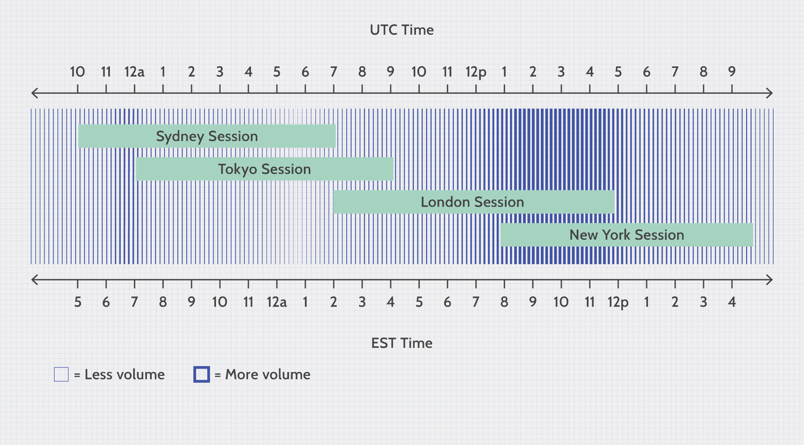

## Table of Contents

## What is the Forex market?

The Forex market, also known as the foreign exchange market, is where people buy and sell different currencies from around the world. It's the largest financial market globally, with trading happening 24 hours a day, five days a week. People and businesses use the Forex market to convert one currency into another when they need to do business or travel abroad. For example, if you're going on a trip to Japan, you might exchange your dollars for yen at the Forex market.

In addition to regular people and businesses, big banks, governments, and other financial institutions also trade in the Forex market. They do this to make money from changes in currency values. For example, if someone thinks the value of the euro will go up compared to the dollar, they might buy euros now and sell them later for a profit. The Forex market is very important because it helps set exchange rates and keeps the global economy running smoothly.

## Why are Forex market hours important?

Forex market hours are important because they tell you when you can trade currencies. The Forex market is open 24 hours a day from Monday to Friday, but it's not the same everywhere. Different parts of the world have their own trading times, like when it's morning in New York, it might be evening in Tokyo. Knowing these times helps you plan when to buy or sell currencies.

Also, some times are busier than others. When big markets like London and New York are open at the same time, there's a lot more trading happening. This can make the market more exciting and sometimes more profitable. If you know when these busy times are, you can decide if you want to trade then or wait for a quieter time.

## What are the standard trading hours for the Forex market?

The Forex market is open 24 hours a day from Monday to Friday. It starts at 5 PM Eastern Time on Sunday and closes at 5 PM Eastern Time on Friday. This is because the market follows the sun around the world, so when one market closes, another one opens.

There are four main trading sessions: Sydney, Tokyo, London, and New York. The Sydney session starts at 5 PM Eastern Time on Sunday, followed by Tokyo at 7 PM Eastern Time. The London session begins at 3 AM Eastern Time on weekdays, and the New York session starts at 8 AM Eastern Time. The busiest time is when London and New York sessions overlap from 8 AM to 12 PM Eastern Time, which is when a lot of trading happens.

## Which are the major Forex trading sessions?

The major Forex trading sessions are Sydney, Tokyo, London, and New York. Each session starts at a different time but they all happen one after the other, so the Forex market is open all the time from Monday to Friday. The Sydney session kicks off at 5 PM Eastern Time on Sunday, then Tokyo starts at 7 PM Eastern Time. After that, London opens at 3 AM Eastern Time on weekdays, and New York begins at 8 AM Eastern Time.

The busiest time in the Forex market is when the London and New York sessions overlap. This happens from 8 AM to 12 PM Eastern Time. During this time, a lot of trading happens because these are two of the biggest markets in the world. Knowing when these sessions happen can help you decide the best times to trade.

## How do different time zones affect Forex trading?

Different time zones affect Forex trading because the market is open 24 hours a day from Monday to Friday, but it moves around the world following the sun. When it's daytime in one part of the world, it's nighttime in another. This means that trading sessions in Sydney, Tokyo, London, and New York happen at different times. For example, when it's morning in New York, it might be evening in Tokyo. Traders need to know these times to decide when to buy or sell currencies.

The time zones also create busy times when multiple big markets are open at the same time. The most active period is when London and New York sessions overlap, from 8 AM to 12 PM Eastern Time. During this time, there's a lot more trading happening, which can make the market more exciting and sometimes more profitable. Understanding how time zones affect trading helps traders plan their activities and take advantage of the busiest times or choose quieter periods if they prefer.

## What is the best time to trade Forex?

The best time to trade Forex is when the market is the busiest. This usually happens when the London and New York trading sessions overlap. That's from 8 AM to 12 PM Eastern Time. During this time, a lot of people are buying and selling currencies, so the market can move a lot. This can be a good time if you want to make money from big changes in currency prices.

But, the best time can also depend on what you want to do. If you like a quieter market, you might want to trade when fewer people are active. For example, the Tokyo session from 7 PM to 4 AM Eastern Time can be less busy. It's all about knowing what times work best for you and your trading plan.

## How does the overlap of trading sessions impact market volatility?

When trading sessions overlap, like when London and New York are both open, the Forex market gets a lot busier. More people are trading, which means more buying and selling of currencies. This can make the prices of currencies move around a lot more than usual. Traders call this "[volatility](/wiki/volatility-trading-strategies)." It's like a busy day at the market where everyone is trying to buy and sell at the same time, so prices can change quickly.

This increased volatility can be good for some traders. If you like to make money from quick changes in prices, these busy times can be exciting. But it can also be risky. If you're not careful, you might lose money because the market is moving so fast. So, knowing when these overlaps happen can help you decide if you want to trade during these times or wait for a quieter period.

## What are the trading hours for specific currency pairs?

The trading hours for specific currency pairs in the Forex market depend on when the major trading sessions are open. The Forex market is open 24 hours a day from Monday to Friday, but different currency pairs are more active at different times. For example, currency pairs involving the Japanese yen (like USD/JPY) are most active during the Tokyo session, which starts at 7 PM Eastern Time and ends at 4 AM Eastern Time. On the other hand, pairs with the British pound (like GBP/USD) are busiest during the London session, which runs from 3 AM to 12 PM Eastern Time.

The most active time for many currency pairs is when the London and New York sessions overlap, from 8 AM to 12 PM Eastern Time. During this time, pairs like EUR/USD, GBP/USD, and USD/CHF see a lot of trading because both of these major markets are open. If you are trading currency pairs that involve currencies from different regions, like AUD/USD (Australian dollar and US dollar), you might find the best times to trade are during the Sydney and New York session overlaps, which happen from 5 PM to 8 PM Eastern Time on Sunday and from 8 AM to 5 PM Eastern Time on weekdays.

## How can traders use Forex market hours to their advantage?

Traders can use Forex market hours to their advantage by knowing when the market is busiest. The busiest time is when London and New York sessions overlap, from 8 AM to 12 PM Eastern Time. During this time, a lot of people are trading, so the market can move a lot. This can be good for traders who like to make money from quick changes in currency prices. By trading during these busy times, traders can take advantage of the big moves in the market.

But, not all traders want to trade during busy times. Some might prefer quieter times when there's less trading happening. For example, the Tokyo session from 7 PM to 4 AM Eastern Time can be less busy. If you like a calmer market, you can trade during these times. Knowing the different trading hours helps traders plan their activities and choose the best times for their trading style.

## What tools can help track Forex market hours?

Traders can use special tools to keep track of Forex market hours. One popular tool is a Forex market hours monitor. This is a special clock that shows when different trading sessions are open around the world. You can see at a glance when Sydney, Tokyo, London, and New York sessions are happening. This helps you know the best times to trade based on how busy you want the market to be.

Another helpful tool is a trading calendar. This calendar shows not just the market hours but also important events that might affect currency prices, like when a country's leader is going to make a big announcement. By using a trading calendar, you can plan your trades around these events and make better decisions. Both of these tools are easy to find online and can make trading a lot easier.

## How do holidays and special events affect Forex market hours?

Holidays and special events can change Forex market hours. When it's a big holiday in a country like the United States or the United Kingdom, the banks and financial markets in that country might close. This means there's less trading happening, so the Forex market can be quieter than usual. For example, if it's Christmas, the market might be closed or have very little trading because many traders are on holiday.

Special events like big economic announcements or elections can also affect the market. When a country's leader is going to make an important speech or there's an election happening, traders might wait to see what happens before they buy or sell currencies. This can make the market move a lot right after the event, or it can be very quiet if everyone is waiting. Knowing when these holidays and events are happening can help traders plan their activities better.

## What strategies should be employed during different Forex market sessions?

During the Sydney and Tokyo sessions, which are from 5 PM to 4 AM Eastern Time, the market can be quieter. This is a good time for traders who like to take their time and don't want a lot of fast changes. You can use strategies like range trading, where you buy and sell within a certain price range. Since there's less trading happening, the prices might not move as much, so you can try to make money from small changes. Also, if you're trading pairs with the Japanese yen, like USD/JPY, this is a good time because a lot of people in Japan are trading then.

When the London session starts at 3 AM Eastern Time, the market gets busier. This is a good time for traders who like a lot of action. You can use strategies like [breakout](/wiki/breakout-trading) trading, where you buy or sell when the price moves out of a certain range. The market can move a lot during this time, especially when London and New York sessions overlap from 8 AM to 12 PM Eastern Time. This is the busiest time, so you can try to make money from big changes in prices. If you're trading pairs like EUR/USD or GBP/USD, this is a great time because a lot of people in Europe and the US are trading then.

## References & Further Reading

[1]: Bank for International Settlements (2023). ["Triennial Central Bank Survey of Foreign Exchange and Over-The-Counter (OTC) Derivatives Markets in 2022."](https://www.bis.org/statistics/rpfx22.htm)

[2]: Narang, R. (2013). ["Inside the Black Box: A Simple Guide to Quantitative and High Frequency Trading."](https://onlinelibrary.wiley.com/doi/book/10.1002/9781118662717) Wiley Finance.

[3]: Aldridge, I. (2013). ["High-Frequency Trading: A Practical Guide to Algorithmic Strategies and Trading Systems."](https://onlinelibrary.wiley.com/doi/pdf/10.1002/9781119203803.fmatter) Wiley.

[4]: De Prado, M. L. (2018). ["Advances in Financial Machine Learning."](https://www.amazon.com/Advances-Financial-Machine-Learning-Marcos/dp/1119482089) Wiley.

[5]: Aronson, D. R. (2007). ["Evidence-Based Technical Analysis: Applying the Scientific Method and Statistical Inference to Trading Signals."](https://onlinelibrary.wiley.com/doi/book/10.1002/9781118268315) Wiley.