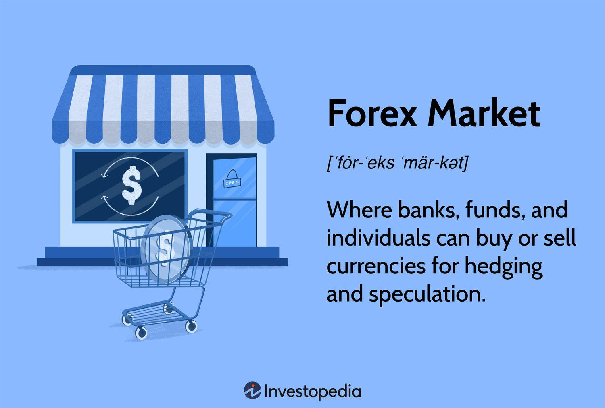

## Table of Contents

## What is the Forex market and why is it important?

The Forex market, also known as the foreign exchange market, is where people and businesses trade different currencies from around the world. It's like a big marketplace where you can exchange dollars for euros, or yen for pounds, and so on. This market is open 24 hours a day, five days a week, and it's the largest financial market in the world, with trillions of dollars traded every day.

The Forex market is important for several reasons. First, it helps countries and businesses do trade with each other. If a company in the United States wants to buy goods from Japan, it needs to exchange dollars for yen to pay for those goods. Without the Forex market, this would be much harder. Second, the Forex market affects the value of currencies, which can impact the economy of a country. If a country's currency gets weaker, it might make their exports cheaper and more attractive to other countries, but it can also make imports more expensive. So, the Forex market plays a big role in the global economy.

## How does the Forex market function on a daily basis?

The Forex market works every day by letting people and businesses trade currencies all around the world. It starts in one place, like Australia, and then moves to other places as the day goes on. This means it's always open somewhere, from Monday morning in Sydney to Friday afternoon in New York. People use banks, brokers, and online platforms to buy and sell currencies. They do this to make money from the small changes in currency values, or to protect themselves from those changes.

Every day, the Forex market is busy with lots of trading. The most common currencies traded are the US dollar, the euro, and the Japanese yen. Traders watch the news and economic reports to guess which way currency values will go. If they think a currency will go up, they buy it, hoping to sell it later for more money. If they think it will go down, they might sell it first. All this buying and selling affects the value of currencies, which can change the prices of things we buy and sell around the world.

## What are the main types of Forex markets?

There are two main types of Forex markets: the spot market and the derivatives market. The spot market is where currencies are traded right away. If you want to exchange dollars for euros now, you would use the spot market. It's like going to a currency exchange place at the airport. The price you get is based on what's happening in the market at that moment.

The derivatives market is different. It's where people trade contracts that are based on currencies, but they don't actually exchange the money right away. There are two main types of derivatives: forwards and futures. Forwards are private agreements between two people to exchange currencies at a future date, at a price they agree on now. Futures are similar, but they are traded on public exchanges and are standardized. People use derivatives to protect themselves from changes in currency values, or to try to make money from those changes.

## What are the key participants in the Forex market?

The Forex market has many different people and groups that take part in it. The biggest players are the big banks, like JPMorgan and Bank of America. They trade huge amounts of money every day, and they help set the prices for currencies. Central banks, like the Federal Reserve in the US, also play a big role. They can change the value of their country's currency by buying or selling it.

Besides banks, there are also businesses that use the Forex market to buy and sell things from other countries. If a company in Germany wants to buy parts from Japan, it needs to change euros into yen. Hedge funds and other investors also trade in the Forex market. They try to make money by guessing which way currency values will go. Lastly, there are regular people like you and me who might trade currencies through online platforms, hoping to make a little extra money.

## How do currency pairs work in Forex trading?

In Forex trading, currencies are traded in pairs. This means that when you trade, you are always buying one currency and selling another at the same time. For example, if you see a pair like EUR/USD, it means you are trading the euro against the US dollar. If you think the euro will get stronger compared to the dollar, you would buy the EUR/USD pair. If you think the euro will get weaker, you would sell the EUR/USD pair.

The first currency in the pair is called the base currency, and the second one is the quote currency. The price you see for a currency pair tells you how much of the quote currency you need to buy one unit of the base currency. For instance, if the EUR/USD pair is priced at 1.2000, it means you need 1.20 US dollars to buy one euro. As the price changes, it shows how the value of the two currencies is moving relative to each other.

## What are the basic strategies for Forex trading?

Forex trading can seem tricky, but there are some basic strategies that traders use to make decisions. One common strategy is called trend trading. This means watching the market to see if a currency pair is going up or down over time. If a currency pair is going up, a trader might buy it, hoping it will keep going up so they can sell it later for more money. If it's going down, they might sell it, hoping to buy it back later for less. Another strategy is called range trading. This is when a currency pair moves between two prices, like a high and a low. Traders buy when the price is low and sell when it's high, over and over again.

Another strategy is called [breakout](/wiki/breakout-trading) trading. This is when a currency pair suddenly moves out of its usual range. Traders watch for these breakouts and try to trade in the direction of the breakout, hoping the trend will continue. For example, if a currency pair breaks above its usual high, a trader might buy it, expecting it to keep going up. There's also a strategy called [carry](/wiki/carry-trading) trading, which is a bit different. This is when traders borrow money in a currency with a low [interest rate](/wiki/interest-rate-trading-strategies) and then use that money to buy a currency with a higher interest rate. They make money from the difference in interest rates, but it can be risky if the currency values change a lot.

These strategies help traders make sense of the Forex market and decide when to buy and sell. Each strategy has its own risks and rewards, and traders often use a mix of them depending on what's happening in the market. The key is to understand the market well and have a plan for what to do in different situations.

## What are the common tools and platforms used for Forex trading?

Forex traders use different tools and platforms to help them trade. One of the most popular platforms is MetaTrader 4 (MT4). It's easy to use and has lots of tools that help traders see what's happening in the market. They can use charts, indicators, and even write their own trading programs. Another platform is MetaTrader 5 (MT5), which is similar but has more advanced features. There are also other platforms like cTrader and TradingView, which traders like because they have good charts and tools for analyzing the market.

Besides platforms, traders use different tools to help them make decisions. One common tool is a charting software, which shows the price of currency pairs over time. Traders can add lines and shapes to these charts to see trends and patterns. Another tool is a Forex calendar, which shows when important economic news will come out. This helps traders know when the market might move a lot. There are also economic indicators and news feeds that traders use to stay up to date with what's happening in the world, which can affect currency values.

## What are the major risks involved in Forex trading?

Forex trading can be risky because the market can change quickly. One big risk is called market risk. This means the value of currencies can go up and down a lot, and if you're not careful, you could lose money. For example, if you buy a currency pair hoping it will go up, but it goes down instead, you'll lose money. Another risk is called leverage risk. In Forex trading, you can use leverage, which means borrowing money to trade more than you have. This can make your profits bigger, but it can also make your losses bigger if the market goes against you.

Another risk in Forex trading is called [liquidity](/wiki/liquidity-risk-premium) risk. This happens when there aren't enough buyers or sellers in the market, making it hard to trade. If you want to sell a currency pair but there's no one to buy it, you might have to wait or sell it for less than you wanted. There's also something called counterparty risk, which means the person or company you're trading with might not be able to pay you if they owe you money. This can happen if they go out of business or have financial problems. All these risks make Forex trading something you need to be careful about and learn a lot before you start.

## How does leverage affect Forex trading and what are its risks?

Leverage in Forex trading lets you trade with more money than you actually have. It's like borrowing money from your broker to make bigger trades. For example, if you have $1,000 and use 100:1 leverage, you can trade with $100,000. This can make your profits bigger if the market goes the way you want. But, it also makes your losses bigger if the market goes against you. So, if the market moves just a little bit in the wrong direction, you could lose all your money very quickly.

The main risk with leverage is that it can make small changes in the market have a big impact on your account. If you're using a lot of leverage and the market moves against you, you might get a margin call. This means you have to put more money into your account or close your trades to cover the losses. If you can't do that, your broker might close your trades for you, and you could lose more money than you started with. That's why it's important to use leverage carefully and understand how it can affect your trades.

## What are the differences between spot, forward, and futures Forex markets?

The spot Forex market is where people trade currencies right away. It's like going to a currency exchange at the airport and getting your money changed on the spot. The price you get is based on what's happening in the market at that moment. This market is used by people and businesses who need to exchange money for things like travel or buying goods from other countries. It's the most common type of Forex trading and is open 24 hours a day, five days a week.

The forward Forex market is different because it's about trading currencies at a future date. It's like making a deal with someone to exchange money later, at a price you agree on now. This is useful for businesses that want to protect themselves from changes in currency values. For example, if a company knows it will need to pay for something in another currency in six months, it can use a forward contract to lock in the price now. Forward contracts are private agreements and are not traded on public exchanges.

The futures Forex market is similar to the forward market, but it's more standardized and traded on public exchanges. Futures contracts are agreements to buy or sell a currency at a future date, at a price set today. They are used by traders and investors who want to bet on where they think currency values will go, or to protect themselves from changes in those values. Unlike forward contracts, futures contracts have set sizes and expiration dates, making them easier to trade but less flexible.

## How do economic indicators and global events impact Forex markets?

Economic indicators and global events can have a big impact on Forex markets. Economic indicators are like reports that tell us how well a country's economy is doing. Things like unemployment rates, inflation, and how much a country is making or spending can change the value of its currency. For example, if a country's economy is doing well, its currency might get stronger because more people want to buy it. On the other hand, if the economy is doing badly, the currency might get weaker. Traders watch these indicators closely to guess which way currency values will go.

Global events also play a big role in Forex markets. Things like political changes, natural disasters, or big news stories can make currency values move a lot. For example, if there's a war or a big election happening in a country, it can make people worried about that country's economy, and its currency might go down. Or, if a country finds a lot of oil or has a big new trade deal, its currency might go up. Traders need to keep an eye on the news and understand how these events might affect the countries they are trading.

## What advanced techniques can be used to manage and mitigate Forex trading risks?

One advanced technique to manage Forex trading risks is using stop-loss orders. A stop-loss order is like a safety net that you set up before you start trading. It tells your broker to close your trade if the price moves against you by a certain amount. This can help you limit your losses if the market doesn't go the way you expected. Another technique is called hedging, which is like taking out insurance on your trades. If you buy a currency pair, you can also sell another pair that moves in the opposite direction. This way, if one trade loses money, the other one might make money, helping to balance things out.

Another way to manage risks is by using a strategy called diversification. This means not putting all your money into one currency pair or one type of trade. Instead, you spread your money across different pairs and strategies. This can help you reduce the risk of losing all your money if one trade goes wrong. Also, using technical analysis can help you make better trading decisions. Technical analysis is when you look at charts and patterns to guess where the market might go next. By understanding these patterns, you can make more informed trades and manage your risks better.

## References & Further Reading

[1]: Bergstra, J., Bardenet, R., Bengio, Y., & Kégl, B. (2011). ["Algorithms for Hyper-Parameter Optimization."](https://dl.acm.org/doi/10.5555/2986459.2986743) Advances in Neural Information Processing Systems 24.

[2]: ["Advances in Financial Machine Learning"](https://www.amazon.com/Advances-Financial-Machine-Learning-Marcos/dp/1119482089) by Marcos Lopez de Prado

[3]: ["Evidence-Based Technical Analysis: Applying the Scientific Method and Statistical Inference to Trading Signals"](https://www.amazon.com/Evidence-Based-Technical-Analysis-Scientific-Statistical/dp/0470008741) by David Aronson

[4]: ["Machine Learning for Algorithmic Trading"](https://github.com/stefan-jansen/machine-learning-for-trading) by Stefan Jansen

[5]: ["Quantitative Trading: How to Build Your Own Algorithmic Trading Business"](https://www.amazon.com/Quantitative-Trading-Build-Algorithmic-Business/dp/1119800064) by Ernest P. Chan