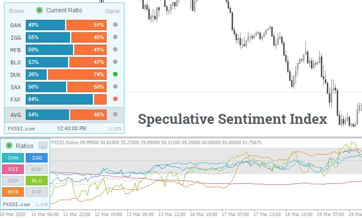

## Table of Contents

## What is the Forex market and why is sentiment important in it?

The Forex market, also known as the foreign exchange market, is where people and businesses trade different currencies. It's the biggest and most liquid market in the world. People trade currencies to make money from changes in their values. For example, if you think the US dollar will get stronger compared to the Euro, you might buy dollars with Euros. If the dollar does get stronger, you can sell it back for more Euros than you started with.

Sentiment is really important in the Forex market because it can move currency values a lot. Sentiment means how people feel about a currency. If many people feel good about a country's economy, they might want to buy that country's currency. This demand can make the currency's value go up. On the other hand, if people feel bad about an economy, they might sell that currency, which can make its value go down. So, traders often watch news and reports to guess how people might feel about different currencies and make their trading decisions based on that.

## What are Forex market sentiment indicators?

Forex market sentiment indicators are tools that help traders understand how other people feel about different currencies. These indicators show if traders are feeling positive or negative about a currency's future value. Some common sentiment indicators include the Commitment of Traders (COT) report, which shows what big traders are doing, and the Speculative Sentiment Index (SSI), which tells you if more traders are betting that a currency will go up or down.

Another important sentiment indicator is the news and economic reports. When good news comes out about a country's economy, like more jobs or higher growth, it can make people feel more positive about that country's currency. On the other hand, bad news can make people feel more negative. Traders often watch news websites and economic calendars to keep up with these changes in sentiment. By using these indicators, traders can make better guesses about where currency values might be heading next.

## How do sentiment indicators help in making trading decisions?

Sentiment indicators help traders make better decisions by showing them how other people feel about a currency. If a lot of traders are feeling positive about a currency, it might be a good time to buy it because its value could go up. On the other hand, if many traders are feeling negative, it might be a good time to sell because the currency's value could go down. By looking at these indicators, traders can see if they should follow the crowd or do the opposite, depending on their own strategy.

For example, the Commitment of Traders (COT) report can show if big traders are buying or selling a currency. If big traders are buying a lot, it might mean they think the currency will go up in value. A trader might then decide to buy that currency too. Another example is the Speculative Sentiment Index (SSI), which shows if more traders are betting on a currency going up or down. If the SSI shows a lot of people betting on a currency going down, a trader might decide to sell that currency or even buy it, thinking it might go up because so many people are betting against it. By using these indicators, traders can make more informed choices about when to buy or sell currencies.

## What are the most common types of sentiment indicators used in Forex trading?

The most common types of sentiment indicators used in Forex trading are the Commitment of Traders (COT) report, the Speculative Sentiment Index (SSI), and news and economic reports. The COT report is released weekly by the Commodity Futures Trading Commission (CFTC) and shows what big traders are doing. It tells you if they are buying or selling a currency, which can help you guess what might happen next. The SSI, provided by Forex brokers like IG Group, shows if more traders are betting that a currency will go up or down. This can help you see if you should follow the crowd or do the opposite.

News and economic reports are also important sentiment indicators. When good news comes out about a country's economy, like more jobs or higher growth, it can make people feel more positive about that country's currency. Bad news can make people feel more negative. Traders often watch news websites and economic calendars to keep up with these changes in sentiment. By using these indicators, traders can get a better idea of how other people feel about different currencies and make smarter trading decisions.

## How can beginners use sentiment indicators effectively?

Beginners can use sentiment indicators effectively by starting with the basics. The Commitment of Traders (COT) report is a good place to begin. It's released every week and shows what big traders are doing. If big traders are buying a lot of a currency, it might mean they think its value will go up. Beginners can look at this report to see if they should buy the same currency. The Speculative Sentiment Index (SSI) is another useful tool. It shows if more traders are betting that a currency will go up or down. If a lot of people are betting against a currency, a beginner might think about buying it, hoping it will go up because so many people are betting it will go down.

Another important thing for beginners is to keep an eye on the news and economic reports. Good news about a country's economy, like more jobs or higher growth, can make people feel good about that country's currency. Bad news can make people feel bad about it. Beginners can watch news websites and economic calendars to see these changes in sentiment. By using these simple tools, beginners can start to understand how other people feel about different currencies and make better trading decisions. It's all about paying attention and learning from what others are doing.

## What is the difference between sentiment indicators and technical indicators?

Sentiment indicators and technical indicators are two different kinds of tools that traders use to make decisions about buying and selling currencies. Sentiment indicators tell you how people feel about a currency. They show if traders think a currency's value will go up or down. For example, the Commitment of Traders (COT) report shows what big traders are doing, and the Speculative Sentiment Index (SSI) shows if more people are betting on a currency going up or down. News and economic reports also help because they can change how people feel about a currency.

On the other hand, technical indicators look at past price movements and other data to predict what might happen next. They use charts and numbers to find patterns and trends. For example, moving averages show the average price of a currency over time, and the Relative Strength Index (RSI) tells you if a currency is overbought or oversold. Technical indicators don't care about how people feel; they just look at the numbers. By using both sentiment and technical indicators, traders can get a fuller picture of what might happen in the market.

## How do you interpret the Commitment of Traders (COT) report in Forex?

The Commitment of Traders (COT) report is a weekly report that shows what big traders are doing with their money in the Forex market. It tells you if these big traders are buying or selling a currency. If you see that a lot of big traders are buying a currency, it might mean they think its value will go up. On the other hand, if they are selling a lot, it might mean they think the currency's value will go down. The COT report is useful because it gives you an idea of what the smart money is doing, and you can use that information to make your own trading decisions.

To interpret the COT report, you should look at the positions of different types of traders, like commercial traders, who are businesses that use the market to hedge their risks, and non-commercial traders, who are big investors trying to make money from trading. If you see that non-commercial traders are increasing their long positions (buying) in a currency, it might be a sign that the currency's value could go up. If they are increasing their short positions (selling), it might mean the currency's value could go down. By watching these trends, you can get a better idea of where the market might be heading and decide if you want to buy or sell a currency based on what the big traders are doing.

## What role does the Speculative Sentiment Index (SSI) play in Forex trading?

The Speculative Sentiment Index (SSI) is a tool that Forex traders use to see how other people feel about a currency. It tells you if more traders are betting that a currency will go up or down. If the SSI shows a lot of people are betting on a currency going up, it means the sentiment is positive. If it shows a lot of people are betting on it going down, the sentiment is negative. This can help traders decide if they should buy or sell a currency based on what other people are doing.

Traders can use the SSI in different ways. Some traders might follow the crowd and buy a currency if the SSI shows a lot of people are betting on it going up. Others might do the opposite and sell a currency if the SSI shows a lot of people are betting on it going up, thinking it might go down because so many people are betting on it going up. By looking at the SSI, traders can get a better idea of the market's mood and make smarter trading decisions.

## How can advanced traders combine multiple sentiment indicators for better insights?

Advanced traders can get better insights by using more than one sentiment indicator together. For example, they might look at the Commitment of Traders (COT) report and the Speculative Sentiment Index (SSI) at the same time. The COT report shows what big traders are doing, while the SSI shows how most traders are feeling about a currency. If the COT report shows big traders are buying a lot of a currency and the SSI shows most traders are also betting on it going up, it might be a strong sign that the currency's value will go up. But if the COT report shows big traders are selling and the SSI shows most traders are betting on the currency going down, it might be a good time to sell.

Traders can also add news and economic reports to the mix. If good news comes out about a country's economy and both the COT report and SSI are positive, it can make the case even stronger for buying that country's currency. On the other hand, if bad news comes out and both indicators are negative, it might be a clear sign to sell. By looking at all these indicators together, advanced traders can get a fuller picture of the market's mood and make smarter trading decisions.

## What are the limitations and potential pitfalls of relying on sentiment indicators?

Using sentiment indicators can be helpful, but they have some limits. One big problem is that they can change quickly. How people feel about a currency can shift fast because of new news or events. This means that even if a sentiment indicator looks good now, it might not be the same in a few hours. Also, sentiment indicators show what other people are thinking, but they don't always get it right. Sometimes, a lot of people can be wrong about where a currency is going, and following the crowd can lead to bad trades.

Another issue is that sentiment indicators don't tell the whole story. They are just one part of the puzzle. If you only look at sentiment and ignore other things like technical indicators or the big picture of the economy, you might miss important information. For example, a currency might look good based on sentiment, but if the country's economy is in trouble, the currency could still go down. So, while sentiment indicators can be useful, it's important to use them along with other tools and not rely on them too much.

## How do global economic events influence Forex market sentiment?

Global economic events can change how people feel about different currencies in the Forex market. When something big happens, like a country's economy growing faster than expected or a big company going bankrupt, it can make people think differently about that country's currency. For example, if a country reports more jobs than people thought, traders might feel good about that country's economy and want to buy its currency. But if there's bad news, like a country going into a recession, traders might feel bad about the currency and want to sell it.

These events can also make the market move a lot. When important news comes out, it can cause a lot of buying or selling in a short time. This can make currency values go up or down quickly. Traders need to keep an eye on the news and economic reports to understand how these events might change how people feel about different currencies. By doing this, they can make better guesses about where currency values might be heading next.

## What advanced strategies can expert traders employ using sentiment indicators to gain an edge in the market?

Expert traders can use sentiment indicators in smart ways to get an edge in the Forex market. One strategy is called contrarian trading. This means they look at sentiment indicators like the Speculative Sentiment Index (SSI) to see if a lot of people are betting on a currency going up or down. If most traders are betting one way, an expert trader might bet the opposite way. For example, if the SSI shows a lot of people betting on the Euro going down, an expert trader might buy the Euro, thinking it could go up because so many people are betting against it. This can be risky, but it can also lead to big wins if the trader's guess is right.

Another advanced strategy is to combine sentiment indicators with other tools. Expert traders might look at the Commitment of Traders (COT) report to see what big traders are doing, the SSI to see what most traders are feeling, and also use technical indicators to see past price movements. If all these indicators line up, like the COT report showing big traders buying a currency, the SSI showing most traders feeling positive, and technical indicators showing the currency's value going up, it can give a strong signal to buy that currency. By using these different tools together, expert traders can get a fuller picture of the market and make smarter trading decisions.

## References & Further Reading

[1]: ["Advances in Financial Machine Learning"](https://www.amazon.com/Advances-Financial-Machine-Learning-Marcos/dp/1119482089) by Marcos Lopez de Prado

[2]: ["Machine Learning for Algorithmic Trading"](https://github.com/stefan-jansen/machine-learning-for-trading) by Stefan Jansen

[3]: ["Quantitative Trading: How to Build Your Own Algorithmic Trading Business"](https://www.amazon.com/Quantitative-Trading-Build-Algorithmic-Business/dp/1119800064) by Ernest P. Chan

[4]: L. Caraiani, ["Macroeconomic Modelling, Sentiment, and Machine Learning"](https://www.kansascityfed.org/documents/921/2018-Machine%20Learning%20Approaches%20to%20Macroeconomic%20Forecasting.pdf) (2021), Springer.

[5]: T. Oberlechner, ["The Psychology of the Foreign Exchange Market"](https://books.google.com/books/about/The_Psychology_of_the_Foreign_Exchange_M.html?id=w--FXX4DQSIC) by Wiley Finance.

[6]: H. Biner, S.J. Hou, ["Combining Sentiment with Market Data to Predict Common Stock Price Movements"](https://www.mdpi.com/2079-9292/13/17/3396), Journal of Investment Management (2012).