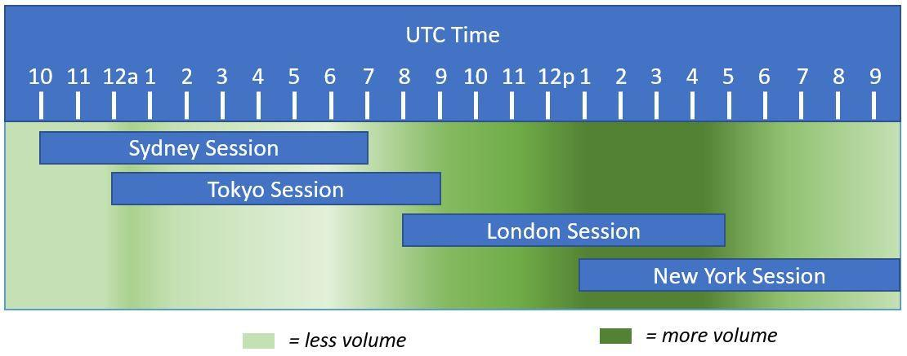

Forex trading, a global marketplace for the exchange of currencies, stands as one of the largest and most liquid financial markets in the world. Trillions of dollars are traded daily, reflecting its sheer scale and widespread appeal among investors and traders. The market operates 24 hours a day, five days a week, with trading occurring across major financial centers in different time zones. These include the Sydney, Tokyo, London, and New York sessions. Each session has distinct characteristics, influencing trading volume and volatility patterns, which traders must understand to optimize their trading strategies.

The continuous operation of forex trading is segmented into these major sessions, with notable overlaps such as the one between the London and New York sessions, leading to heightened trading activity and liquidity. Such overlaps create opportunities for traders to exploit market inefficiencies and optimize their trading portfolios.

Weekend trading is gaining traction as traders seek to capitalize on price movements that may occur when traditional markets are closed. This additional trading option offers potential advantages, though it is accompanied by unique risks such as lower liquidity and higher spreads. As such, it attracts a specific subset of traders willing to navigate the challenges of the weekend market landscape.

Algorithmic trading, or algo trading, is a game-changer in modern forex markets, leveraging technology to automate trading strategies, enhance trading speed, and minimize human error. Algorithms can process vast amounts of market data and execute trades at lightning-fast speeds, making them invaluable tools for traders seeking to maximize efficiency and profit potential.

This article aims to dissect the interplay between market hours, weekend trading, and algorithmic trading within forex markets. Understanding these elements is crucial for traders seeking to refine their strategies, manage risks effectively, and explore new trading avenues in this dynamic market. By the end, readers should have a deeper comprehension of how to navigate the forex landscape by aligning their trading practices with the unique characteristics of market hours and technological advancements in algorithmic trading.

## Table of Contents

## Understanding Forex Market Hours

The forex market operates 24 hours a day, five days a week, and is divided into four primary trading sessions: Sydney, Tokyo, London, and New York. These sessions collectively facilitate the continuous trading of currencies across the globe, supporting a dynamic and fluid market environment.

The Sydney session, opening at 10:00 PM GMT, marks the start of the [forex](/wiki/forex-system) trading week. It is relatively quieter but plays a crucial role in the progression of trading as it sets the tone for market sentiment. The Tokyo session, commencing at 12:00 AM GMT, brings increased activity as Asian traders enter the market. This session often experiences moderate [volatility](/wiki/volatility-trading-strategies), especially involving the Japanese yen and other Asian currencies.

The London session, starting at 8:00 AM GMT, is one of the most crucial forex sessions due to the sheer [volume](/wiki/volume-trading-strategy) of transactions it handles. Being a major financial hub, London's session contributes to a significant portion of daily forex turnover. Finally, the New York session, beginning at 1:00 PM GMT, overlaps with the London session, creating a period of heightened [liquidity](/wiki/liquidity-risk-premium) and increased trading opportunities. The overlapping of the London and New York sessions fosters a conducive environment for enhanced trading volumes and volatility, crucial for short-term traders and scalpers.

Overlapping market hours are significant because they coincide with the release of important economic reports and news updates, thereby intensifying market activities. The intersection between the London and New York sessions is particularly notable, providing traders with the opportunity to capitalize on increased volatility and liquidity. This overlap period is often marked by rapid price movements, offering numerous profitable opportunities for traders who adeptly navigate these volatile conditions.

Liquidity and volatility vary throughout the day, influenced by the opening and closing of different market sessions. Generally, trading during periods of high liquidity means tighter spreads and better execution of trades, which is advantageous for traders. Conversely, periods of low liquidity can result in wider spreads and potential difficulties in trade execution.

Aligning trading strategies with specific market hours can significantly impact profitability. For example, traders focusing on the EUR/USD might prefer the London session due to the concentration of European market participants, whereas those trading USD/JPY might find the Tokyo session more suitable.

To leverage peak trading times for higher profitability, traders can adopt various strategies. For instance, utilizing [breakout](/wiki/breakout-trading) strategies during the first hour of major sessions can exploit initial market movements. Additionally, focusing on currency pairs with the highest liquidity during overlapping sessions can maximize trading opportunities. Traders should also remain adaptable, modifying their strategies based on anticipated economic news releases that coincide with active trading hours.

Overall, a comprehensive understanding of forex market hours and the strategic timing of trades can enhance trading performance and profitability. By recognizing the patterns of market liquidity and volatility across sessions, traders can develop robust strategies tailored to the dynamic nature of the forex market.

## Weekend Trading: Opportunities and Risks

Weekend trading in the forex market refers to the trading activities conducted outside the standard trading hours, primarily occurring on Saturday and Sunday. Unlike the traditional forex market that operates 24 hours from Monday to Friday across various global time zones, weekend trading allows traders to engage with financial markets during these typically inactive days. This practice has gained attention due to the potential opportunities it presents for capitalizing on global events and developments that might occur during the weekends.

Several platforms and brokers have recognized the demand for weekend trading and offer services specifically tailored for this purpose. Notable brokers that facilitate weekend trading include IG, OANDA, and Forex.com, among others. These platforms provide access to a range of tradable instruments, including currencies, cryptocurrencies, and indices, while implementing specific conditions that suit the lower liquidity and different market dynamics typical of weekends.

The potential benefits of weekend trading include the opportunity to respond to geopolitical developments and economic announcements that occur during weekends, which could affect market conditions once the traditional trading week resumes. For example, a significant political election or an unexpected economic report during the weekend could lead to substantial market shifts. Traders engaging in weekend trading can position themselves to take advantage of these market movements before regular trading resumes.

However, weekend trading also comes with notable drawbacks. One primary concern is the reduced liquidity during weekends, which can lead to wider spreads and increased volatility. Furthermore, the forex market's dynamics during weekends can be less predictable, as fewer participants are engaged in trading, which might lead to erroneous price action and false breakouts. 

Risk management becomes paramount in weekend trading due to these unpredictable conditions. Traders are advised to employ stringent stop-loss orders to protect their positions from adverse price movements. Additionally, it is essential to adjust position sizes appropriately to mitigate risks associated with the elevated volatility and reduced market depth typical of weekend trading.

The psychological aspects of trading outside regular hours can also impact trader performance. The extended activity can lead to increased stress and the temptation to overtrade, particularly for those who might feel compelled to continuously monitor the markets. Traders must be disciplined and maintain clear boundaries to avoid burnout and ensure they are making rational decisions rather than impulsive ones driven by the fear of missing out.

In conclusion, while weekend trading offers unique opportunities to capitalize on market-altering events, it comes with inherent risks associated with reduced liquidity and volatility. Traders engaging in weekend trading must adopt comprehensive risk management strategies and maintain psychological discipline to navigate the distinct challenges presented by these non-standard trading hours.

## The Role of Algorithmic Trading in Forex

Algorithmic trading, often known as algo trading, employs computer programs to automate trading decisions in financial markets, including the foreign exchange (forex) market. This method leverages technological advancements to analyze market conditions and execute trades at speeds beyond the capabilities of human traders.

**Benefits of Using Algorithms in Forex**

Algorithms offer several key benefits in forex trading. They ensure efficiency by executing trades based on pre-set criteria, enabling traders to capture market opportunities that might otherwise be missed due to delays. Speed is a critical advantage, as trading algorithms can open and close positions in milliseconds, exploiting market inefficiencies effectively. Furthermore, algorithms minimize human error, which can occur due to emotional influences or simple miscalculations during trading activities.

**Examples of Common Algorithms Used in Forex Trading**

Several common algorithms are employed in forex trading, each with specific objectives:

1. **Trend-following Algorithms**: These algorithms identify and capitalize on long-term trends in currency pairs. They primarily use moving averages and momentum indicators to signal buy or sell positions.

2. **Mean Reversion Strategies**: This type of algorithm operates on the principle that prices and returns eventually revert to their historical mean. They look for deviations that indicate potential profit opportunities as prices correct themselves.

3. **Arbitrage Algorithms**: These algorithms seek to take advantage of price discrepancies between different markets or instruments, buying in a lower-priced market and simultaneously selling in a higher-priced one.

4. **Market Making**: Algorithms in this category provide liquidity to the market by simultaneously quoting buy and sell prices, aiming to profit from the bid-ask spread.

**Increasing Trend of Algo Trading**

The adoption of [algorithmic trading](/wiki/algorithmic-trading) has been on the rise in the forex markets, driven by advancements in computational capabilities and data analytics. This trend significantly influences market dynamics by increasing liquidity and tightening spreads, as algorithms engage in high-frequency trading activities. Moreover, they contribute to market transparency by reducing the impact of human biases.

**Considerations for Traders**

Traders interested in integrating algorithmic solutions into their practices should consider several factors:

- **Data Quality and Sources**: The effectiveness of algorithmic trading heavily relies on the quality and depth of data. Access to real-time, high-fidelity market data is essential for accurate analysis.

- **Backtesting and Optimization**: Before deploying an algorithm, thorough backtesting using historical data is crucial to assess its performance and refine parameters.

- **Risk Management**: Algorithmic strategies must include robust risk management protocols to mitigate potential losses from market anomalies or unforeseen events.

- **Regulatory Compliance**: Traders must ensure that their algorithmic strategies comply with regulatory requirements, as non-compliance can lead to significant legal and financial repercussions.

- **Technical Expertise**: A sound understanding of programming and trading theories is vital. Proficiency in languages like Python or R can greatly enhance the ability to develop and maintain trading algorithms.

Incorporating these considerations helps traders effectively employ algorithmic trading strategies in the forex market, enhancing their ability to achieve desired trading outcomes.

## Combining Weekend and Algo Trading

Algorithmic trading has revolutionized the way traders interact with the forex market, and its role is even more prominent when considering trading strategies during weekends. Algorithms offer several advantages that can be particularly beneficial for trading during weekends when market participation is typically lower and price movements can be more unpredictable. Algorithms operate based on pre-defined instructions which allow them to execute trades non-stop, maximizing opportunities without the constraints of human limitations or regular market hours.

### Automated Systems Operating Beyond Regular Hours

Automated trading systems are designed to function continuously, analyzing market conditions and executing trades based on specific criteria even beyond typical market hours. Such systems leverage historical data, technical indicators, and sophisticated mathematical models to make decisions. During the weekends, when manual trader intervention is minimal, these systems ensure that any available trading opportunity is not missed. The ability to process large volumes of data and execute orders at high speeds without the risk of emotional bias provides a significant edge in weekend trading scenarios.

### Case Studies of Successful Integration

Traders who have effectively combined algorithmic solutions with weekend trading illustrate the potential of this approach. For instance, a case study could involve a trader who focuses on cryptocurrencies, which can be traded 24/7, including weekends. By deploying algorithms tailored to monitor and act on crypto price fluctuations during weekends, traders have reported enhanced profit margins due to the reduced competition and noise compared to standard forex markets.

In another example, traders specializing in indices that have extended trading sessions take advantage of algorithms to capture [arbitrage](/wiki/arbitrage) opportunities that arise due to price discrepancies between the end of one market close on Friday and the open on Monday.

### Challenges in Less Liquid Weekend Markets

Despite the potential benefits, using algorithms in weekend trading also comes with challenges, predominantly due to the reduced liquidity and increased volatility during these times. Less liquid weekend markets can lead to wider spreads and higher slippage, making precise execution more difficult. Algorithms must be carefully calibrated to [factor](/wiki/factor-investing) in these conditions, possibly incorporating safety nets like stop-loss orders that are adaptive to the liquidity environment.

Furthermore, market data can be sparse, affecting the accuracy of algorithmic predictions. Maintaining an updated and reliable data feed is crucial to avoid misinformation that can lead to bank-breaking trades.

### Future Prospects for Seamless Integration

The future integration of algorithmic trading into weekend practices looks promising with advancements in [machine learning](/wiki/machine-learning) and [artificial intelligence](/wiki/ai-artificial-intelligence). These technologies are expected to enhance the adaptability and learning capacity of algorithms, enabling them to recognize patterns and perform optimizations that were previously not possible. The growing interest in decentralized finance (DeFi) platforms, operating on blockchain technology, will likely further aid the implementation of sophisticated algorithms able to operate autonomously even in the more fragmented weekend markets. As technology continues to evolve, the seamless integration of algorithmic solutions into weekend trading frameworks is anticipated to set new standards for 24/7 trading. 

In conclusion, while algorithmic trading presents certain challenges, its judicious application offers a compelling solution for accessing weekend trading opportunities with efficiency and precision. As technology progresses, traders who adopt these strategies will likely find themselves at the forefront of a continuously evolving market landscape.

## Conclusion

Forex trading, characterized by its 24-hour cycle, offers traders a dynamic environment shaped by distinct market hours across global financial centers such as Sydney, Tokyo, London, and New York. The cyclical nature of these sessions creates specific times of increased trading volume and liquidity, which traders can leverage to enhance profitability. Aligning trading strategies with these peak periods is crucial for maximizing potential gains and minimizing risks.

Weekend trading presents both opportunities and challenges. While it allows traders to capitalize on continuous market dynamics, it requires comprehensive strategies due to the possibility of low liquidity and heightened volatility. Successful weekend trading necessitates effective risk management and awareness of the psychological demands associated with trading outside regular hours.

Algorithmic trading significantly impacts modern forex markets by providing efficiency, speed, and precision that manual trading cannot match. Algorithms minimize human error and allow for continuous operation, making them invaluable in today’s fast-paced trading environments. As the influence of algorithmic solutions grows, traders must understand and adapt to these technologies to remain competitive.

As the forex market continues to evolve, staying informed and adopting flexible trading strategies becomes essential. For traders, this evolution is an invitation to explore and integrate these methodologies into their practices, thereby enhancing their trading journey and capitalizing on the dynamic opportunities within the forex market.

## References & Further Reading

[1]: ["Evidence-Based Technical Analysis: Applying the Scientific Method and Statistical Inference to Trading Signals"](https://www.amazon.com/Evidence-Based-Technical-Analysis-Scientific-Statistical/dp/0470008741) by David Aronson

[2]: ["Advances in Financial Machine Learning"](https://www.amazon.com/Advances-Financial-Machine-Learning-Marcos/dp/1119482089) by Marcos Lopez de Prado

[3]: ["Quantitative Trading: How to Build Your Own Algorithmic Trading Business"](https://books.google.com/books/about/Quantitative_Trading.html?id=j70yEAAAQBAJ) by Ernest P. Chan

[4]: ["Machine Learning for Algorithmic Trading"](https://github.com/PacktPublishing/Machine-Learning-for-Algorithmic-Trading-Second-Edition) by Stefan Jansen

[5]: Bergstra, J., Bardenet, R., Bengio, Y., & Kégl, B. (2011). ["Algorithms for Hyper-Parameter Optimization."](https://proceedings.neurips.cc/paper/2011/file/86e8f7ab32cfd12577bc2619bc635690-Paper.pdf) Advances in Neural Information Processing Systems 24

[6]: Lyons, R.K. (2002). ["The Microstructure Approach to Exchange Rates."](https://direct.mit.edu/books/monograph/2004/The-Microstructure-Approach-to-Exchange-Rates) MIT Press

[7]: Harris, L. (2003). ["Trading and Exchanges: Market Microstructure for Practitioners."](https://books.google.com/books/about/Trading_and_Exchanges.html?id=Rd9hDRR1Yx4C) Oxford University Press