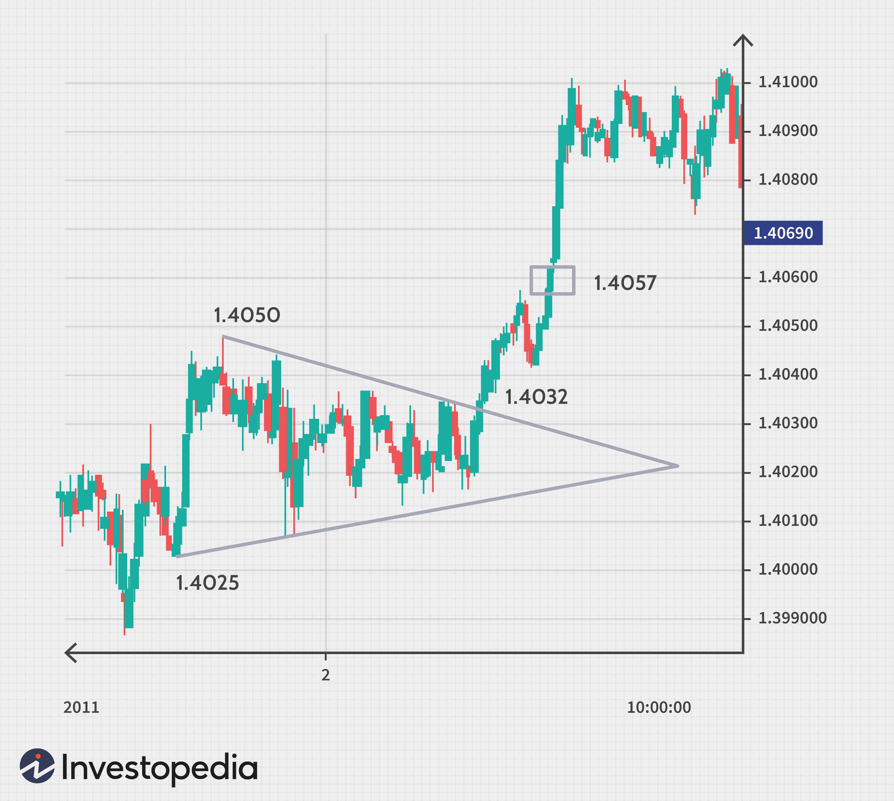

## Table of Contents

## What is the Forex market?

The Forex market, also known as the foreign exchange market, is where people buy and sell different currencies from around the world. It's the largest financial market globally, with trading happening 24 hours a day, five days a week. People trade currencies to make money from changes in their value, or to do business in other countries. For example, if you want to buy something from Japan, you might need to exchange your dollars for yen.

In the Forex market, currencies are traded in pairs, like USD/EUR or GBP/JPY. This means you're always buying one currency and selling another at the same time. The price of these pairs changes based on many things, like how well a country's economy is doing, political events, and even natural disasters. Traders use this information to guess which way the price will move and make trades based on those guesses. It's a fast-paced market where big profits can be made, but it can also be risky.

## How does a Forex transaction work?

A Forex transaction happens when someone wants to exchange one currency for another. Let's say you're in the United States and you want to buy something from Europe that costs 100 Euros. You go to a Forex broker or use an online platform and see that the exchange rate is 1 USD to 0.85 EUR. This means you need to give up about $117.65 to get 100 Euros. You make the trade, and now you have 100 Euros to spend in Europe.

The price of currencies changes all the time because of things like how well a country's economy is doing or big news events. Traders watch these changes closely. If they think the Euro will become more valuable compared to the Dollar, they might buy Euros now, hoping to sell them later for more Dollars. But if the Euro goes down in value instead, they could lose money. That's why Forex trading can be exciting but also risky.

## What are the main types of Forex transactions?

There are two main types of Forex transactions: spot transactions and forward transactions. A spot transaction is the most common type. It's when you buy or sell a currency and the exchange happens right away, usually within two days. For example, if you're traveling and need Euros, you might go to a bank or use an online service to get Euros right away. The price you get is called the spot rate.

The other type is a forward transaction. This is when you agree to buy or sell a currency at a set price, but the actual exchange happens in the future. It's like making a bet on what the exchange rate will be later. Companies often use forward transactions to protect themselves from big changes in currency prices. For example, if a company knows it will need to pay for something in Euros in six months, it can lock in today's rate to avoid surprises if the Euro goes up or down.

## What are the key participants in the Forex market?

The Forex market has many different kinds of people and groups that take part in it. The biggest players are banks. Big banks trade huge amounts of money every day. They do this for their own profit and also to help their customers, like big companies that need to buy or sell foreign currency. Governments and central banks also play a big role. They might step in to control their country's currency value or to keep their economy stable.

Besides banks and governments, there are also companies that trade in the Forex market. These companies need to buy and sell foreign currencies to do business in other countries. For example, a car company in Japan might need to buy Euros to pay for parts from Germany. Then there are individual traders and investors. These are people who trade currencies to make money from the changes in currency values. They might use online platforms and brokers to make their trades. Hedge funds and other big investors also participate, often making big bets on currency movements.

## How can someone start trading in the Forex market?

To start trading in the Forex market, first you need to choose a reliable Forex broker. A broker is like a middleman who helps you buy and sell currencies. Look for a broker that is regulated, has good reviews, and offers a platform that is easy for you to use. Once you pick a broker, you'll need to open an account with them. This usually involves filling out some forms and maybe sending some documents to prove who you are. After your account is set up, you'll need to put some money into it. This is called your trading capital, and it's what you'll use to make trades.

Next, you'll want to learn about the Forex market and how to trade. There are lots of resources online, like videos, articles, and even free demo accounts where you can practice trading without risking real money. It's important to understand things like how to read currency charts, what affects currency prices, and how to manage your risk. Once you feel ready, you can start making real trades. Remember, Forex trading can be risky, so it's a good idea to start small and only trade with money you can afford to lose.

## What are the most common currency pairs traded in the Forex market?

The most common currency pairs traded in the Forex market are called the major pairs. These are pairs that include the US Dollar (USD) and one other major currency. The most popular ones are the Euro against the US Dollar (EUR/USD), the US Dollar against the Japanese Yen (USD/JPY), the US Dollar against the British Pound (USD/GBP), and the US Dollar against the Swiss Franc (USD/CHF). These pairs are the most traded because they are very liquid, meaning lots of people are buying and selling them all the time, so it's easier to make trades.

Besides the major pairs, there are also minor pairs and exotic pairs. Minor pairs are ones that don't include the US Dollar, like the Euro against the British Pound (EUR/GBP) or the Euro against the Japanese Yen (EUR/JPY). Exotic pairs include one major currency and one from a smaller or emerging economy, like the US Dollar against the Mexican Peso (USD/MXN) or the Euro against the Turkish Lira (EUR/TRY). These pairs are less traded and can be more risky, but they can also offer bigger opportunities for profit.

## What factors influence Forex market transactions?

Many things can affect the Forex market and how people trade currencies. One big thing is how well a country's economy is doing. If a country's economy is growing and doing well, its currency might become more valuable because more people want to invest there. On the other hand, if a country's economy is struggling, its currency might lose value. Another important [factor](/wiki/factor-investing) is interest rates set by central banks. If a country raises its interest rates, it might attract more foreign money because investors can earn more from that country's bonds or savings accounts, making its currency stronger.

Political events and news can also have a big impact on the Forex market. For example, if there's a big election or a new law that might change how a country's economy works, it can make the currency go up or down. Natural disasters, like earthquakes or hurricanes, can also affect a country's economy and its currency. Traders watch all these things closely and try to guess how they will change currency prices. They use this information to decide when to buy or sell currencies, hoping to make a profit from the changes.

## How do leverage and margin work in Forex trading?

Leverage and margin are important parts of Forex trading that let you trade with more money than you actually have. Leverage is like borrowing money from your broker to make bigger trades. For example, if you have $1,000 and your broker offers 100:1 leverage, you can trade as if you had $100,000. This means you can buy or sell more currency and possibly make more money. But it's risky because if the trade goes the wrong way, you can lose more money than you started with.

Margin is the amount of money you need to put down to open a leveraged trade. It's like a deposit to cover part of your trade. If you're using 100:1 leverage, you might only need to put down 1% of the total trade value as margin. So, with $1,000, you could control a $100,000 trade. But if the trade starts losing money, your broker might ask for more money, which is called a margin call. If you can't add more money, your broker might close your trade to limit their risk. So, while leverage and margin can help you make bigger trades, they also increase the risk of big losses.

## What are the risks associated with Forex transactions?

Forex trading can be risky because the market changes all the time. The value of currencies goes up and down because of things like how well a country's economy is doing, big news events, and even natural disasters. If you guess wrong about which way a currency will move, you could lose money. Also, using leverage means you can trade with more money than you have, but it also means you can lose more than you started with. If the market moves against you, you might get a margin call, which means you need to add more money to your account or your broker will close your trade.

Another risk is that Forex markets can be hard to predict. Even people who know a lot about the market can get it wrong. Sometimes, big banks and other big players can move the market in ways that are hard to guess. Plus, there are risks from things like fraud and scams. Not all brokers are honest, and some might try to trick you. It's important to pick a good, regulated broker to help lower these risks. But even with a good broker, Forex trading can be risky, so it's smart to only trade with money you can afford to lose.

## How do Forex brokers make money?

Forex brokers make money in a few ways. One way is through the spread, which is the difference between the price they buy a currency at and the price they sell it at. When you make a trade, you pay the higher price to buy and get the lower price when you sell. This difference, or spread, is how brokers make money on every trade you do. The smaller the spread, the less you pay, but brokers still make a little bit of money on each trade.

Another way brokers make money is through fees and commissions. Some brokers charge a fee every time you make a trade, or they might take a percentage of the money you make. This is another way they earn money from your trading. Some brokers also offer extra services, like special trading tools or training, and they might charge extra for those.

Lastly, brokers can make money from something called swaps or overnight fees. If you keep a trade open overnight, you might have to pay or get paid a small amount of money based on the interest rates of the currencies you're trading. This can add up over time and is another way brokers make money.

## What advanced strategies can be used in Forex trading?

One advanced strategy in Forex trading is called [carry](/wiki/carry-trading) trading. This is when you borrow money in a currency that has a low [interest rate](/wiki/interest-rate-trading-strategies) and use it to buy a currency with a higher interest rate. The idea is to make money from the difference in interest rates. For example, if the Japanese Yen has a very low interest rate and the Australian Dollar has a higher one, you could borrow Yen, buy Australian Dollars, and earn the difference in interest. But this strategy can be risky because if the value of the Australian Dollar goes down compared to the Yen, you could lose more money than you make from the interest.

Another strategy is called [scalping](/wiki/gamma-scalping). Scalping is about making lots of small trades to make a little bit of money from each one. Traders who use this strategy watch the market very closely and try to make trades that last only a few seconds or minutes. They aim to take advantage of small price changes and add up small profits over time. This can be exciting but also stressful because you need to make quick decisions and be very focused on the market. It's also risky because even small mistakes can add up to big losses.

A third strategy is using technical analysis. This means looking at charts and patterns to guess where the price of a currency might go next. Traders who use technical analysis look for things like support and resistance levels, trend lines, and other patterns on the charts. They use this information to decide when to buy or sell. This strategy can be helpful because it's based on what the market has done before, but it's not perfect because past patterns don't always predict the future. It's important to combine technical analysis with other information, like news about the economy, to make better trading decisions.

## How do global economic events impact Forex market transactions?

Global economic events have a big impact on the Forex market because they can change how people think about different currencies. For example, if a country's economy is doing well, its currency might become more valuable because more people want to invest there. On the other hand, if there's bad news, like a big company going bankrupt or a country facing a lot of debt, its currency might lose value. Traders watch these events closely and try to guess how they will affect currency prices. For instance, if the U.S. releases a report showing that its economy grew a lot, the U.S. Dollar might go up because more people want to buy it.

Another way global economic events affect the Forex market is through interest rates set by central banks. If a country raises its interest rates, its currency might become more attractive to investors because they can earn more from that country's bonds or savings accounts. This can make the currency stronger. For example, if the European Central Bank raises interest rates, the Euro might go up in value. But if there's a big event like a financial crisis or a natural disaster, it can make people scared and want to move their money to safer places, which can cause big changes in currency values. Traders need to keep an eye on all these events to make smart trading decisions.

## What are the mechanics of buying and selling in Forex?

Forex trading provides investors with the opportunity to speculate on the fluctuations in currency values. This involves two primary strategies: taking a long position or a short position. A long position, or buying, occurs when a trader anticipates that a currency will appreciate in value, whereas a short position, or selling, is taken when a decrease in currency value is expected. These speculative strategies form the core of [forex](/wiki/forex-system) trading.

Leverage is a prominent feature in forex trading, allowing traders to control larger positions than what would be possible through their capital alone. Leverage amplifies both potential gains and potential losses, as it provides traders the means to execute trades with significant volumes using relatively small deposits. For example, a leverage ratio of 100:1 means that for every $1 of capital, a trader can control a position worth $100. The formula for calculating the leveraged amount is:

$$
\text{Leveraged Amount} = \text{Margin} \times \text{Leverage Ratio}
$$

The forex market is characterized by its vast daily trading [volume](/wiki/volume-trading-strategy), often exceeding $6 trillion, ensuring high [liquidity](/wiki/liquidity-risk-premium). This substantial liquidity facilitates the ease of entering and exiting trades rapidly, as there is typically a large number of buyers and sellers at any given time. High liquidity not only reduces the risk of significant price manipulation but also minimizes the bid-ask spread, providing better pricing to traders. As a result, forex trading offers a dynamic environment where traders can efficiently manage their entry and [exit](/wiki/exit-strategy) points based on market conditions and predictions.

## References & Further Reading

[1]: Bergstra, J., Bardenet, R., Bengio, Y., & Kégl, B. (2011). ["Algorithms for Hyper-Parameter Optimization."](https://papers.nips.cc/paper/4443-algorithms-for-hyper-parameter-optimization) Advances in Neural Information Processing Systems 24.

[2]: ["Advances in Financial Machine Learning"](https://www.amazon.com/Advances-Financial-Machine-Learning-Marcos/dp/1119482089) by Marcos Lopez de Prado

[3]: ["Evidence-Based Technical Analysis: Applying the Scientific Method and Statistical Inference to Trading Signals"](https://www.amazon.com/Evidence-Based-Technical-Analysis-Scientific-Statistical/dp/0470008741) by David Aronson

[4]: ["Machine Learning for Algorithmic Trading"](https://github.com/PacktPublishing/Machine-Learning-for-Algorithmic-Trading-Second-Edition) by Stefan Jansen

[5]: ["Quantitative Trading: How to Build Your Own Algorithmic Trading Business"](https://books.google.com/books/about/Quantitative_Trading.html?id=j70yEAAAQBAJ) by Ernest P. Chan