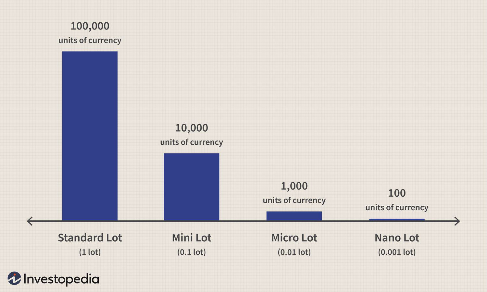

The forex market, recognized as the largest financial market globally, presents unique trading prospects for investors. With trillions of dollars traded daily, this market surpasses the size and liquidity of other financial markets, ensuring constant activity and numerous trading opportunities. Currency trading in the forex environment is characterized by the exchange of one currency for another among global participants, including corporations, governments, and individual traders. This continuous exchange and interaction contribute to the dynamic nature of the forex market.

For beginners in forex trading, starting with a forex mini account is a strategic approach that helps mitigate financial risk. Mini accounts allow traders to operate with smaller lot sizes, thus requiring less capital to begin trading. This feature offers newcomers a manageable way to gain experience and understanding of currency trading dynamics without exposing themselves to significant financial losses.

In this article, we will explore various facets of currency trading, focusing on the use of forex mini accounts as a means to enter the market safely and effectively. Additionally, we will discuss the rise of algorithmic trading (algo trading) in the forex market—a technological advancement that enables trades to be executed based on pre-defined criteria, enhancing speed and precision. This integration of technology signifies a substantial shift in trading strategy, allowing traders to capitalize on market trends more efficiently. As the forex market evolves, understanding these elements becomes crucial for anyone looking to participate successfully.

## Table of Contents

## Understanding the Forex Market

The forex market, also known as the foreign exchange or [FX](/wiki/fx-anomaly) market, serves as a global platform for the trading of currencies. Unlike centralized financial markets such as stock exchanges, the forex market is decentralized, operating through an over-the-counter (OTC) framework. This means trading is facilitated directly between participants such as banks, brokers, and financial institutions, without the intermediation of a central exchange.

In the forex market, currencies are traded in pairs, such as EUR/USD (Euro/US Dollar) or GBP/USD (British Pound/US Dollar). Each currency pair represents the exchange rate between two currencies, with the first currency known as the base currency and the second as the quote currency. This pairing system allows traders to speculate on the relative strength of one currency against another, seeking to profit from changes in exchange rates.

A significant feature of the forex market is its continuous operation, functioning 24 hours a day, five days a week. This is possible due to the global nature of the market, which spans across major financial centers in different time zones, such as London, New York, Tokyo, and Sydney. As one major market closes, another opens, allowing traders to engage at almost any time, catering to flexibility and urgency in trading operations.

Several factors influence currency rates in the [forex](/wiki/forex-system) market. Economic indicators, such as Gross Domestic Product (GDP) growth rates, employment [statistics](/wiki/bayesian-statistics), and inflation figures, can provide insights into a country's economic health, thereby impacting its currency's strength. Geopolitical events, including elections, political unrest, or international conflicts, can cause significant [volatility](/wiki/volatility-trading-strategies) as they may alter market perceptions and economic forecasts. Finally, market sentiment, which reflects the mood or psychology of traders and investors, often sways currency values through speculative trading, driving trends and short-term movements.

Overall, the forex market's unique characteristics, including its decentralized nature, continuous operation, and sensitivity to a broad array of economic and political factors, make it a dynamic and challenging environment for currency trading.

## The Benefits of Trading with a Forex Mini Account

A forex mini account offers a strategic advantage for traders looking to engage with the forex market while minimizing exposure to risk. Unlike standard accounts that typically require larger capital investment and involve trading in standard lot sizes of 100,000 units, mini accounts allow traders to participate with lot sizes of just 10,000 units of the base currency. This reduced lot size makes forex mini accounts highly accessible to beginner traders or those with limited initial capital.

One of the primary benefits of trading with a forex mini account is the reduced financial barrier to entry. Traders can start with a smaller initial deposit, which makes the forex market more inclusive for individuals who may not have significant investment funds. This accessibility enables new traders to gain exposure to currency trading, helping them acquire valuable practical experience with a lower financial commitment.

In addition to requiring a smaller initial capital, forex mini accounts serve as a risk management tool by minimizing potential losses. The smaller trade sizes mean that any adverse market movements have a proportionately smaller impact on the trader’s account balance. This feature provides a safer environment for novice traders to learn the mechanics of forex trading without the fear of incurring significant losses.

Forex mini accounts also provide traders with access to the same market data and trading tools available to those using standard accounts. Platforms supporting mini accounts offer comprehensive charts, technical analysis tools, and other resources necessary for informed trading decisions. This ensures that mini account holders can engage with the market using advanced software and analysis techniques, thereby leveling the playing field between different trader account sizes.

Overall, the use of a forex mini account is an effective way for traders to enter the forex market, manage risk prudently, and develop their trading skills before potentially scaling up their investment. The combination of reduced initial capital requirements, risk limitation, and comprehensive market access makes mini accounts an attractive choice for those new to forex trading.

## Algo Trading in Forex: An Emerging Trend

Algorithmic trading, or algo trading, has become an increasingly important [factor](/wiki/factor-investing) in the forex market, leveraging technology to automate trading decisions and executions. Algo trading involves the use of computer algorithms programmed with specific trading criteria, which can include timing, price, or mathematical models. This method of trading is noted for enhancing speed and accuracy, substantially reducing the likelihood of human error.

In the fast-moving forex market, where currency values can fluctuate rapidly, the ability to execute trades swiftly is crucial. Algo trading systems can process numerous transactions per second, allowing traders to capitalize on fleeting opportunities that might be missed by manual trading. With the functioning of algorithms, trades are executed close to real-time, ensuring that traders can lock in optimum prices.

Moreover, algorithms can handle vast volumes of data, analyzing complex datasets to identify patterns and trends that human traders may overlook. This capability allows for strategies that are data-driven and quantitatively sophisticated, making use of statistical methods to predict movements and devise strategies based on historical data. Algorithms can take into account multiple variables concurrently, optimizing decisions based on a wide range of market factors.

The transformation of the forex market through algo trading also lies in its capacity to implement strategies that would be challenging to monitor manually. For example, mean reversion or statistical [arbitrage](/wiki/arbitrage) can be effectively executed through algorithms, utilizing strategies dependent on slight price variations and high-frequency trading strategies.

The rise of algo trading offers significant competitive advantages to traders who are equipped with sophisticated tools and strategies. By reducing dependency on human judgment and emotion, algorithmic systems allow for a disciplined adherence to trading strategies. This systematic approach not only aims at enhancing profits but also mitigates the risks associated with volatile market conditions.

In conclusion, algo trading is increasingly dominating the forex landscape by offering tools that contribute to strategic trading decisions and efficient market operations. As technology evolves, it is likely to further advance, providing even more innovative ways to exploit market inefficiencies for those willing to invest in and embrace its potential.

## How to Get Started with Forex Mini Accounts and Algo Trading

Educating yourself on the basics of forex trading and the specific functionalities of forex mini accounts and [algorithmic trading](/wiki/algorithmic-trading) is crucial before entering the market. Start by understanding the fundamental concepts of forex trading, including how currencies are paired and traded, the mechanics of market operations, and the factors influencing currency prices. A plethora of online courses, tutorials, and [books](/wiki/algo-trading-books) are available to build this foundational knowledge.

Choosing a reputable and regulated forex broker is essential for secure trading. Ensure the broker offers mini accounts, which are designed for beginners with smaller initial capital requirements. These accounts allow trading in smaller lot sizes, minimizing potential losses while gaining valuable market experience. Additionally, verify that the broker supports platforms for algorithmic trading. This requires robust trading software capable of executing trades automatically based on pre-set rules and strategies.

Once a broker is selected, starting with a demo account is advisable. Most brokers provide demo accounts that simulate real trading without the financial risk. This allows traders to familiarize themselves with the trading platform's interface and functionalities. Traders can also practice executing trades, applying various strategies, and understanding market movements in real-time. Demo accounts are an excellent way to experience forex trading dynamics and refine your strategies before committing real capital.

Developing a solid trading plan is integral to successful forex trading. A well-crafted trading plan outlines your financial goals, risk tolerance, and specific strategies you intend to apply. This plan should define criteria for entering and exiting trades, risk management procedures such as setting stop-loss orders, and guidelines for evaluating your trading performance. As you transition to live trading, maintaining discipline and adhering to your trading plan is crucial for managing risks effectively.

When you feel confident in your understanding and have tested your strategies extensively in a demo environment, gradually transition to live trading using a forex mini account. This approach allows you to manage exposure and risk, providing the opportunity to build confidence and experience in the live market. As you gain proficiency, gradually increase your trading [volume](/wiki/volume-trading-strategy) and explore more advanced strategies, including the use of algorithmic trading to enhance trade execution speed and accuracy. 

Continual learning is vital, as the forex market is dynamic and influenced by ever-changing global economic conditions, requiring traders to adapt and refine their strategies for sustained success.

## Conclusion

Currency trading in the forex market presents extensive opportunities for traders who employ the right tools and strategies, enhancing their potential for success. Forex mini accounts serve as an invaluable starting point for novice traders, providing a way to engage with the market while managing financial exposure. By allowing participation with smaller lot sizes and lower initial capital requirements, these accounts offer a conducive environment for learning and skill development without the risk associated with standard accounts.

In addition, the integration of algorithmic trading (algo trading) into forex has marked a significant advancement in trading methodologies. Algo trading leverages sophisticated computer algorithms to execute trades based on predefined criteria, thereby enhancing the speed and precision of trades. This technological application reduces human error and allows for the rapid analysis of large datasets, which can be critical for identifying profitable trends and patterns. As a result, traders who adopt algo trading can gain a competitive advantage in the forex market, potentially improving their overall returns.

For traders at any level, the journey through the forex market is one of continual learning and adaptation. This environment demands an ongoing commitment to acquiring new knowledge and refining strategies to respond to the dynamic nature of currency trading. Whether utilizing mini accounts for risk management and education or deploying advanced algo trading strategies, successful forex trading is built on a foundation of informed decision-making and strategic flexibility.

## References & Further Reading

[1]: ["Forex Trading: The Basics Explained in Simple Terms"](https://www.amazon.com/FOREX-TRADING-Explained-Beginners-Strategies/dp/1535198567) by Adam Milton

[2]: "High-Frequency Trading: A Practical Guide to Algorithmic Strategies and Trading Systems" by Irene Aldridge

[3]: ["Algorithmic Trading: Winning Strategies and Their Rationale"](https://books.google.com/books/about/Algorithmic_Trading.html?id=WAlFDwAAQBAJ) by Ernest P. Chan

[4]: ["Foreign Exchange Demystified"](https://www.investopedia.com/ask/answers/08/what-is-foreign-exchange.asp) by David Creamer

[5]: ["Currency Trading for Dummies"](https://www.amazon.com/Currency-Trading-Dummies-Business-Personal/dp/1119824729) by Kathleen Brooks and Brian Dolan