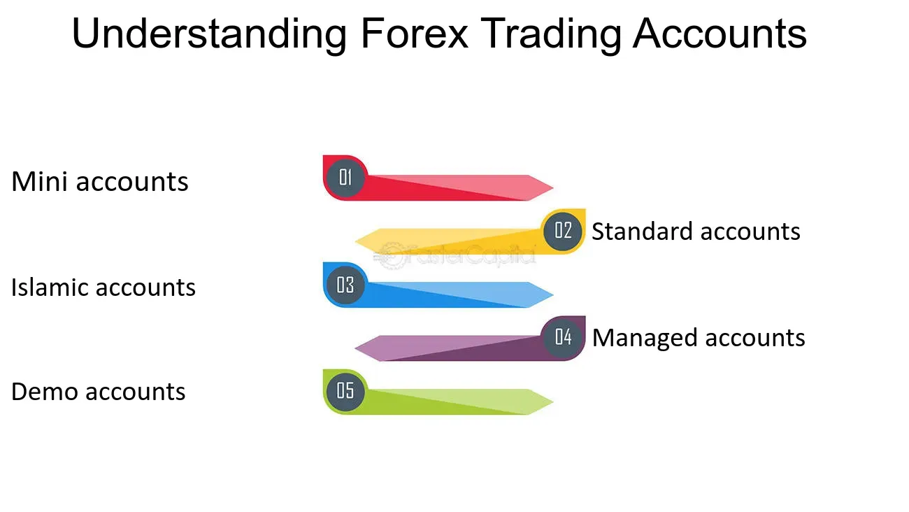

## Table of Contents

## What is a Forex mini account?

A Forex mini account is a type of trading account that allows people to trade currencies with smaller amounts of money. Instead of trading in standard lots, which are usually 100,000 units of currency, a mini account lets you trade in mini lots. Each mini lot is 10,000 units of currency. This makes it easier for people who don't have a lot of money to start trading in the Forex market.

Mini accounts are great for beginners because they help you learn how to trade without risking too much money. They also let you practice using real market conditions, but with less financial risk. Many brokers offer mini accounts with lower minimum deposits, sometimes as low as $100, making Forex trading more accessible to a wider range of people.

## How does a Forex mini account differ from a standard account?

A Forex mini account and a standard account mainly differ in the size of the lots you can trade and the amount of money you need to start. In a mini account, you trade in mini lots, which are 10,000 units of currency. This is smaller than the standard lot size of 100,000 units used in a standard account. Because the lot size is smaller, you can start trading with less money. Mini accounts often have lower minimum deposit requirements, sometimes as low as $100, while standard accounts might need a bigger initial deposit.

Another difference is the level of risk and the suitability for different types of traders. Mini accounts are great for beginners or people who want to trade with less risk. The smaller lot sizes mean you can practice trading without risking large amounts of money. On the other hand, standard accounts are better for experienced traders who can handle bigger trades and are comfortable with higher risks. Standard accounts might also offer more features and better trading conditions, but they require more capital and a deeper understanding of the market.

## What are the benefits of using a Forex mini account for beginners?

Using a Forex mini account is great for beginners because it lets them start trading with less money. Instead of needing a big amount to open a standard account, a mini account might only need around $100 to get started. This makes it easier for people who don't have a lot of money to try out Forex trading. Also, since mini accounts use smaller lot sizes, beginners can practice trading without risking too much money. This helps them learn the ropes without worrying about losing a lot if they make a mistake.

Another benefit is that mini accounts let beginners get real experience in the Forex market. They can trade with actual market conditions, which helps them understand how the market works. This hands-on experience is really important for learning how to trade well. Plus, many brokers offer tools and resources to help beginners learn, like tutorials and practice accounts. So, a Forex mini account is a good way for new traders to start their journey in the Forex market without feeling overwhelmed.

## What is the typical lot size for a Forex mini account?

The typical lot size for a Forex mini account is 10,000 units of currency. This is smaller than the standard lot size of 100,000 units used in regular accounts. Because the lot size is smaller, it's easier for people to start trading without needing a lot of money.

Using a mini account with a 10,000 unit lot size helps beginners practice trading without risking too much. It's a good way to learn how the Forex market works without feeling overwhelmed. This smaller lot size makes it possible for more people to try out Forex trading and see if it's right for them.

## How much capital is required to open a Forex mini account?

The amount of money you need to open a Forex mini account can be as low as $100. This is a lot less than what you might need for a standard account, which often asks for much more money to start. Because mini accounts need less money to open, they are a good choice for people who don't have a lot of money to spend on trading.

Having a lower entry cost makes it easier for beginners to start trading. With just $100, you can practice trading and learn how the Forex market works without risking too much money. This smaller amount helps more people try out Forex trading and see if it's something they want to do more of.

## What are the risks associated with trading using a Forex mini account?

Trading with a Forex mini account still has risks, even though you start with less money. The main risk is losing money. Even with smaller lot sizes, if the market moves against you, you can lose the money you put in. This is why it's important to understand the market and have a good trading plan to try and reduce these risks.

Another risk is getting too confident. Because you're starting with less money, you might feel like you can take bigger risks. But trading is always risky, no matter the size of your account. It's easy to make mistakes, especially when you're new to trading. So, it's good to be careful and not trade more than you can afford to lose.

Lastly, there's the risk of not managing your account well. With a mini account, you might think you don't need to keep a close eye on your trades. But all trading needs good management. You need to watch your trades, set stop-loss orders, and keep learning about the market. If you don't do these things, you could lose money even with a mini account.

## How does leverage work in a Forex mini account?

Leverage in a Forex mini account lets you control a bigger amount of money with a smaller amount of your own. For example, if you have a leverage of 1:100, you can trade $10,000 with just $100 of your own money. This means you can make bigger trades without needing a lot of money to start. Leverage can help you make more money if the market moves in your favor, but it also makes trading riskier because you could lose more money if the market goes against you.

Using leverage in a mini account is great for beginners because it lets them trade without needing a lot of money. But it's really important to understand how leverage works and use it carefully. If you use too much leverage, you could lose all the money in your account quickly. So, it's a good idea to start with lower leverage and learn how to manage your trades well before using higher leverage.

## Can a Forex mini account be used for automated trading?

Yes, a Forex mini account can be used for automated trading. Automated trading means using computer programs to buy and sell currencies without you having to do it yourself. These programs, called trading robots or expert advisors, can be set up to follow rules you make. This is great for people who don't have a lot of time to watch the markets all day. With a mini account, you can still use these robots to trade smaller amounts of money, which is good for beginners.

Automated trading in a mini account works the same way as in a standard account, but with smaller lot sizes. This means you can practice and learn how to use trading robots without risking too much money. It's a good way to see if automated trading is right for you. Just remember, even with automation, it's important to keep an eye on your trades and understand how the market works.

## What are the best strategies for managing a Forex mini account?

Managing a Forex mini account well means starting with a good plan. You should set clear goals for what you want to achieve and make a trading plan that fits those goals. This plan should include rules for when to buy and sell, how much money you're okay with risking on each trade, and how you'll keep track of your trades. It's also important to use stop-loss orders to limit how much you can lose on a trade. This helps protect your money if the market moves against you.

Another key part of managing a mini account is to keep learning and practicing. The Forex market can change a lot, so it's good to stay updated on what's happening. You can use demo accounts to practice your trading without risking real money. This helps you get better at trading and try out new strategies. Also, don't use too much leverage at first. Start with lower leverage to keep your risks small while you learn. Over time, as you get more comfortable and understand the market better, you can slowly increase your leverage if you want to.

## How do transaction costs and spreads impact Forex mini account trading?

Transaction costs and spreads can have a big impact on trading with a Forex mini account. When you trade, you have to pay a fee called a spread. This is the difference between the price you buy a currency at and the price you sell it at. For mini accounts, the spreads are usually a bit higher than for standard accounts. This means you might need the market to move more in your favor just to break even on a trade. It's important to look for a broker that offers lower spreads because it can save you money and make your trading more profitable.

Also, other transaction costs like commissions can add up over time. Some brokers charge a fee for each trade you make, and even though it might be small, it can affect your overall profits, especially if you're trading with smaller amounts of money like in a mini account. To manage these costs, you should compare different brokers and choose one that has low fees and spreads. This way, you can keep more of your profits and have a better chance of making money from your trades.

## What advanced techniques can be applied to maximize profits in a Forex mini account?

To maximize profits in a Forex mini account, one useful technique is using [scalping](/wiki/gamma-scalping). Scalping means making a lot of small trades in a short time, trying to make a little profit from each one. Since mini accounts use smaller lot sizes, scalping can help you make money without risking too much on each trade. It's important to pick the right times to trade and use quick decisions to take advantage of small market changes. Also, using tools like technical indicators can help you see when it might be a good time to buy or sell.

Another technique is using [carry](/wiki/carry-trading) trading. This is when you borrow money in a currency with a low [interest rate](/wiki/interest-rate-trading-strategies) and use it to buy a currency with a higher interest rate. The difference in interest rates can add up over time, giving you extra profit. With a mini account, you can start carry trading with less money, but you need to be patient because it takes time to see the benefits. It's also important to keep an eye on how the exchange rates between the two currencies change, because if the currency you bought goes down too much, you could lose money.

## How can one transition from a Forex mini account to a standard account?

Moving from a Forex mini account to a standard account is a big step that shows you're getting better at trading. To make this transition, you should first make sure you have enough money saved up. Standard accounts usually need a bigger amount of money to start, so you'll need to build up your savings from your mini account profits. It's also important to keep learning and practicing. Use the time with your mini account to try out different trading strategies and get good at managing your trades. When you feel confident and have enough money, you can talk to your broker about switching to a standard account.

Once you decide to switch, it's a good idea to start slow. You can begin by trading smaller amounts in your new standard account to get used to the bigger lot sizes. This helps you adjust without risking too much money right away. Also, remember that standard accounts might have different fees and spreads, so make sure to understand these before you fully switch over. By taking your time and being careful, you can make a smooth transition from a mini account to a standard account and keep growing as a trader.

## References & Further Reading

[1]: ["Forex Trading: The Basics Explained in Simple Terms"](https://www.amazon.com/FOREX-TRADING-Explained-Beginners-Strategies/dp/1535198567) by Adam Milton

[2]: "High-Frequency Trading: A Practical Guide to Algorithmic Strategies and Trading Systems" by Irene Aldridge

[3]: ["Algorithmic Trading: Winning Strategies and Their Rationale"](https://books.google.com/books/about/Algorithmic_Trading.html?id=WAlFDwAAQBAJ) by Ernest P. Chan

[4]: ["Foreign Exchange Demystified"](https://www.investopedia.com/ask/answers/08/what-is-foreign-exchange.asp) by David Creamer

[5]: ["Currency Trading for Dummies"](https://www.amazon.com/Currency-Trading-Dummies-Business-Personal/dp/1119824729) by Kathleen Brooks and Brian Dolan