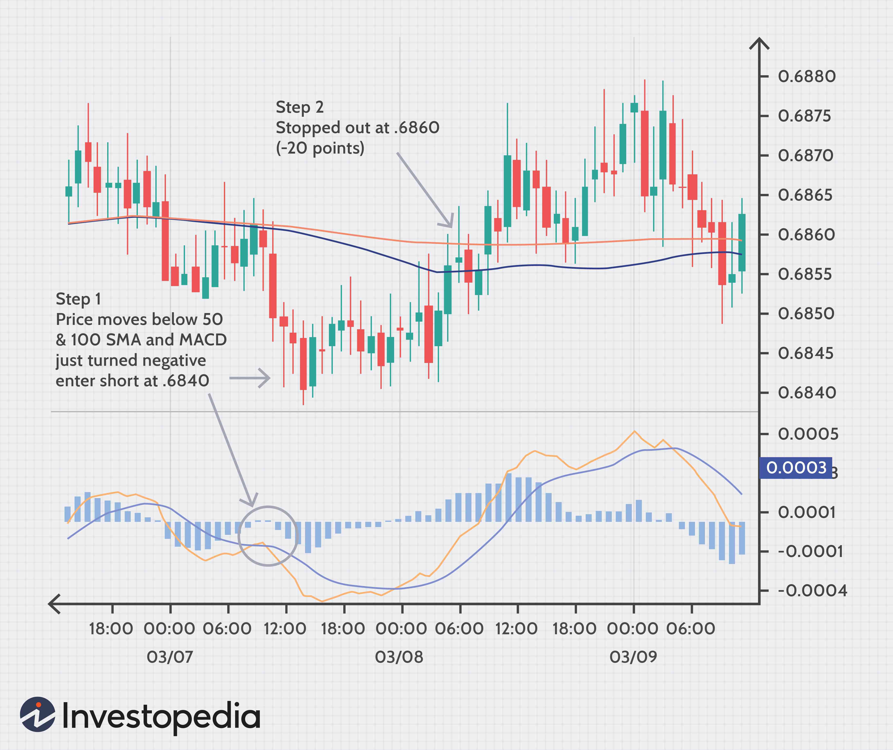

## Table of Contents

## What is a moving average in forex trading?

A moving average in forex trading is a tool that helps traders see the average price of a currency pair over a certain period of time. It smooths out price data by creating a constantly updated average price, which makes it easier to spot trends. Traders often use moving averages to figure out if a currency pair is going up or down over time.

There are different types of moving averages, but the two most common ones are the Simple Moving Average (SMA) and the Exponential Moving Average (EMA). The SMA calculates the average price of a currency pair over a specific number of periods, like 50 days or 200 days. The EMA, on the other hand, puts more weight on recent prices, so it reacts faster to new information. Traders choose which type to use based on how quickly they want to see changes in the trend.

## What is the MACD indicator and how does it work?

The MACD, which stands for Moving Average Convergence Divergence, is a popular tool used by traders to see if a currency pair's price is going up or down. It uses two lines: the MACD line and the signal line. The MACD line is found by taking the difference between a 26-period exponential moving average (EMA) and a 12-period EMA. The signal line is a 9-period EMA of the MACD line. When the MACD line crosses above the signal line, it can mean that it's a good time to buy because the price might go up. When the MACD line crosses below the signal line, it might be a good time to sell because the price might go down.

Another part of the MACD is the histogram, which shows the difference between the MACD line and the signal line. The histogram helps traders see the strength of the trend. If the histogram bars are getting bigger, it means the trend is getting stronger. If the bars are getting smaller, it means the trend is getting weaker. Traders use the MACD to help them decide when to buy or sell, but it's important to use it along with other tools and not just rely on it alone.

## How can moving averages be used to identify trends in forex markets?

Moving averages help traders see if a currency pair's price is going up or down over time. They do this by smoothing out the price data and showing an average price over a certain number of days. For example, if a trader uses a 50-day moving average, it shows the average price of the currency pair over the last 50 days. If the price is above the moving average, it might mean the price is going up, which is called an uptrend. If the price is below the moving average, it might mean the price is going down, which is called a downtrend.

Traders can also use two moving averages to see trends more clearly. They might use a shorter moving average, like a 20-day one, and a longer moving average, like a 50-day one. When the shorter moving average goes above the longer one, it can mean the start of an uptrend. When the shorter moving average goes below the longer one, it can mean the start of a downtrend. This method helps traders see changes in the trend more quickly and make better decisions about when to buy or sell.

## What are the different types of moving averages and which is best for forex trading?

There are two main types of moving averages that traders use: the Simple Moving Average (SMA) and the Exponential Moving Average (EMA). The SMA is calculated by adding up the closing prices of a currency pair over a certain number of days and then dividing by that number of days. For example, a 50-day SMA adds up the last 50 days of closing prices and divides by 50. The EMA, on the other hand, puts more weight on recent prices. It uses a formula that gives more importance to the most recent data, so it reacts faster to price changes than the SMA.

Choosing the best moving average for forex trading depends on what the trader wants to achieve. The SMA is good for traders who want to see the overall trend over a longer period of time because it is slower to react to price changes. This can help them avoid getting tricked by short-term price movements. The EMA is better for traders who want to catch trends early because it reacts faster to new price information. Many traders use both types of moving averages to get a complete picture of the market. They might use an EMA to spot quick changes and an SMA to confirm the overall trend.

## How does the MACD indicator help in identifying potential buy and sell signals?

The MACD indicator helps traders find good times to buy or sell by using two lines: the MACD line and the signal line. The MACD line is the difference between a 26-day EMA and a 12-day EMA. The signal line is a 9-day EMA of the MACD line. When the MACD line crosses above the signal line, it's called a bullish crossover, which can mean it's a good time to buy because the price might go up. When the MACD line crosses below the signal line, it's called a bearish crossover, which can mean it's a good time to sell because the price might go down.

Another way the MACD helps is with the histogram, which shows the difference between the MACD line and the signal line. The histogram bars can get bigger or smaller. If the bars are getting bigger, it means the trend is getting stronger, which can be a sign to keep holding a position. If the bars are getting smaller, it means the trend is getting weaker, which can be a sign to get ready to exit a position. Traders use these signals to make better decisions, but they also use other tools to make sure they're making the right choices.

## What is the significance of the MACD histogram in trading decisions?

The MACD histogram is a part of the MACD indicator that helps traders see how strong a trend is. It shows the difference between the MACD line and the signal line. When the histogram bars get bigger, it means the trend is getting stronger. This can be a good sign for traders to keep holding their position because the price might keep moving in the same direction. If the bars are getting smaller, it means the trend is getting weaker. This can be a warning for traders to get ready to sell or buy, depending on which way the price is going.

Traders use the MACD histogram to help them make better decisions about when to enter or exit trades. For example, if a trader sees the histogram bars getting bigger after a bullish crossover, it might be a good time to buy because the upward trend is getting stronger. On the other hand, if the bars start getting smaller after a bearish crossover, it might be a good time to sell because the downward trend is losing strength. By watching the MACD histogram, traders can get a better idea of the momentum behind price movements and make more informed trading choices.

## How can combining moving averages and MACD enhance trading strategies?

Combining moving averages and the MACD can make trading strategies better by giving traders more information about trends and when to buy or sell. Moving averages help traders see the big picture of whether a currency pair's price is going up or down over time. For example, a trader might use a 50-day moving average to see the overall trend and a 20-day moving average to catch changes in the trend more quickly. When these moving averages are used with the MACD, traders can get even more clues about the market. The MACD can show if the trend is strong or weak and help traders find the best times to enter or exit trades.

Using both tools together can help traders make better decisions. For instance, if the price of a currency pair is above both the 50-day and 20-day moving averages, and the MACD line crosses above the signal line, it can be a strong sign to buy. This is because the moving averages show an upward trend, and the MACD confirms that the trend is getting stronger. On the other hand, if the price is below both moving averages and the MACD line crosses below the signal line, it might be a good time to sell. By combining these indicators, traders can feel more confident in their trading choices and better understand the market's direction and momentum.

## What are the common time frames used for moving averages and MACD in forex trading?

In forex trading, people often use different time frames for moving averages and MACD to see the market in different ways. For moving averages, common time frames are 20 days, 50 days, and 200 days. The 20-day moving average helps traders see short-term trends, while the 50-day and 200-day moving averages help them see longer-term trends. Traders might use a short-term moving average like the 20-day one to catch quick changes in the market, and a longer-term one like the 200-day to see the big picture.

For the MACD, the most common time frames used are the 12-day, 26-day, and 9-day settings. The MACD line is the difference between a 26-day EMA and a 12-day EMA, and the signal line is a 9-day EMA of the MACD line. These settings help traders see if the price is going up or down and how strong the trend is. Some traders might change these time frames to fit their own trading style, but these are the most popular ones used in forex trading.

## Can you explain a basic trading strategy using moving averages and MACD?

A basic trading strategy using moving averages and MACD starts with looking at the moving averages to see if the market is going up or down. You can use a 50-day moving average to see the overall trend and a 20-day moving average to catch quick changes. If the price is above both moving averages, it might be a good time to buy because the market is going up. If the price is below both, it might be a good time to sell because the market is going down. By using these moving averages, you can get a clear picture of the trend and make better decisions about when to enter or exit trades.

Next, you can use the MACD to find the best times to buy or sell. The MACD has two lines: the MACD line and the signal line. When the MACD line crosses above the signal line, it's called a bullish crossover, which can be a sign to buy because the price might keep going up. When the MACD line crosses below the signal line, it's called a bearish crossover, which can be a sign to sell because the price might keep going down. You can also look at the MACD histogram, which shows how strong the trend is. If the histogram bars are getting bigger, it means the trend is getting stronger, so you might want to keep your position. If the bars are getting smaller, it means the trend is getting weaker, so you might want to get ready to exit your trade. By combining moving averages and MACD, you can make more informed trading choices and better understand the market's direction and momentum.

## How do you adjust the settings of moving averages and MACD to suit different market conditions?

When you want to adjust the settings of moving averages and MACD to fit different market conditions, you need to think about how fast the market is moving. If the market is moving quickly, you might want to use shorter time frames for your moving averages and MACD. For example, instead of using a 50-day moving average, you could use a 20-day one to catch quick changes. For the MACD, you might shorten the time frames from 12, 26, and 9 days to 6, 13, and 4 days. This way, you can react faster to what's happening in the market.

On the other hand, if the market is moving slowly, you might want to use longer time frames. A longer moving average like a 200-day one can help you see the big picture and avoid getting tricked by small price movements. For the MACD, you could use longer time frames like 24, 52, and 18 days to get a better idea of the overall trend. By changing these settings, you can make sure your trading strategy works well no matter how fast or slow the market is moving.

## What are the potential pitfalls or limitations of using moving averages and MACD together?

Using moving averages and MACD together can be really helpful, but there are some things to watch out for. One big problem is that these tools can give you false signals. This means they might tell you to buy or sell when it's not really the right time. For example, the price might move above the moving average or the MACD line might cross above the signal line, but then the price goes back down quickly. This can trick you into making a trade that doesn't work out.

Another issue is that moving averages and MACD can be slow to react to big changes in the market. They are good for seeing trends, but if the market suddenly moves a lot, these tools might not tell you about it right away. This can make you miss out on good chances to buy or sell. It's important to use other tools along with moving averages and MACD to get a better idea of what's happening in the market and make the best choices for your trades.

## How can advanced traders use moving averages and MACD in conjunction with other technical indicators to improve accuracy?

Advanced traders can use moving averages and MACD along with other technical indicators to make their trading decisions more accurate. One way to do this is by using the Relative Strength Index (RSI), which helps traders see if a currency pair is overbought or oversold. If the RSI shows that a currency pair is overbought and the MACD line crosses below the signal line, it might be a good time to sell. On the other hand, if the RSI shows that a currency pair is oversold and the MACD line crosses above the signal line, it might be a good time to buy. By using these indicators together, traders can get a better idea of when to enter or exit trades and avoid false signals.

Another useful indicator that advanced traders might use is the Bollinger Bands, which show how much the price of a currency pair is moving around. When the price touches the upper Bollinger Band and the MACD line crosses below the signal line, it could be a sign to sell because the price might be too high. If the price touches the lower Bollinger Band and the MACD line crosses above the signal line, it could be a sign to buy because the price might be too low. By combining these indicators with moving averages, traders can get a fuller picture of the market's direction and momentum, helping them make more informed trading decisions.

## What is the MACD Indicator and How Can It Be Understood?

The Moving Average Convergence Divergence (MACD) indicator is a fundamental tool for forex traders, providing insights into momentum changes and potential trend reversals. It operates by analyzing the relationship between two exponential moving averages (EMAs) of different periods. Typically, the standard settings involve a 12-period EMA and a 26-period EMA. 

### Components of MACD

#### MACD Line
The first component is the MACD Line, which is derived by subtracting the 26-period EMA from the 12-period EMA:

$$
\text{MACD Line} = \text{EMA}_{12} - \text{EMA}_{26}
$$

This line serves as the core of the indicator, reflecting the degree of separation between the short-term and long-term moving averages.

#### Signal Line
The second component is the Signal Line, a smoothed version of the MACD Line. It is calculated as a 9-period EMA of the MACD Line:

$$
\text{Signal Line} = \text{EMA}_{9}(\text{MACD Line})
$$

Traders closely observe the interaction between the MACD Line and the Signal Line to identify potential buy and sell signals.

#### MACD Histogram
The third component, the MACD Histogram, represents the difference between the MACD Line and the Signal Line:

$$
\text{MACD Histogram} = \text{MACD Line} - \text{Signal Line}
$$

The histogram provides a visual representation of the [momentum](/wiki/momentum), with positive values indicating an upward momentum and negative values suggesting a downward momentum.

### Purpose and Utility

Collectively, these three components facilitate the understanding of momentum shifts and potential reversals in the market. When the MACD Line crosses above the Signal Line, it may indicate a bullish signal, suggesting increasing upward momentum. Conversely, when the MACD Line crosses below the Signal Line, it may signal a bearish trend, suggesting a shift towards downward momentum.

The MACD Histogram serves as a visual and quantitative tool for assessing the velocity of the movement. Expanding bars suggest a growing divergence between the MACD Line and the Signal Line, pointing towards accelerating market trends, whereas contracting bars could indicate slowing momentum and potential for reversal. 

The MACD provides a multifaceted view of market dynamics, offering traders the ability to gauge momentum adjustments and trend directionality with greater clarity.

## How is MACD calculated?

The Moving Average Convergence Divergence (MACD) is a technical analysis tool used by traders to identify trends and momentum changes in asset prices. The calculation of the MACD involves three main components: the MACD Line, the Signal Line, and the MACD Histogram.

1. **Calculating the MACD Line**: The MACD Line is derived by subtracting the 26-period Exponential Moving Average (EMA) from the 12-period EMA. This operation highlights the shorter-term momentum in relation to the longer-term trend. The formula for the MACD Line is:
$$
   \text{MACD Line} = \text{EMA}_{12} - \text{EMA}_{26}

$$
   In Python, computing the MACD Line with the pandas library, which is widely used for handling time series data, might look like this:
   ```python
   import pandas as pd

   # Assuming 'prices' is a pandas Series of closing prices
   ema12 = prices.ewm(span=12, adjust=False).mean()
   ema26 = prices.ewm(span=26, adjust=False).mean()
   macd_line = ema12 - ema26
   ```

2. **Calculating the Signal Line**: The Signal Line is a 9-period EMA of the MACD Line, which helps smooth out the signal and reduces the likelihood of noise affecting trading decisions. The formula is:
$$
   \text{Signal Line} = \text{EMA}_{9}(\text{MACD Line})

$$
   This can also be computed in Python:
   ```python
   signal_line = macd_line.ewm(span=9, adjust=False).mean()
   ```

3. **Determining the MACD Histogram**: The MACD Histogram is the difference between the MACD Line and the Signal Line. It provides a visual representation of the momentum and is often used to spot potential buy or sell signals when it crosses above or below the zero line, respectively. The calculation is straightforward:
$$
   \text{MACD Histogram} = \text{MACD Line} - \text{Signal Line}

$$
   In Python, this is implemented as:
   ```python
   macd_histogram = macd_line - signal_line
   ```

The MACD is particularly valuable for traders due to its ability to provide clear signals regarding momentum shifts and potential reversals in the price of an asset. This indicator's applications range from manual trading strategies to sophisticated [algorithmic trading](/wiki/algorithmic-trading) systems.

## References & Further Reading

[1]: Pring, M. J. (2002). ["Technical Analysis Explained: The Successful Investor's Guide to Spotting Investment Trends and Turning Points"](https://www.amazon.com/Technical-Analysis-Explained-Fifth-Successful/dp/0071825177). McGraw-Hill.

[2]: Murphy, J. J. (1999). ["Technical Analysis of the Financial Markets: A Comprehensive Guide to Trading Methods and Applications"](https://archive.org/details/technicalanalysi0000murp). New York Institute of Finance.

[3]: Elder, A. (1993). ["Trading for a Living: Psychology, Trading Tactics, Money Management"](https://www.amazon.com/Trading-Living-Psychology-Tactics-Management/dp/0471592242). Wiley.

[4]: Kaufman, P. J. (2013). ["Trading Systems and Methods"](https://www.amazon.com/Trading-Systems-Methods-Website-Wiley/dp/1118043561), 5th Edition. Wiley.

[5]: Appel, G. (2005). ["Technical Analysis: Power Tools for Active Investors"](https://www.amazon.com/Technical-Analysis-Power-Active-Investors/dp/0132930048). Financial Times Press.