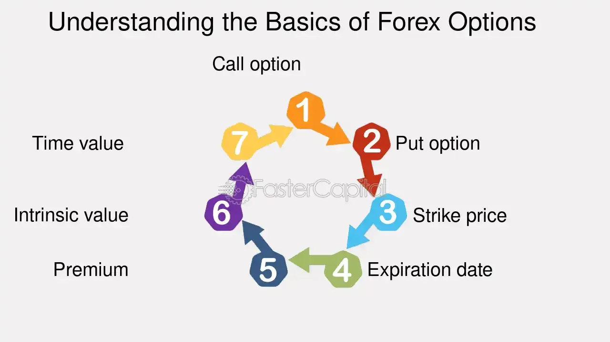

## Table of Contents

## What are forex options and how do they work?

Forex options are financial instruments that give traders the right, but not the obligation, to buy or sell a specific currency at a set price before a certain date. They are used in the foreign exchange market, where people trade different currencies. When you buy a forex option, you pay a price called a premium. This premium gives you the choice to trade the currency at the agreed price, called the strike price, no matter what the market price is at that time.

Using forex options can help traders manage risk or speculate on currency movements. For example, if you think the value of the Euro will go up against the US Dollar, you can buy a call option on the Euro. If the Euro does go up, you can use your option to buy Euros at the lower strike price and then sell them at the higher market price, making a profit. If the Euro doesn't go up, you can just let the option expire and only lose the premium you paid. This way, your potential loss is limited to the premium, while your potential profit can be much larger.

## What are the basic types of forex options?

There are two main types of forex options: call options and put options. A call option gives you the right to buy a currency at a specific price before a certain date. For example, if you think the Euro will get stronger against the US Dollar, you can buy a call option on the Euro. This means you can buy Euros at a set price, even if the market price goes up. If the Euro does go up, you can make money by buying at the lower set price and selling at the higher market price.

A put option, on the other hand, gives you the right to sell a currency at a specific price before a certain date. If you think the Euro will get weaker against the US Dollar, you can buy a put option on the Euro. This lets you sell Euros at a set price, even if the market price goes down. If the Euro does go down, you can make money by selling at the higher set price and buying back at the lower market price. Both call and put options help traders manage risk or make profits based on their predictions about currency movements.

## How can beginners start trading forex options?

To start trading [forex](/wiki/forex-system) options as a beginner, you first need to learn the basics. Forex options are about buying or selling currencies at a set price before a certain date. You should understand what call options and put options are, and how they can help you make money or protect against losses. It's also important to know about the risks involved. You can find a lot of free resources online, like articles, videos, and courses, that can teach you these things. Once you feel comfortable with the basics, you can move on to the next steps.

The next step is to choose a good broker. A broker is a company that lets you trade forex options. Look for a broker that is regulated, which means they follow rules to keep your money safe. Also, make sure they have a platform that is easy to use and offers tools to help you learn and trade. Many brokers let you start with a demo account, where you can practice trading with fake money. This is a great way to get experience without risking real money. Once you're ready, you can open a real account, deposit some money, and start trading forex options for real.

## What are the key factors to consider before trading forex options?

Before you start trading forex options, it's important to understand how they work. Forex options let you buy or sell currencies at a set price before a certain date. There are two main types: call options, which let you buy a currency, and put options, which let you sell a currency. You need to know the difference between these and how they can help you make money or protect against losses. Also, you should be aware of the risks involved. The price you pay for an option, called the premium, is the most you can lose if things don't go your way. But, if the currency moves in the direction you expected, you could make a lot more money.

Choosing the right broker is another key [factor](/wiki/factor-investing). A good broker is regulated, which means they follow rules to keep your money safe. They should also have a platform that's easy to use and offers tools to help you learn and trade. Many brokers let you start with a demo account, where you can practice trading with fake money. This is a great way to get experience without risking real money. Once you feel ready, you can open a real account, deposit some money, and start trading forex options for real. Taking the time to learn and choose wisely can make a big difference in your trading success.

## How do leverage and margin affect forex options trading?

Leverage and margin are important concepts in forex options trading. Leverage lets you control a larger amount of money than you actually have. For example, if you use leverage, you might be able to trade $100,000 worth of currency with just $1,000 of your own money. This can make your potential profits bigger, but it also makes your potential losses bigger. If the currency moves against you, you could lose more than the money you put in. Margin is the money you need to put down to use leverage. It's like a deposit that lets you borrow more money to trade. If the market moves against you, your broker might ask for more money, called a margin call, to keep your trade open.

Using leverage and margin can be risky, especially for beginners. It's important to understand how much you can lose and to use these tools carefully. If you're not careful, you could end up losing more money than you can afford. That's why many traders start with a demo account to practice trading with fake money before using real money. This way, they can get a feel for how leverage and margin work without risking their savings. Always remember to trade responsibly and only use money you can afford to lose.

## What are the common strategies used in forex options trading?

One common strategy in forex options trading is called the "straddle." With this strategy, you buy both a call option and a put option on the same currency pair at the same strike price and expiration date. You use this strategy when you think the currency will move a lot, but you're not sure which way it will go. If the currency moves a lot in either direction, one of your options will make money, and it might make more than the cost of both options. This can be a good way to make money from big moves in the market, but it can also be risky if the currency doesn't move much.

Another strategy is the "covered call." This is when you own a currency and sell a call option on it. You do this when you think the currency will stay the same or go up a little, but not too much. By selling the call option, you get money right away, called a premium. If the currency doesn't go above the strike price, you keep the premium and the currency. But if the currency goes above the strike price, the buyer of the call option can take your currency at the lower price. This strategy can give you extra income, but it also limits how much you can make if the currency goes up a lot.

A third strategy is the "protective put." This is when you own a currency and buy a put option on it. You use this strategy to protect your currency from going down in value. If the currency does go down, you can sell it at the higher strike price of the put option. This limits your loss if the currency goes down, but it also costs you money because you have to pay for the put option. Using a protective put can be a good way to manage risk, but it's important to think about the cost of the option and how it might affect your overall profit or loss.

## How do market conditions influence the feasibility of forex options trading?

Market conditions play a big role in how well forex options trading works. When the market is moving a lot, it can be a good time to trade options. Big moves in the market can make your options more valuable, especially if you're using strategies like straddles. But, if the market is not moving much, it can be harder to make money with options. In quiet markets, the cost of buying options, called the premium, might be more than what you can make from the trade. So, you need to look at how much the market is moving and decide if it's a good time to trade options.

Also, market conditions can affect how risky it is to trade forex options. In times when the market is very unpredictable, like during big news events or economic changes, the value of currencies can change a lot. This can make options more risky because the price can move against you quickly. On the other hand, if the market is stable and predictable, trading options might be less risky. You can use options to protect your trades or make small profits from small moves in the market. So, it's important to understand the market conditions and use them to decide if trading options is a good idea for you.

## What are the risks associated with forex options trading and how can they be managed?

Trading forex options can be risky. One big risk is losing money. When you buy an option, you pay a price called a premium. If the currency doesn't move the way you thought it would, you can lose all of that money. Another risk is using leverage, which lets you trade with more money than you have. This can make your profits bigger, but it can also make your losses bigger. If the market moves against you, you might have to put in more money or close your trade at a loss. Also, the market can be unpredictable, especially during big news events or economic changes, which can make your options less valuable or cause big losses.

To manage these risks, you can use different strategies. One way is to start with a demo account, where you can practice trading with fake money. This helps you learn how the market works without risking real money. Another way is to use stop-loss orders, which automatically close your trade if the market moves against you too much. This can limit your losses. You can also use options to protect your trades. For example, buying a put option can help you limit losses if the currency goes down. It's important to only trade with money you can afford to lose and to keep learning about the market to make better decisions.

## How does the regulatory environment impact forex options trading?

The rules and regulations set by governments and financial bodies can have a big impact on forex options trading. These rules are there to make sure that trading is fair and safe for everyone. For example, in some countries, you need to be a certain age or have a certain amount of money to trade forex options. Also, brokers need to follow these rules to keep your money safe. If a broker is not following the rules, they might get in trouble, and you might not be able to trade with them. So, it's important to choose a broker that is regulated by a trusted authority.

Regulations can also affect what kinds of trades you can make and how much you can trade. Some countries have strict rules about using leverage, which lets you trade with more money than you have. These rules can limit how much leverage you can use, which can change how much risk you take and how much money you can make or lose. Also, different countries might have different rules about taxes on forex options trading. Knowing these rules can help you plan your trades better and avoid any surprises. So, it's a good idea to learn about the regulations in your country before you start trading forex options.

## What advanced tools and analytics are available for expert traders in forex options?

Expert traders in forex options have access to many advanced tools and analytics that help them make better decisions. One important tool is technical analysis software, which lets traders look at charts and patterns to predict how currencies might move. This software can show things like moving averages, support and resistance levels, and other indicators that help traders see trends and make trades based on them. Another useful tool is [algorithmic trading](/wiki/algorithmic-trading) platforms, which use computer programs to make trades automatically based on set rules. These platforms can help traders take advantage of small changes in the market quickly and without emotions getting in the way.

In addition to these tools, expert traders can use advanced analytics like [volatility](/wiki/volatility-trading-strategies) analysis to understand how much a currency might move. This can help them choose the right options and manage their risk better. Risk management tools are also important, as they can help traders set stop-loss orders and other limits to protect their money. Some traders also use economic calendars and news feeds to stay updated on events that might affect the market. By combining all these tools and analytics, expert traders can make more informed decisions and improve their chances of success in forex options trading.

## How can one assess the profitability and feasibility of different forex options trading strategies?

To assess the profitability and feasibility of different forex options trading strategies, you need to look at how well they have worked in the past and how they might work in the future. One way to do this is by using [backtesting](/wiki/backtesting), which means you test a strategy on past market data to see how it would have done. This can give you an idea of how profitable the strategy might be. You should also think about the costs involved, like the premium you pay for options and any fees from your broker. Another important thing to consider is how much risk you are taking. Some strategies might make more money, but they can also lose more money if the market moves against you.

Another way to assess the feasibility of a strategy is by looking at the current market conditions. Different strategies work better in different situations. For example, a straddle strategy might be good when you expect big moves in the market, but it might not work well if the market is quiet. You should also think about your own goals and how much time you can spend on trading. Some strategies need a lot of attention and quick decisions, while others can be more hands-off. By considering all these factors, you can decide which strategies are most likely to be profitable and feasible for you.

## What are the future trends and innovations in forex options trading that experts should be aware of?

Experts in forex options trading should keep an eye on the growing use of [artificial intelligence](/wiki/ai-artificial-intelligence) (AI) and [machine learning](/wiki/machine-learning). These technologies can help traders make better predictions about how currencies will move. AI can look at a lot of data quickly and find patterns that humans might miss. This can make trading strategies more accurate and help traders make more money. Also, AI can help with risk management by automatically setting stop-loss orders and other limits to protect traders' money. As AI gets better, it will become a bigger part of forex options trading.

Another trend to watch is the rise of blockchain and cryptocurrencies in forex options trading. Some platforms are starting to offer options on cryptocurrencies like Bitcoin and Ethereum. Blockchain technology can make trading faster and more secure by keeping a clear record of all trades. This can help prevent fraud and make the market more trustworthy. As more people start using cryptocurrencies, the demand for forex options on these currencies might grow. Experts should learn about these new technologies and how they can be used in trading to stay ahead in the market.

## References & Further Reading

[1]: Lopez de Prado, M. (2018). ["Advances in Financial Machine Learning."](https://www.amazon.com/Advances-Financial-Machine-Learning-Marcos/dp/1119482089) Wiley.

[2]: Chan, E. P. (2009). ["Quantitative Trading: How to Build Your Own Algorithmic Trading Business."](https://github.com/ftvision/quant_trading_echan_book) Wiley.

[3]: Aronson, D. R. (2006). ["Evidence-Based Technical Analysis: Applying the Scientific Method and Statistical Inference to Trading Signals."](https://www.amazon.com/Evidence-Based-Technical-Analysis-Scientific-Statistical/dp/0470008741) Wiley.

[4]: Jansen, S. (2020). ["Machine Learning for Algorithmic Trading."](https://github.com/stefan-jansen/machine-learning-for-trading) Packt Publishing.

[5]: Bergstra, J., Bardenet, R., Bengio, Y., & Kégl, B. (2011). ["Algorithms for Hyper-Parameter Optimization."](https://dl.acm.org/doi/10.5555/2986459.2986743) Advances in Neural Information Processing Systems 24.