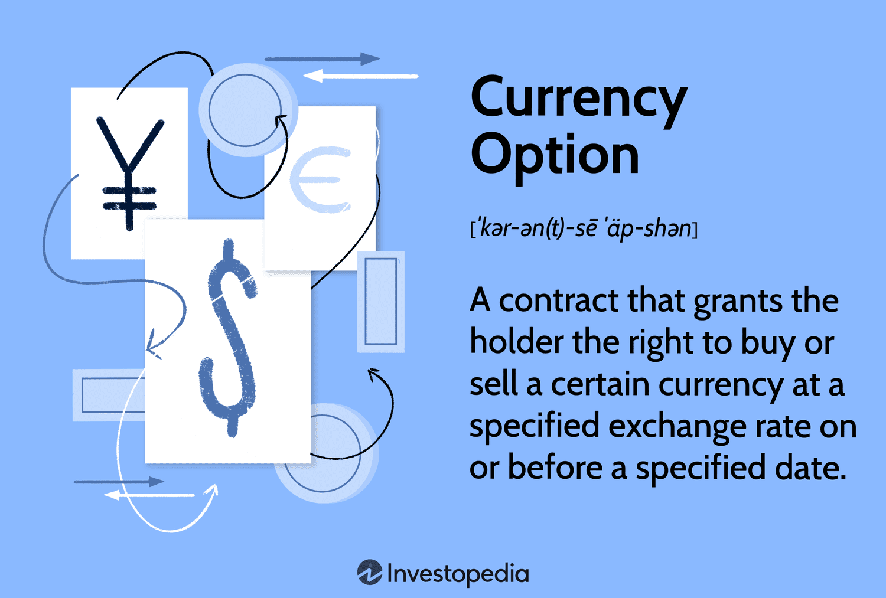

Forex options trading offers unique possibilities in the currency markets, utilizing options strategies to capitalize on fluctuations in currency prices. These financial derivatives grant traders the right, yet not the obligation, to engage in buying or selling currency pairs at pre-determined prices, which could lead to significant profits or mitigate potential losses. This article aims to shed light on the spectrum of trading strategies accessible through forex options, providing real-world trade examples and exploring how algorithmic trading can optimize these strategies. 

Irrespective of whether you are a seasoned market participant or a novice, grasping these fundamental concepts is vital for effective navigation and decision-making in the ever-volatile forex markets. Proficiency in forex options trading is enhanced through a comprehensive understanding of the mechanics and potential applications of these instruments. Additionally, the integration of algorithmic trading techniques can significantly augment the efficiency and accuracy of executing forex trading strategies.



The content of this article strives to equip you with a foundational knowledge of forex options and the role of algorithmic trading. This understanding is not only advantageous for making informed trading decisions but also crucial for developing a strategic edge in the competitive landscape of currency trading. The information provided will serve as a guide to aid in mastering these essential elements, ensuring that you are well-prepared to tackle the complexities of forex trading.

## Table of Contents

## Overview of Forex Options Trading

Forex options are financial derivatives that give traders the right, although not the obligation, to buy or sell currency pairs at pre-established prices. This unique characteristic allows traders to capitalize on favourable currency price movements without the mandatory execution required by spot forex trading or futures contracts.

Forex options serve as significant instruments for hedging against foreign exchange risks. By securing the right to exchange currency at a set rate, businesses and investors can mitigate the uncertainty tied to fluctuating exchange rates. For instance, a corporation with future receivables in a foreign currency can use a forex option to lock in the exchange rate, ensuring financial stability.

Furthermore, forex options offer considerable versatility and can be adapted to a range of trading strategies. Traders can utilize these options to speculate on market direction, [volatility](/wiki/volatility-trading-strategies), or changes in correlations between currency pairs. Given their flexibility, forex options strategies can be adjusted to suit various market conditions, such as trending, ranging, or volatile markets, as well as particular trader objectives like risk management or profit maximization.

Understanding the mechanics of [forex](/wiki/forex-system) options is crucial. A forex option consists of certain key components, including the strike price, premium, expiration date, and the underlying currency pair. The strike price is the rate at which the option holder can buy (call option) or sell (put option) the currency pair. The premium is the cost of purchasing the option, influencing the overall potential profitability of the trade. The expiration date is when the holder must decide to either exercise the option or let it expire worthless.

An in-depth comprehension of these elements and the potential scenarios they create is fundamental for effectively integrating forex options into any trading arsenal. By skillfully navigating these components, traders can leverage forex options to not only hedge against risks but also to explore growth and profitability in diverse market environments.

## Primary Types of Forex Options

Forex options trading encompasses two primary varieties: vanilla options and SPOT options. Understanding the distinctions between these types is essential for traders looking to leverage different market conditions and strategic objectives effectively.

Vanilla options represent the traditional structure of options trading, involving straightforward call or put options. A call option grants the buyer the right, but not the obligation, to purchase a currency pair at a predetermined price, known as the strike price, before the option's expiration date. Conversely, a put option allows the buyer to sell the currency pair at the strike price within the specified period. These options are typically favored by traders who have a specific view on the direction of currency movement. For instance, if a trader anticipates that a particular currency will increase in value, they might purchase a call option to capitalize on this potential appreciation.

The mechanics of vanilla options allow for a wide range of trading strategies. Traders can employ methods such as straddles or strangles, which involve buying multiple options to benefit from significant price movements regardless of direction. The flexibility of vanilla options makes them suitable for hedging positions as well, providing a way to mitigate potential losses from adverse currency movements.

On the other hand, SPOT options, also known as single payment options trading, operate as binary options. These options offer a fixed payout if the final condition, or outcome, of the contract is met by expiration. If the condition is not achieved, the trader receives nothing. The binary nature of SPOT options makes them attractive to traders who prefer all-or-nothing outcomes and wish to take clear stances on price movements over specific time frames. 

For example, a SPOT option might pay out if a currency pair exceeds a certain price level by the expiration date, offering potential returns without the need for complex strategies. However, the simplicity comes at the cost of higher risk, as the payout is contingent on meeting the specified condition entirely.

Each type of forex option possesses unique characteristics that cater to different trader profiles and market predictions. Vanilla options are typically employed by traders comfortable with more complex strategies and those seeking to hedge existing positions. In contrast, SPOT options appeal to those preferring a more straightforward, riskier approach, relying on clear-cut market forecasts.

Understanding these two types of forex options and their applications aids traders in aligning their trading activities with their risk tolerance and market outlook, effectively enhancing their forex trading strategies.

## Examples of Forex Options Trading

To effectively illustrate forex options trading, consider a scenario involving an investor who holds a bullish view on the euro. The investor decides to purchase a call option on the EUR/USD currency pair. This call option grants the investor the right, but not the obligation, to buy euros at a specified strike price before the expiration date.

### Example Scenario:

1. **Market Condition and Option Selection:**
   - Suppose the current EUR/USD exchange rate is 1.2000, and the investor anticipates that the euro will appreciate in the near future. 
   - The investor identifies a call option with a strike price of 1.2200 and expiring in one month.
   - The option premium, or the price paid for this right, is $500.

2. **Profitability Condition:**
   - For the call option to be profitable, the EUR/USD exchange rate must rise above the strike price (1.2200) plus the premium paid, effectively requiring the rate to exceed 1.2250.

3. **Outcome Analysis:**
   - **Profitable Outcome**: If, by expiration, the EUR/USD rate rises to 1.2300, the investor can exercise the option. The intrinsic value of the option at this point is:
$$
     \text{Intrinsic Value} = (\text{Final Rate} - \text{Strike Price}) \times \text{Notional Amount} = (1.2300 - 1.2200) \times \text{Notional Amount}

$$

     Subtracting the premium paid, the profit can be calculated as:
$$
     \text{Profit} = \left[(\text{Final Rate} - \text{Strike Price}) \times \text{Notional Amount}\right] - \text{Premium}

$$
   - **Non-profitable Outcome**: If the rate remains below or at 1.2200, the investor may choose not to exercise the option, limiting the loss to the $500 premium.

4. **Strategic Implications:**
   - This example demonstrates how forex options enable investors to speculate on currency movements with limited risk. The maximum loss is confined to the option premium, while gains could be substantial if the market moves favorably. 
   - Such trading strategies leverage market predictions to enhance profitability, allowing traders to capitalize on currency fluctuations while implementing effective risk management.

In conclusion, strategic positioning in forex options like call options on anticipated currency movements provides traders with flexibility to make informed investment decisions. By effectively managing potential profit and loss scenarios, traders can enhance their overall trading performance within the currency markets.

## Algorithmic Trading in Forex

Algorithmic trading refers to the use of computer programs and interfaces to execute trades at speeds and frequencies impossible for human traders. In the context of forex markets, [algorithmic trading](/wiki/algorithmic-trading) has become an essential tool due to the high [liquidity](/wiki/liquidity-risk-premium) and 24-hour market operations.

Forex algorithmic trading strategies leverage mathematical models and algorithms to make trading decisions, processing vast data sets rapidly to identify potential profitable trading opportunities. These algorithms can monitor several currency pairs simultaneously, detecting [arbitrage](/wiki/arbitrage) opportunities, or executing high-frequency trading ([HFT](/wiki/high-frequency-trading-strategies)) strategies that seek to capitalize on minute price changes. 

One of the primary advantages of algorithmic trading in forex is its ability to manage the complexity of multiple simultaneous trades. Traditional methods may require manual calculations and execution, which can be cumbersome and slow. In contrast, algorithmic systems can execute a pre-determined strategy thousands of times a second based on market trends and statistical analyses. For example, [statistical arbitrage](/wiki/statistical-arbitrage) algorithms can use mean reversion strategies where they predict currency pairs will return to their historical average values.

Python is a prevalent language used for implementing forex trading algorithms due to its simplicity and extensive libraries such as pandas for data manipulation, NumPy for numeric computations, and specific libraries like fxcmpy for direct interaction with forex trading platforms. A basic implementation of a moving average crossover algorithm, which is a common strategy in algorithmic trading, can be illustrated in Python:

```python
import pandas as pd
from fxcmpy import fxcmpy
import matplotlib.pyplot as plt

# Establishing the connection to the Forex platform
con = fxcmpy.fxcmpy(config_file='fxcm.cfg')

# Retrieving historical data
data = con.get_candles('EUR/USD', period='m1', number=1000)

# Calculating short and long moving averages
data['SMA10'] = data['bidclose'].rolling(window=10).mean()
data['SMA50'] = data['bidclose'].rolling(window=50).mean()

# Generating Buy/Sell signals
data['Signal'] = 0
data['Signal'][10:] = np.where(data['SMA10'][10:] > data['SMA50'][10:], 1, -1)

# Plotting
plt.figure(figsize=(10,5))
plt.plot(data['bidclose'], label='Close Price')
plt.plot(data['SMA10'], label='10-period SMA')
plt.plot(data['SMA50'], label='50-period SMA')
plt.legend()
plt.show()

# Disconnecting
con.close()
```

This example showcases a simple moving average crossover strategy where a 'buy' signal is generated when the short-moving average crosses above the long-moving average and vice versa for a 'sell' signal. Algorithmic trading efficiently handles such strategies at a scale that manual trading cannot match.

Moreover, algorithmic trading in forex is not without challenges. It requires significant infrastructure to support robust back-testing and real-time execution to ensure that the strategies perform as intended in live markets. Additionally, traders must consider latency, which can affect the profitability of high-frequency strategies, and must also incorporate effective risk management techniques to mitigate potential losses due to rapid market movements.

Overall, algorithmic trading offers powerful capabilities in forex markets to exploit market inefficiencies across diverse trading conditions.

## Benefits and Challenges of Algo Trading in Forex

Algorithmic trading has transformed forex markets by leveraging technology to enhance trading efficiency and precision. One of the significant benefits of algorithmic trading is its ability to execute high-speed trades without human intervention. This offers increased efficiency as algorithms can process vast streams of market data in real-time, identifying profitable trading opportunities that might be missed by human traders.

Furthermore, algorithmic trading reduces human error in trade execution. Since trades are executed based on pre-defined criteria, the emotional bias common in manual trading is minimized. Algorithms are capable of consistently adhering to trading strategies without deviation, leading to more disciplined and reliable trading outcomes.

Enhanced precision is another notable advantage. Algorithms calculate the optimal price and timing for trade execution, which is particularly beneficial in volatile forex markets. This precision ensures better control over entry and [exit](/wiki/exit-strategy) points, potentially maximizing profitability and minimizing losses.

However, there are challenges associated with algorithmic trading. A primary concern is the need for substantial technical infrastructure. High-frequency trading systems require reliable and sophisticated technology capable of handling numerous transactions per second. This includes powerful servers, complex algorithms, and robust internet connections, which can be costly to implement and maintain.

Risk management is another critical challenge. While algorithms can be designed to incorporate risk management strategies, market anomalies and unexpected events can lead to significant financial losses. Traders must continuously monitor and refine their algorithms to adapt to changing market conditions.

Technological reliability poses additional risks. System failures, software bugs, or power outages can disrupt trading activities, potentially resulting in financial losses. Traders are often required to have contingency plans in place to address such issues promptly.

As the integration of algorithmic trading in forex strategies becomes more prevalent, understanding these dynamics is essential. Traders need to weigh the benefits against the challenges, maintaining a balance between technological advancements and traditional risk management practices.

## Conclusion

Trading forex options and leveraging algorithmic trading strategies are powerful approaches in the dynamic world of currency trading. These strategies offer unique advantages, allowing traders to make informed decisions based on quantitative analysis and sophisticated modeling. However, to maximize their potential, traders must engage in careful analysis and effective risk management. By thoroughly understanding market conditions, traders can craft strategies that mitigate risks and capitalize on opportunities.

Incorporating algorithmic models can enhance precision and efficiency in trade execution. Such models enable traders to analyze vast datasets instantaneously, optimizing decision-making processes and allowing for high-frequency trades that are not feasible manually. Despite these advantages, traders must also account for the challenges algorithmic trading presents, such as the necessity for robust technological infrastructure, effective risk management protocols, and acute awareness of technical failures.

Continuous learning and adaptation to changing market conditions are essential for traders to excel in forex trading. Markets are inherently unpredictable, and success relies on a trader’s ability to stay informed about global economic trends, currency fluctuations, and technological advancements. By cultivating an adaptable learning mindset, traders can refine their strategies and remain competitive.

In sum, the integration of forex options and algorithmic trading offers a competitive edge, provided traders remain vigilant about their strategies and market dynamics. The path to sustained success in forex trading is paved with innovation, strategic planning, and a disciplined approach to risk management.

## References & Further Reading

[1]: Hull, J. C. (2018). ["Options, Futures, and Other Derivatives."](https://www.semanticscholar.org/paper/Options%2C-Futures%2C-and-Other-Derivatives-Hull/89bdee500c8623864fc9eb7a471546aa713acc44) Pearson, 10th Edition.

[2]: Derman, E. (2004). ["My Life as a Quant: Reflections on Physics and Finance."](https://archive.org/details/mylifeasquantref0000derm) Wiley.

[3]: ["Algorithmic and High-Frequency Trading"](https://www.amazon.com/Algorithmic-High-Frequency-Trading-Mathematics-Finance/dp/1107091144) by Álvaro Cartea, Sebastian Jaimungal, and José Penalva

[4]: Taleb, N. N. (2007). ["The Black Swan: The Impact of the Highly Improbable."](https://archive.org/details/10.1.1.695.4305) Random House.

[5]: Harris, L. (2003). ["Trading and Exchanges: Market Microstructure for Practitioners."](https://www.amazon.com/Trading-Exchanges-Market-Microstructure-Practitioners/dp/0195144708) Oxford University Press.

[6]: Chance, D. M. & Brooks, R. (2015). ["An Introduction to Derivatives and Risk Management."](https://books.google.com/books/about/Introduction_to_Derivatives_and_Risk_Man.html?id=b8PgBQAAQBAJ) Cengage Learning, 10th Edition.

[7]: ["Inside the Black Box: A Simple Guide to Quantitative and High-Frequency Trading"](https://www.amazon.com/Inside-Black-Box-Quantitative-Frequency/dp/1118362411) by Rishi K. Narang