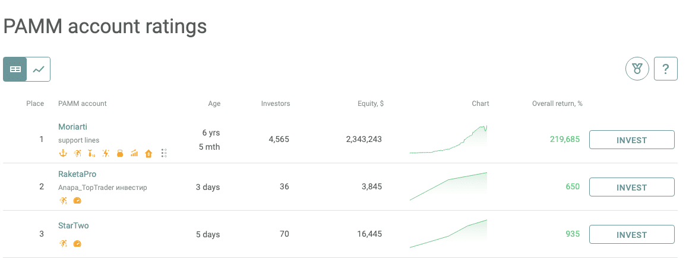

In the complex world of forex trading, investor preferences are increasingly leaning towards strategies that offer passive income opportunities. This trend is driven by the potential for significant returns without requiring active and ongoing engagement in the trading process. PAMM (Percentage Allocation Management Module) accounts represent a popular investment choice for those seeking to engage in forex trading without having to actively manage trades themselves. These accounts allow investors to harness the expertise of professional money managers, who handle the intricacies of forex trading on their behalf.

PAMM accounts operate by pooling funds from multiple investors. These pooled resources are then managed by skilled professionals, enabling larger and potentially more lucrative trades. This system benefits both the investors, who share in the profits or losses proportionately based on their financial contribution, and the managers, who typically receive a performance fee for their services. The structure of PAMM accounts offers a symbiotic relationship between investors seeking to maximize their returns and money managers looking to leverage larger pools of capital for trading.



This article will explore the workings of PAMM accounts, their advantages and disadvantages, and how they integrate with forex algorithmic (algo) trading. Algo trading, which involves the use of automated and pre-programmed trading instructions, can potentially enhance the effectiveness of PAMM accounts by executing trades at high speeds and exploiting short-lived market inefficiencies. Through this examination, potential investors will gain insights into how PAMM accounts can serve as a viable strategy for earning passive income while navigating the volatile forex trading landscape.

## Table of Contents

## Understanding PAMM Accounts

PAMM (Percentage Allocation Management Module) accounts are a type of investment vehicle within the forex trading market that enable investors to allocate their capital to experienced money managers. The primary advantage of these accounts is that they allow investors to participate in forex trading without the necessity of managing trades, relying instead on the expertise of selected managers to generate profits.

In a typical PAMM account, the capital from multiple investors is aggregated into a single trading pool. This pooled capital allows the money manager to execute larger trades than would be possible individually, potentially gaining from more favorable terms or enhanced market positions due to increased leverage. The collective nature of PAMM accounts serves as a mechanism to achieve substantial trading volumes, which can be advantageous in the forex market where liquidity and order size matter significantly.

The profits and losses generated by the manager's trading activity are apportioned among the investors proportionally to the size of their respective contributions to the pool. This proportional distribution is handled automatically by the platform managing the PAMM account, ensuring transparency and fairness.

For instance, if an investor contributes 10% of the total capital in the PAMM account, they will receive 10% of the profits (or bear 10% of the losses) after the trades executed by the manager. The distribution formula can be expressed mathematically as:

$$
\text{Investor's Profit/Loss} = \left( \frac{\text{Investor's Contribution}}{\text{Total Contributions}} \right) \times \text{Total Profit/Loss}
$$

Such automation and proportional distribution help in minimizing conflicts of interest, ensuring that all investors share equally in both success and risk based on their investment size. PAMM accounts are thus structured to offer a blend of professional management and flexible investment opportunities for both novice and experienced [forex](/wiki/forex-system) participants.

## Benefits of Using PAMM Accounts

PAMM (Percentage Allocation Management Module) accounts provide several benefits to investors seeking passive income opportunities in the forex trading market. One of the most appealing aspects of PAMM accounts is the ability to earn passive income. By allocating funds to these accounts, investors can potentially gain from the trading profits without the necessity of managing the trades themselves. This hands-off approach allows individuals to focus on other pursuits while their investments work for them.

Furthermore, PAMM accounts offer investors access to professional expertise. These accounts are typically managed by skilled money managers with proven track records and extensive experience in forex trading. By leveraging the expertise of these professionals, investors increase their chances of realizing consistent profits. The money managers analyze market trends, execute trades, and make informed decisions to capitalize on market opportunities, thus enhancing the potential for profit.

Another significant advantage of investing in PAMM accounts is the ability to diversify risk. Investors can allocate their funds across multiple PAMM accounts managed by different money managers, thereby spreading their risk. Diversification is a widely acknowledged strategy in investment management, as it reduces the impact of a poor-performing account on the investor's overall portfolio. By diversifying their investments, investors can better manage potential losses and optimize returns.

In summary, PAMM accounts offer a viable pathway for passive income generation, access to seasoned forex trading professionals, and diversification of investment risk. These benefits make PAMM accounts an attractive investment option for those looking to participate in forex trading without the demands of active management.

## Risks Involved With PAMM Accounts

Investing in PAMM (Percentage Allocation Management Module) accounts, while offering substantial benefits, also involves inherent risks that investors must consider. One of the primary concerns is capital loss. Since PAMM accounts involve entrusting funds to a professional money manager, there is always the risk that the manager might underperform. The manager's strategies might not yield the expected returns, which can result in losses proportional to the amount invested by each participant in the pool.

Another significant risk [factor](/wiki/factor-investing) is market [volatility](/wiki/volatility-trading-strategies). The forex market is known for its rapid price fluctuations, influenced by numerous factors such as economic indicators, geopolitical events, and market sentiment. These variables can lead to unpredictable outcomes and affect the performance of PAMM accounts. Even the most adept money managers can find it challenging to consistently navigate these volatile conditions to achieve profit.

Lastly, reliance on managers presents a considerable risk for investors in PAMM accounts. Investors must place a high degree of trust in the chosen money manager's judgment and trading strategies. The success of the investment heavily depends on the manager's ability to effectively assess and respond to market conditions. This dependence amplifies the importance of comprehensive due diligence when selecting a manager, as poor performance or strategic missteps can significantly impact the investor’s capital. Consequently, investors must carefully evaluate a manager's track record, experience, and strategy alignment with their own risk tolerance.

## Choosing a PAMM Account

When selecting a PAMM (Percentage Allocation Management Module) account, several factors must be evaluated to ensure a profitable and secure investment experience. First and foremost, examining the trading history and style of the money manager is pivotal. A manager's past performance offers insights into their expertise and adaptability to market fluctuations. Historical data, including win-to-loss ratios and drawdown [statistics](/wiki/bayesian-statistics), can help gauge effectiveness and risk-taking behavior.

The fee structure is another critical component to consider. Typically, these accounts involve performance and management fees, which can vary widely among managers. A common fee model is the performance fee, usually structured as a percentage of the profits generated. It's essential to understand how these fees are calculated and agree with them beforehand to avoid any surprises.

Furthermore, evaluating the account requirements is equally important. These requirements may include minimum deposit limits, lock-in periods, and withdrawal conditions. Understanding these terms establishes clarity and ensures that the investor can commit to the manager's strategies without financial constraints.

Conducting thorough due diligence is imperative before committing to a PAMM account. This involves meticulously reviewing the past performance results of prospective managers. Platforms hosting PAMM accounts often provide tools and metrics to assess a manager's performance, such as graphs displaying historical profit and loss data and volatility measures. It is advisable to compare these metrics across different managers to identify those who align best with your investment goals and risk appetite.

Finally, understanding the risk profiles of potential managers can mitigate exposure to unnecessary financial risk. Some managers might employ aggressive trading strategies, which can offer higher returns but also increase the likelihood of losses. Others might take a more conservative approach, prioritizing the preservation of capital. Aligning a manager's risk profile with your own risk tolerance is crucial for a harmonious investment relationship.

By carefully analyzing these factors—trading history and style, fee structures, account requirements, and risk profiles—investors can make informed decisions when choosing a PAMM account, thus optimizing their chances for success in the forex market.

## Role of Forex Algo Trading in PAMM Accounts

Algorithmic trading, often referred to as algo trading, has become an integral component of modern PAMM (Percentage Allocation Management Module) accounts. This advanced trading method involves the use of computer algorithms that follow a set of pre-programmed instructions to execute trades at speeds and frequencies that are beyond human capability. Algo trading capitalizes on the ability to swiftly process vast amounts of data, identify patterns, and execute trading orders in a fraction of a second, thereby offering a strategic advantage in the forex market.

One of the primary advantages of [algorithmic trading](/wiki/algorithmic-trading) within PAMM accounts is its ability to exploit market inefficiencies. Forex markets are known for their rapid fluctuations and large volumes, which present opportunities for knowledgeable traders to make profits from small price changes that occur frequently. Algorithms can be programmed to identify and react to these price discrepancies almost instantaneously, positioning PAMM managers to potentially enhance returns for their investors.

For instance, imagine an algorithm designed to identify [arbitrage](/wiki/arbitrage) opportunities within currency pairs. The algorithm might be structured as follows in Python:

```python
def arbitrage_opportunity(pair_prices):
    for pair in pair_prices:
        if pair['ask'] < pair['bid']:
            execute_buy_order(pair)
            execute_sell_order(pair)

def execute_buy_order(pair):
    print(f"Buying {pair['currency']} at price {pair['ask']}")

def execute_sell_order(pair):
    print(f"Selling {pair['currency']} at price {pair['bid']}")
```

This basic structure highlights the automated decision-making process used in algo trading, where trades are executed based on the defined criteria without human intervention.

Investors considering PAMM accounts should critically evaluate the algorithmic capabilities of the money managers they choose to engage with. This involves understanding the specific strategies employed, the technological infrastructure supporting the trading, and the track record of these algorithms in real-market conditions. Assessing these elements is crucial, as the effectiveness of an algorithm can significantly impact the success of a PAMM account.

Moreover, while the use of algorithms tends to mitigate the emotional aspects of trading and leverage computational efficiency, it does not eliminate risk. Misconfigured algorithms or those based on flawed models can lead to significant financial losses. Therefore, transparency regarding the algorithms' operations and their past performance is essential for informed decision-making.

In summary, the integration of algorithmic trading in PAMM accounts provides a sophisticated tool for seizing forex market opportunities, but it requires diligent assessment of both the algorithms and the expertise of the managers implementing them. As technology continues to evolve, the role of algo trading in PAMM accounts is likely to grow, offering both challenges and opportunities for investors.

## Conclusion

PAMM accounts serve as a promising vehicle for passive engagement in forex trading, providing investors with the chance to achieve profits while managing risk. By entrusting their funds to skilled money managers, investors can participate in the forex market without the need for constant monitoring and intervention. This structure leverages professional expertise, enhancing the probability of favorable returns through strategic trading.

Despite the clear benefits, PAMM accounts are not devoid of risks. The potential for capital loss exists if the money manager's performance does not align with investor expectations. However, these risks can be mitigated through meticulous selection of managers and thorough due diligence. Reviewing a manager's trading history, understanding their risk management strategies, and assessing their expertise in algorithmic trading are critical steps for investors to protect their capital.

Technology continues to transform forex trading, and PAMM accounts are well-positioned to take advantage of these advancements. By integrating algorithmic trading, money managers can execute trades with precision and speed, capitalizing on market opportunities that might be missed through manual trading. This technological alignment makes PAMM accounts an attractive proposition for investors seeking to benefit from professional management combined with cutting-edge trading strategies. As the trading landscape evolves, PAMM accounts are likely to remain a viable option for those pursuing a strategic, risk-managed entry into the forex market.

## FAQs

**What is a PAMM account in forex trading?**

A PAMM (Percentage Allocation Management Module) account is a type of trading account in which investors allocate their funds to be managed by a qualified and experienced money manager. The manager trades in the forex market on behalf of these investors. The main feature of a PAMM account is that profits and losses are distributed among investors based on the proportion of their investment in the account. This structure allows investors to benefit from the expertise of seasoned traders without needing to engage in the day-to-day operations of trading.

**How do PAMM accounts work?**

PAMM accounts operate by pooling the investments of multiple participants, which are then managed by a designated trader, who is usually a professional with substantial experience and a proven track record. Each investor owns a portion of the PAMM account proportional to their deposited amount. The manager executes trades on the entire collection of funds and allocates the results—profits or losses—among the investors according to their respective shares. The formula for allocating profits or losses is typically:

$$
\text{Investor's Share of Profit/Loss} = \left(\frac{\text{Investor's Deposit}}{\text{Total Managed Capital}}\right) \times \text{Total Profit/Loss}
$$

**What are the benefits of investing via PAMM accounts?**

1. **Passive Income**: Investors can potentially earn returns from forex trading without the need for active management.

2. **Professional Expertise**: By investing in PAMM accounts, individuals gain access to the skills and strategies of experienced money managers, increasing the potential for profitable trades.

3. **Diversification**: Investors have the ability to spread their risk by investing in multiple PAMM accounts managed by different traders with varying strategies.

**What should I consider when choosing a PAMM account?**

When selecting a PAMM account, it's vital to evaluate several factors:

- **Manager's Trading History**: Analyze the track record of the potential money manager, focusing on consistency and style.
- **Fees Involved**: Understand the fee structure, which may include management fees, performance fees, and other charges.
- **Account Requirements**: Be aware of any minimum investment requirements and other specific conditions tied to the account.
- **Risk Profile**: Review the risk levels associated with the manager's trading strategy to ensure they align with your risk tolerance.

**What are the risks associated with PAMM accounts?**

Investing in PAMM accounts entails several risks:

- **Capital Loss**: There is always a potential for financial loss if the money manager fails to perform as expected.
- **Market Volatility**: The forex market is known for its volatility, which can lead to unpredictable fluctuations in investment values.
- **Manager Dependence**: Investors rely heavily on the chosen manager's expertise and judgment, which means selecting an unqualified manager can be detrimental. 

Diligent research and careful selection can mitigate some of these risks, but they cannot be completely eliminated. Thus, investors should be prepared to accept potential losses.

## References & Further Reading

[1]: Duan, J., Zhang, Y., & Han, Y. "Risk and Return in Algorithmic Trading of Forex Markets: A Literature Review." [Journal of Financial Markets](https://www.mdpi.com/2073-445X/13/11/1742)30011-2/fulltext).

[2]: "Forex Trading Using PAMM, LAMM and MAM Accounts." Investopedia. [https://www.investopedia.com/articles/active-trading/040415/forex-trading-using-pamm-lamm-and-mam-accounts.asp](https://www.investopedia.com/articles/active-trading/040415/forex-trading-using-pamm-lamm-and-mam-accounts.asp).

[3]: Berkoski, J. (2015). "Machine Learning in Algorithmic Trading Market: A Comprehensive Review." [SSRN Electronic Journal.](https://papers.ssrn.com/sol3/papers.cfm?abstract_id=2676553)

[4]: "What is PAMM?" Forex Academy. [https://www.forex.academy/what-is-pamm-and-how-does-it-work/](https://www.forex.academy/what-is-pamm-in-forex/).

[5]: "Algorithmic Trading Strategies for Forex Markets." FXCM. [https://www.fxcm.com/uk/insights/algorithmic-trading-strategies-for-forex-markets/](https://resources.caih.jhu.edu/primo-explore/publication/HomePages/automated_trading_with_r_quantitative_research_and_platform_development.pdf).