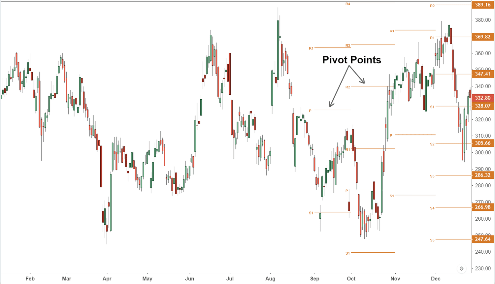

Pivot points have long been a staple in the toolbox of forex traders due to their simplicity and effectiveness. These technical analysis tools are crucial in forex trading for identifying key support and resistance levels. Originating from the commodities markets, pivot points have evolved into essential components of trading, especially with the rise of algorithmic trading.

The concept of pivot points centers around the idea that the price level usually transitions around a central point derived from the previous trading day's data. Specifically, pivot points are calculated using the high, low, and close prices, giving traders a forecast of potential market movements. This method provides a straightforward framework to predict changes in price direction, thereby helping in making informed trading decisions.



In algorithmic trading, pivot points play a significant role. They serve as criteria for entering and exiting trades by helping define critical levels of support and resistance. Automated systems can leverage these points to make trading decisions that are free from human emotions, making trades more consistent and strategic. 

Through a comprehensive exploration of pivot points, their historical context, and their modern applications, traders can integrate these tools into their strategies effectively. By understanding their utility, traders are better equipped to predict market behaviors and enhance their trading performance. Pivot points, therefore, not only aid in making insightful predictions but also help traders refine their overall strategy to capitalize on market opportunities.

## Table of Contents

## Understanding Pivot Points

Pivot points are essential tools in technical analysis, primarily utilized to identify potential turning points in the forex market. Their origins trace back to floor traders in the commodities markets who developed them as a simple yet effective method for predicting market trends. Over time, this practice has become integral to forex trading, providing traders with crucial insights into support and resistance levels.

Pivot points are derived from the previous day's price data, specifically the high, low, and closing prices. The calculations begin with the primary pivot point, often denoted as $P$, which is computed using the formula:

$$

P = \frac{\text{High} + \text{Low} + \text{Close}}{3} 
$$

This value serves as a central reference from which additional support and resistance levels are calculated. Support levels, typically noted as $S1, S2, \ldots$, and resistance levels, denoted as $R1, R2, \ldots$, are determined using straightforward formulas that incorporate the primary pivot point and previous price data.

One of the key advantages of pivot points is their predictive nature, offering traders the ability to anticipate possible future price movements. By analyzing these points, traders can identify significant levels at which they might expect the market to react, either bouncing off a support level or encountering resistance.

There are several variations of pivot points, each offering a distinct calculation method and application suitable for different trading strategies. Classic pivot points continue to be popular due to their simplicity and wide acceptance. Variations like Fibonacci, Woodie, Demark, and Camarilla pivot points introduce unique elements into their calculations. For instance, Fibonacci pivot points integrate Fibonacci ratios to refine the estimation of support and resistance levels, offering more precision in certain trading contexts.

Each variant of pivot points has unique characteristics that can align with a trader's specific objectives. Woodie's pivot points, for example, place greater weight on the current trading session's data, making them particularly advantageous for short-term trading. Meanwhile, Camarilla pivot points provide additional levels of support and resistance, which can be beneficial for intraday trading.

Understanding the different types of pivot points and their respective methodologies allows traders to select the most appropriate version for their trading objectives and market conditions. In doing so, they can use pivot points to enhance their market analysis and improve decision-making processes.

## How to Calculate Pivot Points

Calculating pivot points is a crucial aspect of technical analysis in [forex](/wiki/forex-system) trading, providing traders with an objective framework for predicting future market movements. The primary pivot point (P) is determined by calculating the average of the high (H), low (L), and close (C) prices from the previous trading day, using the formula:

$$
P = \frac{H + L + C}{3}
$$

Once the primary pivot point is established, traders can derive support and resistance levels to enhance their market analysis. The typical support (S) and resistance (R) levels are calculated as follows:

- Resistance Level 1 (R1) = $(2 \times P) - L$
- Resistance Level 2 (R2) = $P + (H - L)$
- Support Level 1 (S1) = $(2 \times P) - H$
- Support Level 2 (S2) = $P - (H - L)$

These basic calculations offer a framework for identifying potential reversal levels or where price [momentum](/wiki/momentum) could increase.

Alternative methods for calculating pivot points cater to different trading styles and market conditions, including Fibonacci, Woodie's, and Camarilla pivot points. Each of these methods applies unique adjustments to the standard formula:

- **Fibonacci Pivot Points** incorporate Fibonacci retracement levels into the calculation of support and resistance levels. For example, additional levels might be computed by using the P as a base and applying Fibonacci values, such as 38.2% or 61.8% of the high-low range.

- **Woodie’s Pivot Points** place a greater emphasis on the current trading session by assigning a different weight to the closing, opening, high, and low prices. The formula adjusts to prioritize recent price movements, making it particularly useful in volatile market environments.

- **Camarilla Pivot Points** offer more nuanced support and resistance levels with a focus on intraday trading. This method uses a unique mathematical formula calibration to predict potential turning points within a trading session.

Selecting the appropriate pivot point calculation is dependent on a trader’s specific strategy and prevailing market conditions. Traders should choose a method that aligns best with their trading approach, risk tolerance, and the market environment they are operating in. By diversifying the methods of calculation, traders can optimize their insight into price movements and enhance their predictive accuracy in the forex market.

## Types of Pivot Points and Their Applications

Pivot points are a fundamental tool utilized by traders to identify support and resistance levels. There are several types of pivot points, each offering unique methodologies and applications to suit diverse trading needs. Understanding these types allows traders to select the most appropriate for their strategies.

**Classic Pivot Points** are the most widely used due to their simplicity and ease of calculation. They provide one central pivot point and multiple support (S1, S2) and resistance levels (R1, R2) based on the previous trading day's high, low, and close prices. The simplicity of classic pivot points makes them a staple in traders' toolkits, suitable for identifying entry and exit points efficiently.

**Fibonacci Pivot Points** integrate Fibonacci retracement levels, calculated by deriving extra support and resistance levels using the Fibonacci sequence. They offer more refined levels by incorporating key ratios such as 38.2%, 61.8%, and 100%. This method provides traders with additional insights into potential reversal levels and market sentiment shifts.

Formula for Fibonacci Pivot Points:
$$
\text{R1} = \text{P} + 0.382 \times (\text{High} - \text{Low})
$$
$$
\text{S1} = \text{P} - 0.382 \times (\text{High} - \text{Low})
$$
Where P is the pivot point calculated as:
$$
P = \frac{\text{High} + \text{Low} + \text{Close}}{3}
$$

**Woodie's Pivot Points** place greater emphasis on the current day’s data rather than the previous day’s close, making them particularly appealing for short-term traders. The calculations apply more weight to the current period, potentially capturing the mood of the ongoing session. This approach can provide more accurate pivot calculations in fast-moving markets.

Formula for Woodie's Pivot Point:
$$
P = \frac{\text{Current High} + \text{Current Low} + 2 \times \text{Current Close}}{4}
$$

**Camarilla Pivot Points** are designed specifically for intraday trading, offering more granular support and resistance levels. They calculate up to eight levels of support and resistance, focusing on potential reversal points. Camarilla levels provide traders with multiple zones of price action, which can be particularly useful in highly volatile markets.

Formula for Camarilla Pivot Points:
$$
\text{R4} = \text{Close} + (\text{High} - \text{Low}) \times 1.1/2
$$
$$
\text{S4} = \text{Close} - (\text{High} - \text{Low}) \times 1.1/2
$$

Each type of pivot point offers distinct advantages and can be chosen based on the trader's objectives and market conditions. Classic pivot points offer simplicity; Fibonacci pivot points provide enhanced precision; Woodie's pivot points cater to intra-session trends; and Camarilla pivot points offer intricate intraday support and resistance levels. By selecting the appropriate pivot type, traders can better tailor their strategies to market dynamics.

## Integrating Pivot Points in Algorithmic Trading

Algorithmic trading, commonly referred to as algo trading, utilizes computer algorithms to automate trading activities based on predefined criteria with the aim of executing trades at optimal prices and speeds. A crucial component that can be integrated into these algorithms is pivot points, which are instrumental in defining support and resistance levels—critical indicators in decision-making processes.

Pivot points serve as a robust mechanism by identifying potential market turning points, thus providing traders with objective levels to inform entry and [exit](/wiki/exit-strategy) decisions. When integrated into [algorithmic trading](/wiki/algorithmic-trading) systems, pivot points enable the automation of these decisions, thereby reducing the potential for human error and emotional bias, a common pitfall in discretionary trading. The primary pivot point is calculated as:

$$
P = \frac{{\text{High} + \text{Low} + \text{Close}}}{3}
$$

Additionally, support and resistance levels can also be derived, offering more depth and precision to trading strategies.

In practical terms, an algorithm can be programmed to monitor these pivot levels continuously. For instance, when the price approaches a pivot point, the algorithm can execute a trade—buying as the market trends upwards past a resistance level or selling as it trends downwards past a support level. Furthermore, algorithms can employ pivot points to anticipate breakouts, entering trades when price momentum is likely to [carry](/wiki/carry-trading) an asset beyond established pivot levels, thus maximizing profit potential.

The integration of pivot points in algorithmic trading enhances the consistency and reliability of trading strategies. By providing a structured framework within which trades can be executed, pivot points ensure that decisions are made based on systematic market analytics rather than on subjective judgment or emotional responses. This automation fosters a level of discipline in trading that can lead to more predictable and stable trading outcomes.

Moreover, advanced trading platforms allow for the customization of algorithms utilizing pivot points, enabling traders to tailor strategies to specific market conditions and personal risk tolerances. Python, with its robust ecosystem of financial libraries, serves as a highly effective tool for developing and [backtesting](/wiki/backtesting) such algorithms:

```python
def calculate_pivot(high, low, close):
    pivot = (high + low + close) / 3
    support1 = (2 * pivot) - high
    resistance1 = (2 * pivot) - low
    return pivot, support1, resistance1

# Example data
high_price = 1.1500
low_price = 1.1450
close_price = 1.1475

pivot, support, resistance = calculate_pivot(high_price, low_price, close_price)
print(f"Pivot: {pivot}, Support: {support}, Resistance: {resistance}")
```

In conclusion, when effectively implemented within algorithmic trading, pivot points not only streamline trading operations but also significantly bolster strategic decision-making by leveraging precise market analytics to identify optimal trading opportunities.

## Benefits and Drawbacks of Using Pivot Points

Pivot points are widely regarded in forex trading for their clear and objective approach to determining potential market turning points. One of the primary advantages of using pivot points is their simplicity and ease of calculation, which allows traders to quickly establish significant support and resistance levels. This objectivity is particularly advantageous as it reduces the subjective bias that can cloud decision-making.

Their versatility is another strength, as pivot points can be applied to various time frames ranging from intraday to weekly and monthly charts. This adaptability allows them to be used across different trading strategies, whether short-term [scalping](/wiki/gamma-scalping) or longer-term [trend following](/wiki/trend-following). Moreover, pivot points are compatible with all currency pairs, making them a flexible tool for a diverse range of forex trading opportunities.

Pivot points hold psychological significance within the trading community. Many traders, aware of these levels, tend to behave predictably around them, such as entering or exiting trades at these crucial points. This collective behavior often enhances the reliability of pivot points, as the market tends to respect these levels, further reinforcing their importance in the analysis.

Despite their benefits, pivot points are not without drawbacks. In volatile markets, pivot points may generate false signals, leading traders to make erroneous decisions based on anticipated rather than actual market movements. To mitigate this risk, it's advisable to use pivot points in conjunction with other technical indicators, such as moving averages or trend lines, to confirm signals and enhance their effectiveness.

Another limitation of pivot points is their predictive power, which is focused on indicating potential price levels rather than the extent or strength of market movements. This limitation suggests that while pivot points are valuable for identifying key trading levels, they should not be solely relied upon for making comprehensive trading decisions. Instead, traders are encouraged to incorporate pivot points into a broader arsenal of analytical tools to maximize their effectiveness in the forex market.

## Practical Examples and Case Studies

Incorporating pivot points into forex trading strategies has been proven effective through numerous real-world applications and case studies. These examples illustrate how traders have successfully utilized pivot points to enhance their trading outcomes and make strategic decisions regarding entry, stop-loss, and profit-taking.

One notable case study involves a professional trader using pivot points to navigate a volatile forex market. By integrating classic pivot points with moving averages, the trader improved their decision-making process. For instance, when the price was near the pivot point, the trader would look for confirmation from the moving averages. If the short-term moving average crossed above a longer-term moving average near a pivot point, it provided a strong buy signal. Conversely, a crossover below indicated a potential sell signal. This integration helped in filtering out noise and reducing false signals, which are common in volatile market conditions.

In another successful example, a trading firm employed algorithmic trading strategies incorporating Fibonacci pivot points. The algorithms were programmed to calculate pivot points daily and adjust trading strategies accordingly. By setting entry and exit points based on these pivot calculations, the firm was able to systematically exploit market inefficiencies. This approach led to a consistent profit margin, as the automated system quickly responded to changing market conditions without emotional bias.

However, it is crucial to acknowledge the lessons learned from unsuccessful uses of pivot points. A common pitfall is relying solely on pivot points without considering other market factors. In one case, a trader relied exclusively on pivot points during an unexpected geopolitical event that drastically affected currency prices. The trader failed to incorporate [fundamental analysis](/wiki/fundamental-analysis) or additional technical indicators, leading to significant losses. This scenario underscored the importance of a holistic approach, where pivot points should be part of a broader analytical toolkit.

To further illustrate the effectiveness of combining indicators, one case study involved both pivot points and RSI (Relative Strength Index) to confirm overbought or oversold conditions. Traders would look for instances where the price was near a pivot point and the RSI indicated an extreme value. This dual confirmation provided more robust signals for trade execution, enhancing overall trading performance.

In conclusion, practical examples and case studies demonstrate that while pivot points are invaluable for identifying critical support and resistance levels, their success is maximized when used in conjunction with other indicators and market insights. Adopting a multifaceted strategy that includes pivot points can lead to improved trading decisions, although caution must be exercised to avoid over-reliance on any single analytical tool.

## Conclusion

Pivot points are essential instruments for traders aiming to anticipate market trends and movements. By mastering the art of calculating and applying these technical indicators, traders can significantly improve their decision-making prowess. Pivot points provide a reliable framework for pinpointing key support and resistance levels, which are crucial elements in devising strategic trading plans. However, while pivot points are advantageous on their own, their effectiveness is enhanced when used in conjunction with other technical indicators. This approach ensures a more comprehensive analysis of market conditions and mitigates the risk of false signals. Ultimately, integrating pivot points into a broader trading strategy can lead to more insightful predictions and bolster overall trading performance. As traders grow adept at utilizing pivot points, they can potentially unlock a more structured and effective trading strategy, aligning with dynamic market environments.

## References & Further Reading

[1]: ["Technical Analysis of the Financial Markets: A Comprehensive Guide to Trading Methods and Applications"](https://www.amazon.com/Technical-Analysis-Financial-Markets-Comprehensive/dp/0735200661) by John J. Murphy

[2]: ["A Complete Guide to Volume Price Analysis: Read the book then read the market"](https://www.amazon.com/Complete-Guide-Price-Analysis-Market/dp/B0CR4TLZ8K) by Anna Coulling

[3]: ["The New Trading for a Living: Psychology, Discipline, Trading Tools and Systems, Risk Control, Trade Management"](https://www.amazon.com/New-Trading-Living-Psychology-Discipline/dp/1118443926) by Dr. Alexander Elder

[4]: ["Market Wizards: Interviews with Top Traders"](https://www.amazon.com/Market-Wizards-Updated-Interviews-Traders/dp/1118273052) by Jack D. Schwager

[5]: ["The Financial Times Guide to Technical Analysis"](https://www.pearson.de/media/muster/ext/9780273751748.pdf) by Jacinta Chan