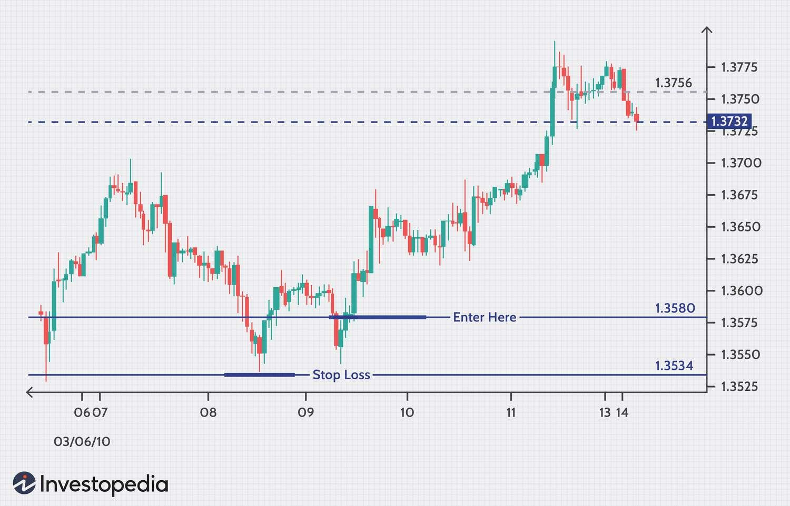

Currency trading, commonly known as forex (FX) trading, stands as one of the most dynamic and liquid financial markets globally. Trillions of dollars are traded daily as participants buy and sell currency pairs, seeking to capitalize on fluctuations in exchange rates. In this high-stakes environment, risk management emerges as an essential element for achieving sustainable success. Effective risk management enables traders to navigate the inherent volatility and unpredictability of the forex market, safeguarding against potentially significant financial losses.

Algorithmic trading, often referred to as algo trading, offers a systematic and data-driven approach to managing risks in the forex market. By employing computer algorithms, traders can execute trades with precision and speed, removing emotional biases that can lead to poor decision-making. Algorithms can be designed to consider a variety of market factors and predetermined rules, helping to manage risks efficiently.



This article will examine the critical role of risk management within forex trading and explore the intersection of risk management practices and algorithmic trading. We will cover strategies that mitigate risks and assess how integrating algorithmic trading can enhance these strategies' effectiveness. Additionally, we'll investigate the benefits and challenges that come with employing algo trading in the forex market.

Understanding the potential and limitations of algorithmic trading in conjunction with traditional risk management can equip traders with the tools necessary to thrive in the ever-evolving forex landscape.

## Table of Contents

## Understanding Forex Risk Management

Forex risk management is a critical aspect of trading that involves a systematic approach to identifying, assessing, and mitigating the various risks encountered in the currency markets. Effective risk management is essential for minimizing potential losses while maximizing trading opportunities. This section outlines the primary risks in forex trading and strategies to control them.

### Key Risks in Forex Trading

1. **Market Volatility**: Currencies are subject to fluctuations due to economic events, geopolitical developments, and market sentiment. High volatility can lead to significant price movements, which may result in unexpected losses. Traders must anticipate these fluctuations and use tools like volatility indicators to gauge market stability.

2. **Leverage**: Forex trading often involves borrowing funds to increase the potential return on investment, known as leverage. While leverage amplifies profits, it also magnifies losses. The use of excessive leverage can quickly result in a margin call, where the broker demands additional funds to cover potential losses. Thus, maintaining appropriate leverage levels is crucial.

3. **Liquidity Risk**: The forex market is generally liquid, but liquidity may vary between currency pairs and during different trading sessions. Low liquidity can lead to slippage, where orders are executed at less favorable prices. Traders should be aware of the liquidity conditions before executing large trades.

4. **Broker Risk**: The choice of a forex broker can impact trading outcomes. Factors such as regulatory compliance, financial stability, and trading platform reliability determine broker risk. Ensuring that the broker is reputable and regulated reduces the potential for fraud and operational issues.

### Techniques for Effective Risk Management

1. **Setting Stop-Loss Orders**: Stop-loss orders automatically close a trade when the price reaches a predetermined level, limiting potential losses. For instance, if a trader buys EUR/USD at 1.1000 and sets a stop-loss at 1.0950, the trade will close if the price falls to 1.0950, thus capping the loss. This tool is fundamental for protecting capital in volatile markets.

    ```python
    def calculate_stop_loss(entry_price, risk_percentage, account_balance):
        risk_amount = account_balance * (risk_percentage / 100)
        stop_loss_price = entry_price - risk_amount
        return stop_loss_price
    ```

2. **Controlling Leverage Levels**: Proper leverage management is vital to avoid large losses. Traders should use leverage levels that align with their risk tolerance and trading strategy. Regulatory bodies often set maximum leverage limits to protect retail traders from excessive risk exposure. 

3. **Diversification**: Diversifying trades across multiple currency pairs or financial instruments can reduce exposure to risk associated with a single currency. By spreading risk, traders can cushion the impact of adverse movements in any particular market.

In conclusion, [forex](/wiki/forex-system) risk management is an indispensable practice for traders aiming to achieve long-term success. By understanding and addressing the key risks associated with currency trading, traders can enhance their ability to protect their investments while capitalizing on market opportunities.

## What is Forex Algorithmic Trading?

Algorithmic trading in forex relies on computer algorithms to automatically execute currency trades based on pre-defined strategies and rules. The primary advantage of this method is the ability to process vast amounts of market data and execute orders at speeds beyond human capabilities. This rapid processing allows traders to exploit short-lived market opportunities and ensures they remain competitive in the fast-paced forex market.

One of the significant benefits of using algorithms in trading is the removal of emotional biases. Human traders may be influenced by emotions such as fear or greed, which can lead to irrational decision-making. Algorithmic trading, however, strictly adheres to the pre-set strategy, ensuring consistency and discipline in trading practices. This objective approach helps in maintaining the integrity of trading strategies, particularly during volatile market conditions.

Key components of a successful forex [algorithmic trading](/wiki/algorithmic-trading) system include data analysis, speed, efficiency, and continuous monitoring:

1. **Data Analysis**: Algorithms need to be fed with historical and real-time market data to make informed trading decisions. This process involves using statistical models and predictive analytics to identify profitable trading opportunities. Analyzing patterns like moving averages, support and resistance levels, and other technical indicators can provide a robust foundation for trade execution.

2. **Speed**: The forex market operates continuously, and prices can change rapidly. Algorithms can execute trades in milliseconds, a speed unattainable by human traders. This quick execution reduces slippage—the difference between the expected price of a trade and the price at which the trade is actually executed—and can greatly enhance profitability.

3. **Efficiency**: Algorithmic systems are designed to operate efficiently, executing large volumes of trades with minimal errors. By optimizing the algorithm’s code and infrastructure, traders can achieve higher throughput, lower latency, and improved execution quality, which are critical in trading high-frequency forex strategies.

4. **Continuous Monitoring**: Despite the advantages of algorithmic trading, continuous monitoring is necessary to ensure that the system operates as intended. Market conditions can change, and algorithms need regular updates and adjustments to remain effective. Traders must vigilantly oversee these systems to detect and rectify any potential anomalies or technical glitches promptly.

Algorithmic trading employs sophisticated programming languages such as Python, which offers comprehensive libraries for data analysis, like Pandas and NumPy, and [machine learning](/wiki/machine-learning) tools such as Scikit-learn and TensorFlow. An example of a simple moving average crossover strategy in Python is provided below:

```python
import pandas as pd
import numpy as np

# Load market data
data = pd.read_csv('forex_data.csv')  # Example data file
data['SMA_50'] = data['Close'].rolling(window=50).mean()
data['SMA_200'] = data['Close'].rolling(window=200).mean()

# Generate trading signals
data['Signal'] = 0
data['Signal'][data['SMA_50'] > data['SMA_200']] = 1  # Buy signal
data['Signal'][data['SMA_50'] < data['SMA_200']] = -1 # Sell signal

# Example of executing orders based on signals
for index, row in data.iterrows():
    if row['Signal'] == 1:
        print(f"Buy order executed at {row['Close']} on {row['Date']}")
    elif row['Signal'] == -1:
        print(f"Sell order executed at {row['Close']} on {row['Date']}")
```

In summary, forex algorithmic trading is a transformative approach that enhances trading precision and execution quality, paving the way for more systematic and profitable trading experiences.

## Integrating Risk Management in Forex Algorithmic Trading

Algorithmic trading in forex allows for the integration of sophisticated risk management strategies that exceed manual trading capabilities. Automated systems enhance risk management by quickly adapting to evolving market conditions, enabling traders to address unexpected events efficiently.

One of the primary techniques utilized in algorithmic risk management is the implementation of stop-loss orders. A stop-loss order is designed to limit an investor's loss on a position by triggering a sale once the price falls to a predetermined level. By programming these orders into an algorithm, traders can ensure that trades are executed promptly, mitigating potential losses that might occur during periods of rapid market movement.

Diversification is another key strategy in managing risk through algorithmic trading. By spreading exposure across different currency pairs or financial instruments, algorithms can reduce the impact of adverse price movements in any single asset. This multi-faceted approach to portfolio management can be automated to continuously assess and adjust a trader's exposure based on pre-defined parameters and market conditions.

Position sizing, a technique that determines the amount of capital invested in a particular trade, is critical in risk management and is optimized through algorithms. By calculating risk-adjusted position sizes, algorithms can help maintain a balanced risk-to-reward ratio across a portfolio. This systematic approach enables algorithms to dynamically adjust position sizes according to market [volatility](/wiki/volatility-trading-strategies) and the trader's risk appetite. In a Python environment, a simple formula for position sizing could be:

```python
def calculate_position_size(account_balance, risk_percentage, stop_loss_pips, pip_value):
    risk_amount = account_balance * risk_percentage
    position_size = risk_amount / (stop_loss_pips * pip_value)
    return position_size

# Example usage
account_balance = 10000  # example account balance in currency
risk_percentage = 0.02  # 2% risk
stop_loss_pips = 50  # stop loss in pips
pip_value = 10  # pip value in currency

position_size = calculate_position_size(account_balance, risk_percentage, stop_loss_pips, pip_value)
print("Position Size:", position_size)
```

Implementing these risk management techniques algorithmically not only prevents human errors but also ensures a disciplined approach to trading. This disciplined execution of trades reduces the probability of substantial losses by consistently applying a trader's risk management rules without deviation.

To summarize, incorporating advanced risk management strategies within forex algorithmic trading allows traders to adapt to market changes swiftly, manage portfolio risks through diversification, and regulate position sizes effectively. These systematic methods enhance a trader's ability to minimize losses and optimize performance in the highly volatile forex market.

## Benefits of Combining Risk Management with Algo Trading

Combining risk management with algorithmic trading in the forex market provides enhanced precision and efficiency when executing trades. One of the primary advantages is the ability of algorithmic trading systems to operate continuously, 24 hours a day, seven days a week. This constant operation enables traders to capitalize on global market opportunities without interruption, as forex markets are open around the clock across different time zones.

Furthermore, these algorithms are designed to rapidly adjust to market volatility and shifts, surpassing the capability of human traders. This speed and responsiveness are critical, especially in the highly volatile forex market, where prices can fluctuate dramatically within minutes. Algorithms, with their capacity to manage large datasets and execute trades instantaneously, can navigate these rapid changes effectively, thus minimizing potential losses and preserving capital.

Another significant benefit is the discipline these systems bring to trading strategies. Algorithmic trading minimizes emotional decision-making, ensuring that each trade aligns with the preconceived risk management parameters. By adhering to a systematic approach, traders can maintain consistency in executing their trading plans, which is crucial for long-term success. Through the use of predefined rules for entries, exits, and position sizing, algorithms enforce a strict and unbiased approach to trading.

Moreover, algorithmic trading aids in effective capital management. Through sophisticated models that optimize position sizing, traders can better manage their exposure and distribute risk across various trades and currency pairs. This systematic allocation and reallocation of capital based on real-time analysis and strategic goals enhance the overall efficiency of the trading process. Ultimately, the integration of risk management principles within algorithmic systems leads to an optimized trading environment, promoting stability, and consistent growth in traders' portfolios.

## Challenges and Considerations

Forex algorithmic trading offers numerous advantages, but it also presents several challenges that traders must navigate to maintain effectiveness and minimize risks. One of the primary concerns in algorithmic trading is the risk of overfitting. Overfitting occurs when a trading algorithm is too closely tailored to historical data, capturing noise rather than genuine market signals. This phenomenon can lead to an overly optimistic backtest performance that doesn't necessarily translate into future success. To mitigate this, traders should ensure that their algorithms are tested on out-of-sample data and subjected to rigorous cross-validation techniques.

Another significant challenge is data snooping, which involves excessive searching through historical data to identify seemingly profitable patterns that may have arisen by chance. This can lead to unreliable trading strategies. Avoiding data snooping requires maintaining a disciplined approach during the strategy development phase, such as only testing hypotheses formed independently of the data or using techniques like walk-forward analysis to validate strategies.

Algorithm design is crucial, requiring comprehensive [backtesting](/wiki/backtesting) and optimization to prevent future losses. Backtesting involves applying a trading algorithm to historical data to evaluate its performance. However, care must be taken to avoid look-ahead bias and ensure that the results are realistic and not overly optimistic. The optimization of parameters should strike a balance between fit to historical data and robustness to future market conditions. One method to prevent overfitting during optimization is to incorporate a penalty for complexity in the model selection criterion, such as using the Akaike Information Criterion (AIC) or Bayesian Information Criterion (BIC).

Traders must also make sure their algorithms are robust and adaptable to changing market conditions. Markets are dynamic, and an algorithm that performs well under certain conditions may fail in others. Creating algorithms that can adapt to such changes is vital. This can involve integrating machine learning techniques that allow the algorithm to learn and adjust its parameters based on real-time data without manual intervention. 

Continuous monitoring and evaluation are necessary to ensure ongoing effectiveness and risk mitigation. This involves regularly reviewing algorithm performance, recalibrating models, and making necessary adjustments based on market changes. Automated alerts and dashboards can help in monitoring performance and highlighting any deviations from expected trading behavior.

By addressing these challenges through careful design, testing, and ongoing management, traders can better harness the power of algorithmic trading while minimizing associated risks.

## Future Trends in Forex Algorithmic Trading

The future of forex algorithmic trading is poised for significant transformation with the integration of advanced technologies like machine learning (ML) and [artificial intelligence](/wiki/ai-artificial-intelligence) (AI). These technologies have the potential to refine risk management practices considerably, offering traders more sophisticated tools to anticipate and respond to market dynamics.

Machine learning algorithms, especially those leveraging [deep learning](/wiki/deep-learning) techniques, can analyze vast datasets far beyond the capacity of human traders. By identifying patterns and trends in historical and real-time data, these systems can make highly accurate predictions. For instance, ML models can be trained to optimize portfolio risk by analyzing the covariance between currencies, utilizing techniques such as Principal Component Analysis (PCA) to reduce dimensions and identify uncorrelated factors.

Big data analytics further complements this by providing the capability to process and analyze massive and complex datasets in real time. This allows for enhanced predictive trading strategies that can adapt to rapid changes in market conditions. Python, with libraries like pandas and scikit-learn, provides a robust environment for developing and testing these predictive models efficiently. For example:

```python
import pandas as pd
from sklearn.model_selection import train_test_split
from sklearn.ensemble import RandomForestRegressor

# Load forex data
data = pd.read_csv('forex_data.csv')

# Preprocess and split the data
X = data.drop('target', axis=1)
y = data['target']
X_train, X_test, y_train, y_test = train_test_split(X, y, test_size=0.2, random_state=42)

# Train a random forest model
model = RandomForestRegressor(n_estimators=100, random_state=42)
model.fit(X_train, y_train)

# Predict on test data
predictions = model.predict(X_test)
```

Regulatory frameworks are likely to evolve to address the increasing sophistication and ubiquitous nature of algorithmic trading in forex markets. Regulators may impose stricter standards on algorithmic trading practices to ensure fair and stable market conditions. This could involve requirements for algorithm testing, stress testing under various market conditions, and continuous performance monitoring to prevent systemic risks and market abuse.

Ethical considerations will grow in importance as these technologies advance. The potential for AI-driven trading systems to disrupt markets or exploit inefficiencies raises concerns about fairness and transparency. Ensuring that algorithms operate within ethical boundaries while preserving market stability will be a critical challenge. Moreover, accountability for algorithmic decisions and their outcomes will have to be clearly defined, requiring collaboration between scholars, industry stakeholders, and regulators.

As technology progresses, maintaining an equilibrium between innovation and ethical responsibility will be crucial. The forex algorithmic trading landscape will continue to evolve, potentially leading to more efficient markets and new opportunities, as long as these advancements are managed with caution and foresight.

## Conclusion

Risk management is a cornerstone of successful currency trading, especially in the highly volatile forex market. The fast-paced nature of forex trading demands sophisticated tools and strategies to handle the myriad risks involved, such as market volatility and leverage. Algorithmic trading provides such tools, offering a structured and systematic approach to risk management. By employing pre-set rules and computer programs, algo trading minimizes human error and biases, thus enhancing trading performance.

The power of algorithmic trading lies in its ability to process vast amounts of market data swiftly and execute trades with precision and speed. This capability allows traders to manage risks more efficiently and maintain a disciplined approach, protecting their capital against potential market downturns. However, to fully exploit the potential of algo trading, strategies must be continually refined and adapted. The dynamic nature of the forex markets means that algorithms need constant updating and backtesting to remain effective.

The integration of robust risk management strategies within an algorithmic trading framework can pave the way for sustainable long-term success in currency trading. By leveraging technologies such as machine learning and data analytics, traders can develop predictive models that enhance market insights and decision-making. As these technologies evolve, so too will the sophistication of algo trading systems, offering even greater tools to manage risks and capitalize on market opportunities.

Ultimately, the successful fusion of risk management and algorithmic trading hinges on the trader's ability to adapt and respond to market changes. Ensuring continuous evaluation and optimization of trading systems can mitigate unforeseen risks and secure a competitive edge in the forex market. When implemented correctly, this synergy does not only lead to improved trading outcomes but also lays the foundation for sustained profitability over the long term.

## References & Further Reading

[1]: Bergstra, J., Bardenet, R., Bengio, Y., & Kégl, B. (2011). ["Algorithms for Hyper-Parameter Optimization."](https://proceedings.neurips.cc/paper/2011/file/86e8f7ab32cfd12577bc2619bc635690-Paper.pdf) Advances in Neural Information Processing Systems 24.

[2]: ["Advances in Financial Machine Learning"](https://www.amazon.com/Advances-Financial-Machine-Learning-Marcos/dp/1119482089) by Marcos Lopez de Prado

[3]: ["Evidence-Based Technical Analysis: Applying the Scientific Method and Statistical Inference to Trading Signals"](https://www.amazon.com/Evidence-Based-Technical-Analysis-Scientific-Statistical/dp/0470008741) by David Aronson

[4]: ["Machine Learning for Algorithmic Trading"](https://github.com/PacktPublishing/Machine-Learning-for-Algorithmic-Trading-Second-Edition) by Stefan Jansen

[5]: ["Quantitative Trading: How to Build Your Own Algorithmic Trading Business"](https://books.google.com/books/about/Quantitative_Trading.html?id=j70yEAAAQBAJ) by Ernest P. Chan