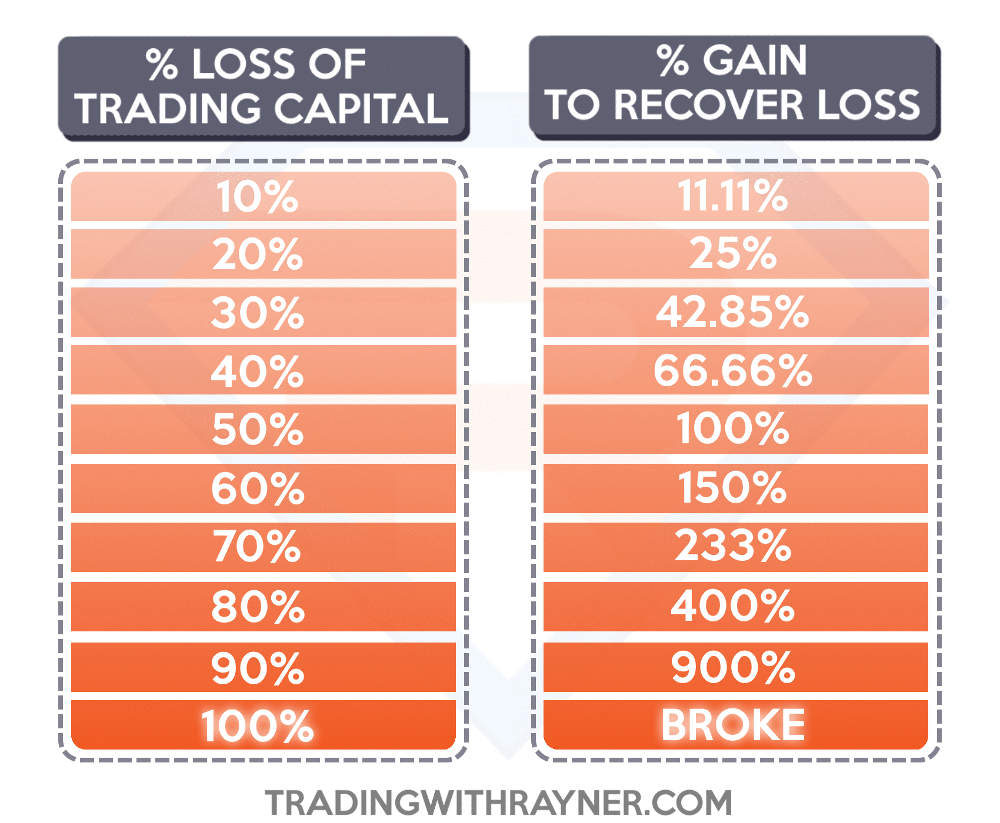

## Table of Contents

## What is Forex risk management?

Forex risk management is about protecting your money when you trade currencies. It's important because the forex market can be unpredictable, and prices can change quickly. By managing risk, you try to limit how much money you could lose. This involves setting rules for yourself, like how much you're willing to risk on each trade and sticking to those rules no matter what.

One common way to manage risk in forex is by using stop-loss orders. A stop-loss order is like a safety net that automatically closes your trade if the price moves against you by a certain amount. This helps prevent big losses. Another method is to not put all your money into one trade. Instead, you spread it out over different trades, which is called diversification. This way, if one trade goes bad, you won't lose everything.

It's also helpful to keep learning and staying updated on what's happening in the world, as news can affect currency prices. Good risk management means being disciplined and not letting emotions control your trading decisions. By following these practices, you can trade more safely and increase your chances of success in the forex market.

## Why is Forex risk management important for traders?

Forex risk management is really important for traders because it helps them protect their money. The [forex](/wiki/forex-system) market can be very unpredictable, with prices going up and down quickly. If traders don't manage their risk, they could lose a lot of money on a single trade. By using risk management strategies, traders can set limits on how much they're willing to lose, which helps them stay in the game longer and avoid big losses.

One key part of risk management is using tools like stop-loss orders. These orders automatically close a trade if the price moves against the trader by a certain amount. This way, even if the market moves unexpectedly, the trader's losses are limited. Another important strategy is diversification, which means not putting all your money into one trade. By spreading out their investments, traders can reduce the impact of a bad trade on their overall portfolio. 

In the end, good risk management helps traders make smarter decisions and not let emotions take over. It's about being disciplined and sticking to a plan, even when the market gets tough. By managing risk well, traders can increase their chances of success and build confidence in their trading abilities.

## What are the common types of Forex risks?

Forex trading comes with different kinds of risks that traders need to watch out for. One common type is exchange rate risk, which happens when the value of one currency goes up or down compared to another. This can affect how much money a trader makes or loses. Another type is [interest rate](/wiki/interest-rate-trading-strategies) risk, which comes from changes in the interest rates set by central banks. If interest rates change, it can make currencies stronger or weaker, impacting forex trades.

There's also country risk, which is about the political and economic stability of a country. If a country has problems like political unrest or economic troubles, its currency can become less valuable. This can be risky for traders who are dealing with that country's currency. Lastly, there's transaction risk, which happens when there's a delay between agreeing on a trade and actually completing it. During this time, exchange rates can change, which might lead to losses.

Understanding these risks is important for traders because it helps them plan better and protect their money. By knowing what can go wrong, traders can use strategies to manage these risks and trade more safely.

## How can beginners start managing Forex risks?

For beginners, starting to manage Forex risks can feel overwhelming, but it's really about taking small, smart steps. One of the first things you can do is set a clear budget for how much money you're willing to risk. This means deciding on a specific amount of money that you're okay with losing, and sticking to it. It's also helpful to use a demo account to practice trading without real money. This way, you can get a feel for the market and try out different strategies without risking your savings.

Another important step is to use stop-loss orders. These are like safety nets that automatically close your trade if the price moves against you by a certain amount. This helps you limit your losses and protect your money. It's also a good idea to spread out your investments, which is called diversification. Instead of putting all your money into one trade, try different trades. This way, if one trade goes bad, you won't lose everything. By starting with these simple practices, beginners can learn to manage Forex risks better and trade more confidently.

## What are the basic tools and strategies for Forex risk management?

The basic tools for Forex risk management include stop-loss orders and take-profit orders. A stop-loss order is like a safety net that automatically closes your trade if the price moves against you by a certain amount. This helps you limit your losses and protect your money. A take-profit order does the opposite; it closes your trade when the price reaches a level where you want to lock in your profits. Both of these tools help you stick to your trading plan and avoid making emotional decisions.

Strategies for managing Forex risk start with setting a clear budget for how much money you're willing to risk. This means deciding on a specific amount of money that you're okay with losing, and sticking to it. Another strategy is diversification, which means spreading out your investments across different trades. This way, if one trade goes bad, you won't lose everything. It's also important to keep learning and staying updated on what's happening in the world, as news can affect currency prices. By following these strategies, you can trade more safely and increase your chances of success in the Forex market.

## How does leverage affect Forex risk management?

Leverage can make Forex trading more exciting but also a lot riskier. When you use leverage, you're borrowing money from your broker to make bigger trades than you could with just your own money. This means you can control a large position with a small amount of your own money. But, if the trade goes against you, the losses can be much bigger than what you initially put in. That's why managing risk becomes even more important when you're using leverage. You need to be extra careful about how much you're willing to risk on each trade and use tools like stop-loss orders to protect your money.

Understanding how much leverage to use is key to good risk management. If you use too much leverage, even a small move in the wrong direction can wipe out your account. So, it's smart to start with lower levels of leverage until you get more comfortable with the market. Also, always keep an eye on your account balance and make sure you have enough money to cover potential losses. By being careful with leverage and using good risk management strategies, you can trade more safely and increase your chances of success in the Forex market.

## What is the role of stop-loss orders in managing Forex risks?

Stop-loss orders are really important for managing risks in Forex trading. They work like a safety net that automatically closes your trade if the price moves against you by a certain amount. This means you can set a limit on how much money you're willing to lose on a trade. By using stop-loss orders, you can protect your money and avoid big losses, especially in a market that can change quickly.

Using stop-loss orders also helps you stick to your trading plan and not let emotions take over. When the market gets tough, it's easy to feel scared or hopeful and make bad decisions. But with a stop-loss order in place, you don't have to worry about making quick choices under pressure. It does the work for you, closing the trade at the level you set, which helps you stay disciplined and trade more safely.

## How can advanced traders use hedging to manage Forex risks?

Advanced traders can use hedging to manage Forex risks by opening trades that offset potential losses from their main positions. For example, if a trader has a long position in one currency pair, they might open a short position in a correlated pair to protect against adverse movements. This way, if the market moves against their main trade, the losses on that trade might be balanced out by gains in the hedging trade. Hedging doesn't guarantee profits, but it can help limit the impact of market [volatility](/wiki/volatility-trading-strategies) and unexpected events.

To use hedging effectively, advanced traders need to understand the relationships between different currency pairs and how global economic news can affect them. They might use tools like correlation matrices to identify pairs that move in opposite directions. By carefully choosing which pairs to hedge with, traders can create a more balanced portfolio that's less likely to suffer big losses. Hedging requires careful planning and monitoring, but it can be a powerful strategy for managing Forex risks.

## What are the psychological aspects of Forex risk management?

Managing risk in Forex trading isn't just about numbers and strategies; it's also about how you feel and think. One big part of this is dealing with fear and greed. When the market moves a lot, it's easy to feel scared and want to close your trades too soon, even if they're doing well. On the other hand, if you're feeling greedy, you might keep a trade open too long, hoping to make more money, which can lead to big losses. Good risk management means learning to control these feelings and sticking to your plan, no matter what the market does.

Another important psychological aspect is discipline. It's really hard to follow your trading rules all the time, especially when things get tough. But being disciplined means you can keep your emotions in check and make better decisions. It's also about being patient and not rushing into trades just because you want to make money fast. By staying calm and focused, you can manage your risks better and increase your chances of success in Forex trading.

## How do economic indicators and news events impact Forex risk management?

Economic indicators and news events can have a big impact on Forex risk management because they can change how people think about different currencies. When important news comes out, like changes in interest rates or big economic reports, it can make the value of a currency go up or down quickly. Traders need to keep an eye on these events so they can guess how the market might move and adjust their trades to manage their risks better. For example, if a country's economy is doing well, its currency might get stronger, and traders might want to buy more of that currency.

Staying updated on economic news also helps traders decide when to use tools like stop-loss orders. If there's a big news event coming up that could shake the market, traders might set their stop-loss orders closer to their entry points to protect their money. This way, if the news turns out to be bad and the currency's value drops a lot, the stop-loss order will close the trade before the losses get too big. By paying attention to economic indicators and news, traders can make smarter choices and manage their risks more effectively in the Forex market.

## What advanced techniques can be used to quantify and manage Forex risks?

Advanced traders can use something called Value at Risk (VaR) to measure how much money they might lose in a trade. VaR helps traders figure out the worst-case scenario for their trades over a certain time, like a day or a week. By knowing this, traders can set limits on how much they're willing to risk and make better decisions about their trades. Another technique is using stress testing, where traders see how their trades would do if the market went through a really tough time, like a big economic crisis. This helps them prepare for the worst and adjust their strategies to handle big market swings.

Another advanced way to manage Forex risks is by using options. Options give traders the right, but not the obligation, to buy or sell a currency at a set price in the future. This can be a good way to protect against big losses if the market moves against them. Traders can also use [algorithmic trading](/wiki/algorithmic-trading), where they use computer programs to make trades based on certain rules. These programs can help manage risks by automatically closing trades or adjusting positions when the market hits certain levels. By using these advanced techniques, traders can get a better handle on their risks and trade more safely in the Forex market.

## How can Forex risk management strategies be adapted for different trading styles and timeframes?

Forex risk management strategies can be changed to fit different trading styles and timeframes. For example, if you're a day trader who makes a lot of trades in a single day, you might want to use tighter stop-loss orders. This means setting your stop-loss closer to your entry point so that you can quickly get out of a trade if it goes the wrong way. Day traders also need to keep an eye on their trades all the time and be ready to make quick decisions. On the other hand, if you're a swing trader who holds trades for a few days or weeks, you might use wider stop-loss orders. This gives the trade more room to move and helps you avoid getting stopped out by small market swings.

For different timeframes, risk management can also be adjusted. If you're trading on a short-term chart, like a 5-minute or 15-minute chart, you'll want to set smaller risk levels because the market can change quickly. You might also use smaller position sizes to limit how much you can lose on each trade. If you're looking at longer-term charts, like daily or weekly charts, you can set larger risk levels and use bigger position sizes. This is because you're giving the trade more time to work out, and you're less worried about short-term market noise. No matter what your trading style or timeframe, the key is to always think about how much risk you're taking and adjust your strategies to match your goals and comfort level.

## References & Further Reading

[1]: Bergstra, J., Bardenet, R., Bengio, Y., & Kégl, B. (2011). ["Algorithms for Hyper-Parameter Optimization."](https://proceedings.neurips.cc/paper/2011/file/86e8f7ab32cfd12577bc2619bc635690-Paper.pdf) Advances in Neural Information Processing Systems 24.

[2]: ["Advances in Financial Machine Learning"](https://www.amazon.com/Advances-Financial-Machine-Learning-Marcos/dp/1119482089) by Marcos Lopez de Prado

[3]: ["Evidence-Based Technical Analysis: Applying the Scientific Method and Statistical Inference to Trading Signals"](https://www.amazon.com/Evidence-Based-Technical-Analysis-Scientific-Statistical/dp/0470008741) by David Aronson

[4]: ["Machine Learning for Algorithmic Trading"](https://github.com/PacktPublishing/Machine-Learning-for-Algorithmic-Trading-Second-Edition) by Stefan Jansen

[5]: ["Quantitative Trading: How to Build Your Own Algorithmic Trading Business"](https://books.google.com/books/about/Quantitative_Trading.html?id=j70yEAAAQBAJ) by Ernest P. Chan