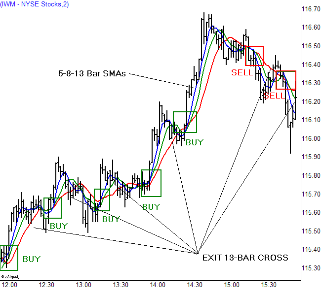

Forex scalping is a widely adopted trading strategy that emphasizes executing multiple trades within extremely short time frames. This approach is highly favored by traders who aim for small yet frequent profits during the trading day. Scalping necessitates a distinct set of skills and characteristics owing to its rapid pace and elevated risk levels. 

Scalpers focus on leverage and small price movements to generate returns, contrasting long-term strategies that rely on larger market shifts. This method thrives on high volatility and liquidity, making it essential for scalpers to maintain a deep understanding of market behavior and trends. 



This article will explore various strategies crucial to successful scalping, the essential tools required, and the integration of algorithmic trading to optimize efficiency and performance. Additionally, the discussion will encompass the risks associated with forex scalping and present best practices aimed at maximizing profitability while mitigating potential downsides. By understanding these elements, traders can enhance their scalability and effectiveness within the fast-paced trading environment of forex scalping.

## Table of Contents

## Understanding Forex Scalping

Forex scalping is a trading strategy designed to capitalize on small price fluctuations in currency markets. This approach involves executing multiple trades in rapid succession, often within seconds or minutes, to accumulate small but consistent profits. Scalpers focus on short-term movements, using minute-by-minute, tick, or 1-minute charts to monitor and respond to price changes.

The primary advantage of forex scalping is its ability to generate profits in both trending and range-bound markets. In trending markets, scalpers aim to ride the momentum for quick gains. Conversely, in stagnant or range-bound markets, they exploit minor price oscillations, entering and exiting trades within the boundaries of support and resistance levels.

Scalpers require a sound understanding of market dynamics, as well as the ability to interpret complex chart patterns and indicators quickly. This trading style demands a high level of concentration, as decisions must be made rapidly to exploit short-lived opportunities. By maintaining strict discipline and focus, scalpers can effectively mitigate the inherent risks associated with this high-speed trading method.

## Essential Tools and Setup for Scalping

A reliable and fast internet connection is paramount for executing [scalping](/wiki/gamma-scalping) trades effectively, as the nature of [forex](/wiki/forex-system) scalping demands rapid decision-making and execution within minute price movements. Traders depend heavily on their trading platform, which must ensure quick execution times and support a variety of technical analysis tools. Platforms such as MetaTrader 4 (MT4), MetaTrader 5 (MT5), and TradingView are popular among scalpers due to their wide range of features, including customizable charts, indicator options, and automated trading capabilities.

Choosing the right broker is another crucial component for successful scalping. Brokers must offer tight spreads and low commission fees to maximize profitability, given the thin margins that scalping typically involves. Major brokers such as IG, OANDA, and FXCM are often recommended for their robust platforms and competitive pricing structures. Traders should also consider brokers that provide additional features like negative balance protection and access to a broad range of currency pairs, ensuring they have the flexibility needed to capitalize on different market conditions.

Besides these elements, a proficient scalper must ensure a complete and efficient trading setup. This includes using high-performance computing equipment that can handle multiple data streams without latency and a multi-monitor setup to track various charts and data feeds simultaneously. Employing a Virtual Private Server (VPS) can also be advantageous, as it allows for continuous operation of automated strategies independent of local power or internet disruptions.

Overall, assembling the right tools and setup is indispensable for executing a forex scalping strategy effectively. Ensuring that technology and brokerage choices align with the specific needs of scalping can substantially enhance the chances of trading success in this fast-paced environment.

## Developing a Scalping Strategy

Developing an effective scalping strategy is pivotal for traders aiming to profit from small price movements in the forex market. The cornerstone of a successful scalping approach begins with focusing on liquid currency pairs. High [liquidity](/wiki/liquidity-risk-premium) ensures minimal slippage, allowing traders to execute trades swiftly and accurately. Pairs like EUR/USD, GBP/USD, and USD/JPY are favored for their high trading volumes and relatively tighter spreads.

An essential component of a scalping strategy is the selection of appropriate indicators. Common indicators used by scalpers include moving averages, Bollinger Bands, and the Relative Strength Index (RSI). Moving averages, like the Exponential Moving Average (EMA), can help identify trend direction and potential reversal points. Bollinger Bands assist in visualizing price [volatility](/wiki/volatility-trading-strategies), while the RSI signals overbought and oversold conditions, providing entry and [exit](/wiki/exit-strategy) cues.

Stop-loss settings and target profit levels are critical to risk management within a scalping framework. Scalpers often set tight stop-loss orders to limit potential losses, typically ranging from 2 to 5 pips depending on market conditions and currency pair volatility. Similarly, target profit levels are usually modest, aiming to capitalize on small price fluctuations.

Both manual and automated trading systems are viable in scalping, offering distinct advantages. Manual trading grants traders complete control over their decisions, allowing for intuitive responses to market changes. It requires constant monitoring and rapid decision-making skills. On the other hand, automated trading systems, employing algorithmic strategies, execute trades without emotional bias. Automation can enhance consistency and exploit opportunities that arise in milliseconds—crucial in the high-speed environment of scalping.

Python, a popular language for developing trading algorithms, can be used to create a simple moving average crossover strategy for scalping:

```python
import pandas as pd

def moving_average_crossover_strategy(prices, short_window, long_window):
    signals = pd.DataFrame(index=prices.index)
    signals['price'] = prices['Close']
    signals['short_mavg'] = prices['Close'].rolling(window=short_window, min_periods=1, center=False).mean()
    signals['long_mavg'] = prices['Close'].rolling(window=long_window, min_periods=1, center=False).mean()

    signals['signal'] = 0.0
    signals['signal'][short_window:] = np.where(signals['short_mavg'][short_window:] > signals['long_mavg'][short_window:], 1.0, 0.0)   
    signals['positions'] = signals['signal'].diff()

    return signals
```

This code sets up a simple moving average crossover strategy, where trades are initiated based on the crossing of short and long-term moving averages. Such automated strategies require [backtesting](/wiki/backtesting) and optimization to ensure they align with a trader's risk tolerance and trading goals.

Whether employing manual or automated systems, the foremost objective in developing a scalping strategy is ensuring it aligns with personal trading objectives, risk appetite, and available resources, thus maximizing the chances of profitability in the forex market.

## Algorithmic Trading in Scalping

Algorithmic trading, often referred to as algo trading, involves the use of computer programs to execute trades based on pre-defined criteria. In the context of forex scalping, algorithms offer the significant advantages of speed and precision, enabling the rapid execution of trades that is crucial to this strategy. By automating the trading process, algo trading minimizes human error and the emotional biases that can negatively impact decision-making. This level of automation is especially beneficial in scalping, where quick responses to market conditions can make a substantial difference in profitability.

To effectively implement [algorithmic trading](/wiki/algorithmic-trading) in scalping, it is essential to rigorously test and optimize the algorithms under various market conditions. Backtesting is one method utilized for this purpose, involving the simulation of an algorithm's performance over historical data to evaluate potential profitability and risk. A typical backtest might involve the following Python code snippet using a popular library like `[backtrader](/wiki/backtrader)`:

```python
import backtrader as bt

class ScalpingStrategy(bt.Strategy):
    params = (('period', 1),)

    def __init__(self):
        self.sma = bt.indicators.SimpleMovingAverage(period=self.params.period)

    def next(self):
        if self.data.close[0] > self.sma[0]:
            self.buy(size=1000)
        elif self.data.close[0] < self.sma[0]:
            self.sell(size=1000)

cerebro = bt.Cerebro()
cerebro.addstrategy(ScalpingStrategy)
data = bt.feeds.YahooFinanceData(dataname='EURUSD', fromdate=datetime(2020, 1, 1), todate=datetime(2021, 1, 1))
cerebro.adddata(data)
cerebro.run()
```

Optimization is the next critical step, where parameters such as moving average periods, stop-loss settings, and trade size are fine-tuned for better performance. Optimization can prevent the algorithms from becoming too rigidly tied to past market conditions, helping them remain adaptable to future changes. 

Moreover, a well-developed algorithm must incorporate robust risk management protocols, like setting stop-loss and take-profit orders, to secure gains and limit losses effectively. Implementing such measures ensures that even automated strategies adhere to disciplined trading practices, further enhancing their potential success in forex scalping. 

Through ongoing testing, optimization, and careful planning, algorithmic trading emerges as a formidable tool for traders seeking to maximize the efficiency and profitability of their scalping strategies.

## Risk Management in Scalping

Scalping is a trading strategy that revolves around executing trades rapidly to take advantage of minor price fluctuations. However, this frenetic pace comes with increased risk, making risk management a cornerstone of successful scalping. 

Effective risk management in scalping requires the implementation of strict stop-loss levels. A stop-loss is an order placed to sell a security when it reaches a specific price, preventing more significant losses. In scalping, setting this level close to the entry point is crucial due to the small margin of price movements, which are often targeted for profits. Traders typically determine stop-loss levels by considering volatility and technical indicators, ensuring they do not risk more than they can afford to lose on a single trade. 

For example, if a trader plans to scalp a currency pair, they might set a stop-loss at a level that limits their loss to 1% of their total trading capital. This is often calculated using the formula:

$$
\text{Stop-loss level} = \text{Entry price} - \left( \frac{\text{Total capital} \times 0.01}{\text{Trade size}} \right)
$$

In addition to technical safeguards, maintaining an emotional distance from trading outcomes is essential. Scalping requires numerous trades daily, and emotional responses to wins and losses can lead to skewed decision-making. For instance, after a loss, a trader might be tempted to overtrade to recover, thereby increasing their risk exposure. This behavior, known as "revenge trading," often results in further financial losses.

Mindfulness and psychological discipline are vital for scalpers. Adopting a systematic approach to trading decisions, rather than impulse-driven actions, helps sustain focus and discipline. Tools such as trading journals can be beneficial, offering insights into past trades and helping to refine strategies by avoiding emotionally charged decisions. Ultimately, the ability to exit positions rapidly is a critical skill in scalping, requiring both strategic planning and emotional restraint to limit potential losses.

## Conclusion and Best Practices

Scalping can be a rewarding strategy for disciplined traders who enjoy a fast-paced trading environment. The essence of successful scalping hinges on a well-defined strategy, meticulous risk management, and the right tools and setup.

Firstly, a well-defined strategy is essential to navigate the volatile nature of forex markets. Scalpers should develop a plan that specifies entry and exit points, taking into account factors such as market trends and volatility. Using technical analysis and indicators like moving averages or Bollinger Bands can help identify optimal trading conditions. Moreover, setting realistic profit targets and stop-loss levels is crucial to safeguarding gains and minimizing potential losses.

Risk management is paramount in scalping. Given the rapid nature of trades, there's a heightened risk of significant losses. Establishing strict stop-loss levels helps to curb potential downsides, and maintaining an emotional detachment from trading outcomes is vital to preventing impulsive decisions. Traders should also be prepared to close positions quickly if market conditions change unexpectedly, ensuring that losses remain controlled.

The tools and setup can significantly impact the efficiency of a scalping strategy. A reliable and fast internet connection is crucial for executing trades promptly. Additionally, a responsive trading platform that supports technical analysis and allows for quick trade execution is advantageous. Selecting a broker that offers tight spreads and low commissions is equally important, as these can erode profits in high-frequency trading environments.

Scalpers should continuously refine their strategies to adapt to evolving market conditions and enhance trading performance. Regular reviews of trading outcomes and market analyses can identify areas for improvement. By incorporating new insights and adjusting tactics as needed, traders can optimize their strategies over time, ultimately increasing their chances of success in the dynamic forex market.

## FAQs

### FAQs

**What skills do I need to become a successful forex scalper?**

To excel as a forex scalper, traders should possess a variety of skills. Firstly, a keen analytical ability to quickly interpret market data and price charts is crucial. Scalpers must be adept at recognizing patterns and signals in real-time, often using technical indicators. Time management and decision-making skills are also vital, as trades in scalping are executed in mere seconds or minutes. Emotional resilience is another necessary skill; maintaining composure during rapid trading to prevent impulsive decisions is essential. Lastly, proficiency in using trading platforms and tools is critical for executing trades efficiently and effectively.

**How does algorithmic trading integrate with forex scalping?**

Algorithmic trading enhances the scalping process by automating trade executions based on pre-set conditions. This integration allows for rapid processing of market data and execution of trades much faster than manual trading. Algorithms are designed to follow stringent criteria, such as specific entry and exit points indicated by technical signals, thereby removing emotional biases. For example, a Python script could use libraries like Pandas for data analysis and TA-Lib for applying technical indicators. Here is a simplified Python example to demonstrate a moving average crossover strategy:

```python
import pandas as pd
import talib

# Example data
data = pd.DataFrame({'close': [1.1010, 1.1025, 1.1017, ...]})  # Replace with a list of closing prices

# Calculate moving averages
short_ma = talib.SMA(data['close'], timeperiod=5)
long_ma = talib.SMA(data['close'], timeperiod=20)

# Generate signals
signal = short_ma > long_ma

# Output signal: True indicates a buy signal, False indicates a sell signal
print(signal)
```

Algorithmic trading systems require rigorous backtesting and continuous optimization to ensure they remain effective amid changing market conditions.

**What are the best indicators for forex scalping?**

Forex scalpers often rely on a variety of technical indicators to inform their trading decisions. Some of the most effective indicators include:

1. **Moving Averages**: Used to identify trends and support/resistance levels. Moving averages smooth out price data to highlight the direction of the trend, which is useful for making quick decisions in scalping.

2. **Relative Strength Index (RSI)**: This is an oscillator that indicates overbought or oversold conditions, which can signal potential reversals.

3. **Bollinger Bands**: These are used to measure market volatility and can indicate overbought or oversold conditions when price touches the upper or lower bands.

4. **Stochastic Oscillator**: This indicator measures the location of the close relative to the high-low range over a set number of periods and can help identify overbought or oversold conditions.

Each indicator brings unique insights into market dynamics, and scalpers often use a combination to enhance accuracy and confirm trading signals. However, over-reliance on any single indicator can be risky; thus, traders usually integrate them into a comprehensive strategy.

## References & Further Reading

[1]: ["Technical Analysis of the Financial Markets: A Comprehensive Guide to Trading Methods and Applications"](https://archive.org/details/technicalanalysi0000murp) by John J. Murphy

[2]: ["Algorithmic and High-Frequency Trading"](https://assets.cambridge.org/97811070/91146/frontmatter/9781107091146_frontmatter.pdf) by Álvaro Cartea, Sebastian Jaimungal, and José Penalva

[3]: ["Forex Trading: The Basics Explained in Simple Terms"](https://www.amazon.com/FOREX-TRADING-Explained-Beginners-Strategies/dp/1535198567) by Jim Brown

[4]: Rzepczynski, M. (2020). ["Systematic Global Macro: Practical Problems and Lessons."](https://link.springer.com/book/10.1007/978-3-658-27602-7) The Journal of Investment Strategies

[5]: Pardo, R. (2008). ["The Evaluation and Optimization of Trading Strategies"](https://onlinelibrary.wiley.com/doi/book/10.1002/9781119196969) by Robert Pardo