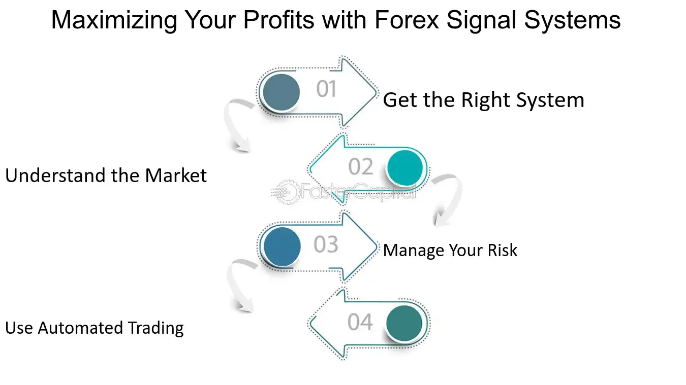

## Table of Contents

## What is a Forex signal system?

A Forex signal system is a tool that helps people who trade in the foreign exchange market. It gives them advice on when to buy or sell different currencies. This system uses special computer programs and math formulas to look at market trends and patterns. Traders use these signals to make better choices about their trades, hoping to make more money.

These signals can come from different places. Some are made by expert traders who study the market a lot. Others come from automatic systems that use numbers and data to predict what might happen next in the market. People who use Forex signal systems can get these signals through emails, text messages, or special apps on their phones or computers. This makes it easier for them to act quickly when they get a signal.

## How do Forex signal systems work?

Forex signal systems work by analyzing the foreign exchange market to find good times to buy or sell currencies. They use special computer programs and math formulas to look at things like price movements, market trends, and other important information. This helps them predict what might happen next in the market. When the system finds a good opportunity, it sends a signal to the trader. This signal tells the trader what currency to buy or sell, and sometimes how much to trade and when to do it.

These signals can come from two main places. First, they can be made by expert traders who spend a lot of time studying the market. These traders use their knowledge and experience to spot good trading opportunities. Second, signals can come from automatic systems. These systems use numbers and data to make predictions without any help from people. Traders can get these signals in different ways, like through emails, text messages, or special apps on their phones or computers. This makes it easy for traders to get the information they need quickly and make their trades at the right time.

## What are the main components of a Forex signal system?

A Forex signal system has a few main parts that help it work well. The first part is the data analysis tool. This tool looks at a lot of information from the market, like price changes and trends. It uses special math formulas to find patterns and predict what might happen next. This helps the system decide when it's a good time to buy or sell a currency. The second part is the signal generation part. This part takes the information from the data analysis tool and turns it into a clear signal that tells the trader what to do. It might say something like "Buy EUR/USD" or "Sell GBP/JPY."

The third part of a Forex signal system is the delivery method. This is how the signal gets from the system to the trader. It could be through an email, a text message, or a special app on a phone or computer. The delivery method needs to be fast and reliable so the trader can act quickly on the signal. The last part is the performance tracking tool. This part keeps track of how well the signals are working. It looks at things like how much money the trader made or lost and how often the signals were right. This helps traders see if the system is helping them make good choices.

## What types of Forex signal systems are available?

There are mainly two types of Forex signal systems: manual and automated. Manual Forex signal systems are made by expert traders who study the market a lot. They use their knowledge and experience to find good times to buy or sell currencies. These traders look at charts, news, and other information to make their decisions. When they find a good opportunity, they send a signal to other traders. This type of system is good because it uses human judgment, but it can be slower because it depends on the trader's time and attention.

Automated Forex signal systems use computer programs and math formulas to analyze the market. These systems can look at a lot of data very quickly and find patterns that might be hard for people to see. When the system finds a good opportunity, it sends a signal automatically. This type of system is fast and can work all the time without getting tired. But, it might not be as good at understanding big changes in the market that a human trader could see. Both types of systems have their own advantages and can help traders make better choices in the Forex market.

## How can beginners use Forex signal systems effectively?

Beginners can use Forex signal systems effectively by first choosing a system that fits their needs. They should look for a system that is easy to understand and use. Many systems offer free trials, so beginners can try them out without spending money right away. It's also important to pick a system that gives clear signals and explains why the signal was given. This helps beginners learn more about the market as they trade.

Once they have a system, beginners should start with small trades. This way, they can practice using the signals without risking too much money. They should also keep track of how well the signals are working. This means writing down each trade and seeing if it made money or lost money. Over time, beginners can learn which signals work best for them and adjust their trading strategy. By using the system carefully and learning from their trades, beginners can improve their skills and become better traders.

## What are the benefits of using Forex signal systems?

Using Forex signal systems can help traders a lot. They give clear advice on when to buy or sell currencies, which can make trading easier, especially for beginners. These systems use special computer programs and math to look at the market and find good trading opportunities. This means traders can make better choices and maybe make more money. Plus, the signals come quickly through emails, texts, or apps, so traders can act fast when they get a signal.

Another good thing about Forex signal systems is that they save time. Instead of spending hours looking at charts and news, traders can let the system do the hard work. This is great for people who don't have a lot of time to trade. Also, these systems can help traders learn more about the market. By following the signals and seeing how they work, traders can get better at understanding what makes the market move. This can help them become better traders over time.

## What are the potential risks associated with Forex signal systems?

Using Forex signal systems can be risky. One big risk is that the signals might not always be right. Even the best systems can make mistakes, and if traders follow a wrong signal, they could lose money. Also, some signal systems might be scams. There are people who make fake signals to trick others into losing money. It's important for traders to check if a system is trustworthy before using it.

Another risk is that traders might start to rely too much on the signals. If they don't learn about the market themselves, they might not know what to do if the system stops working or gives a bad signal. It's good to use signals as a help, but traders should also learn about trading on their own. This way, they can make better choices and not just follow the system blindly.

## How do you evaluate the performance of a Forex signal system?

To evaluate the performance of a Forex signal system, you need to look at how well its signals help you make money. Start by keeping track of every trade you make based on the signals. Write down how much money you make or lose on each trade. Over time, you can see if the system is helping you win more than you lose. It's also important to check the win rate, which is how often the signals are right. A good system should have a high win rate, but it's not the only thing to look at. You also need to see how big the wins and losses are. A system with a lower win rate but bigger wins might still be good.

Another way to evaluate the performance is to compare it with other systems or with trading without signals. You can look at the total profit or loss over a certain time, like a month or a year. Some systems might also give you a report on their performance, showing things like average profit per trade and the biggest loss. It's helpful to use these reports to see if the system is working well for you. Remember, no system is perfect, so it's important to keep learning about the market and not just rely on the signals.

## What technical indicators are commonly used in Forex signal systems?

Forex signal systems often use technical indicators to help traders make decisions. Some of the most common ones are moving averages, which help show the general direction of the market by smoothing out price changes over time. Another popular indicator is the Relative Strength Index (RSI), which measures how fast prices are changing to see if a currency is overbought or oversold. The Moving Average Convergence Divergence (MACD) is also widely used; it helps traders spot changes in the strength, direction, [momentum](/wiki/momentum), and duration of a trend in a currency's price.

Other commonly used indicators include Bollinger Bands, which show how much a currency's price is moving around its average, helping traders see if the market is calm or volatile. The Stochastic Oscillator is another tool that compares a currency's closing price to its price range over a certain period, helping traders find good times to buy or sell. By using these indicators, Forex signal systems can give traders clear signals about when to enter or [exit](/wiki/exit-strategy) trades, making it easier to make money in the market.

## How can advanced traders customize Forex signal systems to fit their strategies?

Advanced traders can customize Forex signal systems to fit their strategies by adjusting the parameters of the technical indicators used in the system. For example, they can change the time periods for moving averages or the settings for the RSI to better match their trading style. They might also add or remove indicators to focus on the ones that work best for them. By tweaking these settings, advanced traders can make the system give signals that are more in line with their own trading goals and risk tolerance.

Another way advanced traders can customize Forex signal systems is by integrating their own rules and conditions into the system. They can set up filters to only get signals that meet certain criteria, like only trading during specific times of the day or only when the market shows certain patterns. This helps them make the system more personalized and effective for their unique strategies. By doing this, advanced traders can use Forex signal systems as a powerful tool to enhance their trading performance while still maintaining control over their decisions.

## What are the latest trends in Forex signal system technology?

The latest trends in Forex signal system technology focus a lot on using [artificial intelligence](/wiki/ai-artificial-intelligence) (AI) and [machine learning](/wiki/machine-learning). These technologies help the systems learn from past trades and get better over time. They can look at a lot of data quickly and find patterns that might be hard for people to see. This means the signals can be more accurate and help traders make more money. Also, more systems are using natural language processing, which lets them understand news and other information written in regular language. This helps the systems give better signals because they can see how news might affect the market.

Another big trend is the use of mobile apps for Forex signal systems. More and more traders are using their phones to trade, so having a good app is important. These apps can send push notifications right to the trader's phone, so they can act on signals fast, no matter where they are. Some apps also let traders connect with other traders and share tips and strategies. This can help traders learn from each other and improve their skills. Overall, these new technologies are making Forex signal systems more powerful and easier to use for traders of all levels.

## How do regulatory considerations impact the use of Forex signal systems?

Regulatory considerations can have a big impact on how Forex signal systems are used. In many countries, there are rules about who can give trading advice and how they can do it. This means that Forex signal providers need to follow these rules to make sure they are allowed to send signals to traders. If a signal system does not follow the rules, it might be seen as a scam or not trustworthy. Traders need to check if a signal system is regulated before using it, so they don't lose money or get into trouble.

These rules are there to protect traders and keep the market fair. For example, in the United States, the Commodity Futures Trading Commission (CFTC) and the National Futures Association (NFA) have rules about Forex trading. They say that signal providers need to be registered and follow certain rules. This helps make sure that the signals are honest and not trying to trick people. Traders should always look for signal systems that follow the rules in their country, so they can trade safely and with confidence.

## References & Further Reading

[1]: Bank for International Settlements. (2019). ["Triennial Central Bank Survey."](https://www.bis.org/statistics/rpfx19_fx.pdf) 

[2]: Lopez de Prado, M. (2018). ["Advances in Financial Machine Learning."](https://www.amazon.com/Advances-Financial-Machine-Learning-Marcos/dp/1119482089) Wiley.

[3]: Aronson, D. R. (2006). ["Evidence-Based Technical Analysis: Applying the Scientific Method and Statistical Inference to Trading Signals."](https://www.amazon.com/Evidence-Based-Technical-Analysis-Scientific-Statistical/dp/0470008741) Wiley.

[4]: Jansen, S. (2020). ["Machine Learning for Algorithmic Trading."](https://github.com/stefan-jansen/machine-learning-for-trading) Packt Publishing.

[5]: Chan, E. P. (2008). ["Quantitative Trading: How to Build Your Own Algorithmic Trading Business."](https://github.com/ftvision/quant_trading_echan_book) Wiley.