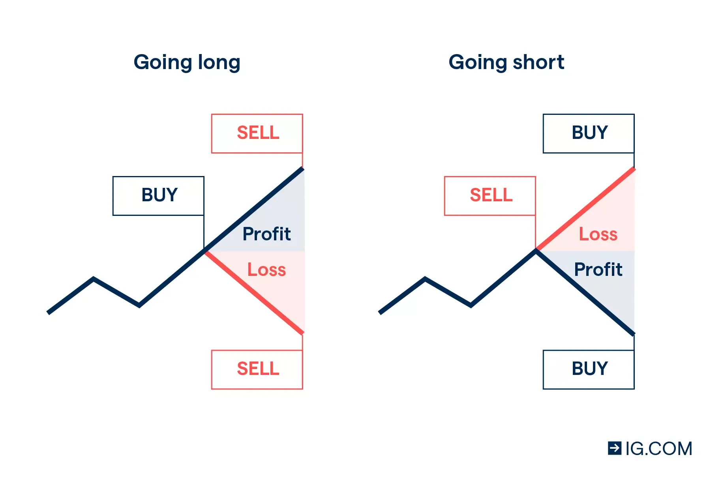

The modern financial trading landscape is characterized by an array of diverse and dynamic trading and betting methods, each offering unique ways to engage with the global markets. Among these, forex trading, financial betting, spread betting, and algorithmic trading are particularly prominent.

Forex trading, or foreign exchange trading, involves the buying and selling of currencies to take advantage of fluctuations in exchange rates. It is one of the largest and most liquid financial markets in the world. Financial betting, on the other hand, enables traders to speculate on the future price movements of financial instruments without owning the underlying asset. Spread betting is a variation that allows profit from both rising and falling markets, offering a tax-efficient way to trade in certain regions.



Algorithmic trading uses complex algorithms to automate trading strategies based on predefined criteria, significantly impacting financial markets by increasing transaction speed and liquidity. This computerized trading has paved the way for high-frequency trading, which executes a large number of orders at exceptionally rapid speeds.

Understanding these financial trading mechanisms is crucial in today's economy due to their interconnectedness and the way they influence global financial stability and individual investment opportunities. These trading types are interwoven; for instance, algorithmic trading strategies are often applied in the forex market, and spread betting might incorporate elements of financial betting.

Technology and digital platforms play a critical role in advancing trading strategies. The rise of online trading platforms has democratized access to financial markets, allowing individual traders to participate alongside institutional players. This technological advancement has also led to greater innovation in trading methodologies, enabling the integration of various trading techniques and enhancing the efficiency of financial transactions.

In summary, the modern trading landscape is continually evolving, shaped by a mix of traditional and contemporary methods. Understanding these mechanisms offers a strategic advantage in navigating the complexities of today's financial markets.

## Table of Contents

## Understanding Currency Trading

Currency trading, commonly referred to as [forex](/wiki/forex-system) trading, involves the exchange of one currency for another and is conducted within the foreign exchange (forex) market, the largest financial market in the world. Forex trading is centered around currency pairs, where the first currency in the pair is the base currency, and the second is the quote currency. The price at which the exchange occurs is known as the exchange rate, which determines how much of the quote currency is needed to purchase one unit of the base currency.

Key participants in the forex market include banks, financial institutions, hedge funds, corporations, and individual traders. Banks and financial institutions play a critical role by providing [liquidity](/wiki/liquidity-risk-premium), while hedge funds and corporations leverage forex trading for speculative purposes and hedging against currency fluctuations. Individual traders, often retail participants, engage in forex trading to profit from changes in currency values.

Forex trading is influenced by various factors, including macroeconomic indicators, geopolitical events, [interest rate](/wiki/interest-rate-trading-strategies) differentials, and market sentiment. For instance, inflation rates, employment data, and monetary policy decisions can significantly impact currency prices. Exchange rates are also affected by supply and demand dynamics, which are often shaped by these broader economic indicators.

Currency trading presents both risks and rewards. The potential for high returns can be significant due to leverage, which allows traders to control large positions with a relatively small amount of capital. However, leverage also amplifies the risk of losses, and market fluctuations can lead to rapid and substantial price changes. Additionally, forex market [volatility](/wiki/volatility-trading-strategies) necessitates effective risk management strategies to protect against adverse price movements.

### Example of Exchange Rate Calculation

Exchange rates are a crucial aspect of forex trading, determining the value of foreign currencies in transactional terms. For instance, if the exchange rate of EUR/USD is 1.20, it signifies that one euro can be exchanged for 1.20 US dollars. Changes in these rates are influenced by various factors including economic indicators and geopolitical events.

To compute changes in exchange rates:
```python
# Assuming an initial exchange rate
initial_rate = 1.20

# New rate after market changes
new_rate = 1.25

# Calculate percentage change
percentage_change = ((new_rate - initial_rate) / initial_rate) * 100

print(f"The exchange rate changed by {percentage_change:.2f}%")
```

### Risk and Reward in Currency Trading

Traders must navigate the inherent risks and rewards involved in forex trading. Market movements offer the potential for considerable profits, primarily through leverage. However, leverage can just as easily magnify losses. Successful forex trading requires a diligent approach to risk management, often including the use of stop-loss orders, position sizing, and diversification strategies to safeguard against volatile market shifts.

Forex trading is further complicated by geopolitical risks and regulatory changes that can create uncertainty in the markets. Adherence to market regulations and a thorough understanding of economic and political landscapes are crucial for traders aiming to maintain an edge in this competitive environment.

## Financial Betting and Its Mechanisms

Financial betting, as a speculative strategy, presents an alternative approach to engaging with financial markets. Unlike traditional investing, which typically involves purchasing assets like stocks or bonds with the expectation of long-term returns via appreciation or dividends, financial betting allows participants to predict and wager on the movement of financial markets without owning the underlying asset.

Financial betting differs from traditional investing primarily in its structure and objectives. Traditional investing requires purchasing financial instruments to build equity over time, relying on asset appreciation or income yield. Financial betting, conversely, is characterized by making predictions about market movements over shorter timescales, which can result in significant returns if predictions are accurate. This form of betting is more akin to speculation and often caters to those who favor high-risk, high-reward scenarios.

Common forms of financial betting include spread betting, binary options, and contracts for difference (CFDs). Spread betting entails predicting whether a particular market or asset will rise or fall, with profit or loss determined by the degree of movement relative to the spread set by the betting provider. Binary options involve wagering on a simple yes/no proposition about an asset's price movement within a set timeframe. CFDs allow participants to engage in price speculation without ownership, with profits and losses calculated on the difference between entry and [exit](/wiki/exit-strategy) prices.

The potential for profit in financial betting is notable, as participants can leverage small initial stakes into significant returns. However, the inherent risks are substantial. The volatile nature of financial markets, coupled with the leverage often used in these betting instruments, can lead to rapid and significant losses. Traders must exercise caution and implement robust risk management strategies.

Legal and regulatory considerations are crucial when engaging in financial betting. Jurisdictions vary in their approach to regulating these instruments, with some viewing them as derivatives and subjecting them to securities regulation, while others may classify them under gambling laws. Regulatory bodies like the Financial Conduct Authority (FCA) in the UK or the Commodity Futures Trading Commission (CFTC) in the United States oversee financial betting activities to ensure fair practices and protect consumers from fraud. Participants should be cognizant of the regulatory landscape in their respective regions to ensure compliance and understand the protections available to them.

In summary, while financial betting offers tantalizing opportunities for profit, it also demands a deep understanding of its mechanisms and the disciplined application of risk management principles. Responsible engagement requires awareness of both the strategic landscape and the regulatory environment to mitigate risks and capitalize on potential market movements.

## Exploring Forex Spread Betting

Spread betting is a popular financial derivative product that allows traders to speculate on the price movements of forex pairs without owning the underlying asset. In forex trading, spread betting involves placing bets on the direction of currency pairs, forecasting whether the price will rise or fall.

One of the primary attractions of forex spread betting is the ability to profit from both increasing and decreasing markets. When a trader predicts that a currency pair will rise, they place a "buy" bet, and conversely, a "sell" bet is placed when a decline is anticipated. The potential profit or loss in spread betting is determined by the extent of price movement in the chosen direction and the size of the bet placed.

### Comparison to Direct Forex Trading

Spread betting differs from direct forex trading in several key aspects. While both methods involve speculating on currency movements, direct forex trading requires the actual purchase and sale of currency pairs, whereas spread betting does not entail ownership of the underlying currencies. Consequently, spread betting offers greater flexibility as it allows traders to take advantage of both market directions without the need for substantial initial capital. Additionally, spread betting is typically executed with leverage, amplifying both potential gains and losses.

### Tax Efficiency

In some regions, forex spread betting is considered more tax-efficient than direct trading. For instance, in the United Kingdom, profits from spread betting are often exempt from Capital Gains Tax (CGT) and Stamp Duty. This tax efficiency makes spread betting an attractive option for private and retail investors seeking to maximize their returns.

### Risks and Mitigation Strategies

Despite its benefits, spread betting carries inherent risks. The use of leverage can amplify losses, quickly leading to substantial financial drawbacks if the market moves unfavorably. Traders must be aware of this leverage risk and manage their positions accordingly.

Risk management strategies are crucial in spread betting. Traders should employ techniques such as stop-loss orders, which automatically close positions at predetermined loss levels to limit potential damage. Additionally, diversification across multiple currency pairs can reduce exposure to risk.

Ultimately, forex spread betting offers a flexible and potentially tax-efficient method for traders to engage in currency markets. However, the high-risk nature of leverage and price volatility necessitates cautious and informed strategy development for successful participation in these markets.

## Algo Trading: The New Frontier

Algorithmic trading, often referred to as algo trading, represents a significant advancement in the financial markets, leveraging advanced technologies to enhance trading efficiency. Algorithms are systematically coded strategies that automate the process of trading by executing buy and sell orders based on predefined criteria like price movements, timing, or quantity. This automation minimizes human intervention in trading, providing consistency in executing strategies without emotional bias.

Algorithmic trading can take various forms, but one of the most prominent is high-frequency trading ([HFT](/wiki/high-frequency-trading-strategies)). HFT uses powerful computer programs to transact a large number of orders at extremely high speeds. It typically requires colossal data processing capabilities and relies heavily on speed and precision. HFT influences market dynamics significantly, often contributing to liquidity and tighter bid-ask spreads. However, it can also lead to increased volatility, as rapid trades can exacerbate market movements.

The primary advantages of [algorithmic trading](/wiki/algorithmic-trading) include precision and speed. Algorithms can perform complex calculations and execute trades in fractions of a second, far beyond human capabilities. This quick enactment is crucial in fast-moving markets where opportunities can appear and vanish within moments. Furthermore, the predefined rules help in executing trades consistently without the influence of emotions, which often skew human judgment.

Despite these advantages, algorithmic trading is not without its challenges and controversies. One of the main concerns is the potential for market manipulation, as some strategies may exploit small price discrepancies for profit, raising ethical questions. Additionally, the reliance on technology exposes traders to risks such as system failures and software bugs, which could lead to significant financial loss. There are also discussions about regulation and the need for oversight to ensure fairness and stability in the markets, as the high-speed nature of algo trading can sometimes trigger abrupt market disturbances, exemplified by events like the "Flash Crash" of 2010.

In conclusion, algorithmic trading forms a critical component of modern financial markets, offering unparalleled speed and efficiency. Nevertheless, the challenges it poses necessitate careful consideration and strong regulatory frameworks to safeguard investor interests and maintain market integrity. As technology continues to evolve, so will the strategies in algorithmic trading, potentially leading to even more sophisticated systems that further enhance market processes.

## Interconnections Between These Trading Strategies

Understanding the interconnections between various financial trading strategies is essential for traders seeking to optimize their portfolio and adapt to evolving market conditions. The dynamic interplay between forex trading, financial betting, spread betting, and algorithmic trading can be largely attributed to technological advancements that have revolutionized traditional methods.

Technology has been pivotal in converging conventional and contemporary trading techniques. Modern digital platforms facilitate seamless access to diverse trading mechanisms, providing traders with the tools to implement multiple strategies simultaneously. For instance, algorithmic trading leverages sophisticated software and high-speed internet to execute trades at a pace and precision unattainable by human traders. These algorithms can integrate data from forex markets as well as spread betting platforms to inform decision-making and optimize strategies.

Case studies illustrate how these interconnections manifest in practice. For example, a trader might utilize algorithmic systems to analyze forex market trends continuously. The same algorithms can adjust positions in spread betting to hedge against potential market downturns while capitalizing on upward movements. By automating such processes, traders can optimize their return profiles across different financial instruments.

Traders often leverage a combination of strategies to achieve diversification. Employing forex trading alongside spread betting and algo trading allows for a spread of risk and potential enhancement of returns. For instance, while the direct forex market might be sluggish, a trader could engage in spread betting to profit from strategic short-term positions, balancing their exposure and hedging against loss in more conventional trades.

Looking ahead, the future of integrated trading strategies is likely to be shaped by continued technological progress. The development of more sophisticated algorithms using [artificial intelligence](/wiki/ai-artificial-intelligence) and [machine learning](/wiki/machine-learning) could enable even more nuanced analysis and real-time decision-making across different trading fronts. This could result in the creation of more adaptive trading systems that respond promptly to market changes.

In conclusion, the interconnections between various trading strategies are characterized by their reliance on technological innovation to harness opportunities across markets. By understanding and leveraging these connections, traders can enhance their ability to navigate the complexities of the financial landscape.

## Risks and Considerations

Financial trading and betting encompass various strategies, each presenting unique risks and considerations. Understanding these risks and implementing robust risk management and strategic planning techniques are critical for success.

### Common Risks in Financial Trading and Betting

1. **Market Volatility**: All trading strategies, including forex trading, financial betting, spread betting, and algorithmic trading, are susceptible to market volatility. Rapid price movements can result in significant gains or losses. For instance, currency trading in the forex market is heavily influenced by geopolitical events and economic data releases, leading to unpredictable fluctuations.

2. **Leverage Risk**: Leverage amplifies both potential gains and losses. While it can enhance profitability in forex and spread betting, it equally magnifies losses, making it a double-edged sword. Traders often use leverage ratios that, if mishandled, can wipe out their capital.

3. **Counterparty Risk**: In financial betting and some forms of forex trading, the risk of the counterparty defaulting is a consideration. This risk highlights the importance of choosing reputable brokers and platforms.

4. **Liquidity Risk**: In algorithmic trading and specific forex markets, liquidity risk is prevalent. It refers to the inability to execute trades at desired prices due to a lack of market participants. This risk is especially relevant for high-frequency traders who require quick entry and exit from positions.

5. **Regulatory Risk**: Different jurisdictions impose varying regulatory requirements on trading activities. For example, financial betting may face stricter oversight in certain regions, leading to legal and compliance challenges for traders.

### Importance of Risk Management and Strategic Planning

Effective risk management is essential in navigating the complexities of financial trading and betting. Techniques such as:

- **Stop-Loss Orders**: Implementing stop-loss orders can mitigate potential losses by triggering an automatic sale when an asset reaches a predetermined price.
- **Diversification**: Spreading investments across various assets and strategies reduces overall risk.
- **Position Sizing**: Carefully calculating the size of each trade helps manage exposure and limits potential losses.

Moreover, strategic planning involves setting clear objectives, conducting thorough market analysis, and continuously updating strategies in response to changing market conditions.

### Regulatory Concerns and Compliance Issues

Trading in global markets requires awareness of the regulatory landscape. Regulations differ significantly across regions:

- **United States**: Entities such as the Securities and Exchange Commission (SEC) and the Commodity Futures Trading Commission (CFTC) regulate trading activities with stringent compliance requirements.
- **European Union**: The Markets in Financial Instruments Directive (MiFID II) governs trading practices, emphasizing transparency and investor protection.
- **Asia**: Countries like Japan and Singapore have their regulatory bodies, ensuring fairness and security in trading activities.

Traders must ensure compliance to avoid legal repercussions and maintain the integrity of their operations.

### Advice for New Traders

For newcomers entering the financial trading and betting markets, several recommendations can enhance their chances of success:

- **Education and Training**: Engaging in educational programs and utilizing online resources to gain a comprehensive understanding of markets and strategies is invaluable.
- **Demo Accounts**: Practicing on demo accounts helps develop skills without risking real capital.
- **Mentorship and Networking**: Seeking guidance from experienced traders and building a network can provide insights and support.

### Resources for Continued Learning and Development

Numerous resources are available for traders seeking to expand their knowledge:

- **Books and Publications**: Authors like Jack D. Schwager, known for "Market Wizards," offer insights into trading psychology and strategy development.
- **Online Courses and Webinars**: Platforms like Coursera and Udemy provide courses taught by industry experts on various trading topics.
- **Forums and Communities**: Online forums such as Reddit's r/Forex and r/algotrading facilitate knowledge sharing and community support.

In conclusion, understanding the inherent risks and implementing effective risk management, compliance, and continuous learning strategies are paramount for anyone involved in financial trading and betting. Responsible and informed trading practices can lead to sustainable success in these dynamic markets.

## Conclusion

Throughout this article, we have examined various financial trading and betting methods, each possessing unique characteristics, advantages, and risks. Currency trading in the forex market stands as a cornerstone for understanding global financial dynamics, with its intricate network of banks, institutions, and traders influencing currency price movements. Financial betting presents itself as a contrasting speculative strategy, offering the allure of profit but with significant risks and regulatory considerations.

The exploration of forex spread betting has highlighted its potential for tax efficiency and the ability to profit from both market directions, while algorithmic trading represents the cutting edge of financial innovation. Algorithmic strategies provide enhanced precision and speed, reshaping market dynamics through high-frequency trading.

The potential for profit and growth through these diverse strategies cannot be understated. As traders master the nuances of each method, they can create sophisticated portfolios that leverage multiple approaches for diversification. However, this potential is accompanied by considerable risks, underscoring the importance of comprehensive risk management and strategic planning.

Looking forward, the future of trading and betting in the financial world appears promising yet complex. The continuous evolution of technology will likely foster new trading methodologies, requiring traders and institutions alike to adapt swiftly. Thorough research and analysis become indispensable tools for anyone considering participation in these markets.

As a final reflection, engaging in responsible and informed trading practices is imperative. The ever-evolving landscape demands dedication to education and compliance with regulatory frameworks to ensure sustainable success. Practitioners must commit to understanding the complexities of these financial strategies, creating a solid foundation for prudent and profitable trading endeavors.

## References & Further Reading

[1]: Taylor, Mark. ["The Global Foreign Exchange Market: An Introduction."](https://faculty.haas.berkeley.edu/lyons/Sager_Taylor_Microscope.pdf) Financial Analysts Journal, 76(1), 2020.

[2]: [Darbyshire, Scott. "Algorithmic Trading: Winning Strategies and Their Rationale."](https://www.wiley.com/en-us/Algorithmic+Trading%3A+Winning+Strategies+and+Their+Rationale-p-9781118746912) John Wiley & Sons, 2013.

[3]: ["Forex Trading: The Basics Explained in Simple Terms"](https://www.amazon.com/FOREX-TRADING-Explained-Beginners-Strategies/dp/1535198567) by Jim Brown

[4]: Pardo, Robert. ["The Evaluation and Optimization of Trading Strategies."](https://onlinelibrary.wiley.com/doi/book/10.1002/9781119196969) John Wiley & Sons, 2008.

[5]: Chaboud, Alain, et al. ["Rise of the Machines: Algorithmic Trading in the Foreign Exchange Market."](https://www.federalreserve.gov/pubs/ifdp/2009/980/ifdp980.pdf) Federal Reserve Bank of San Francisco Working Paper, 2009.

[6]: [Schwager, Jack D. "Market Wizards: Interviews with Top Traders."](https://www.amazon.com/Market-Wizards-Jack-D-Schwager/dp/0887306101) John Wiley & Sons, 1992.