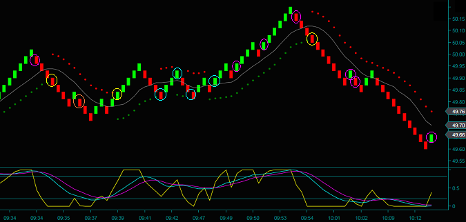

## Table of Contents

## What is Forex system trading?

Forex system trading, also known as foreign exchange system trading, is a method used by traders to buy and sell different currencies in the global market. The goal is to make a profit from the changes in the exchange rates between these currencies. Traders use a set of rules and strategies, often automated by computer programs, to decide when to buy or sell. This system helps them make decisions based on data and trends rather than emotions.

These systems can be simple or very complex. Some traders use basic systems that look at moving averages or other simple indicators. Others use more advanced systems that might include many different indicators and algorithms. The advantage of using a Forex system is that it can help traders be more consistent and disciplined. However, no system is perfect, and traders need to keep learning and adjusting their systems to stay successful in the ever-changing Forex market.

## How does a Forex trading system work?

A Forex trading system works by using a set of rules to decide when to buy and sell currencies. Traders set up these rules based on things like price movements, trends, and other market indicators. For example, a simple system might tell a trader to buy a currency when its price goes above a certain level and to sell it when the price drops below another level. These rules can be programmed into a computer, which then automatically makes trades based on the system's instructions. This helps traders make decisions without letting emotions get in the way.

The system can be as simple or as complex as the trader wants. Some systems use just a few indicators, like moving averages, to make decisions. Others might use many different indicators and complex math to predict what the market will do next. Traders often test their systems using past market data to see how well they would have worked. This helps them fine-tune their rules to make better trades. Even with a good system, the Forex market can be unpredictable, so traders need to keep learning and adjusting their systems to stay successful.

## What are the benefits of using a Forex trading system?

Using a Forex trading system can make trading easier and more organized. It helps traders by giving them clear rules to follow, so they don't have to guess what to do next. This can take away a lot of the stress and worry that comes with trading. Instead of trying to figure out the market all the time, traders can let the system do a lot of the work for them. This can save time and help them make decisions based on facts rather than feelings.

Another big benefit is that a Forex trading system can help traders be more consistent. When traders follow a set of rules, they are more likely to make the same kind of decisions over and over. This can lead to more steady results, which is important in the up-and-down world of Forex trading. Plus, these systems can be tested with past data to see how well they might work in the future. This helps traders feel more confident and prepared, even when the market is unpredictable.

## What are the common types of Forex trading systems?

Forex trading systems come in different types, but two common ones are trend-following systems and counter-trend systems. Trend-following systems try to make money by going with the flow of the market. They look for times when the market is moving in a clear direction and then buy or sell to follow that trend. These systems use things like moving averages to find out where the market is going. On the other hand, counter-trend systems try to make money by going against the market's direction. They look for times when the market might be ready to change direction and then trade in the opposite way. These systems often use things like support and resistance levels to find good times to trade.

Another type of Forex trading system is the [breakout](/wiki/breakout-trading) system. This system tries to make money by trading when the price breaks out of a certain range. For example, if the price has been moving between $1.10 and $1.15 for a while, a breakout system might tell the trader to buy if the price goes above $1.15 or sell if it goes below $1.10. Breakout systems can be exciting because they try to catch big moves in the market, but they can also be risky if the breakout doesn't last long. Each type of system has its own way of looking at the market and making trades, so traders often choose the one that fits their style and goals the best.

## How can a beginner start using a Forex trading system?

A beginner can start using a Forex trading system by first learning about the different types of systems available, like trend-following, counter-trend, and breakout systems. It's important to understand how each type works and which one might fit your trading style best. Once you have an idea of the kind of system you want to use, you can look for a pre-made system or create your own. Many online platforms offer demo accounts where you can practice trading without risking real money. This is a great way to test out different systems and see how they work in the market before you start trading with real money.

After choosing a system, it's helpful to backtest it. Backtesting means using past market data to see how well your system would have worked in the past. This can give you a good idea of how it might perform in the future. Once you're comfortable with your system and have practiced with a demo account, you can start trading with a small amount of real money. It's important to keep learning and adjusting your system as you go, because the Forex market can change a lot. By starting small and staying patient, you can slowly build up your skills and confidence in using a Forex trading system.

## What are the key components of a successful Forex trading system?

A successful Forex trading system needs a few key parts to work well. The first part is a clear set of rules for when to buy and sell. These rules should be based on things like price movements, trends, and other market signs. Having clear rules helps traders make decisions without letting their feelings get in the way. Another important part is a way to manage risk. This means setting limits on how much money you can lose on each trade. It's really important to have a plan for what to do if the market doesn't go the way you expect.

Testing the system is also a big part of making it successful. Traders should use past market data to see how well their system would have worked before. This is called [backtesting](/wiki/backtesting), and it helps traders feel more sure about their system. It's also important to keep learning and changing the system as the market changes. No system will work perfectly all the time, so traders need to be ready to make small changes to keep up with the market. By having these key parts, a Forex trading system can help traders make better and more steady choices in the tricky world of Forex trading.

## How do you evaluate the performance of a Forex trading system?

Evaluating the performance of a Forex trading system is important to see how well it works. You can start by looking at how much money the system makes, called the profit. But it's not just about profit; you also need to look at how much risk the system takes to make that profit. A good way to do this is by checking the risk-reward ratio. This tells you how much you could lose compared to how much you could win on each trade. Another thing to look at is how often the system wins trades, called the win rate. A high win rate is good, but if the system takes big risks for small wins, it might not be the best.

Another important part of evaluating a Forex trading system is looking at how steady its results are. This means checking if the system makes money over a long time, not just in short bursts. You can do this by looking at the system's performance over different time periods, like months or years. Also, it's good to test the system with past market data, which is called backtesting. This helps you see how the system would have done in the past. But remember, past results don't always mean the same will happen in the future. So, keep watching and adjusting the system to make sure it keeps working well in the ever-changing Forex market.

## What are the risks associated with Forex system trading?

Forex system trading can be risky because the market can change a lot and be hard to predict. Even if you have a good system, there's no guarantee that it will always make money. Sometimes, the market can move in ways that your system didn't expect, which can lead to big losses. Also, using a system doesn't mean you won't make mistakes. If you don't set up your system right or if you don't keep an eye on it, you could lose money. It's important to understand that no system can take away all the risks in Forex trading.

Another risk is that you might rely too much on your system and not pay attention to other important things happening in the market. For example, big news events can change the market quickly, and your system might not be ready for that. Plus, if you use a system that other people are using too, everyone might be trying to buy or sell at the same time, which can make the market move in unexpected ways. So, it's a good idea to keep learning about the market and not just trust your system completely.

## How can one optimize a Forex trading system for better results?

To make a Forex trading system work better, you need to keep testing it and making small changes. One way to do this is by backtesting, which means using old market data to see how your system would have done in the past. This can help you find out what parts of your system need to be better. You might need to change your rules for when to buy or sell, or you might need to adjust how much risk you're taking. It's also a good idea to test your system in a demo account before using real money. This way, you can see how it works without losing anything.

Another important thing is to keep an eye on the market and learn from what's happening. The Forex market can change a lot, so you need to be ready to change your system too. Pay attention to big news events and how they affect the market. Sometimes, you might need to add new rules to your system or take out old ones that don't work anymore. By staying flexible and always trying to make your system better, you can have a better chance of making money in the Forex market.

## What advanced strategies can be incorporated into a Forex trading system?

One advanced strategy that can be added to a Forex trading system is using multiple time frames. This means looking at the market over different lengths of time, like hours, days, or weeks. By doing this, you can see bigger trends and smaller movements at the same time. For example, you might use a longer time frame to find the overall direction of the market and a shorter time frame to find the best time to make a trade. This can help you make better decisions and catch more trading opportunities.

Another advanced strategy is using [algorithmic trading](/wiki/algorithmic-trading). This means using computer programs to make trades automatically based on your system's rules. These programs can look at a lot of data very quickly and make trades without letting emotions get in the way. You can program the computer to use things like moving averages, trend lines, and other indicators to decide when to buy or sell. This can make your trading more consistent and help you take advantage of small changes in the market that you might miss if you were trading by hand.

## How do market conditions affect Forex system trading?

Market conditions can really change how well a Forex trading system works. If the market is moving a lot, like when there's big news or economic reports, a system might have a hard time keeping up. During these times, prices can jump around a lot, and the system's rules might not work as well as they do in calmer times. For example, if a system is set up to follow trends, but the market is all over the place, it might buy and sell at the wrong times and lose money. So, it's important for traders to know what's going on in the market and maybe change their system's rules when things get wild.

On the other hand, when the market is calm and moving in a clear direction, a Forex trading system can do really well. In these conditions, the system's rules can work smoothly, and it can make trades that follow the market's flow. For example, if the market is going up slowly and steadily, a trend-following system can keep buying and making money as long as the trend lasts. But even in good market conditions, traders need to keep an eye on things and be ready to adjust their system if the market starts to change. Understanding how market conditions affect Forex system trading can help traders make better choices and keep their system working well.

## What are the latest trends and technologies impacting Forex system trading?

The latest trends in Forex system trading include the use of [artificial intelligence](/wiki/ai-artificial-intelligence) (AI) and [machine learning](/wiki/machine-learning). These technologies help traders make better predictions about the market by looking at a lot of data very quickly. AI can find patterns that humans might miss and can keep learning from new data to make the trading system better over time. This means that Forex trading systems can become smarter and more accurate, helping traders make more money with less risk. Another trend is the use of mobile trading apps, which let traders use their systems from anywhere, making it easier to keep an eye on the market and make trades on the go.

Blockchain technology is also starting to impact Forex system trading. It can make trading safer and more transparent by keeping a record of all trades that can't be changed. This can help stop fraud and make sure that trades are fair. Some Forex trading platforms are now using blockchain to make their systems more secure and trustworthy. As these technologies keep getting better, they will likely change how Forex trading systems work and make them even more effective for traders.

## References & Further Reading

[1]: Bergstra, J., Bardenet, R., Bengio, Y., & Kégl, B. (2011). ["Algorithms for Hyper-Parameter Optimization."](https://proceedings.neurips.cc/paper/2011/file/86e8f7ab32cfd12577bc2619bc635690-Paper.pdf) Advances in Neural Information Processing Systems 24.

[2]: ["Advances in Financial Machine Learning"](https://www.amazon.com/Advances-Financial-Machine-Learning-Marcos/dp/1119482089) by Marcos Lopez de Prado

[3]: ["Evidence-Based Technical Analysis: Applying the Scientific Method and Statistical Inference to Trading Signals"](https://www.amazon.com/Evidence-Based-Technical-Analysis-Scientific-Statistical/dp/0470008741) by David Aronson

[4]: ["Machine Learning for Algorithmic Trading"](https://github.com/stefan-jansen/machine-learning-for-trading) by Stefan Jansen

[5]: ["Quantitative Trading: How to Build Your Own Algorithmic Trading Business"](https://www.amazon.com/Quantitative-Trading-Build-Algorithmic-Business/dp/1119800064) by Ernest P. Chan