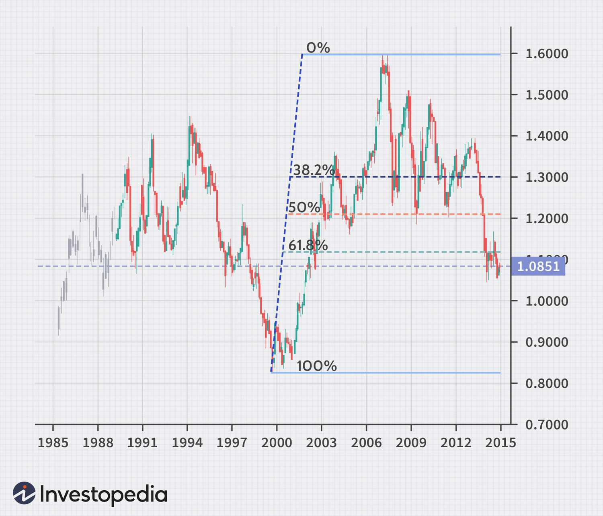

Forex trading, or foreign exchange trading, involves the buying and selling of currency pairs, a process that has seen significant transformation with the advent of technology-driven solutions like automated trading systems. Leveraging these technologies, traders can now operate in an environment that offers both enhanced opportunities and specific challenges. This article addresses currency market system trading, with a keen focus on forex trading and algorithmic trading (algo trading) strategies.

The core of these systems lies in their ability to execute trades based on pre-defined parameters, thereby removing the psychological biases and emotional influences that often hamper manual trading. By employing complex algorithms, traders can analyze market data and execute trades at speeds that are virtually impossible for humans. These technologies not only streamline trading operations but also improve the accuracy and consistency of trading strategies, essential components for success in the volatile forex market.



Understanding how these systems function is crucial for traders at all levels. Novices and advanced traders alike can find value in appreciating the nuances of automated trading. Systems that integrate algorithmic trading strategies offer distinct advantages, such as reduced reaction times and decreased human error, which can result in more emotion-free trading experiences.

In this discussion, we will explore how such systems work and the benefits they provide, including potentially enhanced efficiency and profitability. However, the risks associated with these systems cannot be overlooked. Technical failures, market volatility, and algorithm inaccuracies pose real challenges that traders must navigate.

Moreover, the article will provide guidance on creating and refining robust trading algorithms. Whether one is looking to purchase or develop custom-built systems, a deep understanding of market signals and trading objectives is essential for successful implementation. We will also discuss the importance of selecting the right platforms and tools to effectively automate trades. Choosing a reliable platform not only enhances trading performance but also aligns technological capabilities with individual trading strategies.

Ultimately, whether you are at the beginning of your forex journey or have years of experience, integrating these advanced trading systems into your strategy can offer a competitive edge. Understanding the mechanics and implications of technology-driven trading solutions is essential in today's rapidly evolving forex market landscape.

## Table of Contents

## Understanding the Currency Market

The currency market, commonly known as the [forex](/wiki/forex-system) market, stands as the largest financial market globally, marked by an uninterrupted trading cycle operating 24 hours a day. This market's function is sustained through major financial centers located across diverse time zones, facilitating continuous currency trading activities. Unlike other financial markets such as stocks or commodities, the forex market does not have a centralized exchange; instead, it operates on an over-the-counter (OTC) basis.

Currency trading centers on trading currency pairs like EUR/USD (Euro/US Dollar) and GBP/USD (British Pound/US Dollar). These pairs are quoted in terms of bid and ask prices, which represent the price levels at which traders can sell or buy a currency pair. The primary currency in the pair, known as the base currency (e.g., EUR in EUR/USD), is quoted against the second currency, termed the quote or counter currency.

The forex market comprises a diverse array of participants. Central banks play a crucial role in this market, managing monetary policy and foreign exchange reserves, impacting currency supply and demand. Financial institutions, such as banks and hedge funds, engage actively in forex trading for various purposes, including speculation, hedging, and [arbitrage](/wiki/arbitrage). Retail traders, facilitated by online trading platforms, have also grown significantly in their participation, contributing to the market's [liquidity](/wiki/liquidity-risk-premium) and dynamism.

Understanding the market dynamics is essential for formulating effective trading strategies. Factors driving the forex market include interest rates, inflation, political stability, and economic indicators published by governments and international organizations. Exchange rates fluctuate based on these economic fundamentals and the sentiments and behavior of the market participants. Traders perform technical analysis, utilizing price charts and patterns, and [fundamental analysis](/wiki/fundamental-analysis), assessing economic indicators and political events, to make informed trading decisions. The interplay between these analyses aids in forecasting price movements and managing risk in trading activities.

Moreover, technological advancements have further influenced the currency market, facilitating high-frequency trading and the utilization of sophisticated tools for data analysis and [algorithmic trading](/wiki/algorithmic-trading), enhancing market efficiency and decision-making processes. Understanding these elements is key to navigating the complexities of the forex market effectively.

## Basics of Algorithmic Trading

Algorithmic trading, often referred to as algo trading, employs specialized computer programs to automate the execution of trading orders based on predefined rules and algorithms. This approach capitalizes on computational efficiency and speed, facilitating transactions at a rate unachievable by human traders. 

At the core of algorithmic trading lies the ability of algorithms to digest and analyze large volumes of market data swiftly. These programs can scan for patterns, correlations, and trends, subsequently executing trades within milliseconds when the specified criteria are met. The automation of these processes minimizes the role of human emotion and error, fostering improved decision-making and consistency in trade execution.

Different styles of algorithmic trading cater to various trading strategies. Statistical analysis-based algorithms rely on historical price data and mathematical models to predict future price movements. Strategies such as mean reversion and [statistical arbitrage](/wiki/statistical-arbitrage) fall under this category, hinging on the belief that asset prices will return to their historical averages over time.

Direct market access (DMA) algorithms enable traders to place bids and offers directly on the stock exchange, bypassing traditional brokers. DMA allows strategies that require fast execution speeds, reduced latency, and better control over the trading process.

High-frequency trading ([HFT](/wiki/high-frequency-trading-strategies)) represents the pinnacle of speed-focused trading, involving the rapid execution of a large number of orders within microseconds to milliseconds. HFT strategies often profit from small price discrepancies by utilizing advanced algorithms and infrastructure to secure the best possible execution price.

The removal of human error through algorithmic trading systems not only cuts down on mistakes associated with manual trading but also enhances efficiency. Systems can optimize order execution, manage market impact, and ensure consistent application of trading strategies without the biases and hesitations inherent to human decision-makers.

In conclusion, algorithmic trading harnesses the strengths of computational algorithms to optimize trade executions, leveraging speed, precision, and analytical proficiency. As the landscape of trading evolves, the role of algorithmic systems continues to expand, offering traders improved efficiency and strategic capabilities in financial markets.

## Automated Forex Trading Systems

Automated forex trading systems are specifically designed to execute trades without needing manual oversight. These systems allow traders to define explicit rules that govern entry and [exit](/wiki/exit-strategy) points, position sizes, and risk management strategies. By leveraging such automation, traders benefit from significantly reduced reaction times, minimizing the probability of human error, and facilitating emotion-free trading environments.

To establish an automated trading system, traders often follow set criteria which ensure that the trading process aligns with their financial goals and risk tolerance. These rules typically involve mathematical models and algorithms that can instantaneously process market data and make informed trading decisions.

Automated trading systems can either be custom-built by the trader or purchased as a pre-made solution. Custom solutions allow for a more tailored approach, catering to specific trading styles and strategies. For instance, a trader might code their own algorithm using Python, which is popular in financial technology due to its robust libraries like pandas for data manipulation and [backtrader](/wiki/backtrader) for testing strategies:

```python
import backtrader as bt
import pandas as pd

class MovingAverageCrossStrategy(bt.SignalStrategy):
    def __init__(self):
        ma1 = bt.ind.SMA(period=20)  # 20-period moving average
        ma2 = bt.ind.SMA(period=50)  # 50-period moving average
        self.signal_add(bt.SIGNAL_LONG, ma1 - ma2)

cerebro = bt.Cerebro()
cerebro.addstrategy(MovingAverageCrossStrategy)

data = bt.feeds.PandasData(dataname=pd.read_csv('forex_data.csv'))
cerebro.adddata(data)

cerebro.run()
cerebro.plot()
```

In this hypothetical example, the `MovingAverageCrossStrategy` establishes entry points based on the crossover between 20-period and 50-period moving averages—a common technique in algorithmic trading.

Regardless of whether a trader chooses to develop their own system or rely on an existing one, understanding market signals is crucial for success. This means continuous monitoring and analysis of how indices perform under various market conditions are pivotal to understanding when to enter or exit trades effectively.

While vendor-supplied systems can provide convenience and a wealth of features, they often require a substantial understanding of the underlying mechanisms to operate optimally. Advanced users may further employ [machine learning](/wiki/machine-learning) techniques to enhance the decision-making capability of their systems, although this involves complex data analysis and a higher level of technical skill.

Automated forex trading, with its advances in technology, provides new opportunities for optimizing trade execution; however, a deep and analytical approach to understanding how these systems operate and the signals they interpret remains essential for success in the currency markets.

## Developing a Forex Trading Algorithm

Creating a forex trading algorithm requires a structured approach to ensure potential success in live market conditions. A key starting point involves setting clear trading goals, such as achieving a specific return on investment or maintaining a certain risk-to-reward ratio. These objectives will guide the selection of appropriate indicators and the definition of risk parameters.

Indicators are mathematical calculations based on price, [volume](/wiki/volume-trading-strategy), or open interest, aiding in forecasting future price movements. Commonly used indicators in forex trading include moving averages, RSI (Relative Strength Index), and MACD (Moving Average Convergence Divergence). Each indicator has unique attributes and provides distinct information about market trends and [momentum](/wiki/momentum). It is crucial to align chosen indicators with the trading strategy, whether trend-following, mean-reversion, or momentum-based.

Setting risk parameters involves defining stop-loss and take-profit levels. Effective risk management ensures that the risk on any single trade is kept within acceptable limits, preserving capital during adverse market movements. The risk per trade should be a small percentage of the total trading capital, often recommended to be between 1% to 3%.

A robust forex trading algorithm must undergo comprehensive [backtesting](/wiki/backtesting). This involves applying the algorithm to historical market data to assess its performance and profitability under various market conditions. This process allows traders to identify and rectify weaknesses in the algorithm before deploying it in live trading. The following Python code provides a basic framework for backtesting a strategy using historical data:

```python
import pandas as pd

def backtest_strategy(data, signal_column, initial_balance, risk_per_trade):
    balance = initial_balance
    trades = 0

    for i in range(1, len(data)):
        if data[signal_column].iloc[i] == 'Buy':
            # Enter a long position
            entry_price = data['Close'].iloc[i]
            stop_loss = entry_price * (1 - risk_per_trade)
            take_profit = entry_price * (1 + risk_per_trade * 2)

            # Check price conditions for exit
            for j in range(i+1, len(data)):
                if data['Low'].iloc[j] <= stop_loss or data['High'].iloc[j] >= take_profit:
                    exit_price = stop_loss if data['Low'].iloc[j] <= stop_loss else take_profit
                    break

            profit_loss = (exit_price - entry_price) / entry_price * balance
            balance += profit_loss
            trades += 1

    return balance, trades

# Example usage:
# market_data = pd.read_csv('historical_data.csv')
# final_balance, total_trades = backtest_strategy(market_data, 'Signal', 10000, 0.01)
```

Optimization is the next step, involving the fine-tuning of algorithm parameters to enhance performance. This may include adjusting indicator settings or modifying entry and exit criteria. Nonetheless, caution is necessary to prevent overfitting, where an algorithm performs exceptionally on historical data but fails in live markets due to excessive specialization. Regularly updating and validating the algorithm with fresh data can mitigate this risk.

Incorporating machine learning can further enhance trading algorithms. Machine learning models can identify complex patterns within data, adapt to changing market conditions, and improve predictive accuracy. However, this integration demands proficiency in both data science and trading. Techniques such as supervised learning, where models are trained on labeled data, or [reinforcement learning](/wiki/reinforcement-learning), which involves learning optimal actions through interaction with the environment, can be beneficial, but require careful implementation.

Developing a forex trading algorithm is an iterative process that combines methodological planning, thorough testing, and fine-tuning to achieve optimal performance. By integrating technology and analytical rigor, traders can create robust systems capable of navigating the dynamic forex market.

## Risks and Challenges in Algo Trading

Algorithmic trading, particularly in the forex market, presents several risks and challenges notwithstanding its potential advantages. One of the primary concerns is technical failures, where system crashes or network issues can lead to missed trades or incorrect order execution. This unreliability can result in significant financial loss, especially in high-frequency trading environments where trades occur in microseconds. For instance, a minor delay caused by a system error can lead to trading at unfavorable prices, adversely affecting profitability.

Market [volatility](/wiki/volatility-trading-strategies) introduces additional risks, with algorithms potentially exacerbating market crashes. High-frequency trading algorithms can contribute to flash crashes by executing a large number of trades in milliseconds, adversely impacting liquidity and triggering a snowball effect that destabilizes markets. This phenomenon was evident during the 2010 Flash Crash, where the rapid selling by algorithms contributed to a significant drop in major U.S. stock indices.

Overfitting is another concern when developing trading algorithms. While backtesting algorithms against historical data is crucial, there is a risk of tailoring algorithms too closely to past data, resulting in poor performance under different future conditions. This occurs because overfitted algorithms may capture noise rather than underlying market patterns, rendering them ineffective in live trading environments. To mitigate overfitting, traders should employ robust validation techniques and ensure that their models generalize well to unseen data.

Transaction costs and slippage can significantly impact the profitability of algorithmic trading strategies. Slippage occurs when the executed price differs from the expected price due to market movement between order submission and execution. This is especially relevant in the forex market, where rapid price changes are common. To address this, traders can use limit orders to set price ceilings or floors, although this may increase the risk of non-execution.

To succeed in algorithmic trading, diversification and continuous monitoring are essential. Diversifying across different strategies and instruments can mitigate the risks associated with market volatility and algorithmic failures. Regular monitoring and adjustments of algorithms are necessary to adapt to evolving market conditions and to ensure that the strategies remain effective. Automated alerts and risk management protocols should be integrated into the systems to provide real-time insights and prevent significant losses.

Algorithmic traders must balance the technological edge with an understanding of market dynamics and potential pitfalls. By addressing these risks through careful planning and execution, traders can better leverage the strengths of automated systems in the forex market.

## Choosing the Right Platform and Tools

Selecting the right broker and platform is a pivotal decision in algorithmic trading, significantly influencing a trader's ability to execute strategies effectively and efficiently. The decision hinges on several critical factors that vary depending on individual trading needs and goals. 

**Platform Reliability**: A reliable trading platform is non-negotiable. It ensures uninterrupted access to the market, especially during volatile periods when trading opportunities are abundant. Traders should prioritize platforms with minimal downtime and robust infrastructure capable of handling high-frequency trades and large volumes of transactions. 

**Data Feed Quality**: Accurate and timely market data is at the heart of any successful trading strategy. Platforms offering high-quality data feeds with minimal latency can provide an edge in executing trades with precision. Data feeds should cover real-time quotes, order book data, and historical data for backtesting strategies.

**Execution Speed**: The speed at which orders are executed can make a significant difference in profit margins, particularly for strategies relying on minute price movements, such as high-frequency trading (HFT). A platform with fast execution speeds can minimize slippage—the difference between expected and actual trade prices—ensuring trades are completed at desired prices.

**Support for Multiple Trading Strategies**: A versatile trading platform should support a range of trading strategies, from simple buy-and-hold to complex arbitrage. This flexibility allows traders to adapt their strategies in response to market changes. Platforms offering custom programming and scripting capabilities enable the development and integration of bespoke trading algorithms that align with specific tactical approaches.

**APIs and Frameworks**: Modern algo trading platforms often provide Application Programming Interfaces (APIs) and development frameworks. These tools empower traders to create, test, and implement their trading algorithms seamlessly. For instance, platforms offering Python API access allow traders to leverage Python’s extensive libraries and tools for data analysis, machine learning, and algorithmic development. A simple example of using an API to fetch market data in Python could look like this:

```python
import requests

def get_market_data(symbol):
    url = f"https://api.example.com/data/{symbol}"
    response = requests.get(url)
    return response.json()

data = get_market_data("EUR/USD")
print(data)
```

**Evaluating Platform Features**: Each trader's needs are unique, and evaluating a platform involves aligning its features with one's trading objectives. Important considerations include the cost of using the platform, the quality of customer support, availability of educational tools, and community support forums. Testing multiple platforms using demo accounts can offer practical insights into their usability and match with individual trading styles.

In conclusion, selecting the right algo trading platform involves a comprehensive evaluation of its capabilities and alignment with strategic goals. By focusing on reliability, data feed quality, execution efficiency, strategic support, and available development tools, traders can position themselves for enhanced performance and potential profitability.

## Conclusion

Algorithmic trading in the forex market represents a convergence of technology and financial expertise, offering traders the capability to execute strategies with greater precision and minimal latency. This approach provides significant advantages, such as the elimination of human error, the ability to manage large volumes of trades simultaneously, and the potential for profits through high-frequency and data-driven decision-making processes. However, to harness these benefits effectively, traders must equip themselves with a deep understanding of the underlying systems and the intricacies of algorithmic trading.

One must comprehend the mechanics of the currency market, which is inherently volatile and influenced by a myriad of factors, including economic indicators, political events, and central bank policies. Algorithmic trading systems rely on this market data to execute trades, often leveraging models that predict price movements and optimize entry and exit points. As such, traders must have a solid grasp of these concepts to refine their approaches and bolster their strategies' effectiveness.

Furthermore, the sophistication of algorithmic trading demands continual learning and adaptation. The forex market is dynamic, continually evolving as new financial instruments are developed and as global economic landscapes shift. Staying competitive necessitates a commitment to ongoing education in both trading system development and technological advancements, such as machine learning and [artificial intelligence](/wiki/ai-artificial-intelligence). These technologies, when integrated into trading algorithms, can enhance their predictive power and adaptability, although they require users to possess expertise in data science and quantitative analysis.

To maintain a robust trading strategy, practitioners must not only develop algorithms that perform well under historical backtesting but also ensure they are resilient to future market conditions. This involves monitoring algorithms for performance and recalibrating them as necessary to avoid pitfalls such as overfitting. It also calls for a strategic diversification of trading approaches to mitigate systemic risks associated with algorithmic trading, such as technical failures and unforeseen market anomalies.

In summary, while algorithmic trading in forex offers a pathway to enhanced trade execution and profitability, it demands a comprehensive understanding of both financial markets and cutting-edge trading technologies. As the forex landscape continues to evolve, traders must remain vigilant, adapting their strategies and continuously expanding their knowledge to sustain success in this competitive arena.

## References & Further Reading

[1]: Bergstra, J., Bardenet, R., Bengio, Y., & Kégl, B. (2011). ["Algorithms for Hyper-Parameter Optimization."](https://proceedings.neurips.cc/paper/2011/file/86e8f7ab32cfd12577bc2619bc635690-Paper.pdf) Advances in Neural Information Processing Systems 24.

[2]: ["Advances in Financial Machine Learning"](https://www.amazon.com/Advances-Financial-Machine-Learning-Marcos/dp/1119482089) by Marcos Lopez de Prado

[3]: ["Evidence-Based Technical Analysis: Applying the Scientific Method and Statistical Inference to Trading Signals"](https://www.amazon.com/Evidence-Based-Technical-Analysis-Scientific-Statistical/dp/0470008741) by David Aronson

[4]: ["Machine Learning for Algorithmic Trading"](https://github.com/stefan-jansen/machine-learning-for-trading) by Stefan Jansen

[5]: ["Quantitative Trading: How to Build Your Own Algorithmic Trading Business"](https://www.amazon.com/Quantitative-Trading-Build-Algorithmic-Business/dp/1119800064) by Ernest P. Chan