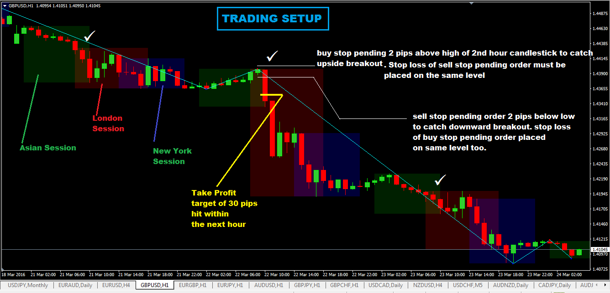

## Table of Contents

## What is a Forex system?

A Forex system is a set of rules and tools that traders use to make decisions about buying and selling currencies in the foreign exchange market. It helps traders figure out when to enter and exit trades, how much money to invest, and how to manage risks. Forex systems can be simple, like following a few basic rules, or complex, using advanced computer programs and algorithms.

These systems are important because the Forex market can be unpredictable and risky. A good Forex system can help traders make better decisions and avoid big losses. Some traders create their own systems based on their experience and knowledge, while others use systems developed by experts. No system is perfect, but having a clear plan can make trading easier and more successful.

## How does a Forex system work?

A Forex system works by giving traders a set of rules to follow when they want to buy or sell currencies. These rules help traders decide when to start a trade, when to end it, and how much money to use. For example, a simple system might say to buy a currency when its price goes above a certain level and sell it when the price drops below another level. The system uses things like charts, numbers, and sometimes even computer programs to help make these decisions.

The main goal of a Forex system is to help traders make money while keeping risks low. It does this by setting clear guidelines on how to manage trades. For instance, the system might tell a trader to only risk a small amount of money on each trade, so if the trade goes wrong, the loss isn't too big. By following the system's rules, traders can avoid making quick, emotional decisions that might lead to big losses. Even though no system can predict the market perfectly, having a plan can make trading more organized and successful.

## What are the basic components of a Forex system?

A Forex system has several important parts that help traders make decisions about buying and selling currencies. The first part is the entry and exit rules, which tell traders when to start and stop a trade. For example, a rule might say to buy a currency when its price goes up by a certain amount and to sell it when the price goes down by another amount. The second part is the money management rules, which help traders decide how much money to use for each trade. These rules are important for keeping risks low and making sure that a trader doesn't lose too much money on one trade.

Another key part of a Forex system is the use of indicators and charts. Indicators are tools that help traders understand the market by showing things like price trends and market strength. Charts show the price movements of currencies over time, which can help traders see patterns and make better decisions. The last part of a Forex system is the risk management strategy, which includes rules like setting stop-loss orders to limit losses and take-profit orders to lock in gains. By combining all these parts, a Forex system helps traders make more organized and successful trades.

## What are the different types of Forex systems available?

There are several types of Forex systems that traders can use. One type is the trend-following system, which looks at the direction of the market and tries to make money by following the trend. For example, if the price of a currency is going up, a trend-following system might tell the trader to buy that currency and sell it when the trend starts to go down. Another type is the range trading system, which works well when the market is moving sideways. This system tries to buy currencies at the low end of their price range and sell them at the high end.

Another popular type is the breakout system, which tries to make money when the price of a currency moves out of its normal range. If the price breaks above a certain level, the system might say to buy, and if it breaks below a certain level, it might say to sell. There are also counter-trend systems, which go against the main direction of the market. These systems try to find times when the market might be ready to change direction and make money from those changes. Each type of system has its own way of helping traders make decisions, and the best one depends on the trader's style and the current market conditions.

## How can a beginner start using a Forex system?

For a beginner wanting to start using a Forex system, the first step is to learn the basics of the Forex market. This means understanding what currencies are traded, how they are bought and sold, and the factors that can affect their prices. Once you have a good grasp of these basics, you can start looking at different Forex systems. It's a good idea to start with a simple system that is easy to understand and follow. Many beginners find success with trend-following systems because they are straightforward and focus on the main direction of the market.

After choosing a system, the next step is to practice using it. Many trading platforms offer demo accounts where you can trade with fake money. This is a great way to test your system without risking real money. As you practice, pay attention to how well the system works and whether you need to make any changes. It's also important to keep learning and stay updated on market news and trends. Over time, as you gain more experience, you can start using your Forex system with real money, but always remember to start small and manage your risks carefully.

## What are the common mistakes to avoid when using a Forex system?

One common mistake beginners make when using a Forex system is not following the rules of the system. It's easy to get tempted to make a trade that goes against the system's rules, especially when the market is moving a lot. But this can lead to bad decisions and big losses. It's important to stick to the system's rules, even when it's hard. Another mistake is not managing risks well. This means not setting stop-loss orders to limit losses or using too much money on one trade. Good risk management is key to making sure you don't lose too much money.

Another mistake is not testing the system enough before using real money. Many beginners jump straight into trading with real money without practicing on a demo account first. This can be risky because you might not know how well the system works until you've already lost money. It's a good idea to practice a lot and make sure you understand how the system works before you start trading for real. Also, some beginners forget to keep learning and updating their system. The Forex market changes all the time, so it's important to keep learning and maybe even change your system to fit new market conditions.

## How can one evaluate the effectiveness of a Forex system?

To evaluate the effectiveness of a Forex system, you need to look at how well it helps you make money and manage risks. One way to do this is by keeping track of your trades over time. You can write down how much money you made or lost on each trade, and then see if you are making more money than you are losing. Another way is to use a demo account to test the system without using real money. This lets you see how the system works in different market conditions without risking your own money. It's also important to see if the system helps you stick to your trading plan and avoid making quick, emotional decisions.

Another thing to consider is how the system handles different market conditions. A good Forex system should work well whether the market is going up, going down, or staying the same. You can test this by looking at how the system performed in the past using historical data. If the system makes money in different market conditions, it's a good sign that it's effective. Lastly, it's helpful to compare your system with other systems to see how it stacks up. If your system does better than others, it's a good indication that it's working well for you.

## What advanced strategies can be integrated into a Forex system?

One advanced strategy that can be added to a Forex system is using algorithms and automated trading. This means using computer programs to make trades for you based on the rules of your system. These programs can look at a lot of data very quickly and make trades without getting tired or emotional. This can be really helpful because it can take the guesswork out of trading and make sure you always follow your system's rules. But, it's important to keep an eye on these programs and make sure they are working the way you want them to.

Another advanced strategy is using multiple time frames for analysis. This means looking at the market over different periods of time, like daily, weekly, and monthly charts. By doing this, you can get a better idea of what's happening in the market and make more informed decisions. For example, if the daily chart shows a trend, but the weekly chart shows something different, you might want to wait before making a trade. This can help you avoid making quick decisions based on short-term changes and focus on the bigger picture.

## How do market conditions affect the performance of a Forex system?

Market conditions can really change how well a Forex system works. When the market is moving a lot, like during big news events or economic changes, a Forex system that is good at catching big moves might do really well. But if the market is quiet and not moving much, the same system might not make as much money. Also, if the market is going up and down a lot, a system that is good at handling risk and using stop-loss orders can help keep losses small. So, it's important to pick a Forex system that fits the current market conditions.

Different types of Forex systems work better in different market conditions. For example, a trend-following system might do great when the market is going in one direction for a long time, but it might not work as well when the market is moving back and forth. On the other hand, a range trading system might do better when the market is staying in a certain range and not moving much. By understanding how the market is acting, you can choose the right Forex system or even change your system to fit the current conditions better. This can help you make more money and keep your risks low.

## What role does risk management play in a Forex system?

Risk management is a big part of any Forex system. It helps traders make sure they don't lose too much money on one trade. A good Forex system will have rules about how much money to use for each trade and when to stop trading if things go wrong. For example, a system might tell a trader to only risk a small amount of their money on each trade, so even if they lose, it's not a big deal. This way, the trader can keep trading even after a few losses without losing all their money.

Another important part of risk management in a Forex system is using stop-loss orders. A stop-loss order is like a safety net that automatically stops a trade if the price goes down too much. This helps limit losses and protect the trader's money. By having clear rules for risk management, a Forex system helps traders stay calm and make smart decisions, even when the market is moving a lot. This can make trading less stressful and more successful in the long run.

## How can one customize a Forex system to fit specific trading goals?

To customize a Forex system to fit specific trading goals, you first need to think about what you want to achieve. Are you looking to make quick profits, or are you more interested in steady, long-term gains? Once you know your goals, you can change your system to match them. For example, if you want to make quick profits, you might set your system to look for short-term trends and use more aggressive entry and exit rules. If you're aiming for long-term gains, you might focus on longer time frames and use more conservative rules to avoid big risks.

Another way to customize your Forex system is by adjusting the risk management rules. If your goal is to protect your money and avoid big losses, you can set tighter stop-loss orders and use less money on each trade. If you're okay with taking bigger risks for the chance of bigger rewards, you might use looser stop-loss orders and put more money into each trade. By tweaking these parts of your system, you can make sure it helps you reach your specific trading goals while still keeping your risks under control.

## What are the latest trends and technologies impacting Forex systems?

The latest trends and technologies in Forex systems are making trading easier and smarter. One big trend is the use of artificial intelligence (AI) and machine learning. These technologies can look at a lot of data very quickly and find patterns that humans might miss. They can help traders make better decisions by predicting how the market might move next. Another trend is the use of mobile trading apps, which let traders buy and sell currencies from their phones. This makes it easier for people to trade anytime and anywhere, even when they are not at their computers.

Another technology that's changing Forex systems is blockchain. Some traders are using cryptocurrencies and other digital assets in their Forex systems. Blockchain can make trading faster and more secure because it keeps a record of all transactions that can't be changed. Also, social trading is becoming more popular. This is when traders can copy the trades of other successful traders. It's a way for beginners to learn from experts and make money without having to come up with their own trading strategies. These trends and technologies are helping traders make smarter and more informed decisions in the Forex market.

## What are Algorithmic Trading Strategies in Forex?

Algorithmic trading strategies in the forex market utilize computer programs to execute trades with high speed and precision. These strategies are designed to capitalize on specific market conditions by using algorithms that can analyze vast amounts of data far quicker than a human trader. Here, we examine some of the most common algo trading strategies employed in forex trading.

### Overview of Common Algo Trading Strategies

**1. Forex Scalping**

Forex [scalping](/wiki/gamma-scalping) is a strategy that involves making dozens or even hundreds of trades in a day, attempting to "scalp" a small profit from each trade. This strategy relies on the ability to act quickly on small price changes. Often, these trades last just seconds to minutes. The success of forex scalping largely depends on the speed and execution capabilities of the trading system. The scalp trader looks for a large number of trades with a small expected win per trade, aiming for an overall net gain.

Key aspects of forex scalping involve the use of highly sensitive technical indicators and automated systems that can execute trades based on these rapid movements. Successful scalping also depends on minimizing spread costs and exploiting minor price gaps in highly liquid markets.

**2. Trend and Momentum Trading Strategies**

Trend trading involves algorithmically detecting and riding market trends, typically using algorithms that identify trends through technical indicators such as moving averages, trendlines, or [momentum](/wiki/momentum) indicators like the Relative Strength Index (RSI). The algorithms are designed to recognize trends early and generate signals to initiate trades in the direction of the trend.

Momentum trading, meanwhile, attempts to capitalize on the continuance of existing trends in the market. A momentum trader enters into a trade when there is enough momentum in a particular direction, often determined by analyzing market volume and price action. Algorithms might analyze momentum indicators like RSI or moving average convergence divergence (MACD) to make these decisions.

The primary advantage of trend and momentum trading strategies is their alignment with market trends, which reduces the risk of countertrend losses. However, these strategies also require careful calibration to avoid late entries or [exit](/wiki/exit-strategy)s from trades.

**3. The Importance of News and Arbitrage Trading**

News trading involves reacting to market-moving news events. Algorithms can be programmed to rapidly process economic data releases and news feeds, executing trades based on pre-defined criteria faster than a human could. Strategies might use linguistic models to analyze the sentiment of news articles or apply economic forecasts as triggers for trades.

Arbitrage trading takes advantage of price discrepancies in different markets or instruments. Forex [arbitrage](/wiki/arbitrage) can involve identifying and exploiting mismatched currency quotes on different exchanges. This strategy requires a high-frequency trading ([HFT](/wiki/high-frequency-trading-strategies)) setup to ensure the rapid execution required to profit from these fleeting opportunities. The basic formula for arbitrage profit is:

$$
Profit = (P_1 - P_2) - (C_1 + C_2)
$$

Where $P_1$ and $P_2$ are the prices of two equivalent forex instruments, and $C_1$ and $C_2$ are the transaction costs involved in buying and selling these instruments.

These strategies highlight the dynamic nature of forex algorithmic trading and reflect the importance of having robust systems that can adapt to changing market conditions quickly and efficiently. As forex markets continue to evolve, traders using algorithmic strategies are better positioned to identify profitable opportunities with high precision.

## References & Further Reading

[1]: Bergstra, J., Bardenet, R., Bengio, Y., & Kégl, B. (2011). ["Algorithms for Hyper-Parameter Optimization."](https://papers.nips.cc/paper_files/paper/2011/hash/86e8f7ab32cfd12577bc2619bc635690-Abstract.html) Advances in Neural Information Processing Systems 24.

[2]: ["Advances in Financial Machine Learning"](https://www.amazon.com/Advances-Financial-Machine-Learning-Marcos/dp/1119482089) by Marcos Lopez de Prado

[3]: ["Evidence-Based Technical Analysis: Applying the Scientific Method and Statistical Inference to Trading Signals"](https://www.wiley.com/en-gb/Evidence+Based+Technical+Analysis:+Applying+the+Scientific+Method+and+Statistical+Inference+to+Trading+Signals-p-9780470008744) by David Aronson

[4]: ["Machine Learning for Algorithmic Trading"](https://www.amazon.com/Machine-Learning-Algorithmic-Trading-intelligence/dp/9918608013) by Stefan Jansen

[5]: ["Quantitative Trading: How to Build Your Own Algorithmic Trading Business"](https://www.amazon.com/Quantitative-Trading-Build-Algorithmic-Business/dp/0470284889) by Ernest P. Chan