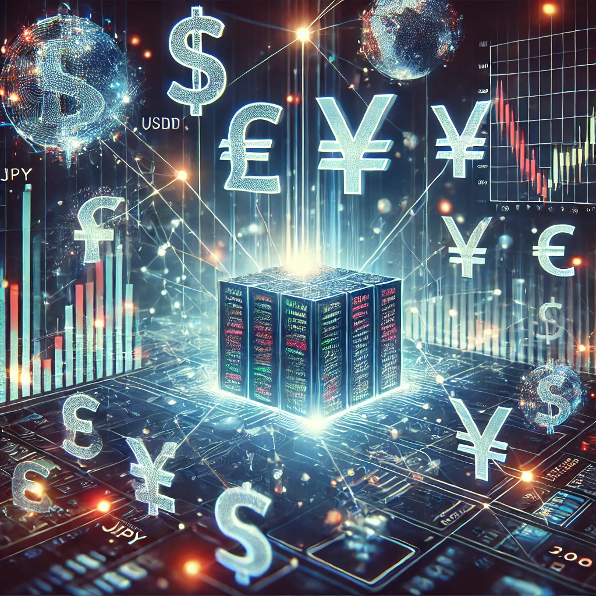

Forex algorithmic trading has revolutionized the way traders engage with the foreign exchange market, providing enhanced precision and execution speed through the use of complex algorithms. This form of trading, also known as algo trading, involves employing computer programs to make swift, data-driven decisions based on predetermined criteria, eliminating much of the human error associated with manual trading.

The appeal of algorithmic trading in forex markets has been growing due to several compelling reasons. Firstly, algo trading effectively eliminates emotional decision-making, which can often lead to irrational outcomes in manual trading. With algorithmic strategies, decisions are made based on pre-set rules and models that analyze vast amounts of data without being influenced by fear or greed. This leads to consistent trading performance and can improve profitability over time.



Moreover, the rapid execution speeds offered by algorithmic trading provide a significant competitive edge. The forex market is characterized by its high liquidity and constant price fluctuations, often measured in pips. Algorithms can process and act on market data much faster than any human trader, executing trades in milliseconds. This efficiency is crucial for taking advantage of short-lived market opportunities and arbitrage situations. In highly volatile markets, having the ability to quickly place trades can mean the difference between a profit and a loss.

Additionally, algorithmic trading allows for the backtesting of trading strategies against historical data, enabling traders to refine and optimize their models before deploying them in live markets. This process helps in assessing the viability and potential risks of a trading strategy, ensuring that it has a reasonable chance of achieving desired results.

This article will explore the evolution and impact of forex algorithmic trading. We will delve into the fundamental components that constitute this approach, discuss popular algorithmic trading strategies, and weigh the benefits against the associated risks. Additionally, insights into the process of creating bespoke trading algorithms and the technical requirements for successful algo trading will be provided. Throughout, we will reference both institutional and retail applications and examine how algorithmic trading is reshaping market dynamics. Ultimately, the aim is to provide a comprehensive understanding of how forex algorithmic trading is transforming financial markets and the potential it holds for future innovation.

## Table of Contents

## What is Forex Algorithmic Trading?

Forex [algorithmic trading](/wiki/algorithmic-trading) refers to the use of computer programs and algorithms to automate the trading of foreign exchange currencies. This method utilizes mathematical models and pre-set trading instructions to execute orders based on market data, essentially eliminating the need for manual intervention. The algorithms evaluate various market variables such as timing, price, and [volume](/wiki/volume-trading-strategy) to identify profitable trading opportunities with precision and speed that would be difficult for a human trader to match.

One of the fundamental differences between algorithmic and manual trading is the emotional detachment and consistency involved in executing trades. Manual trading relies on an individual's analysis, intuition, and sometimes emotional response, which can lead to inconsistent outcomes. In contrast, algorithmic trading operates based on predefined rules and conditions, ensuring that trading decisions are made objectively and consistently, often leading to better risk management and efficiency.

The key components of [forex](/wiki/forex-system) algorithmic trading can be broken down into three main elements: algorithms, software, and execution. 

1. **Algorithms**: These are the mathematical models and strategies that determine when and how trades should be executed. They are designed to analyze data and make decisions based on trends, patterns, and predefined criteria. Algorithms can be simple, like a set moving average crossover, or complex, involving machine learning models that adapt based on new data.

2. **Software**: This is the platform used to develop and implement the algorithms. A trading software can be a custom-built system or a commercial application that offers features such as historical data analysis, backtesting, and simulation. Popular platforms like MetaTrader 4, MetaTrader 5, and TradingView often provide environments for algorithm creation and testing.

3. **Execution**: This involves the communication between the trading software and the forex market, typically through an internet connection. The execution component ensures that trades are executed in real-time, as close to the desired conditions set by the algorithm as possible. Efficient execution is crucial to capitalize on market opportunities and minimize slippage, which is the difference between the expected price of a trade and the actual price.

By automating the trading process, forex algorithmic trading offers speed, efficiency, and the ability to manage complex strategies without the human errors associated with manual trading. As technology and data analytics continue to advance, algorithmic trading is likely to play an increasingly vital role in the forex market landscape.


## Algorithmic Trading Strategies in Forex

Algorithmic trading strategies in the forex market utilize computer programs to execute trades with high speed and precision. These strategies are designed to capitalize on specific market conditions by using algorithms that can analyze vast amounts of data far quicker than a human trader. Here, we examine some of the most common algo trading strategies employed in forex trading.

### Overview of Common Algo Trading Strategies

**1. Forex Scalping**

Forex [scalping](/wiki/gamma-scalping) is a strategy that involves making dozens or even hundreds of trades in a day, attempting to "scalp" a small profit from each trade. This strategy relies on the ability to act quickly on small price changes. Often, these trades last just seconds to minutes. The success of forex scalping largely depends on the speed and execution capabilities of the trading system. The scalp trader looks for a large number of trades with a small expected win per trade, aiming for an overall net gain.

Key aspects of forex scalping involve the use of highly sensitive technical indicators and automated systems that can execute trades based on these rapid movements. Successful scalping also depends on minimizing spread costs and exploiting minor price gaps in highly liquid markets.

**2. Trend and Momentum Trading Strategies**

Trend trading involves algorithmically detecting and riding market trends, typically using algorithms that identify trends through technical indicators such as moving averages, trendlines, or [momentum](/wiki/momentum) indicators like the Relative Strength Index (RSI). The algorithms are designed to recognize trends early and generate signals to initiate trades in the direction of the trend.

Momentum trading, meanwhile, attempts to capitalize on the continuance of existing trends in the market. A momentum trader enters into a trade when there is enough momentum in a particular direction, often determined by analyzing market volume and price action. Algorithms might analyze momentum indicators like RSI or moving average convergence divergence (MACD) to make these decisions.

The primary advantage of trend and momentum trading strategies is their alignment with market trends, which reduces the risk of countertrend losses. However, these strategies also require careful calibration to avoid late entries or [exit](/wiki/exit-strategy)s from trades.

**3. The Importance of News and Arbitrage Trading**

News trading involves reacting to market-moving news events. Algorithms can be programmed to rapidly process economic data releases and news feeds, executing trades based on pre-defined criteria faster than a human could. Strategies might use linguistic models to analyze the sentiment of news articles or apply economic forecasts as triggers for trades.

Arbitrage trading takes advantage of price discrepancies in different markets or instruments. Forex [arbitrage](/wiki/arbitrage) can involve identifying and exploiting mismatched currency quotes on different exchanges. This strategy requires a high-frequency trading ([HFT](/wiki/high-frequency-trading-strategies)) setup to ensure the rapid execution required to profit from these fleeting opportunities. The basic formula for arbitrage profit is:

$$
Profit = (P_1 - P_2) - (C_1 + C_2)
$$

Where $P_1$ and $P_2$ are the prices of two equivalent forex instruments, and $C_1$ and $C_2$ are the transaction costs involved in buying and selling these instruments.

These strategies highlight the dynamic nature of forex algorithmic trading and reflect the importance of having robust systems that can adapt to changing market conditions quickly and efficiently. As forex markets continue to evolve, traders using algorithmic strategies are better positioned to identify profitable opportunities with high precision.


## Benefits and Risks of Forex Algorithmic Trading

Algorithmic trading in the forex market offers a range of benefits but also comes with inherent risks. Understanding these can help traders leverage the power of algorithms while mitigating potential downsides.

### Emotional Detachment and Trading Consistency
One of the largest advantages of algorithmic trading is its ability to eliminate human emotion from the trading process. Emotional trading can lead to inconsistent results, as traders might make impulsive decisions driven by fear or greed. Algorithms, however, execute predetermined strategies, ensuring that trades align with specific criteria and risk parameters consistently. This consistency can result in more predictable trading outcomes and helps in maintaining discipline—an essential component for long-term trading success.

### Speed and Efficiency: The Competitive Edge
Algorithms can process vast amounts of data at lightning speed, far surpassing human capabilities. This rapid data processing facilitates quick decision-making, allowing traders to capitalize on market movements within milliseconds. The competitive edge of speed enables capturing arbitrage opportunities, efficient price discovery, and better execution of trades. Automated systems can monitor multiple currency pairs and market indicators simultaneously, something that would be challenging, if not impossible, for manual traders.

### Potential Pitfalls: Bugs, Market Changes, and Flash Crashes
While the benefits of forex algorithmic trading are substantial, the risks cannot be overlooked. One significant risk is the presence of bugs within the algorithm, which can lead to erroneous trades and substantial financial losses. Inadequate testing and optimization might result in an algorithm that performs poorly in live markets, especially during unprecedented market conditions.

Market changes are another risk [factor](/wiki/factor-investing). Algorithms are typically designed based on historical data, and they may not adapt quickly to changing market conditions or unforeseen economic events. The global forex market is subject to sudden moves influenced by geopolitical developments, central bank interventions, and other factors that can render previously successful strategies ineffective.

Lastly, a phenomenon known as a flash crash presents a unique risk associated with algorithmic trading. Flash crashes are sudden, deep, and rapid market crashes typically triggered by automated trading. They may lead to severe disruptions and substantial financial losses unless the algorithms are equipped with fail-safes.

In conclusion, while forex algorithmic trading provides tools for leveraging automation and efficiency in trading, it's crucial for traders to remain vigilant about its accompanying risks. Continuous monitoring, regular [backtesting](/wiki/backtesting), and adapting strategies to evolving markets are essential practices to enhance the reliability and effectiveness of trading algorithms.


## Creating Your Own Forex Trading Algorithms

Creating your own Forex trading algorithms requires a unique blend of skills that encompass financial knowledge, mathematical aptitude, and technical proficiency in programming. Understanding these skills is crucial for developing effective algorithms that can succeed in the dynamic and fast-paced Forex market.

### Understanding the Skills Required

1. **Financial Acumen**: A strong understanding of financial markets, specifically the Forex market, is essential. This includes knowledge of currency pairs, market trends, economic indicators, and how geopolitical events can influence currency movements.

2. **Mathematical Skills**: Quantitative analysis forms the backbone of algorithmic trading. Skills in statistics, probability, and mathematical modeling are vital for creating algorithms that can identify profitable trading opportunities and manage risks effectively.

3. **Programming Proficiency**: Programming skills are crucial for implementing your trading strategies into a functional algorithm. Python is a popular choice due to its extensive libraries and ease of use, especially libraries like Pandas for data manipulation and NumPy for numerical computations.

4. **Analytical Thinking**: The ability to process large volumes of data and identify patterns is critical. Analytical skills are required to backtest algorithms and optimize them based on historical data.

### The Role of Backtesting and Optimization

Backtesting allows traders to evaluate the viability of their trading algorithms using historical data. It helps in assessing how the strategy would have performed and identifies any weaknesses before deploying the algorithm in live markets. Here's a basic example of a backtesting framework using Python:

```python
import pandas as pd

# Load historical data
data = pd.read_csv('historical_data.csv')
strategy_returns = []

# Simulate trading strategy
for index, row in data.iterrows():
    # Example condition: Buy when the closing price is greater than the opening price
    if row['Close'] > row['Open']:
        strategy_returns.append(row['Close'] - row['Open'])

# Calculate metrics
average_return = sum(strategy_returns) / len(strategy_returns)
print(f"Average Return: {average_return}")
```

Optimization takes this a step further by fine-tuning parameters to improve performance. Techniques such as genetic algorithms or machine learning can be employed for optimization to enhance the robustness and profitability of the algorithmic strategy.

### When to Consider Pre-made Algorithms

While creating your own trading algorithms offers customization and potentially unique edge, there are times when using pre-made algorithms might be beneficial:

1. **Time Constraints**: Developing and testing a new trading algorithm is time-consuming. If you're working with limited time, leveraging pre-made algorithms can provide a quicker start.

2. **Lack of Technical Skills**: If programming or complex quantitative analysis isn't your forte, using well-established pre-made algorithms can help mitigate risks associated with improper implementations.

3. **Limited Access to Data**: Creating a sophisticated algorithm often requires access to comprehensive historical and real-time data. In cases where access is limited, using pre-made algorithms can bypass this hurdle.

In such scenarios, it's crucial to thoroughly evaluate these pre-made solutions to ensure they align with your trading objectives and risk tolerance. Always conduct due diligence and backtest these algorithms with historical data to understand their behavior before deploying them in live trading.


## Who Uses Forex Algorithmic Trading?

Forex algorithmic trading has become a pervasive force in the financial markets, driven largely by advancements in technology and the increasing sophistication of trading algorithms. Both financial institutions and retail traders are leveraging these algorithms to gain an edge in the highly competitive forex market.

### The Role of Financial Institutions and Retail Traders

Financial institutions, such as banks and [hedge fund](/wiki/hedge-fund-trading-strategies)s, have been at the forefront of utilizing algorithmic trading in forex. These institutions have access to vast resources and advanced technology, allowing them to implement complex algorithms that can analyze multiple data streams and execute trades rapidly. Their primary goal is to exploit slight inefficiencies in the market to achieve consistent profits over time. For example, using algorithms to assess [interest rate](/wiki/interest-rate-trading-strategies) differentials between currencies helps institutions form strategies such as [carry](/wiki/carry-trading) trades, where they borrow in a currency with a low interest rate and invest in a currency with a higher rate.

On the other hand, retail traders have increasingly adopted forex algorithmic trading, thanks to platforms that democratize access to sophisticated trading tools and algorithms. Although retail traders typically operate on a smaller scale, many have found success by using pre-made algorithmic strategies available on trading platforms or by developing their own simpler algorithms to automate their trading processes.

### The Rise of High-Frequency Trading (HFT)

High-Frequency Trading (HFT) is a subset of algorithmic trading characterized by the high velocity of transactions. Primarily dominated by financial institutions, HFT involves executing a large number of orders at incredibly fast speeds, often in fractions of a second. This speed allows traders to capitalize on minuscule price movements, contributing to the [liquidity](/wiki/liquidity-risk-premium) and efficiency of the forex markets. HFT strategies often require a substantial investment in technology infrastructure, including state-of-the-art servers located in proximity to exchange data centers to minimize latency.

### Market Dynamics Influenced by Algorithms

The widespread adoption of algorithmic trading strategies, including HFT, plays a significant role in shaping market dynamics. Algorithms contribute to increased market liquidity and can tighten bid-ask spreads, benefiting all market participants. However, they can also lead to increased [volatility](/wiki/volatility-trading-strategies), particularly during periods of market stress or when algorithms are triggered en masse, as seen in flash crashes.

Moreover, the interaction between multiple algorithms can result in complex market behaviors, sometimes making it difficult to predict market movements. These dynamics underscore the importance of risk management in algorithmic trading, as algorithms can react based on outdated or incorrect information without human intervention.

Overall, the integration of algorithmic trading in forex markets has transformed how trading is conducted, presenting both opportunities and challenges for various participants. Whether through the sophisticated models of financial institutions or the burgeoning use among retail traders, algorithmic trading continues to be a driving force in modern forex trading.


## Technical Requirements for Algorithmic Forex Trading

Algorithmic trading in the forex market requires a robust technical setup to ensure that strategies are executed precisely and efficiently. This involves a combination of essential hardware, software, reliable connectivity, and a stable trading environment.

### Essential Hardware and Software Needs

To get started with algorithmic forex trading, you'll need a computer with a fast processor, ample RAM, and sufficient storage. The performance of your hardware directly affects the speed at which algorithms can execute trades. A machine with at least a quad-core processor, 16GB RAM, and SSD storage is recommended to handle data-intensive tasks efficiently.

For software, traders commonly use platforms like MetaTrader 4/5, which support custom algorithms written in MQL4/MQL5. Alternatively, Python is popular due to its extensive libraries like Pandas for data manipulation and SciPy for mathematical functions, enabling complex strategy development. Here's an example of a simple moving average crossover strategy in Python:

```python
import pandas as pd

# Sample DataFrame for forex price data
data = pd.DataFrame({
    'price': [1.1950, 1.1960, 1.1970, 1.1980, 1.1990, 1.2000]
})

# Calculate moving averages
data['short_ma'] = data['price'].rolling(window=2).mean()
data['long_ma'] = data['price'].rolling(window=4).mean()

# Generate trading signals
data['signal'] = 0
data.loc[data['short_ma'] > data['long_ma'], 'signal'] = 1
data.loc[data['short_ma'] < data['long_ma'], 'signal'] = -1

print(data)
```

### Ensuring Reliable Connectivity and Data Management

Reliable internet connectivity is crucial for minimizing latency, which directly influences trade execution speed. A high-speed, wired Ethernet connection is preferable to wireless networks, which are prone to interference. Additionally, using a Virtual Private Server (VPS) can help maintain low latency and constant connectivity, essential for executing trades promptly under volatile market conditions.

Effective data management is equally important. Traders need to handle historical data for backtesting and live data for real-time decision-making. Using cloud solutions like AWS or Google Cloud can provide scalable data storage and processing power, minimizing the risk of data loss and enabling seamless data management.

### The Importance of a Stable Trading Environment

A stable trading environment is critical to avoid interruptions that could lead to missed opportunities or exacerbate losses. This means ensuring that your trading software and any third-party applications are always up-to-date and running smoothly. Regular system audits and performance evaluations can help identify potential bottlenecks or vulnerabilities that might disrupt trading activities.

Moreover, implementing fail-safes and redundancy measures, such as backup internet connections and power supplies, can protect against unexpected failures. Automating regular system checks and updates ensures that the trading environment remains optimal for executing algorithms efficiently.

In conclusion, the technical requirements for forex algorithmic trading span across high-performance hardware, versatile and powerful software, reliable connectivity, robust data management, and a stable trading environment. Ensuring these components are set up correctly will support effective algorithmic trading and improve overall trading performance.


## Conclusion

In the rapidly evolving world of forex algorithmic trading, adaptability remains crucial. As detailed throughout this article, algorithmic trading in forex involves using computer algorithms to automate trading decisions, bringing significant benefits including emotional detachment, enhanced speed, and efficiency. It was explored how various strategies, such as scalping, trend, and momentum trading, and the crucial role of news and arbitrage can be effectively implemented using algorithms. These strategies offer a fundamentally different approach compared to manual trading by utilizing software and execution algorithms, which allow traders to react instantaneously to market changes.

The rise of algorithmic trading has enabled a wider array of participants—from institutional to retail traders—to engage in high-frequency trading (HFT), altering market dynamics significantly. This technological advancement underscores the importance of having solid technical requirements, including reliable hardware, software, and stable trading environments.

Despite the numerous advantages, traders must be vigilant against the potential pitfalls such as software bugs, sudden market changes, and the possibility of flash crashes. Therefore, a robust backtesting and optimization process is critical for developing effective algorithms. Additionally, while creating custom algorithms offers tailored solutions, pre-made algorithms can also be beneficial when skillsets are limited.

Looking ahead, the future of algorithmic trading in forex suggests a continued integration of advanced technologies, such as [machine learning](/wiki/machine-learning) and [artificial intelligence](/wiki/ai-artificial-intelligence), which can enhance predictive analytics and decision-making processes. As these technologies evolve, staying adaptive is not just beneficial but necessary for traders. This adaptability involves staying informed about technological advancements, continuously refining trading strategies, and ensuring systems can withstand the dynamic nature of forex markets. Overall, while challenges remain, the potential for growth and innovation in forex algorithmic trading is vast, promising a transformative impact on how trading is conducted globally.


## References & Further Reading

[1]: Bergstra, J., Bardenet, R., Bengio, Y., & Kégl, B. (2011). ["Algorithms for Hyper-Parameter Optimization."](https://papers.nips.cc/paper_files/paper/2011/hash/86e8f7ab32cfd12577bc2619bc635690-Abstract.html) Advances in Neural Information Processing Systems 24.

[2]: ["Advances in Financial Machine Learning"](https://www.amazon.com/Advances-Financial-Machine-Learning-Marcos/dp/1119482089) by Marcos Lopez de Prado

[3]: ["Evidence-Based Technical Analysis: Applying the Scientific Method and Statistical Inference to Trading Signals"](https://www.wiley.com/en-gb/Evidence+Based+Technical+Analysis:+Applying+the+Scientific+Method+and+Statistical+Inference+to+Trading+Signals-p-9780470008744) by David Aronson

[4]: ["Machine Learning for Algorithmic Trading"](https://www.amazon.com/Machine-Learning-Algorithmic-Trading-intelligence/dp/9918608013) by Stefan Jansen

[5]: ["Quantitative Trading: How to Build Your Own Algorithmic Trading Business"](https://www.amazon.com/Quantitative-Trading-Build-Algorithmic-Business/dp/0470284889) by Ernest P. Chan